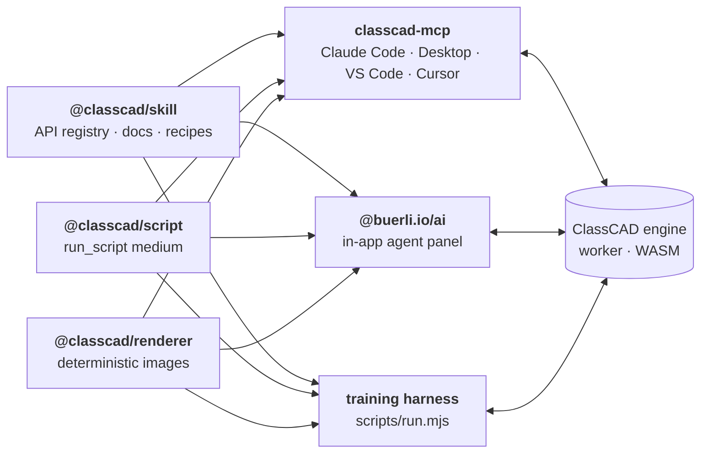
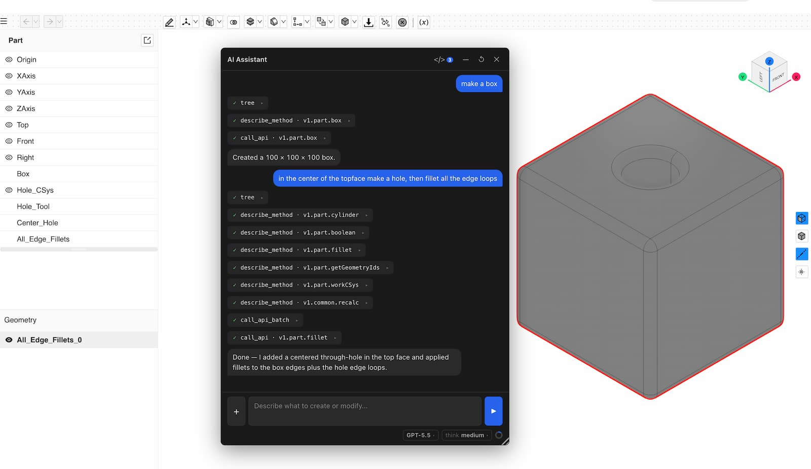

# classcad-ai

Everything that lets AI agents build and verify CAD models with
[ClassCAD](https://classcad.ch): the API knowledge, the script medium agents
write in, the renderer they check their work with, and the agent hosts — an
MCP server for Claude Code, Claude Desktop, VS Code or Cursor, and a chat panel
for [buerli](https://buerli.io) apps.



Three ideas hold it together:

- **One way to execute.** Agents never call the API one method per turn. They
  write a JavaScript program against `api.v1.*`, `api.tree()` and
  `api.graphic()` and run it through `run_script` — the same medium in the
  browser, in the MCP and in headless Node.
- **One knowledge source.** The method registry, the docs and the search that
  serves them live in `@classcad/skill`; every host registers the identical
  discovery tools from it, so every agent sees the same thing.
- **Verification is built in.** ClassCAD reports success for several
  operations that silently did nothing, so agents prove results with numbers
  (mass properties, geometry probes) and with deterministic renders — not with
  status codes.

## Packages

### @classcad/skill — the knowledge

[`packages/skill`](packages/skill) · `@classcad/skill`

The v1 method registry (264 methods across part, assembly, sketch, curve,
solid, drawing2d and common — generated from the engine's JSDoc), per-method
docs with behavior verified against a live engine (gotchas, silent no-ops,
working examples), and end-to-end recipes: constrained sketching from technical
drawings, verification, parametric parts, assembly parameters, patterns,
direct modeling. `SKILL.md` makes it a drop-in agent skill.

Its `discovery` module is the one implementation of method search, fuzzy
describe, the compact method index and the bulk `docs` tool that both hosts
serve:

```js
import { createDiscovery } from '@classcad/skill/discovery'
import registry from '@classcad/skill/method-registry.json' with { type: 'json' }
import bundle from '@classcad/skill/bundle.json' with { type: 'json' }

const discovery = createDiscovery({ registry, bundle })
discovery.searchMethods({ search: 'round the edges', limit: 3 })   // → v1.solid.fillet, …, v1.part.fillet
const { text } = await discovery.bulkDocs(['v1.part.fillet', 'recipes/verification'])
```

### @classcad/script — the script medium

[`packages/script`](packages/script) · `@classcad/script`

Runs model-written JavaScript against a session-abstracted `api`. CAD
construction is mostly computation, so an agent writes a real program —
variables, loops, geometry filtering — instead of dictating single calls.
State lives in the drawing; follow-up scripts attach to the existing model
through `api.tree()`. It also owns the data contract (`DATA`, `STRUCTURE`,
`GRAPHICS`): what `tree` and `graphic` return and how to select geometry from
them.

```js
import { connectSession, runScript } from '@classcad/script/node'
import registry from '@classcad/skill/method-registry.json' with { type: 'json' }

const session = await connectSession()            // classcad-cli worker, ws://localhost:9094
const res = await runScript(`
  const part = (await api.v1.part.create({ name: 'Plate' })).result
  await api.v1.part.box({ id: part, length: 80, width: 50, height: 10 })
  const { volume } = (await api.v1.part.calculateMassProperties({ id: part })).result
  return { part, volume }
`, session, { registry })
// res.returned → { part: 4, volume: 40000 }
```

### @classcad/renderer — the agent's eyes

[`packages/renderer`](packages/renderer) · `@classcad/renderer`


Turns the live tree and graphic into images: same data, same pixels, no GPU,
no camera state. Named and arbitrary cameras, technical drawings in first- or
third-angle projection with hidden lines dashed, capped and hatched sections,
four-view sheets, highlight by world point, probe markers, pixel diffs with
pinned framing. Portable core plus Node and browser adapters.

```js
import { renderSession } from '@classcad/renderer/node'

await renderSession(session, 'plate', './out', {
  drawing: 'first-angle',
  section: { origin: [40, 25, 5], normal: [0, -1, 0] },
})   // → ./out/plate-drawing.png
```

### classcad-mcp — ClassCAD in any MCP host

[`packages/mcp`](packages/mcp) · `@awv-informatik/classcad-mcp`

An MCP server that lets Claude Code, the Claude desktop app, VS Code Copilot,
Cursor and other MCP hosts drive a live ClassCAD session. Tools: `run_script`,
`snapshot`, `docs` / `list_methods` / `describe_method`, `tree` / `find` /
`inspect`, save/load (OFB, STEP, STL), checkpoints, and sessions — it can join
a session an app already has open, or reach the WASM engine inside a
buerligons browser tab. The method index ships in the initialize instructions,
so the model knows the whole API from its first turn.

```bash
claude mcp add classcad --scope user \
  --env CLASSCAD_WS_URL=ws://localhost:9094/ \
  -- npx -y @awv-informatik/classcad-mcp
```

Without a reachable worker it runs the published WASM engine itself.

### @buerli.io/ai — the in-app agent

[`packages/buerli-ai`](packages/buerli-ai) · `@buerli.io/ai`



A chat panel for buerli / react-three-fiber apps that creates and modifies
geometry in natural language. Any tool-calling LLM (Anthropic, OpenAI-compatible
endpoints, local models); all CAD operations run locally in the browser. The
same tools as the MCP, plus browser extras: the user's selection, checkpoints,
notes, and sub-agents for fresh-eyes checks. See it in
[buerligons](https://buerligons.io).

```tsx
import { createCadAgent, createAutoProvider, initAgentAsync } from '@buerli.io/ai'

await initAgentAsync()   // once — loads the bundled ClassCAD knowledge
const { AgentPanel } = createCadAgent({
  provider: createAutoProvider({ apiKey: API_KEY, endpoint: API_ENDPOINT }),
})

function Assistant({ drawingId }) {
  return <AgentPanel drawingId={drawingId} open />   // next to your <Canvas>
}
```

## The training agent

The repo root is also the home of **cc**, the agent that trains the skill: a
harness (`scripts/run.mjs`, built on `@classcad/script/node` and
`@classcad/renderer/node`), journals and plans in `workspace/`, and behavior
files (`AGENTS.md`, `SOUL.md`, `TOOLS.md`, …). It runs experiments against a
live `classcad-cli` worker, proves what it finds with renders and numbers, and
writes what survives into the skill — rewritten in place, never as history.
The packages are its deliverable; the hosts are its consumers.

```bash
node scripts/run.mjs path/to/script.mjs     # script exports default (api, { snapshot }) => …
```

## Working in the repo

```bash
npm install        # links all workspaces
npm run build      # skill (registry + bundle), script, renderer, then mcp and buerli-ai
npm test           # every package's tests
```

`skill`, `script` and `renderer` are independent base packages; `mcp` and
`buerli-ai` compose all three. Inside the monorepo, consumers pick up changes
through npm workspaces without a version bump. Publishing stays per package
(each keeps its npm name and `publishConfig`); the repo root is private.
