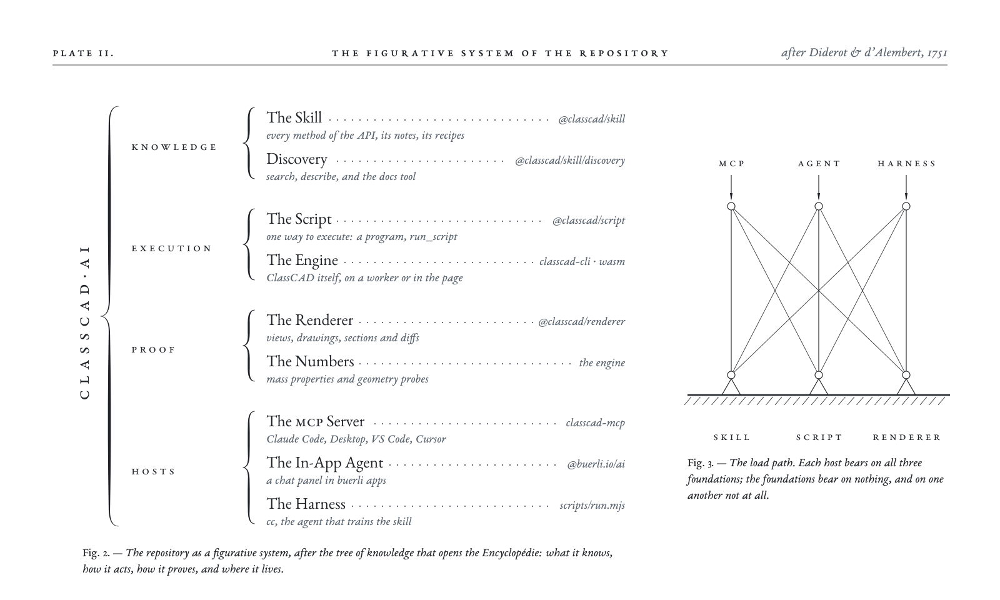
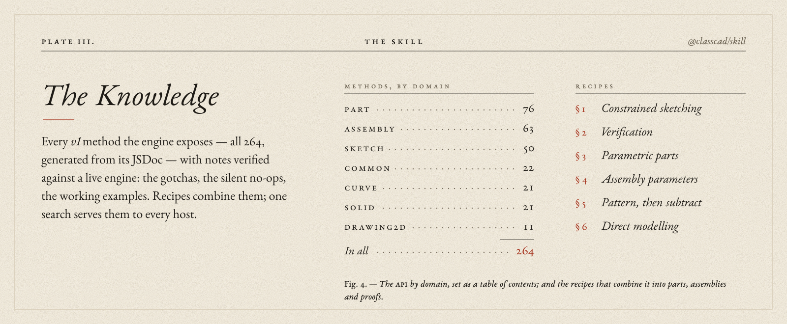
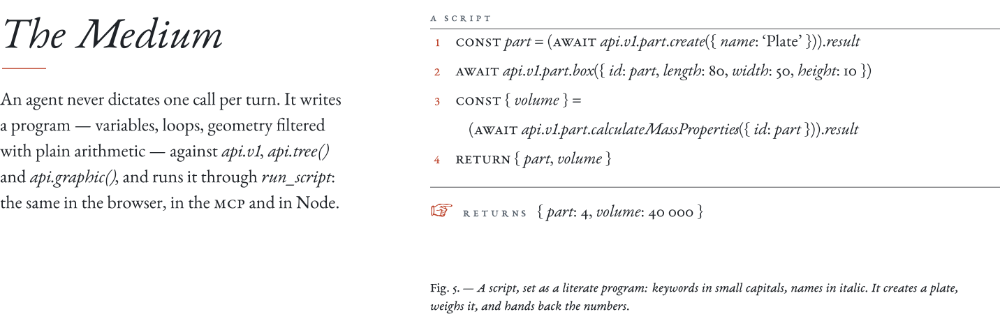
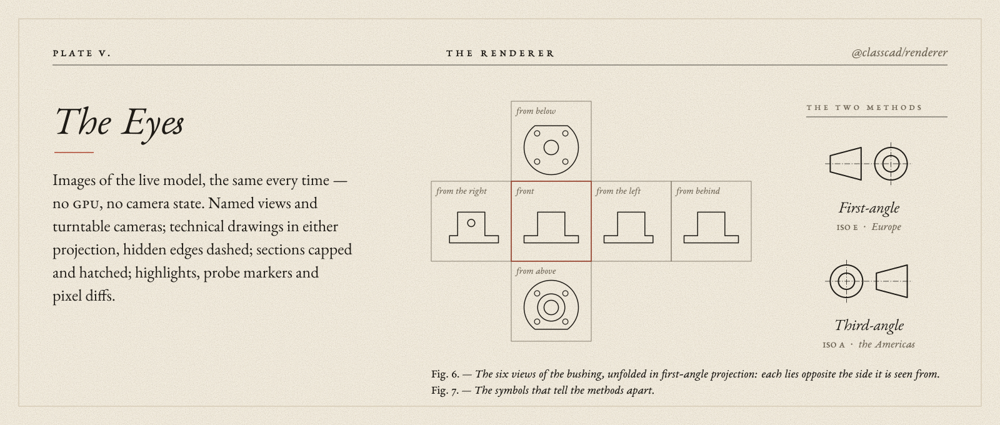
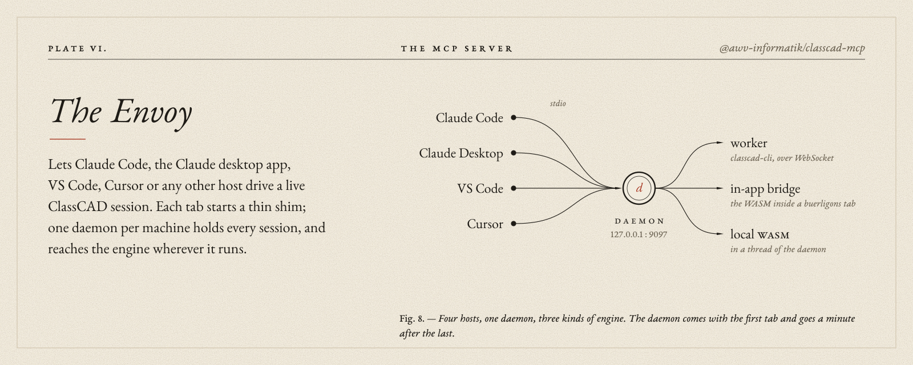
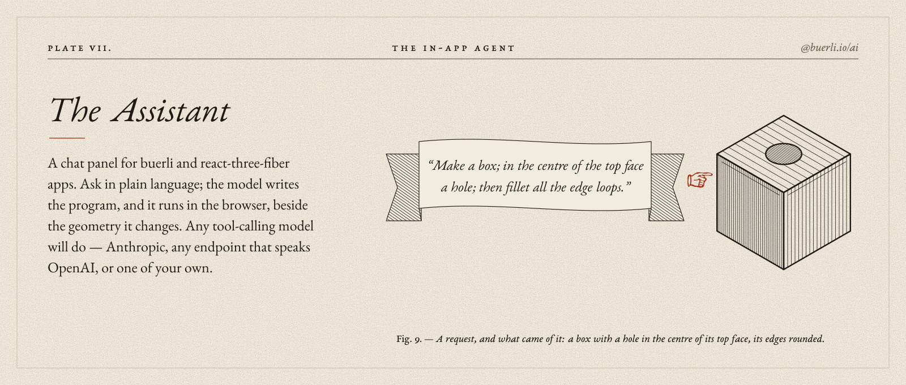

<picture>
  <source media="(prefers-color-scheme: dark)" srcset="docs/readme/frontispiece.dark.svg">
  
</picture>

Everything that lets AI agents build and verify CAD models with
[ClassCAD](https://classcad.ch), and the hosts they work in: an MCP server for
Claude Code, Claude Desktop, VS Code or Cursor, and a chat panel for
[buerli](https://buerli.io) apps.

<picture>
  <source media="(prefers-color-scheme: dark)" srcset="docs/readme/systema.dark.svg">
  
</picture>

<picture>
  <source media="(prefers-color-scheme: dark)" srcset="docs/readme/skill.dark.svg">
  
</picture>

[`packages/skill`](packages/skill) · `@classcad/skill`

<picture>
  <source media="(prefers-color-scheme: dark)" srcset="docs/readme/script.dark.svg">
  
</picture>

[`packages/script`](packages/script) · `@classcad/script`

<picture>
  <source media="(prefers-color-scheme: dark)" srcset="docs/readme/renderer.dark.svg">
  
</picture>

[`packages/renderer`](packages/renderer) · `@classcad/renderer`

<picture>
  <source media="(prefers-color-scheme: dark)" srcset="docs/readme/mcp.dark.svg">
  
</picture>

[`packages/mcp`](packages/mcp) · `@awv-informatik/classcad-mcp`

```bash
claude mcp add classcad --scope user \
  --env CLASSCAD_WS_URL=ws://localhost:9094/ \
  -- npx -y @awv-informatik/classcad-mcp
```

<picture>
  <source media="(prefers-color-scheme: dark)" srcset="docs/readme/agent.dark.svg">
  
</picture>

[`packages/buerli-ai`](packages/buerli-ai) · `@buerli.io/ai`

```tsx
import { createCadAgent, createAutoProvider, initAgentAsync } from '@buerli.io/ai'

await initAgentAsync()   // once — loads the bundled ClassCAD knowledge
const { AgentPanel } = createCadAgent({
  provider: createAutoProvider({ apiKey: API_KEY, endpoint: API_ENDPOINT }),
})

function Assistant({ drawingId }) {
  return <AgentPanel drawingId={drawingId} open />   // next to your <Canvas>
}
```

## Working in the repo

```bash
npm install                     # links all workspaces
npm run build                   # skill, script, renderer, then mcp and buerli-ai
npm test                        # every package's tests
node scripts/run.mjs script.mjs # the training harness: one script against a live worker
python3 docs/readme/build.py    # typesets these plates
```

The root is also home to **cc**, the agent that trains the skill against a
live engine (`AGENTS.md`, `workspace/`).

<picture>
  <source media="(prefers-color-scheme: dark)" srcset="docs/readme/colophon.dark.svg">
  
</picture>
