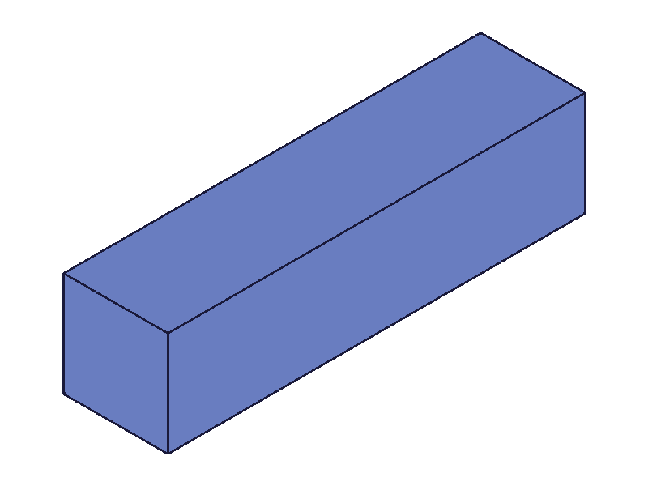
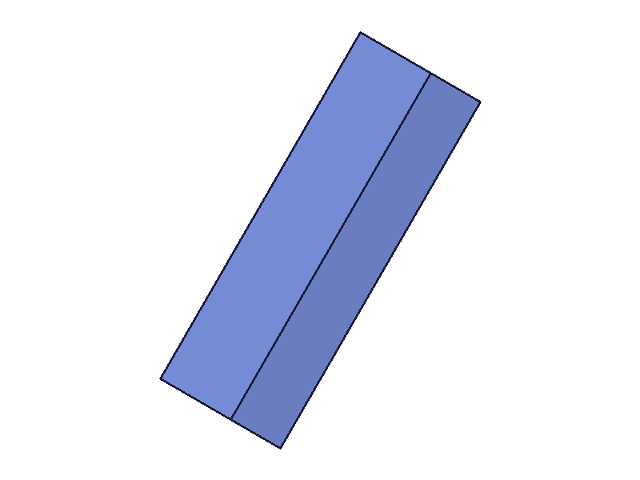
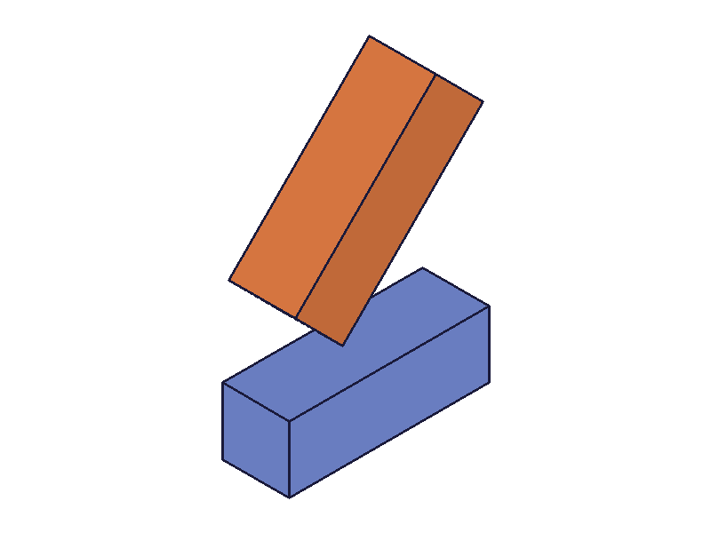

# Training: Data Types

**Date:** 2026-03-22

## Goal

Studying data types: `point` as `[x, y, z]`, coordinate conventions, angle units (radians), transformation matrices (4x4).

**Questions to answer:**

- How do points behave as params (`[x,y,z]`) vs results (`{x,y,z}`)? Is the duality universal?
- Can you pass `{x,y,z}` objects as params instead of `[x,y,z]` arrays?
- What coordinate system does ClassCAD use? Right-hand? Default orientation?
- Are angles universally in radians? What happens if you pass degrees?
- How do rotation vectors work? (`rotation: [rx, ry, rz]` in solid.* APIs) — Euler angles? Order?
- What is the 4x4 transformation matrix layout? Row-major? Where is translation?
- Does `setObjectCoordSystem` accept `[x,y,z]` arrays for `origin`, `xVec`, `yVec`?
- Does `evaluateExpression` return points as `{x,y,z}` objects?
- What precision do point coordinates have?
- Can you use 2D points `[x,y]` or must it always be `[x,y,z]`?

## 01 — point representations

Script: `scripts/01-point-repr.mjs` — ✅ Both `[x,y,z]` and `{x,y,z}` accepted as params. Results always `{x,y,z}`.

**Learned:**
- `evaluateExpression('{10,20,30}')` returns `{x:10, y:20, z:30}` — object, not array
- `setObjectCoordSystem` accepts both `[x,y,z]` arrays AND `{x,y,z}` objects for `origin`, `xVec`, `yVec`
- Point arithmetic in expressions confirmed: `{1,2,3}+{4,5,6}` → `{x:5,y:7,z:9}`, `{1,2,3}*3` → `{x:3,y:6,z:9}`

**📌 LLM doc:** Update `references/common/generic.md` — document that `{x,y,z}` objects are accepted as point params (not just arrays)

## 02 — point edge cases

Script: `scripts/02-point-edges.mjs` — ✅ Strict 3-component requirement confirmed.

**Learned:**
- `[x,y]` → error: "If point is defined as array, it must have exactly 3 real values"
- `[x,y,z,w]` → same error
- `[x]` → same error
- `[]` → same error
- Expression `{10,20}` → null (2-component point fails silently)
- Full double precision: `{0.000001, 999999.999999, -123456.789}` → exact values preserved
- Zero vectors `[0,0,0]` for `xVec`/`yVec` in `setObjectCoordSystem` → error: "Vectors for SetCoordSystem may not have length 0"

**📌 LLM doc:** Document strict 3-component requirement and zero vector rejection

## 03 — angles

Script: `scripts/03-angles.mjs` — ✅ Radians confirmed universally.

**Learned:**
- `sin(90)` → 0.894 (treats 90 as radians, not degrees) — confirms all trig is in radians
- `sin(C:PI/2)` → 1 (correct)
- **`deg` suffix exists:** `45deg` → 0.7854 (PI/4), `sin(90deg)` → 1
- `deg` converts degrees to radians in the expression engine
- `C:PI` = 3.141592653589793
- `atan2(1,1)` → error "could not be evaluated" — `atan2` does NOT exist
- `atan(1)` → 0.7854 (PI/4) — single-arg atan works

**📌 LLM doc:** Document `deg` suffix, missing `atan2`, radians everywhere

## 04-10 — transformation matrix

Scripts: `scripts/04-matrix.mjs` through `scripts/10-matrix-axes.mjs`

**Learned:**
- Matrix must be 4x4. 3x3 → "The provided matrix is not a 4x4 matrix"
- Documentation example shows column-format: translation in last column `[[R|t],[0|1]]`
- Both column and row formats succeed without error (API doesn't validate mathematical properties)
- `isGlobal` param: defaults to TRUE (global coords), FALSE for local coords
- `transformObjectWithMatrix` transforms the part's coordinate system, not individual geometry
- Structure tree shows local coordinates — work axes/points don't change position after global transform
- Matrices compose: applying the same rotation twice doubles the effect

## 11 — coordinate system

Script: `scripts/11-coord-system.mjs` — ✅ Right-handed system confirmed.

**Learned:**
- Default work plane normals: **Top** = `{x:0, y:0, z:1}` (+Z up), **Front** = `{x:0, y:1, z:0}` (+Y forward), **Right** = `{x:1, y:0, z:0}` (+X right)
- This is a standard **right-handed coordinate system**: X-right, Y-forward, Z-up
- `solid.box` uses `length/width/height` params (NOT `xLen/yLen/zLen` like `part.box`)

**📌 LLM doc:** Document coordinate system orientation

## 12 — rotation vectors

Script: `scripts/12-rotation-vector.mjs` — ✅ Visual confirmation of rotation vectors.

|  |  |
|---|---|

|  |
|---|

**Learned:**
- `rotation: [rx, ry, rz]` — each component rotates around that axis, in radians
- Visual confirmation: `[0, 0, PI/4]` rotates 45° in XY plane
- `translation: [tx, ty, tz]` — moves the solid
- `rotateFirst` defaults to TRUE — rotation applied before translation
- Two boxes in same entity injection get distinct colors (per-body coloring confirmed)

**📌 LLM doc:** Document rotation vector semantics and `rotateFirst` behavior

## 13 — points in sketch APIs

Script: `scripts/13-point-in-sketch.mjs` — ✅ Same point format across all domains.

**Learned:**
- Sketch APIs accept both `[x,y,z]` arrays and `{x,y,z}` objects for positions
- 2D `[x,y]` fails with same error: "must have exactly 3 real values"
- For sketches on XY plane, pass z=0 explicitly
- Sketch geometry (lines) store direction as `{x,y,z}` point objects in structure tree

## 14–15 — expression engine functions

Scripts: `scripts/14-expression-functions.mjs`, `scripts/15-expr-followup.mjs` — ✅ Function survey.

**Available functions:**
- **Trig:** `sin`, `cos`, `tan`, `asin`, `acos`, `atan` (all radians, all work)
- **Math:** `sqrt`, `pow(x,y)`, `abs`, `min(a,b)`, `max(a,b)`, `exp`
- **Log:** `log` (base 10!), `ln` (natural log)
- **Constants:** `C:PI` only. `C:E`, `C:2PI`, `C:HALF_PI`, `C:INF` do NOT exist
- **Deg suffix:** `Ndeg` converts degrees to radians — `180deg` → PI
- **Boolean math:** `TRUE + TRUE` → 2, `TRUE * 5` → 5 (booleans are numeric)
- **Strings:** `"hello"` → `"hello"` (string literals work)

**Missing/not supported:**
- `atan2(x,y)` — does not exist
- `floor`, `ceil`, `round` — do not exist
- `mod(a,b)`, `%` operator — do not exist
- `rad` suffix — does not exist (angles are already radians)
- Comparison operators (`>`, `==`, `<`) — do not work
- `if(cond, a, b)` — does not exist
- `^` — NOT a power operator (use `pow`)

**📌 LLM doc:** Update expression engine section with full function inventory
