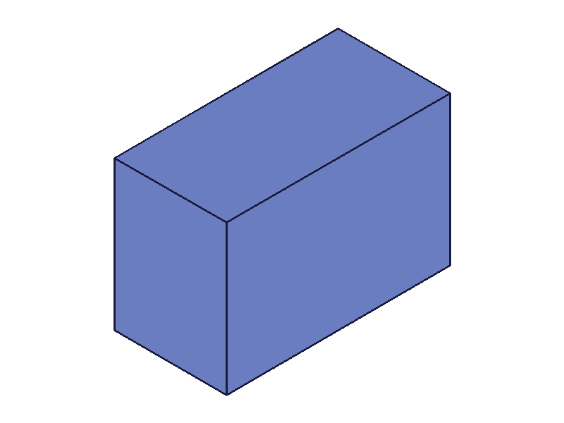

# Training: part.expression

**Date:** 2026-03-24

## Goal

Testing `v1.part.expression` — creating named expressions inside a part.

**Methods to cover:**

- `expression` — basic creation with `toCreate` array
- `expression` — single expression vs. multiple expressions in one call
- `expression` — numeric values vs. string formula values
- `expression` — formulas referencing other expressions by name
- `expression` — using `C:PI` and math functions in values
- `expression` — what happens with duplicate names
- `expression` — invalid expressions (syntax errors, undefined references)
- `expression` — return value (boolean true/false)
- `expression` — interaction with `@expr.NAME` in feature params (box)
- `expression` — empty toCreate array
- `expression` — missing required params (no id, no toCreate)

**Questions:**

- Does `toCreate` order matter when expressions reference each other?
- Can you create expressions with the same name as math functions (e.g., `sin`)?
- What does the return value look like for partial failures (some valid, some invalid)?
- Can you call `expression` multiple times to add more expressions?
- What's the actual boolean return — JS true/false or ClassCAD TRUE/FALSE?

---

## 01 — basic single expression

Script: `scripts/01-basic-single.mjs` — ✅ Creates a single named expression with numeric value. result=1 (number), maxLevel=31, no messages.

**Learned:** Return value is numeric `1` (not JS `true`). This matches ClassCAD's boolean convention where 1=TRUE, 0=FALSE.

## 02 — multiple expressions in one call

Script: `scripts/02-multiple-expressions.mjs` — ✅ Three expressions created in one call. result=1, maxLevel=31.

## 03 — formula values with cross-references

Script: `scripts/03-formula-values.mjs` — ✅ Expressions can reference each other by name. `base=40`, `doubled=base*2` → 80, `combined=doubled+tripled` → 200.

**Learned:** Forward references work — `combined` references `doubled` and `tripled` which are defined earlier in the same `toCreate` array. Order within the array doesn't seem to matter for resolution.
**📌 LLM doc:** Cross-references work within a single `toCreate` call, order doesn't matter.

## 04 — math functions and constants

Script: `scripts/04-math-functions.mjs` — ✅ `C:PI`, `pow()`, `sqrt()`, `sin()` all work in expression values. Computed values correct.

## 05 — duplicate name

Script: `scripts/05-duplicate-name.mjs` — ✅ Attempting to create an expression with an existing name fails: result=0, maxLevel=51, error code 1014 "width already exists". Original value (50) preserved.

**📌 LLM doc:** Duplicate name → error 1014, result=0. Does not overwrite. Use `updateExpression` instead.

## 06 — multiple calls (additive)

Script: `scripts/06-multiple-calls.mjs` — ✅ Calling `expression()` multiple times adds to the expression set. Third call created `c = a + b` referencing expressions from prior calls. c = 30.

## 07 — invalid expression values

Script: `scripts/07-invalid-expression.mjs` — Syntax error (`2 + + 3`): result=0, maxLevel=51, detailed parse error. Bad ref (`nonexistent * 2`): result=0, error "Datamember nonexistent not found". Div by zero (`1/0`): result=0, "Division by zero!" error.

**Learned:** The div/0 call's messages included errors from the bad_ref expression (created in a prior call). This means the server re-evaluates ALL expressions when any new one is added, and reports accumulated errors.
**📌 LLM doc:** Invalid formulas cause result=0 but the expression IS still registered (see script 11). Accumulated evaluation errors appear in messages.

## 08 — empty and missing params

Script: `scripts/08-empty-and-missing.mjs` — Empty `toCreate: []` → result=1, no error (no-op). Omitted `toCreate` → same. Missing `name` in item → error. Missing `value` → error code 1004 "value must be provided", result=null (not 0).

**Learned:** result=null when a required param is missing (not the usual 0/1 boolean). This is a different error path than formula errors.
**📌 LLM doc:** `name` and `value` are both required in toCreate items. Missing `value` → result null, error 1004.

## 09 — partial failure (batch atomicity)

Script: `scripts/09-partial-failure.mjs` — Mixed batch: good1 (valid), bad_syntax (invalid), good2 (valid). Result=0, maxLevel=51. Checking afterwards: good1, bad_syntax, good2 ALL return null from evaluateExpression.

**Learned:** When ANY expression in a toCreate batch has a syntax error, the ENTIRE batch fails atomically — no expressions are created. This differs from script 07 where invalid formulas (bad refs) DO get created but with evaluation errors.
**📌 LLM doc:** Syntax errors in toCreate are atomic — entire batch fails. BUT expressions with valid syntax but bad runtime refs (undefined variables) DO get created.

## 10 — expressions in box via @expr.NAME

Script: `scripts/10-use-in-box.mjs` — ✅ Created L=120, W=80, H=L/2=60. Box with `@expr.L`, `@expr.W`, `@expr.H` renders correctly.

|  |
|---|

## 11 — failed expressions still exist

Script: `scripts/11-failed-still-exists.mjs` — Created `bad_one = nonexistent * 2` (result=0, error). Re-creating with same name → "already exists" error 1014. getExpression shows `{ expression: "nonexistent * 2", value: 1 }`.

**Learned:** Expressions with invalid runtime references ARE registered in the ExpressionSet. They exist with the broken formula and a default value of 1. The creation "fails" (result=0, error) but the name is taken. This is a gotcha — you can create a broken expression you can't re-create (must delete/update it instead).
**📌 LLM doc:** CRITICAL: Expressions with undefined variable refs are registered despite result=0. Default value=1. Must use deleteExpression/updateExpression to fix.

## 12 — special names

Script: `scripts/12-special-names.mjs` — Underscores (`my_var`): ✅. Digits (`var2`): ✅. Function name collision (`sin`): ✅ creates! The expression `sin`=42 shadows the variable but `sin(C:PI/2)` still works as a function. Spaces: ❌ error 1014 "must contain only word characters". Empty string: ❌ error 1014 "must start with a non-digit word character".

**📌 LLM doc:** Names must be word chars only, start with non-digit. Names can shadow math functions without breaking function calls.

## 13 — string values

Script: `scripts/13-string-value.mjs` — Quoted string `'"hello"'`: error, "evaluates to the type String" — expressions must be numeric (Gleitkommazahl = float). Plain string `'hello'`: treated as identifier, fails "Datamember not found". Numeric string `'42'`: failed in this script due to contamination from prior broken expressions (see script 16 for clean test).

**📌 LLM doc:** Expression values must evaluate to a number. String values cause errors but may still register (error accumulation).

## 14 — numeric edge values

Script: `scripts/14-negative-zero-values.mjs` — ✅ Zero, negative (-50), large (999999), small (0.001), float (3.14159) all work correctly.

## 15 — forward reference order

Script: `scripts/15-forward-ref-order.mjs` — ✅ Forward ref works: `x = y * 2` defined BEFORE `y = 10` in the array. x evaluates to 20. Order in toCreate array doesn't matter.

**📌 LLM doc:** Order in toCreate doesn't matter — forward and backward references both resolve.

## 16 — string formula (isolated)

Script: `scripts/16-string-formula-isolated.mjs` — ✅ `'42'` as string value: creates successfully, evaluates to 42. `'6 * 7'` formula: creates, evaluates to 42. Script 13's failure was caused by error contamination.

**📌 LLM doc:** Both numeric and string values work. Strings are parsed as math expressions.

## 17 — param as array

Script: `scripts/17-param-as-array.mjs` — ✅ Passing an array of objects to `expression()` works. Each object has its own `id` and `toCreate`. Both expressions created.

## 18 — circular references

Script: `scripts/18-circular-ref.mjs` + `scripts/18b-circular-values.mjs` — Circular refs (`a = b + 1`, `b = a + 1`) create successfully with no error! Values: a=3, b=2. getExpression shows `a: {expression: "b + 1", value: 3}`, `b: {expression: "a + 1", value: 2}`.

**Learned:** No circular dependency detection. Resolved by single-pass evaluation with seed value 1 (the default). b evaluated first: b = a(seed=1) + 1 = 2. Then a = b(2) + 1 = 3. The values stabilize but aren't mathematically consistent (a ≠ b+1 if b=2 and a=3... wait, a=b+1=3 ✓, but b=a+1=3+1=4≠2). So it's a single-pass, not iterative-to-convergence.
**📌 LLM doc:** Circular references silently succeed. No infinite loop or error. Values are evaluated single-pass with seed=1. Results are NOT mathematically consistent.

## 19 — large batch (50 expressions)

Script: `scripts/19-many-expressions.mjs` — ✅ 50 expressions in one batch, all created and evaluated correctly. No practical limit hit.

## 20 — expressions driving a box feature

Script: `scripts/20-expr-drives-box-update.mjs` — ✅ Expressions L=100, W=60, H=40 drive a box via `@expr.` syntax. getExpression returns `{ expression: "", value: 100 }` for numeric values — the `expression` field is empty when the value is a plain number.

|  |
|---|

**📌 LLM doc:** getExpression returns `{ expression: "<formula>", value: <number> }`. For plain numeric values, expression is empty string.
