# Training: part.expression — Advanced Usage & Real-World Patterns

**Date:** 2026-03-24

## Goal

Deep exploration of expressions in real-world parametric modeling scenarios. Not the API surface (covered in prior session) — this is about HOW expressions work with features, formula syntax edge cases, and practical patterns.

**Areas to explore:**

- Shared expressions driving multiple features (box + cylinder sharing dimensions)
- Inline formulas vs. named expressions in feature params
- `@expr.NAME` with arithmetic in feature params (e.g., `'@expr.L + 10'`)
- Expression-driven point arrays (offsets, positions) via string-encoded `[@expr.x, 0, @expr.z]`
- Expressions in extrusion limit2, taperAngle
- Expressions in cylinder diameter/height
- Complex formula syntax: nested functions, chained refs, long expressions
- What happens when you inline-reference `C:PI` and math functions directly in feature params
- updateExpression + feature recalculation — does changing an expression update features?
- Multiple features sharing the same expression — do all update?

**Questions:**

- Can you use `@expr.NAME` in ALL expression-typed params, or only some?
- Do inline formulas (no named expressions) work in feature params? e.g., `height: '3 * 40'`
- Can you mix `@expr.` refs with inline math? e.g., `height: '@expr.H + 10'`
- When updateExpression changes a value, do features auto-recalculate?
- Can expressions reference dimensions or feature properties, or only other expressions?

---

## 01 — shared expressions driving two features

Script: `scripts/01-shared-exprs-two-features.mjs` — ✅ Box and cylinder both use `@expr.baseSize`, `@expr.wallHeight`, `@expr.holeDiam`. All created successfully.

| 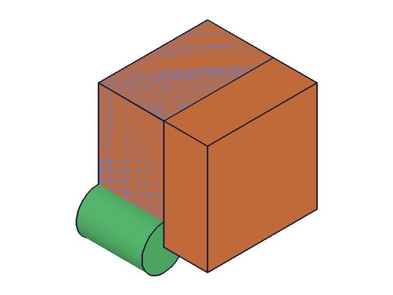 |
|---|

## 02 — inline formulas in feature params (no named expressions)

Script: `scripts/02-inline-formulas-in-features.mjs` — ✅ `'3 * 40'`, `'2 * 30 + 10'`, `'sqrt(2500)'`, `'C:PI * 20'` all work directly in box/cylinder params. No @expr needed for inline math.

| 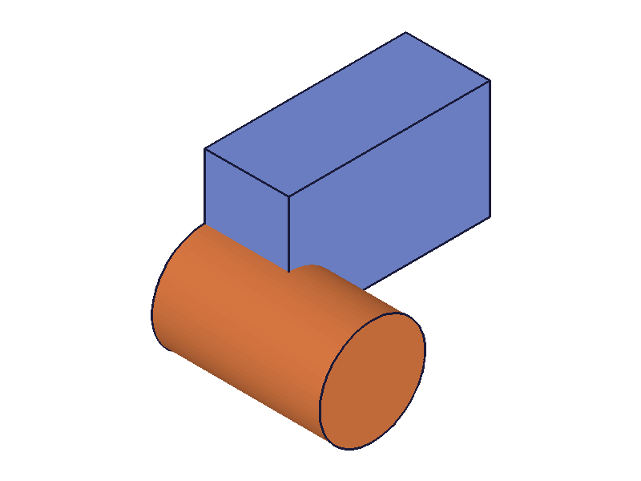 |
|---|

**📌 LLM doc:** Inline formulas work in feature params without any prefix. Only `@expr.` is needed for named expression references.

## 03 — @expr mixed with arithmetic and functions

Script: `scripts/03-expr-with-arithmetic.mjs` — ✅ All variants work:
- `'@expr.base + 20'` — expr + constant
- `'@expr.base - 2 * @expr.margin'` — two exprs + arithmetic
- `'sqrt(@expr.base)'` — function wrapping @expr
- `'max(@expr.base, @expr.margin) / 2'` — multi-arg function with @expr

**📌 LLM doc:** @expr refs freely mix with arithmetic, functions, constants. Full expression syntax available.

## 04 — bare names fail in feature params

Script: `scripts/04-bare-name-in-feature.mjs` — Confirmed: bare `'L'` and `'L + 10'` both fail with error 1000 "Could not convert api params." `'@expr.L'` works.

**📌 LLM doc:** Already documented but confirmed with evidence.

## 05 — expressions in multiple features (box + cylinders)

Script: `scripts/05-expr-in-extrusion.mjs` — ✅ Expressions drive box (boxLen/boxWid/boxHt), cylinder (cylDiam/cylHt), and formula cylinder (`'@expr.cylDiam / 2'`). All created.

| 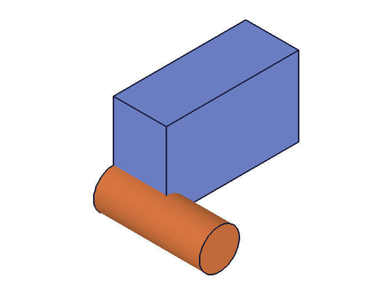 | 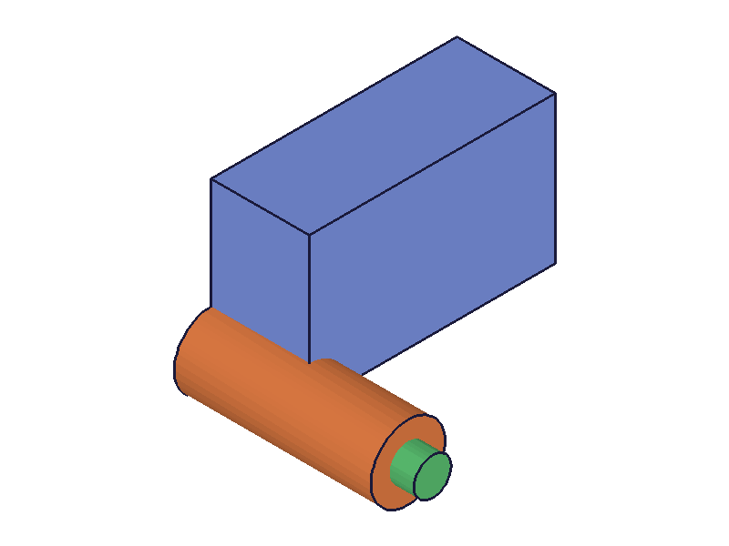 |
|---|---|

## 06–07 — updateExpression with WRONG syntax (initial attempt)

Scripts 06/07 used `{ name, value }` directly instead of `{ toUpdate: [{ name, value }] }`. The calls returned result=1 but the expression value didn't change and features didn't update. **No error was raised** — the wrong param was silently ignored.

**📌 LLM doc:** CRITICAL: `updateExpression` uses `toUpdate: [{ name, value }]` array, NOT direct `name`/`value` params. Wrong params are silently ignored (result=1, no error).

## 08 — string-encoded arrays with @expr

Script: `scripts/08-string-encoded-arrays.mjs` — ✅ `offset: '[@expr.offsetX, @expr.offsetY, @expr.offsetZ]'` works in `workCSys`. WCS created at offset, box placed at WCS.

| 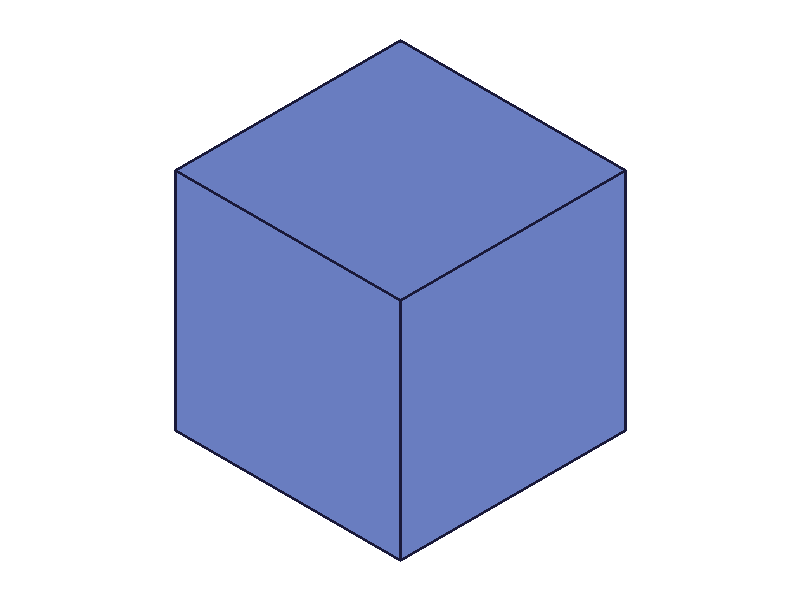 |
|---|

**📌 LLM doc:** @expr works inside string-encoded point arrays for offset/position params.

## 09 — complex formula syntax

Script: `scripts/09-complex-formulas.mjs` — ✅ All complex formulas work:
- `max(min(a, b), sqrt(c))` → 10
- `(a + b) * c / (a - 1)` → 100
- `sin(a_r(a * 3))` → 0.5 (sin(30°))
- `min(max(a * 5, 20), 100)` → 50 (clamped)
- Long chained expression → 1197.4

## 10 — inline formula vs @expr: parametric behavior

Script: `scripts/10-formula-in-feature-vs-expr.mjs` — Box1 uses inline formula `'2 * C:PI * 30'` (hardcoded), Box2 uses `'2 * C:PI * @expr.R'` (references R). After updating R from 30→60 and recalc, only Box2's length should change.

## 11 — updateExpression CORRECT syntax + recalc

Script: `scripts/11-update-correct-syntax.mjs` — ✅ With `toUpdate: [{ name: 'size', value: 120 }]`:
- `updateExpression` result=1
- `getExpression` immediately shows value=120 (updated before recalc!)
- After `common.recalc()`, the feature geometry updated

|  |  |  |
|---|---|---|

**Learned:** The expression value updates immediately (getExpression returns new value). But feature geometry only recalculates after `common.recalc()`. The before/after-no-recalc snapshots look the same (auto-scaled), but after-recalc the geometry grew (confirmed by reference object in script 16).

**📌 LLM doc:** updateExpression updates the value immediately. Features only recalculate after `common.recalc()`. Always call recalc after updateExpression.

## 12 — shared expression update + recalc

Script: `scripts/12-shared-update-recalc.mjs` — ✅ Two boxes sharing expression S. After update S=50→100 + recalc, both boxes recalculated.

## 13 — chain cascade: base → derived → feature

Script: `scripts/13-chain-update-cascade.mjs` — ✅ `base=40`, `doubled=base*2`, `tripled=base*3`. After updating base to 80 + recalc: doubled=160 ✓, tripled=240 ✓. Full cascade through derived expressions.

| 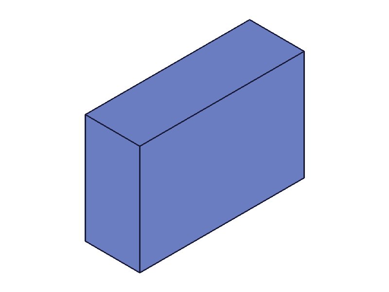 | 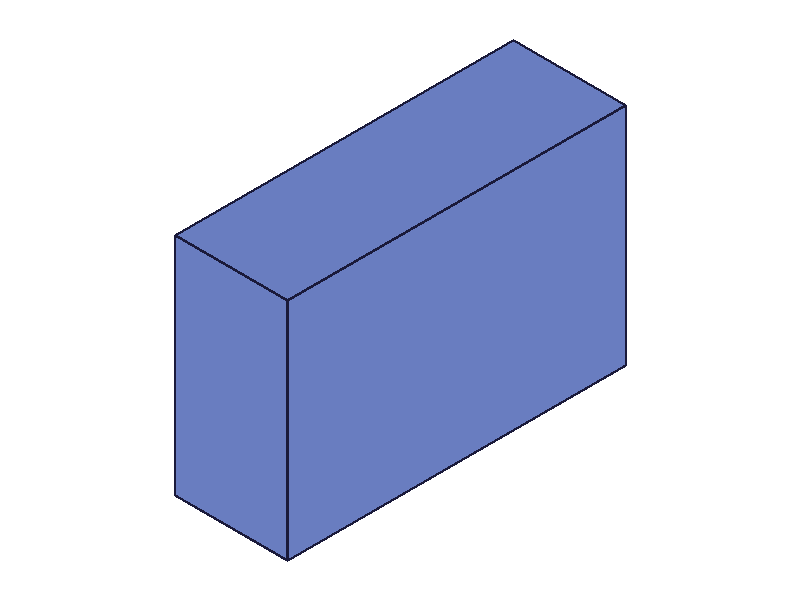 |
|---|---|

**📌 LLM doc:** Expression chains cascade: updating a base expression propagates through all derived expressions and features after recalc.

## 14 — updateExpression: formula change, not just value

Script: `scripts/14-update-formula-not-just-value.mjs` — ✅ Can update both the formula and value:
- `y = x * 2` → update to `y = x * 3 + 5` → getExpression shows `{expression: "x * 3 + 5", value: 35}` ✓
- Update to plain number 99 → `{expression: "", value: 99}` ✓

**📌 LLM doc:** updateExpression can change formula strings, not just numeric values.

## 15 — batch update multiple expressions

Script: `scripts/15-update-multiple.mjs` — ✅ `toUpdate` array with 3 items, all updated. After recalc, L=200, W=120, H=80.

## 16 — visual proof of recalculation

Script: `scripts/16-verify-recalc-dims.mjs` — ✅ Box (expr-driven, S=60→120) + fixed reference cylinder (d=30, h=30). Before: cylinder is ~1/2 box. After: cylinder is ~1/4 box. Geometry DID change.

| 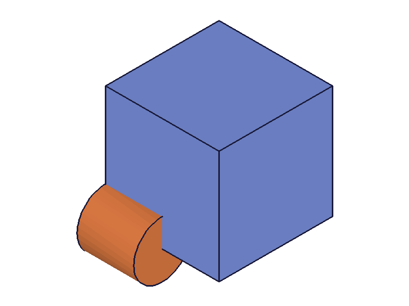 | 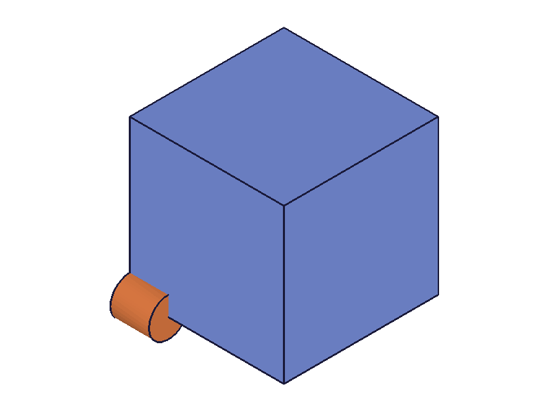 |
|---|---|

## 17 — linkWithExpression (failed — wrong params, deferred to separate task)

Script: `scripts/17-linkWithExpression-test.mjs` — Failed twice. First: `id` must be feature/dimension, not partId. Second: param is `exprName`, not `expressionName`. The correct signature is `{ id: featureId, exprName: 'name', name: 'paramName' }`. Deferred to the linkWithExpression training task.

## 18 — realistic parametric model (flanged block)

Script: `scripts/18-realistic-parametric.mjs` — ✅ Full parametric model: base plate + tower + cylinder, all driven by expressions with cross-references. After updating `baseL` from 120→200 + recalc: towerL=100 ✓, towerH=160 ✓. All derived expressions and features cascaded.

| 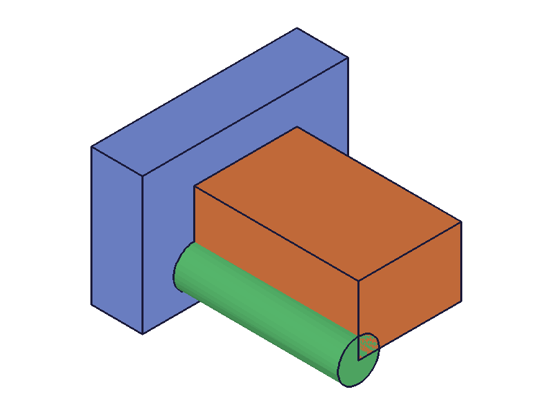 | 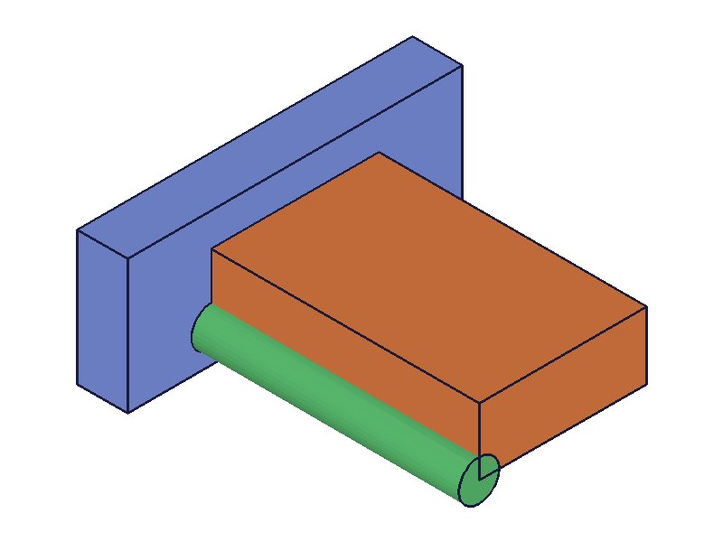 |
|---|---|

## 19 — formula edge cases in feature params

Script: `scripts/19-expr-negative-formula-edge.mjs` —
- Negative `-@expr.val`: box created but error 1122 "Length not valid, must be greater than 0"
- Parenthesized `(@expr.val + 20) * 0.5`: ✅
- Long nested `sqrt(pow(@expr.val, 2) + pow(@expr.val / 2, 2))`: ✅
- Clamp `min(max(@expr.val, 50), 200)`: ✅

**📌 LLM doc:** Negative expression results are validated by the feature — box requires length > 0.

## 20 — WCS offset update + recalc

Script: `scripts/20-expr-in-workCSys-offset.mjs` — ✅ Two boxes with expression-driven spacing via WCS offset `'[@expr.spacing, 0, 0]'`. After updating spacing 50→100 + recalc, gap between boxes doubled.

| 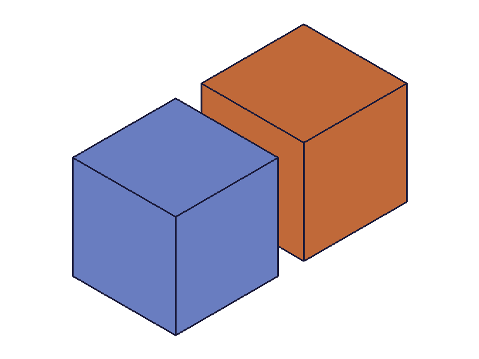 | 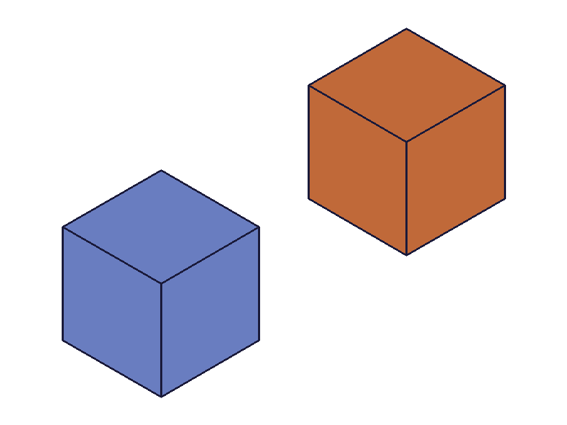 |
|---|---|

**📌 LLM doc:** String-encoded arrays in WCS offset also participate in parametric updates.
