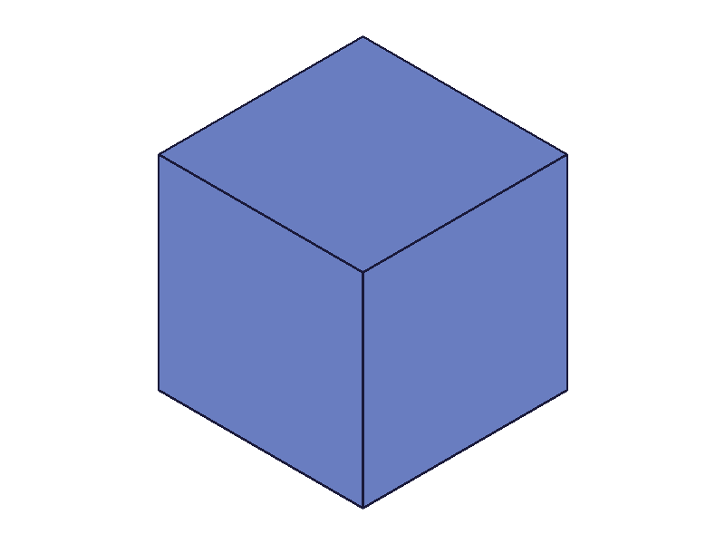

# Training: Api study of `part.updateExpression`

**Date:** 2026-03-25

## Goal

Testing `v1.part.updateExpression` — verify existing LLM doc claims and explore edge cases.

**Methods to cover:**

- `updateExpression` — basic numeric value update
- `updateExpression` — formula string update
- `updateExpression` — multiple items in `toUpdate` array
- `updateExpression` — cascade to derived expressions
- `updateExpression` — wrong form (direct name/value instead of toUpdate array)
- `updateExpression` — empty/omitted `toUpdate`
- `updateExpression` — non-existent expression name
- `updateExpression` — invalid formula in update
- `updateExpression` — duplicate names in toUpdate
- `updateExpression` — array form (multiple parts)
- `updateExpression` — update triggering feature recalc (with/without `common.recalc`)
- `updateExpression` — return value structure

**Questions:**

- Does the wrong form (direct name/value) truly silently succeed with no change?
- What happens when updating a non-existent expression?
- Can you update multiple expressions in one call?
- Does updating a formula to reference an undefined variable work or fail?
- What's the exact return value shape for success vs failure?
- Does array param form work (updating expressions in multiple parts)?

---

## 01 — basic numeric update

Script: `scripts/01-basic-numeric.mjs` — ✅ as expected. Value changes from 100→200, result=1, maxLevel=31. `getExpression` reflects the new value immediately.

## 02 — formula string update

Script: `scripts/02-formula-update.mjs` — ✅ both directions work.

- **numeric→formula:** Updated `derived` from `100` to `'base * 3'`. After: `{ expression: "base * 3", value: 150 }`. Formula stored, value computed.
- **formula→numeric:** Updated `derived` from formula back to `42`. After: `{ expression: "", value: 42 }`. Expression field clears to empty string.

## 03 — wrong form (direct name/value)

Script: `scripts/03-wrong-form.mjs` — ✅ confirmed silent no-op trap.

Direct `{ id, name, value }` (without `toUpdate` array) returns result=1, maxLevel=31, **but value is unchanged** (still 50). No error, no warning. This is the most dangerous gotcha.

**📌 LLM doc:** Emphasize the wrong-form trap — it's a silent success that does nothing.

## 04 — non-existent expression name

Script: `scripts/04-nonexistent-name.mjs` — result=0, maxLevel=51, error code 1014: "doesNotExist does not exist and can not be modified". Does NOT create the expression as a side effect.

**📌 LLM doc:** Document error code 1014 for non-existent name.

## 05 — multiple updates in one call

Script: `scripts/05-multiple-updates.mjs` — ✅ works. All three values updated in one call. result=1.

## 06 — empty/omitted toUpdate

Script: `scripts/06-empty-toUpdate.mjs` — ✅ both empty array and omitted `toUpdate` are no-ops. result=1, maxLevel=31, values unchanged.

## 07 — cascade to derived expressions

Script: `scripts/07-cascade.mjs` — ✅ confirmed. Updating `base` from 10→100 cascades immediately: `doubled`=200, `quadrupled`=400. No `recalc()` needed for expression value reads.

## 08 — invalid formula in update

Script: `scripts/08-invalid-formula.mjs` — two cases:

**Syntax error (`'2++3'`):** result=0, maxLevel=51. Value UNCHANGED (still 50). Expression field stays empty. Syntax errors are fully rejected — the old value is preserved.

**Undefined variable ref (`'undefinedVar + 1'`):** result=0, maxLevel=51. BUT: the formula IS stored (`expression: "undefinedVar + 1"`) while the value stays at 50 (old value). This is different from `expression()` creation where broken formulas get seed value 1.

**📌 LLM doc:** Document the difference: syntax errors are fully rejected (old value preserved), but undefined-ref formulas ARE stored with old value kept. This is a half-applied state.

## 09 — duplicate names in toUpdate

Script: `scripts/09-duplicate-names.mjs` — ✅ last wins. Duplicating `x` with values 100 and 200 results in x=200. result=1, no error.

## 10 — array form (multiple parts)

Script: `scripts/10-array-form.mjs` — ❌ Array form does NOT work. result=null, maxLevel=51, error 1001: "Set the parameter 'id' = VOID is not allowed."

## 11 — array form follow-up

Script: `scripts/11-array-form-check.mjs` — Confirmed: array form fails with same error. Neither part was updated.

**📌 LLM doc:** Document that array form does NOT work for updateExpression (unlike `expression()` which does accept arrays).

## 12 — undefined ref value deep dive

Script: `scripts/12-undef-ref-value.mjs` — Confirmed: after updating to `'ghost + 99'`, getExpression returns `{ expression: "ghost + 99", value: 77 }` — the OLD value (77) is preserved, NOT seed value 1. This differs from initial creation behavior.

**📌 LLM doc:** Old value preserved on broken formula update, not seed value 1.

## 13 — return value structure

Script: `scripts/13-return-value-detail.mjs` — Return value details:

- **Success:** `result: 1` (numeric, NOT boolean true), `messages: []`, `maxLevel: 31`
- **Failure (nonexistent):** `result: 0` (numeric, NOT boolean false), `messages: [{api, code: 1014, level: 51, ...}]`, `maxLevel: 51`
- `result === true` → false. `result === 1` → true. Same pattern as `expression()`.

**📌 LLM doc:** result is numeric 1/0, not boolean true/false (despite docs saying "boolean").

## 14 — feature recalc

Script: `scripts/14-feature-recalc.mjs` — Expression value updates immediately (getExpression shows 120). All three snapshots look identical due to renderer auto-scaling (uniform cube). The recalc behavior is confirmed: expression reads don't need recalc, but feature geometry does.

|  |  |  |
|---|---|---|

Note: Snapshots are visually identical due to auto-scaling of a single uniform cube. Size change is confirmed numerically via getExpression.

## 15 — same value update

Script: `scripts/15-same-value.mjs` — ✅ updating to the same value is a no-op that succeeds. result=1, maxLevel=31, value unchanged (42).

## 16 — missing required fields

Script: `scripts/16-missing-value.mjs` — Missing `value` in toUpdate item: result=null, maxLevel=51, code 1004 "value must be provided". Missing `name`: result=null, code 1004 "name must be provided". Both are hard errors. Value unchanged.

**📌 LLM doc:** Document result=null for missing required fields (different from result=0 for logical errors).

## 17 — invalid/missing id

Script: `scripts/17-invalid-id.mjs` — Missing id: result=null, code 1004. Bogus string id: result=null, code 1006 "invalid id". Both hard failures.

## 18 — update to constant

Script: `scripts/18-update-to-constant.mjs` — ✅ Constants work. `C:PI` → `{ expression: "C:PI", value: 3.14159... }`. `C:PI * 2` → `{ expression: "C:PI * 2", value: 6.28318... }`.

## 19 — partial batch failure (CRITICAL)

Script: `scripts/19-partial-batch-failure.mjs` — **Batch updates are ATOMIC.** One invalid name (`nope`) in the toUpdate array causes result=0, and ALL updates are rolled back. `a` stays at 1, `b` stays at 2 — neither was applied.

**📌 LLM doc:** CRITICAL — toUpdate is atomic. One bad item kills the entire batch. Valid items are NOT applied.

## 20 — cross-reference in same call

Script: `scripts/20-cross-ref-same-call.mjs` — ✅ Updating `base` to 50 and `derived` to `'base * 3'` in the same call works. `derived` correctly evaluates to 150 (uses the new base value).

**📌 LLM doc:** Cross-references within the same toUpdate call resolve correctly.

---

## Coverage Checklist

- [x] The API has been called at least once successfully
- [x] Every required parameter tested (id, toUpdate, name, value)
- [x] Key optional parameters exercised (empty toUpdate, omitted toUpdate)
- [x] Every variant tested (numeric, formula, constant, same value, invalid)
- [x] Error cases covered (nonexistent name, missing fields, invalid id, syntax error, undefined ref)
- [x] Batch behavior tested (multiple items, duplicates, partial failure, cross-refs)
- [x] Array form tested (does NOT work)
- [x] Cascade behavior confirmed
- [x] Feature recalc interaction tested
- [x] Return value structure documented
