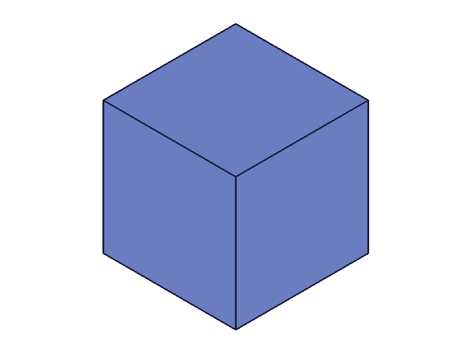

# Training: Api study of `part.deleteExpression`

**Date:** 2026-03-25

## Goal

Testing `v1.part.deleteExpression` — deletion of named expressions.

**Methods to cover:**

- `deleteExpression` — basic single deletion
- `deleteExpression` — multiple deletions in one call
- `deleteExpression` — non-existent name
- `deleteExpression` — empty/omitted `toDelete`
- `deleteExpression` — delete expression referenced by other expressions (cascade?)
- `deleteExpression` — delete expression linked to a feature param
- `deleteExpression` — wrong form (direct name instead of toDelete array)
- `deleteExpression` — invalid/missing id
- `deleteExpression` — partial batch failure (mix of valid/invalid names)
- `deleteExpression` — return value structure
- `deleteExpression` — verify getExpression returns null after deletion
- `deleteExpression` — array param form (multiple parts)

---

## 01 — basic single deletion

Script: `scripts/01-basic-delete.mjs` — ✅ as expected. result=1, maxLevel=31. `getExpression` returns `value: null` after deletion.

## 02 — multiple deletions

Script: `scripts/02-multiple-delete.mjs` — ✅ all three deleted in one call. result=1. All return value=null.

## 03 — non-existent name

Script: `scripts/03-nonexistent.mjs` — result=0, maxLevel=51, code 1014: "doesNotExist does not exist and can not be deleted". Existing expressions unaffected.

## 04 — empty/omitted toDelete

Script: `scripts/04-empty-toDelete.mjs` — ✅ both are no-ops. result=1, maxLevel=31.

## 05 — delete referenced expression (CRITICAL)

Script: `scripts/05-delete-referenced.mjs` — Deleting `base` while `derived = "base * 2"` exists.

**Result:** Deletion succeeds (result=1). The derived expression's formula is **automatically inlined** — it changes from `"base * 2"` to `"10 * 2"`. The value stays 20. The reference is replaced with the literal value at the time of deletion.

**📌 LLM doc:** Formula inlining on delete — derived expressions survive deletion of their references by inlining the current value as a literal.

## 06 — delete feature-linked expression

Script: `scripts/06-delete-feature-linked.mjs` — Deleting `S` while a box uses `@expr.S` for all dimensions.

**Result:** Deletion succeeds (result=1). Recalc succeeds (result=null, maxLevel=31). Geometry survives — the box is still there after recalc.

|  |  |
|---|---|

The feature params appear to get the value baked in, similar to formula inlining. The box geometry is preserved.

**📌 LLM doc:** Deleting an expression used by a feature does NOT destroy the feature. The value is baked into the feature param.

## 07 — wrong form

Script: `scripts/07-wrong-form.mjs` — Two wrong forms tested:

- **Direct `name` param** (no toDelete array): result=1, maxLevel=31, **expression NOT deleted** (value still 50). Silent no-op — same trap as updateExpression.
- **`toDelete` as string** instead of array: result=null, maxLevel=51, code 1001 "wrong type! It should be of type (Array<string>)". At least this one errors.

**📌 LLM doc:** Direct `name` param is a silent no-op. String instead of array at least gives an error.

## 08 — invalid/missing id

Script: `scripts/08-invalid-id.mjs` — Same pattern as updateExpression. Missing id: result=null, code 1004. Bogus id: result=null, code 1006.

## 09 — partial batch failure (CRITICAL)

Script: `scripts/09-partial-batch.mjs` — **Batch is ATOMIC.** One non-existent name causes result=0, and NO deletions are applied. `a` and `b` are both still present despite being valid targets.

**📌 LLM doc:** Atomic batch — one bad name rolls back everything. Same behavior as updateExpression.

## 10 — return value structure

Script: `scripts/10-return-value.mjs` — Confirmed:
- Success: `result: 1` (numeric, not boolean), messages empty, maxLevel=31
- Failure: `result: 0` (numeric), code 1014, maxLevel=51
- `result === true` is false, `result === 1` is true

## 11 — array param form

Script: `scripts/11-array-form.mjs` — ❌ Does NOT work. result=null, code 1001 "Set the parameter 'id' = VOID". Same as updateExpression.

## 12 — double delete in same call

Script: `scripts/12-double-delete.mjs` — Interesting: result=1, expression deleted. No error for the duplicate. The second occurrence is silently ignored (already deleted by the first).

**📌 LLM doc:** Duplicate names in toDelete are fine — first occurrence deletes, second is ignored silently.

## 13 — recreate after delete

Script: `scripts/13-recreate-after-delete.mjs` — ✅ Works fine. Create → delete → recreate with new value. No issues.

## 14 — delete all expressions

Script: `scripts/14-delete-all.mjs` — ✅ Deleting all three (including one that references the others) succeeds. All return value=null.

## 15 — delete order with cross-references

Script: `scripts/15-delete-order-matters.mjs` — Order does NOT matter. Both `['derived', 'base']` and `['base', 'derived']` succeed with result=1. Both expressions are deleted regardless of dependency order.

---

## Coverage Checklist

- [x] The API has been called at least once successfully
- [x] Every required parameter tested (id, toDelete)
- [x] Key optional parameters exercised (empty toDelete, omitted toDelete)
- [x] Error cases covered (nonexistent name, missing fields, invalid id, wrong form)
- [x] Batch behavior tested (multiple items, duplicates, partial failure)
- [x] Array form tested (does NOT work)
- [x] Cascade/reference behavior tested (formula inlining, feature survival)
- [x] Return value structure documented
- [x] Recreate after delete tested
- [x] Delete order independence confirmed
