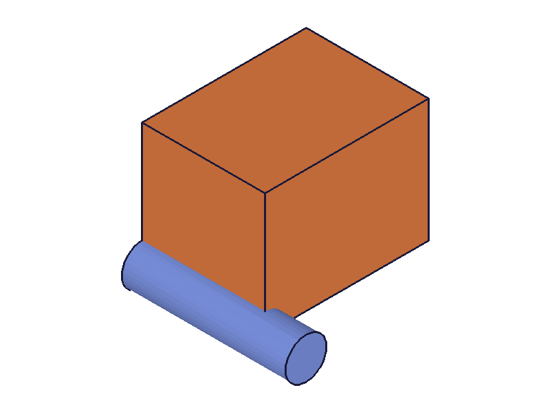
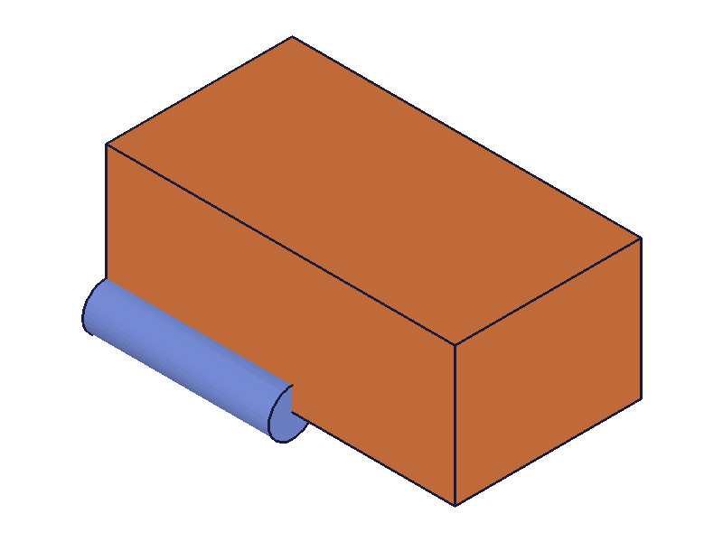
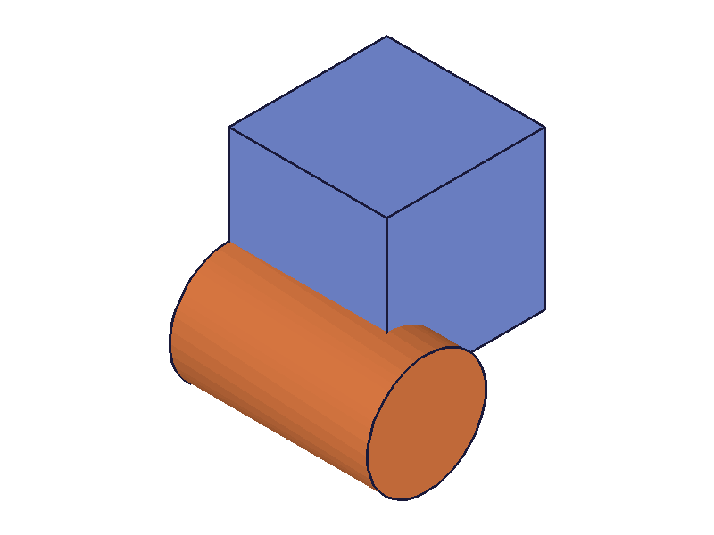
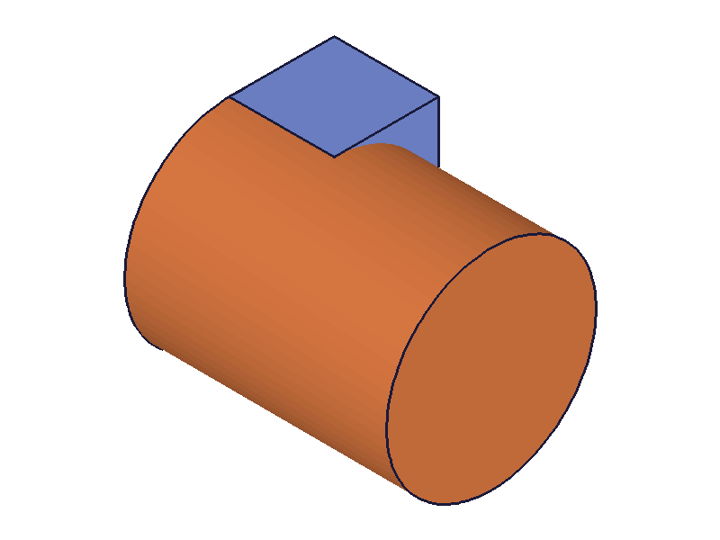
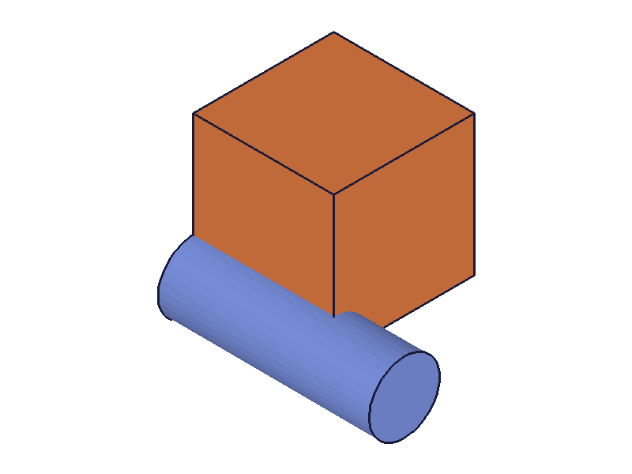
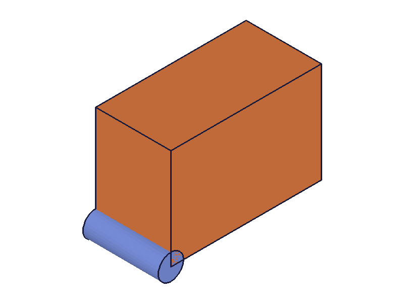
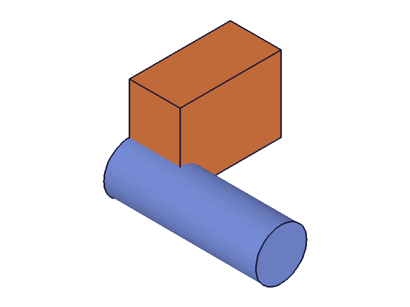
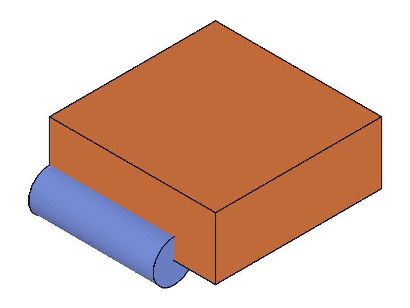
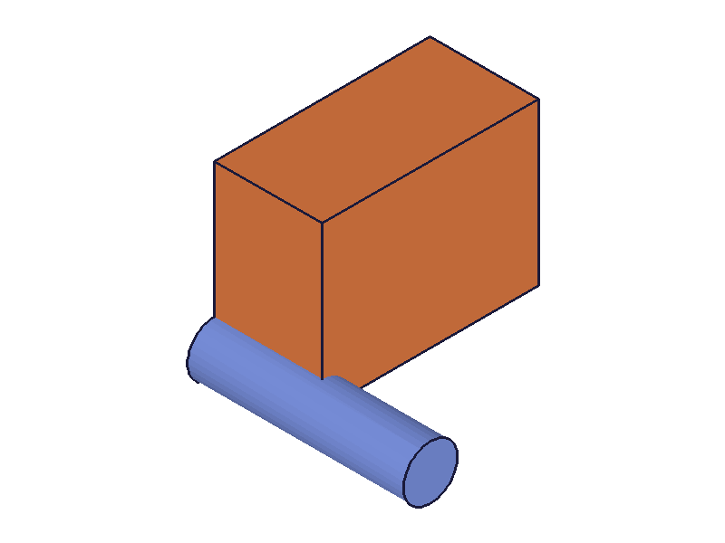
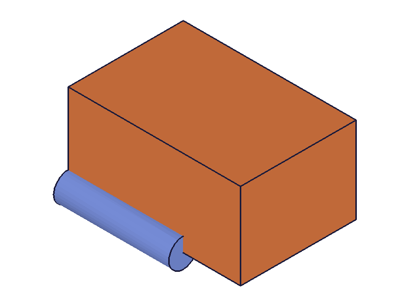

# Training: Api study of `part.linkWithExpression`

**Date:** 2026-03-25

## Goal

Testing `v1.part.linkWithExpression` — post-hoc binding of expressions to feature params.

---

## 01 — basic link

Script: `scripts/01-basic-link.mjs` — ✅ result=null (VOID), maxLevel=31. Box height changes from 40 to 120 after link+recalc.

|  |  |
|---|---|

## 02 — link then update expression

Script: `scripts/02-link-then-update.mjs` — ✅ After linking height to H=60, updating H to 150 and recalcing changes the box geometry.

|  |  |
|---|---|

## 03 — re-link to different expression

Script: `scripts/03-relink.mjs` — ✅ Both links succeed (null, maxLevel=31). Can re-link without unlinking first.

## 04 — non-existent expression name

Script: `scripts/04-nonexistent-expr.mjs` — result=null, maxLevel=51. Error: "Datamember nope not found". The link is attempted and creates a broken reference.

**📌 LLM doc:** Non-existent exprName gives maxLevel=51 error but result is still VOID.

## 05 — non-existent param name (GOTCHA)

Script: `scripts/05-nonexistent-param.mjs` — result=null, maxLevel=**31** (success!). **No error for a bad param name.** The link silently succeeds but has no effect.

**📌 LLM doc:** No validation on param name. Silent success for non-existent params. Check param names carefully.

## 06 — wrong id (part ID)

Script: `scripts/06-wrong-id.mjs` — result=null, maxLevel=51. Clear error: "Provide only following id types: ['feature','dimension']".

**📌 LLM doc:** Must use feature/dimension ID, not part ID.

## 07 — missing required params

Script: `scripts/07-missing-params.mjs` — All three params required:
- No exprName: code 1004
- No name: code 1004
- No id: code 1004

## 08 — cylinder params

Script: `scripts/08-cylinder-params.mjs` — ✅ Linked both `diameter` and `height` of a cylinder.

|  |  |
|---|---|

## 09 — multiple params same feature

Script: `scripts/09-multiple-params.mjs` — ✅ Linked length, width, and height of same box to different expressions.

|  |  |
|---|---|

## 10 — link param already @expr. bound

Script: `scripts/10-link-already-bound.mjs` — ✅ Re-linking from @expr.A to B succeeds (null, maxLevel=31).

## 11 — same expression to two params

Script: `scripts/11-link-same-expr-two-params.mjs` — ✅ Linked expression S to both `length` and `height`.

|  |  |
|---|---|

## 12 — link without recalc

Script: `scripts/12-link-without-recalc.mjs` — The snapshot after link (before explicit recalc) already shows the geometry change. The renderer likely triggers evaluation. After explicit recalc, identical result.

|  |  |  |
|---|---|---|

Note: Renderer may trigger implicit recalc. Always call `common.recalc()` explicitly for reliable behavior.

---

## Coverage Checklist

- [x] Basic link to box and cylinder params
- [x] Link then update expression → geometry changes
- [x] Re-link without unlinking first
- [x] Non-existent expression name (error)
- [x] Non-existent param name (silent success — gotcha)
- [x] Wrong ID type (part vs feature)
- [x] Missing params
- [x] Multiple params on same feature
- [x] Same expression to multiple params
- [x] Link already @expr.-bound param
- [x] Link without recalc
