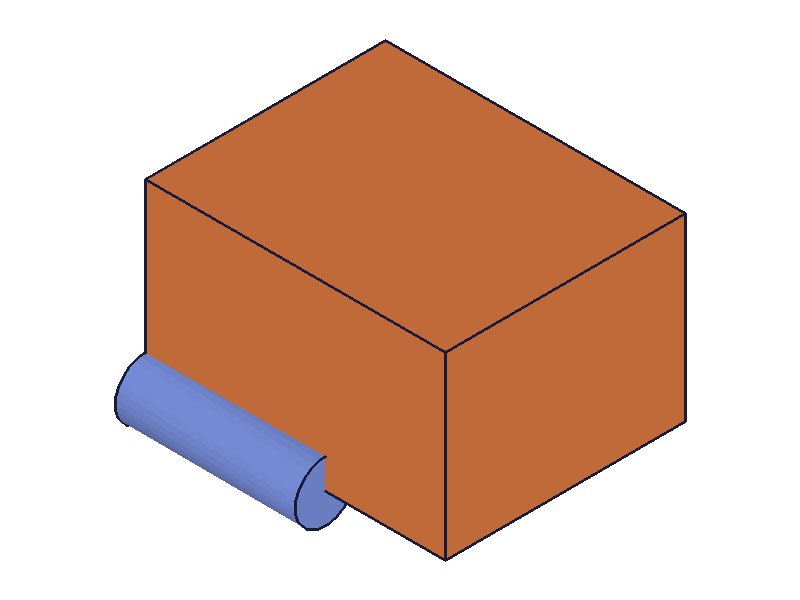

# Training: Api study of `part.unlinkExpression`

**Date:** 2026-03-25

## Goal

Testing `v1.part.unlinkExpression` — disconnecting expressions from feature params.

---

## 01 — basic unlink

Script: `scripts/01-basic-unlink.mjs` — ✅ result=null (VOID), maxLevel=31. After unlink+recalc, box retains the expression's value (120), not the original plain value (40).

|  |  |
|---|---|

Snapshots identical — height stays frozen at 120.

## 02 — unlink then update expression

Script: `scripts/02-unlink-then-update.mjs` — ✅ After unlink, updating H from 100→200 does NOT change box geometry. Box stays at h=100.

|  |  |
|---|---|

Snapshots identical — confirmed unlink truly disconnects.

## 03 — unlink never-linked param

Script: `scripts/03-unlink-never-linked.mjs` — result=null, maxLevel=31. **Silent success** for unlinking a param that was never linked. No error.

## 04 — unlink @expr. at creation

Script: `scripts/04-unlink-at-creation-expr.mjs` — ✅ Works. Unlinking a param set with `@expr.H` at creation succeeds. After unlink, updating H to 200 does NOT affect box.

|  |  |
|---|---|

## 05 — wrong id (part ID)

Script: `scripts/05-wrong-id.mjs` — result=null, maxLevel=51. Error: "wrong id type! Provide only following id types: ['feature','dimension']". Same as linkWithExpression.

## 06 — missing params

Script: `scripts/06-missing-params.mjs` — Missing name: code 1004. Missing id: code 1004. Both required.

## 07 — non-existent param name

Script: `scripts/07-nonexistent-param.mjs` — result=null, maxLevel=31. **Silent success** for bad param name. Same gotcha as linkWithExpression.

**📌 LLM doc:** No validation on param name.

## 08 — unlink then re-link

Script: `scripts/08-unlink-relink.mjs` — ✅ Unlink from A, then re-link to B succeeds (maxLevel=31).

## 09 — double unlink

Script: `scripts/09-double-unlink.mjs` — Both succeed silently (maxLevel=31). No error for unlinking an already-unlinked param.

## 10 — unlink multiple params

Script: `scripts/10-unlink-multiple.mjs` — ✅ Unlinked all three box params (length, width, height), then updated all expressions to 999. Box geometry unchanged.

---

## Coverage Checklist

- [x] Basic unlink with freeze verification
- [x] Unlink then update expression → no geometry change
- [x] Unlink never-linked param (silent success)
- [x] Unlink @expr. at creation
- [x] Wrong ID type (part vs feature)
- [x] Missing params
- [x] Non-existent param name (silent success)
- [x] Unlink then re-link
- [x] Double unlink (idempotent)
- [x] Multiple params unlinked
