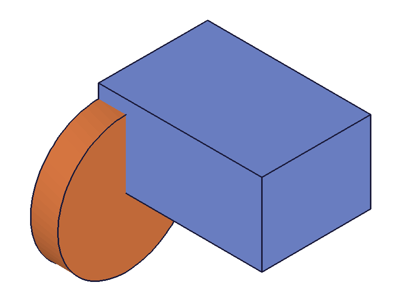
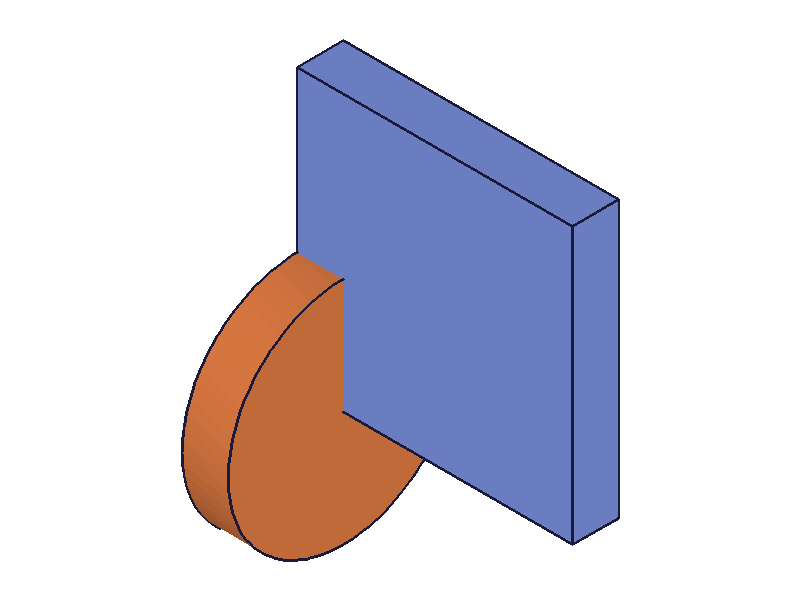
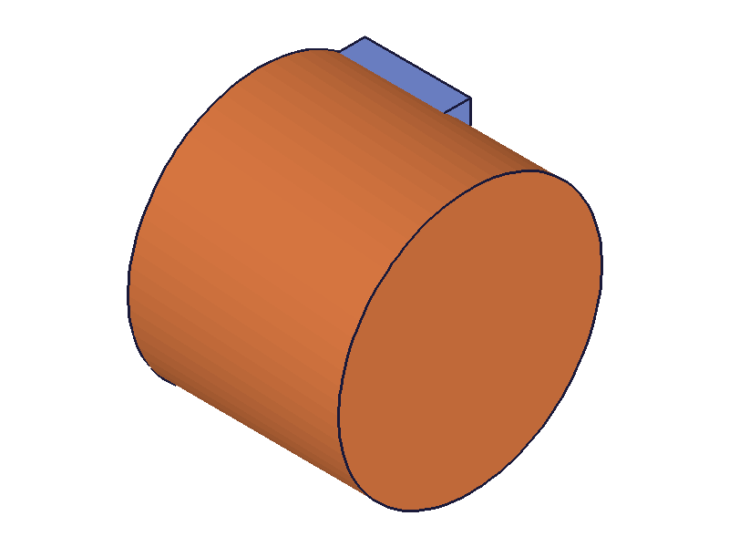
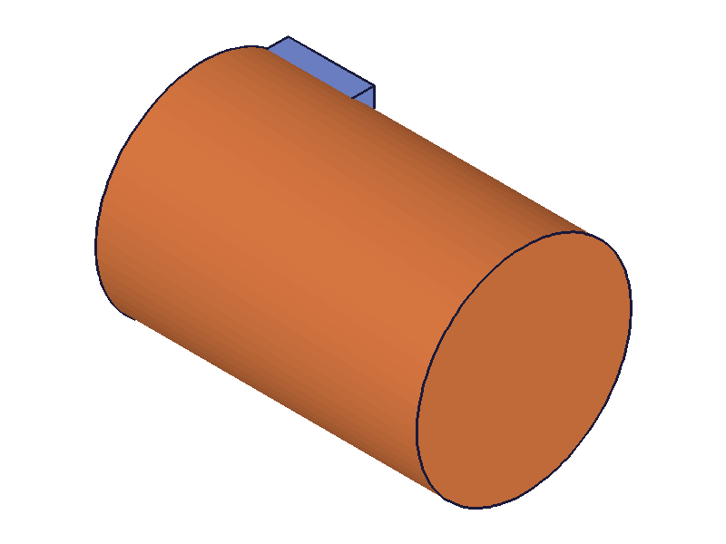
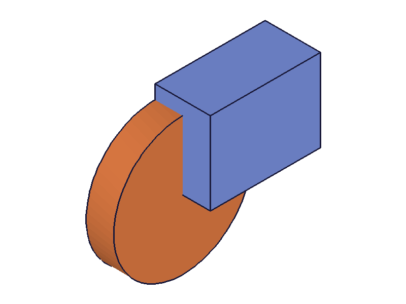
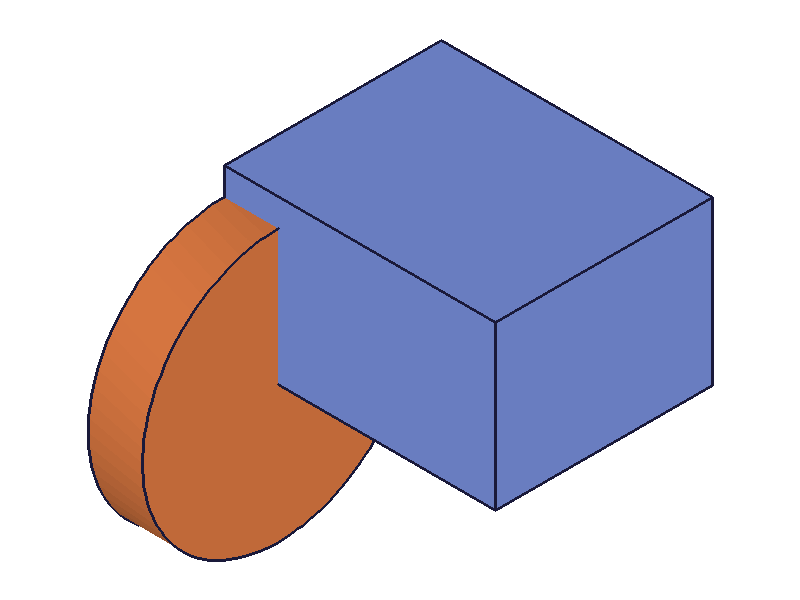
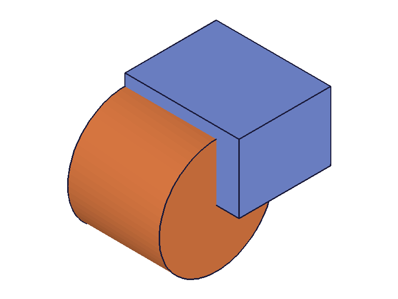

# Training: openFeature / closeFeature / Feature Editing Gate

**Date:** 2026-03-25

## Goal

Testing `v1.part.openFeature` and `v1.part.closeFeature` — the feature editing gate pattern required for all `update*` API calls. Also studying the open → update → close pattern as a conceptual pattern.

**Methods to cover:**

- `openFeature` — param: `id` (feature ID). Returns VOID. Moves GhostRollbackBar to position before feature.
- `closeFeature` — param: `id` (feature ID). Returns VOID. Moves GhostRollbackBar back to RollbackBar.

**Questions:**

- What happens if you call `update*` without `openFeature` first? Does it fail? Silently no-op?
- What happens if you call `openFeature` but forget `closeFeature`?
- Can you open multiple features at once? Or must you close before opening another?
- Does `closeFeature` trigger an automatic recalc, or must you call `recalc()` explicitly?
- What happens if you pass an invalid ID to `openFeature`?
- What happens if you pass the part ID instead of a feature ID?
- Can you open a feature, make no changes, and close it? (no-op round trip)
- Does `openFeature` on a box feature work the same as on a workPlane feature?
- What is the actual effect on geometry after open → update → close? Does the solid change?
- Can you nest openFeature calls (open A, open B, close B, close A)?

---

## 01 — basic round trip (open + close, no changes)

Script: `scripts/01-basic-roundtrip.mjs` — ✅ No-op round trip works. Both return VOID (null), maxLevel 31 (info).

**Learned:** `openFeature` and `closeFeature` are safe to call as a pair even with no modifications between them.

## 02 — update workPlane with open/close

Script: `scripts/02-update-workplane.mjs` — ✅ open → updateWorkPlane(position: [0,0,100]) → close succeeds. `updateWorkPlane` returns the feature ID (91). `getExpression` for 'position' returned null — workPlane position is not exposed as a named expression.

**📌 LLM doc:** `updateWorkPlane` returns the feature ID, not VOID. WorkPlane position is not queryable via `getExpression`.

## 03 — update WITHOUT openFeature (critical test)

Script: `scripts/03-update-without-open.mjs` — ❌ `updateBox` without `openFeature` fails hard.

- maxLevel: 51 (error)
- Messages: "The provided feature is not allowed to update. It's not active and open." + "\"id\" must be provided for update."

|  |  |
| --- | --- |

Geometry unchanged — the update was rejected entirely.

**📌 LLM doc:** `openFeature` is a HARD requirement before any `update*` call. Without it, the update fails with error 51 and a clear message. This is not a warning — it's a complete rejection.

## 04 — proper open → updateBox → close

Script: `scripts/04-update-box-with-open.mjs` — ✅ Box height changed from 40 to 120. `updateBox` returns the feature ID (54).

|  |  |
| --- | --- |

Clear visual change: box tripled in height relative to the reference cylinder.

**📌 LLM doc:** The canonical pattern. `update*` returns the feature ID on success.

## 05 — openFeature with invalid/wrong ID

Script: `scripts/05-open-invalid-id.mjs` — ❌ Both cases fail with maxLevel 51.

- **Bogus ID (99999):** "ToId()/TOID() didn't get an existing or valid id." + "An element of parameter \"id\" has an invalid id!"
- **Part ID:** "The parameter \"id\" has a wrong id type! Provide only following id types: [\"feature\",\"workgeometry\",\"sketch\",\"constraint\",\"relation\"]"

**📌 LLM doc:** `openFeature` requires a feature/workgeometry/sketch/constraint/relation ID. Passing the part ID is a common mistake — the error message is clear about which types are accepted.

## 06 — closeFeature without prior openFeature

Script: `scripts/06-close-without-open.mjs` — ✅ Silent success. maxLevel 31 (info), no error. Harmless no-op.

**📌 LLM doc:** Closing a feature that isn't open is a silent no-op. No error, no side effects.

## 07 — double open / opening two features

Script: `scripts/07-double-open.mjs` — ❌ Both cases fail with maxLevel 51.

- **Double-open same feature:** "There is still an open feature, please commit or decline the feature first."
- **Open different feature while one is open:** Same error.

**📌 LLM doc:** Only ONE feature can be open at a time. You MUST close the current feature before opening another. This is a global lock, not per-feature.

## 08 — does closeFeature auto-recalc?

Script: `scripts/08-open-close-recalc.mjs` — ✅ Snapshots after close (no explicit recalc) and after explicit `recalc()` are identical.

|  |  |
| --- | --- |

Both show the box at the updated height. `closeFeature` triggers recalculation automatically.

**📌 LLM doc:** `closeFeature` auto-recalculates. No need to call `recalc()` after closing — the geometry is already up to date.

## 09 — multiple updates in one open/close session

Script: `scripts/09-multiple-updates-one-session.mjs` — ✅ Three sequential `updateBox` calls (height→120, width→120, length→20) all succeed within one open/close. Each returns the feature ID.

|  |
| --- |

Box went from 80x60x40 to 20x120x120 — a thin tall slab. All three updates applied.

**📌 LLM doc:** You can make multiple `update*` calls within a single open/close session. Each call takes effect. Only one `closeFeature` needed at the end.

## 10 — create feature while another is open

Script: `scripts/10-create-while-open.mjs` — ❌ Creating a cylinder while a box is open fails. Same "still an open feature" error.

**📌 LLM doc:** The open feature gate blocks ALL feature operations, not just updates. You cannot create new features while another is open. Close first.

## 11 — update cylinder (cross-feature-type check)

Script: `scripts/11-update-cylinder.mjs` — ✅ open → updateCylinder(radius: 10, height: 150) → close works perfectly.

|  |  |
| --- | --- |

Pattern is universal across feature types.

## 12 — wrong update type on a feature

Script: `scripts/12-update-wrong-feature-type.mjs` — ❌ Calling `updateCylinder` on a box ID (while box is open) returns maxLevel 51 with a German error: "Index 3 ausserhalb des Arraybereichs" (index out of bounds).

**📌 LLM doc:** Using the wrong `update*` for a feature type causes an internal array error. The error is not user-friendly — you just get a cryptic index-out-of-bounds. Always match the update method to the feature type (updateBox for box, updateCylinder for cylinder, etc.).

## 13 — sequential edits on two features

Script: `scripts/13-sequential-edits.mjs` — ✅ Edit box (height→100), close, then edit cylinder (radius→10, height→80), close. Both updates applied correctly.

|  |  |  |
| --- | --- | --- |

## 14 — rename via update

Script: `scripts/14-open-close-name-update.mjs` — ✅ Renaming a feature (name: 'RenamedBox') via `updateBox` within open/close works.

## 15 — expressions in update params

Script: `scripts/15-open-close-with-expressions.mjs` — ✅ `updateBox({ id: boxId, height: '@expr.H * 3' })` works within open/close. H=40, so height=120.

|  |  |
| --- | --- |

**📌 LLM doc:** `@expr.` syntax works in `update*` calls just like in creation calls.

---

## Summary of Findings

| Question | Answer |
| --- | --- |
| `update*` without `openFeature`? | Hard error (51): "not active and open" |
| `closeFeature` without `openFeature`? | Silent no-op |
| Multiple features open at once? | No. Only one at a time. Must close first. |
| `closeFeature` auto-recalc? | Yes. No need for explicit `recalc()` |
| Invalid ID to `openFeature`? | Error 51 with descriptive message |
| Part ID to `openFeature`? | Error 51: wrong ID type. Needs feature/workgeometry/sketch/constraint/relation |
| No-op round trip? | Works fine |
| Cross-feature-type? | Pattern is universal (box, cylinder, workPlane all tested) |
| Nested opens? | Not possible. Single global lock. |
| Multiple updates in one session? | Yes, all apply |
| Create feature while open? | Not allowed. Gate blocks all operations. |
| Wrong update type? | Cryptic internal error |
| Expressions in update? | Works with `@expr.` syntax |
