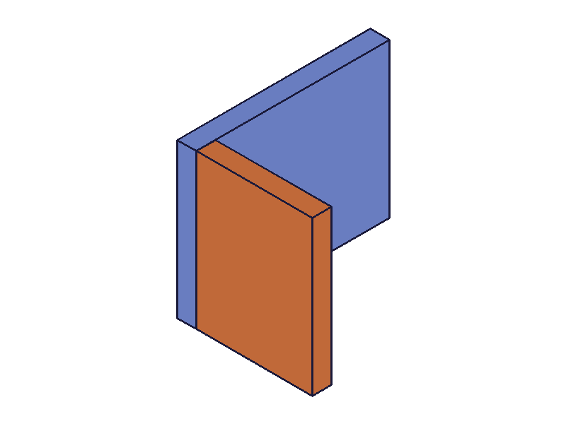
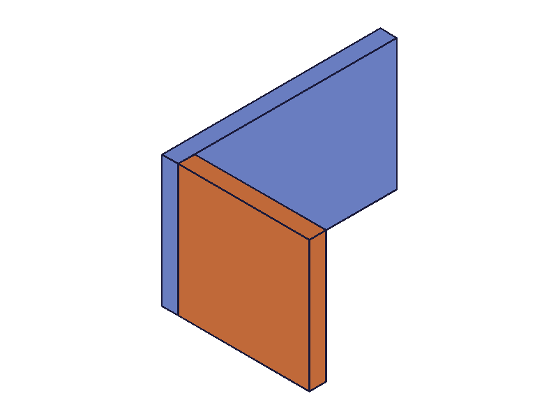
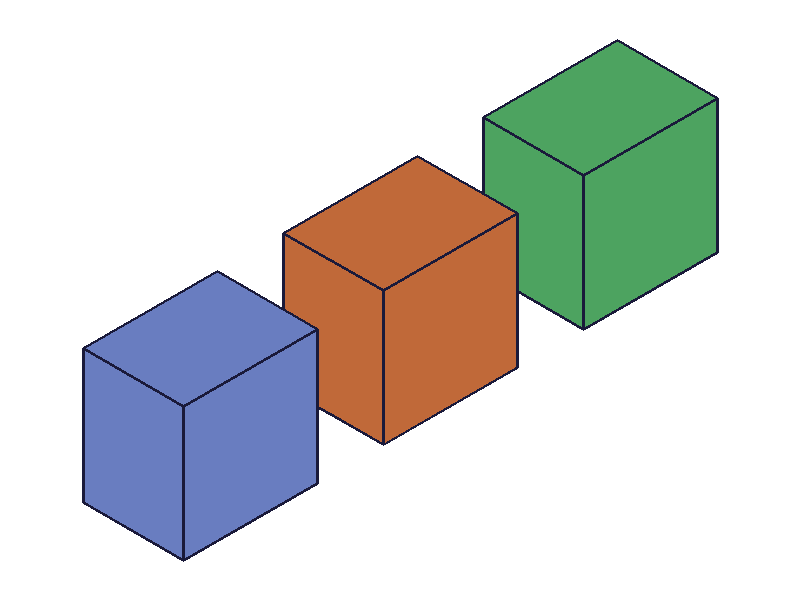
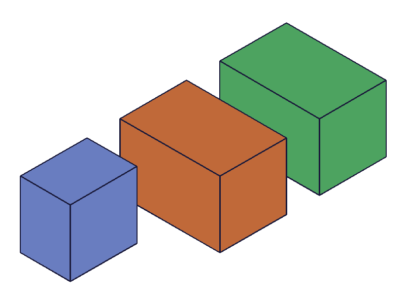

# Training: Expression Workflow (End-to-End)

**Date:** 2026-03-25

## Goal

Study: expression workflow — create → link to feature param → update → observe feature change. This is a conceptual integration task that ties together everything learned in Category 2.2.

**Questions to answer:**

- End-to-end lifecycle with @expr
- Link/unlink workflow with linkWithExpression
- Mixed binding (some @expr, some plain, some linked post-hoc)
- Multi-feature sharing one expression
- Cascade: base → derived → feature
- Expression-driven WCS
- What happens without recalc?
- What happens when deleting/renaming a linked expression?
- Inline formulas vs @expr vs linkWithExpression — which are live?

---

## 01 — basic lifecycle

Script: `scripts/01-basic-lifecycle.mjs` — ✓

- Create expressions (L=100, W=60, H=40) → create box with @expr → update H to 120 → recalc → geometry changed
- `getExpression` returns updated value immediately after `updateExpression` (before recalc)
- Full lifecycle works as expected

---

## 02 — link workflow

Script: `scripts/02-link-workflow.mjs` — ✓

- Create box with plain height=40 → `linkWithExpression` to bigH=150 → recalc → box height becomes 150
- Update bigH to 200 → recalc → box height becomes 200
- Post-hoc linking is a full replacement for @expr binding

---

## 03 — unlink workflow

Script: `scripts/03-unlink-workflow.mjs` — ✓

- Box with @expr.H (H=120) → unlink → recalc → height frozen at 120
- Update H to 999 → recalc → box stays 120
- Confirms freeze behavior: unlink preserves the expression's value at time of unlink, NOT the original hard-coded value

---

## 04 — mixed binding

Script: `scripts/04-mixed-binding.mjs` — ✓

- Box: length=@expr.L, width=40 (plain), height=30 (plain, linked post-hoc to H=50)
- Update L=200, H=100 → recalc → length=200, width=40 (unchanged), height=100
- Mixed binding works: @expr, plain, and post-hoc link coexist on the same feature

---

## 05 — multi-feature sharing

Script: `scripts/05-multi-feature-sharing.mjs` — ✓

- Two boxes both use @expr.size for height
- Update size from 50 to 120 → recalc → both boxes change
- One expression drives multiple features simultaneously

---

## 06 — cascade chain

Script: `scripts/06-cascade-chain.mjs` — ✓

- base=50, doubled=base*2 (=100), tripled=base*3 (=150)
- Box: length=@expr.tripled, width=@expr.doubled, height=@expr.base
- Update base to 80 → doubled=160, tripled=240 → box updates
- Full cascade: base expr → derived expr → feature geometry

---

## 07 — expression-driven WCS

Script: `scripts/07-expr-driven-wcs.mjs` — ✓

- WCS with offset `[0, 0, @expr.spacing]` — second box placed at WCS
- Update spacing from 50 to 120 → recalc → top box moves up
- Expression-driven WCS offsets using string-encoded arrays work and recalculate

---

## 08 — multiple feature types

Script: `scripts/08-multi-feature-types.mjs` — ✓

- Box and cylinder both driven by @expr.size and @expr.ht
- Update both → recalc → both features update
- Expressions work identically across feature types (box, cylinder)

---

## 09 — relink after unlink

Script: `scripts/09-relink-after-unlink.mjs` — ✓

- Box height=@expr.A (60) → unlink (frozen at 60) → relink to B (120) → recalc → height=120
- Update B to 200 → recalc → height=200
- Unlink → relink to different expression works cleanly

---

## 10 — parametric L-bracket (real-world)

Script: `scripts/10-parametric-bracket.mjs` — ✓

| before | after |
|--------|-------|
|  |  |

- L-bracket: base plate + vertical wall, all driven by master dimensions
- wallH = plateL * 0.6 (derived)
- WCS offset driven by @expr.thick
- Scale up (plateL 100→200, plateW 80→120, thick 10→15) → wallH recalculates to 120 → everything scales
- Full real-world parametric model with master → derived → WCS + feature chain

---

## 11 — without recalc

Script: `scripts/11-without-recalc.mjs` — ✓ (with caveat)

- Update H from 40 to 200, snapshot WITHOUT recalc, then snapshot WITH recalc
- Both snapshots look identical — the harness snapshot appears to trigger rendering which includes geometry recalc
- `getExpression` returns the new value immediately (200) even before recalc
- **Caveat:** In the harness/snapshot context, skipping recalc may not show stale geometry because the snapshot itself forces a render pass. In real API usage, always call `common.recalc()` to be safe.

📌 LLM doc: Snapshot/rendering may mask stale geometry. Always call `common.recalc()` explicitly after expression updates — don't rely on visual confirmation.

---

## 12 — delete linked expression

Script: `scripts/12-delete-linked-expr.mjs` — ✓

- Box with @expr.H (H=80) → delete expression H → recalc
- deleteExpression result=1, maxLevel=31 (success, no error)
- Box survives! Geometry unchanged — the feature parameter freezes at the last expression value (80)
- No error, no warning about the feature being orphaned

📌 LLM doc: Deleting an expression that drives a feature does NOT destroy the feature. The param freezes at the expression's last value (same as unlink behavior). No warning emitted.

---

## 13 — rename linked expression

Script: `scripts/13-rename-linked-expr.mjs` — ✓

- Box with @expr.oldName (80) → rename oldName to newName → recalc → update newName to 150 → recalc
- Both after-rename and after-update snapshots show the box at the SAME size
- Rename BREAKS the @expr binding. The feature freezes at the old value and does NOT follow the renamed expression
- renameExpression returns result=1 (success) with no warning about linked features

📌 LLM doc: `renameExpression` BREAKS existing @expr bindings. Features that referenced the old name freeze at the last value. The feature does NOT auto-update to reference the new name. No warning is emitted. If you need to rename, you must re-link features afterward.

---

## 14 — link multiple params

Script: `scripts/14-link-multiple-params.mjs` — ✓

- Box with plain 50x50x50 → link all three (L, W, H) → recalc → 120x80x60
- Update all three → recalc → 200x150x100
- Post-hoc linking works for multiple params on the same feature, and bulk updates work

---

## 15 — inline vs @expr vs linkWithExpression

Script: `scripts/15-expr-inline-vs-named.mjs` — ✓

| before (all h=60) | after S=120 |
|---|---|
|  |  |

- Blue box (inline `30+30`): height stays 60 — **inline formulas are static**, evaluated once at creation
- Orange box (@expr.S): height grows to 120 — **@expr creates a live binding**
- Green box (linkWithExpression to S): height grows to 120 — **linkWithExpression creates a live binding**
- @expr and linkWithExpression are functionally equivalent for live bindings; inline formulas are one-shot

📌 LLM doc: Three binding types — inline formula (static, evaluated once), @expr.NAME (live, set at creation), linkWithExpression (live, set post-hoc). Only @expr and link respond to expression updates.

---

## Coverage Checklist

- [x] Each stated question answered with evidence
- [x] Edge cases probed (delete linked, rename linked, skip recalc)
- [x] Findings grounded in observed server responses
- [x] Tested across multiple feature types (box, cylinder) and mechanisms (@expr, link, inline)
- [x] Real-world example (parametric bracket) demonstrates practical workflow
