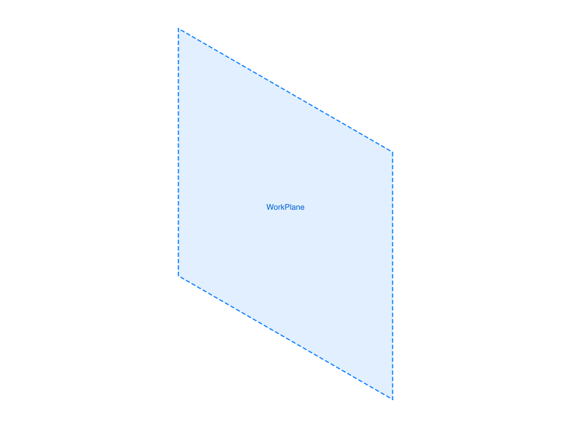
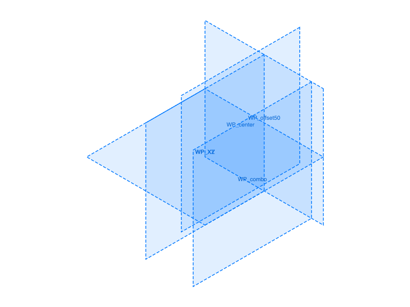
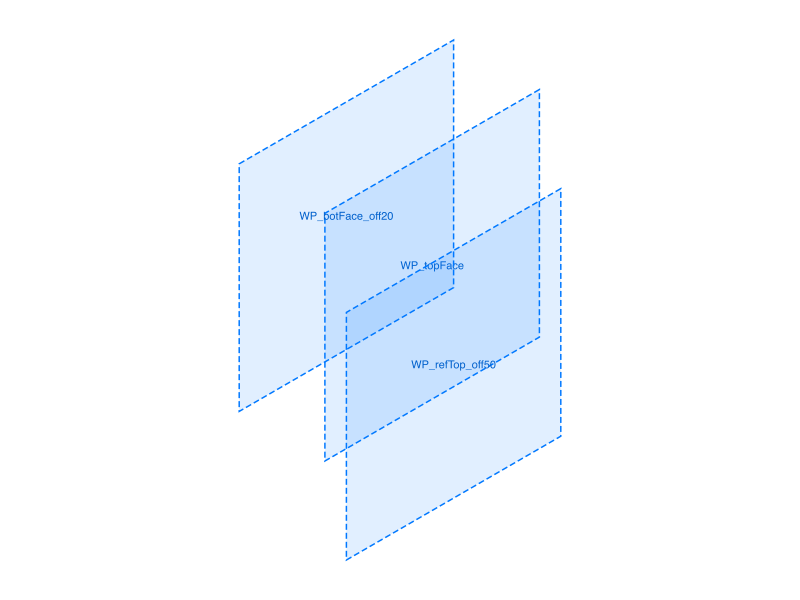
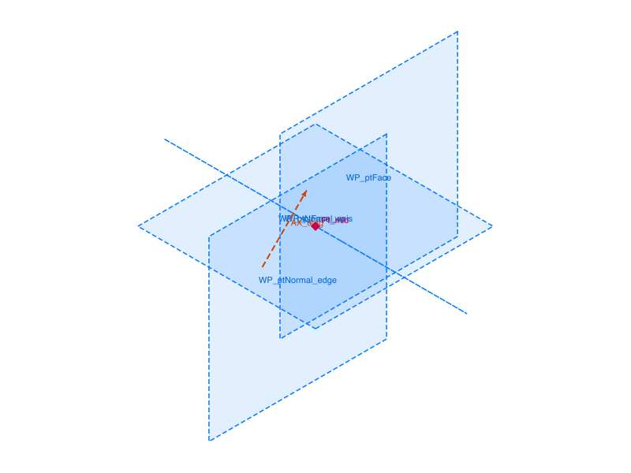
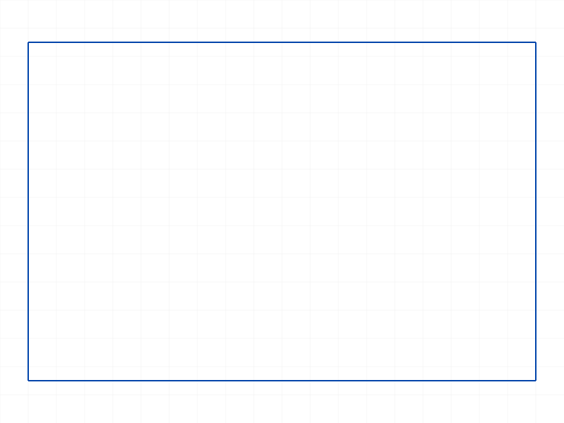
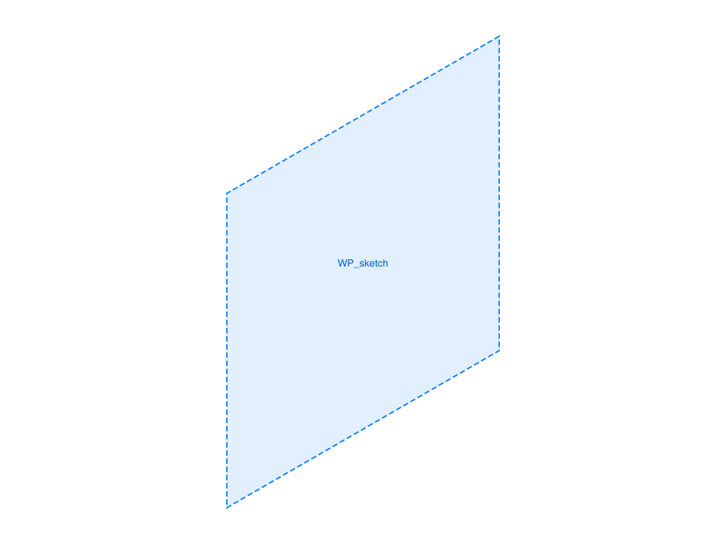

# Training: part.workPlane

**Date:** 2026-03-27

## Goal

Testing `v1.part.workPlane` — creating work plane features with all 7 type variants.

**Methods to cover:**

- `workPlane` default (USERDEFINED) — no references, defined by normal + position + offset
- `workPlane` with custom `name` param — default name, custom name, duplicate names
- `workPlane` type USERDEFINED — custom normal, position, offset combinations
- `workPlane` type PLANE — reference a brep-face or work-plane, with offset
- `workPlane` type EDGEPOINT — reference an edge + point
- `workPlane` type 3POINTS — reference three points
- `workPlane` type POINTNORMAL — point + direction (edge/axis as normal)
- `workPlane` type POINTFACE — point + face (face normal defines plane normal)
- `workPlane` type LINEPLANEANGLE — line + plane + angle
- `offset` parameter behavior across types
- `angle` parameter (LINEPLANEANGLE only, in radians)
- `position` and `normal` params (USERDEFINED only)
- Return value: feature ID — what can it be used for (sketch parent, mirror reference, etc.)
- Error cases: invalid references, wrong param combos

**Questions:**

- Docs say "default=xy" but `normal` default is `[1,0,0]` which is YZ — what does the default actually produce?
- Can work planes be used as sketch parents?
- What does `Size` in the structure tree represent? Is it configurable via the API?
- What happens with invalid reference combinations?
- Does `offset` work the same way across all referenced types?
- How does name auto-incrementing work with duplicates?

---

## 01 — default workPlane

Script: `scripts/01-default.mjs` — ✅ Default creates a YZ plane (normal=[1,0,0]) at origin. Default name is `"WorkPlane"`. `getWorkGeometry("WorkPlane")` returns the same ID.

|  |
|---|

**📌 LLM doc:** Default workPlane normal is [1,0,0] (YZ plane), NOT XY despite "default=xy" in some doc headers. Default name is "WorkPlane".

## 02 — USERDEFINED params

Script: `scripts/02-userdefined-params.mjs` — ✅ All combinations work: custom normal, position, offset, and combo.

|  |
|---|

Five planes created with different normal/position/offset combos, all maxLevel=31.

**Learned:** `offset` shifts the plane along the normal direction. `position` sets the center. Both can be combined — `position=[0,0,0]` + `normal=[0,0,1]` + `offset=40` places the plane at z=40.

## 03 — name and duplicates

Script: `scripts/03-name-duplicates.mjs` — ✅ with interesting name behavior.

**Learned:**
- Default name: `"WorkPlane"` — does NOT auto-increment on duplicates
- Duplicate names succeed silently (no warning, maxLevel=31)
- `getWorkGeometry` returns the **first** object with that name
- Non-existent name returns `null` with maxLevel=51 (error)
- Built-in planes: `Top` (id=38), `Front` (id=42), `Right` (id=46) are always present

**📌 LLM doc:** Duplicate names are allowed but `getWorkGeometry` only finds the first. Use unique names.

## 04 — type PLANE

Script: `scripts/04-type-plane.mjs` — ✅ All variants work.

|  |
|---|

**Learned:**
- Can reference brep faces (from `getGeometryIds` position lookup) or work planes
- Offset shifts the new plane along the referenced plane's normal
- `getGeometryIds` requires position-based queries, not a dump — must know approximate geometry positions

**📌 LLM doc:** `getGeometryIds` is position-based. For a box at origin (L=80, W=60, H=40): top face at `[[40,30,40]]`, bottom at `[[40,30,0]]`.

## 05 — type 3POINTS

Script: `scripts/05-type-3points.mjs` — ✅ Works with brep vertices and work points.

**Learned:**
- Accepts brep vertices (from `getGeometryIds` point lookup) or work point IDs
- 3 points define the plane — order matters for normal direction
- Offset works (shifts along computed normal)

## 06 — types POINTNORMAL and POINTFACE

Script: `scripts/06-type-pointnormal-pointface.mjs` — ✅ All 4 variants work.

|  |
|---|

**Learned:**
- POINTNORMAL: refs = [point, direction]. Direction (edge/axis) becomes the plane's normal. Point sets position.
- POINTFACE: refs = [point, face/workplane]. Face's normal defines plane normal. Point sets position.
- Both accept brep refs (vertex, edge, face) and work geometry refs (workpoint, workaxis, workplane)

**📌 LLM doc:** Reference order matters — point first, then direction/face.

## 07 — type EDGEPOINT

Script: `scripts/07-type-edgepoint.mjs` — ✅ All variants including offset.

**Learned:**
- refs = [edge, point] — the edge and point together define the plane
- Works with brep edges + vertices, work axes + work points
- Offset shifts the plane along its normal

## 08 — type LINEPLANEANGLE

Script: `scripts/08-type-lineplaneangle.mjs` — ✅ All angle variants work.

**Learned:**
- refs = [line, plane] + `angle` parameter
- Line's midpoint → plane position. Plane's normal → initial orientation. Angle rotates around the line.
- Angle accepts numeric radians (Math.PI/4) or expression strings ('45deg')
- Expression strings like `'45deg'` work — useful shorthand
- Works with brep edges+faces and work axes+planes

**📌 LLM doc:** `angle` accepts radians or expression strings ('45deg', '3.14/2'). Expression strings are convenient.

## 09 — sketch on workplane

Script: `scripts/09-sketch-on-workplane.mjs` — ✅ Sketch created on work plane.

|  |  |
|---|---|

**Learned:**
- Work plane ID is passed as `plane` param to `sketch.create({ id: partId, plane: wpId })`
- Sketch was created successfully, rectangle drawn — confirms work planes work as sketch parents
- `sketchRegion` returned null — separate issue, likely needs sketch closing or different setup (not a workPlane issue)

**📌 LLM doc:** Work plane IDs work as `plane` param in `sketch.create`. This is the primary use case for work planes.

## 10 — error cases

Script: `scripts/10-errors.mjs` — ✅ Error messages are descriptive.

**Learned:**
- Missing `id`: `"id" must be provided to create CC_WorkPlane`
- Invalid type: lists all valid values in error message
- PLANE with no refs: `"references" must be provided`
- 3POINTS with 2 refs: `"references" has invalid number of elements! There should be 3 element(s)`
- Collinear 3 points: **creates the feature** (returns ID) but maxLevel=51, warns "points must not be lying in a line"
- Wrong ref types (LPA with 2 faces): internal error (NullMem), feature created but broken

**📌 LLM doc:** Collinear points and wrong ref types create features but set maxLevel=51. Always check maxLevel after creation.

---

## Coverage checklist

- [x] API called successfully
- [x] Required param `id` tested
- [x] All optional params: `name`, `type`, `normal`, `position`, `offset`, `angle`, `references`
- [x] All 7 type variants: USERDEFINED, PLANE, EDGEPOINT, 3POINTS, POINTNORMAL, POINTFACE, LINEPLANEANGLE
- [x] `updateWorkPlane` is task #2 — not tested here
- [x] Realistic usage: sketch on workplane (script 09)
- [x] Error cases (script 10)

## Structure tree findings (from probe data)

Work planes appear in the tree as `CC_WorkPlane` with these members:
- `Position` (point) — center
- `curPosition` (point) — effective position after offset
- `Normal` (point) — normal vector
- `Offset` (real) — offset distance
- `Size` (real) — visual size (always 200, not settable via API)
- `Angle` (real) — for LINEPLANEANGLE type
- `Type` (real) — internal type enum (different from API string types)
- `Inverted` (real) — 0 or 1
- `References` (array) — reference IDs
- `Defined` (real) — 1 if valid

Built-in work geometry per part:
- `Origin` (CC_WorkPoint) — origin point
- `XAxis`, `YAxis`, `ZAxis` (CC_WorkAxis) — principal axes, Length=50
- `Top` (CC_WorkPlane, normal=[0,0,1]), `Front` (normal=[0,1,0]), `Right` (normal=[1,0,0]) — principal planes, Size=200
