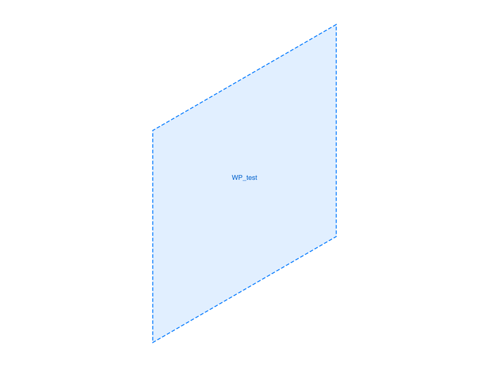

# Training: part.updateWorkPlane

**Date:** 2026-03-27

## Goal

Testing `v1.part.updateWorkPlane` — modifying existing work plane features after creation.

---

## First attempt — all updates fail without openFeature

All 7 scripts initially failed with "The provided feature is not allowed to update. It's not active and open." — confirming the `openFeature`/`closeFeature` gate documented in `references/part/openFeature.md`.

**📌 LLM doc:** Must use `openFeature` → `updateWorkPlane` → `closeFeature` pattern. This is the #1 gotcha.

---

## 01 — update offset

Script: `scripts/01-update-offset.mjs` — ✅ Offset updates from 0→40→80.

|  |  |
|---|---|

**Learned:** Return value is the same work plane ID. `openFeature` → `updateWorkPlane` → `closeFeature` pattern works. Note: before/after workgeo PNGs look identical due to auto-scaling (single plane with no reference body).

## 02 — update normal and position

Script: `scripts/02-update-normal-position.mjs` — ✅ All three variants work: change normal alone, change position alone, change both.

**Learned:** Unset params retain their existing values (docs confirmed). Can update multiple properties in separate open/close sessions.

## 03 — update name

Script: `scripts/03-update-name.mjs` — ✅ Rename works.

**Learned:**
- After rename: `getWorkGeometry("NewName")` returns the ID, `getWorkGeometry("OldName")` returns null
- Name change is immediate after close

## 04 — change type

Script: `scripts/04-change-type.mjs` — ✅/⚠️ Type changes work with proper refs.

**Learned:**
- USERDEFINED→PLANE with references+offset: works (maxLevel 31)
- PLANE→USERDEFINED with normal+position: works (maxLevel 31)
- PLANE with no references: result returned but maxLevel 51, "missing references" — feature enters broken state

**📌 LLM doc:** When changing type, always provide the matching references. Missing refs creates a broken (but existing) feature.

## 05 — update built-in planes

Script: `scripts/05-update-builtin.mjs` — ⚠️ Partial success.

**Learned:**
- Offset update on built-in Top: **BLOCKED** — maxLevel 51, "WorkGeometry created by the system cannot be changed!"
- Rename of built-in Top: maxLevel 51 but **name change takes effect** — `getWorkGeometry("MyTop")` returns 38, `getWorkGeometry("Top")` returns null

**📌 LLM doc:** Built-in work planes (Top/Front/Right) cannot have geometry modified (offset, normal, etc.) but CAN be renamed. Renaming returns maxLevel 51 as a warning but the change sticks.

## 06 — update angle on LPA + multiple updates

Script: `scripts/06-update-angle-lpa.mjs` — ✅ All angle updates work.

**Learned:**
- Angle accepts expression strings ('45deg', '60deg', '90deg') and radians
- Multiple `updateWorkPlane` calls within a single open/close session all work
- Only one `closeFeature` needed at the end

## 07 — error cases

Script: `scripts/07-errors.mjs` — ✅ Error messages documented.

**Learned:**
- No id: `"id" must be provided for update.`
- Part ID instead of WP ID: `"The provided id for the feature is not a feature or work geometry id."`
- Invalid type without open: `"not active and open"` (gate error takes priority)
- No-op update (id only): maxLevel 51

---

## Coverage checklist

- [x] API called successfully with openFeature pattern
- [x] Required param `id` (work plane ID, not part ID)
- [x] Optional params: name, type, references, offset, angle, position, normal
- [x] Partial updates (unset params keep existing values)
- [x] Type change (USERDEFINED→PLANE→USERDEFINED)
- [x] Built-in plane updates (blocked for geometry, rename works)
- [x] Multiple updates in one open session
- [x] Error cases
