# Training: part.workAxis & part.updateWorkAxis

**Date:** 2026-03-30

## Goal

Testing `v1.part.workAxis` and `v1.part.updateWorkAxis`.

**Methods to cover:**

- `workAxis` — all 5 types: USERDEFINED, POINTDIRECTION, CURVE, 2POINTS, 2PLANES
- `workAxis` params: id, name, type, references, position, direction
- `updateWorkAxis` — change name, type, position, direction, references after creation
- Defaults: position=[0,0,0], direction=[1,0,0], name="WorkAxis"

**Coverage checklist:**

- [x] Basic USERDEFINED with defaults
- [x] USERDEFINED with custom position + direction
- [x] USERDEFINED with expression params
- [x] POINTDIRECTION type with point + edge refs
- [x] CURVE type with edge ref
- [x] 2POINTS type with two point refs
- [x] 2PLANES type with two face/plane refs
- [x] Custom name param
- [x] Invalid/error cases (wrong refs, missing params)
- [x] updateWorkAxis — change position/direction
- [x] updateWorkAxis — change type
- [x] updateWorkAxis — change name
- [x] Realistic usage: workAxis as pattern direction + revolve axis

---

## 01 — USERDEFINED with all defaults

Script: `scripts/01-defaults.mjs` — ✅ Works. Returns feature ID (54), maxLevel=31.

Default work axis created with just `{ id: partId }`. No errors, no messages. Default position=[0,0,0], direction=[1,0,0] (X-axis), name="WorkAxis".

| 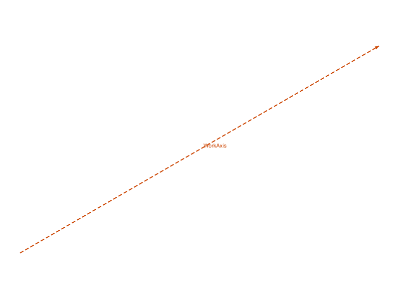 |
|---|

---

## 02 — custom position, direction, zero vector

Script: `scripts/02-custom-pos-dir.mjs` — ✅/⚠️ Mixed.

- WA_Y (position=[40,0,20], direction=[0,1,0]): ✅ result=100, maxLevel=31
- WA_diag (direction=[10,10,10] non-normalized): ✅ result=108, maxLevel=31 — **direction does NOT need to be normalized**
- WA_zero (direction=[0,0,0]): ⚠️ result=116, maxLevel=31 — **zero vector accepted silently!** No error, no warning. Creates a degenerate axis.

| 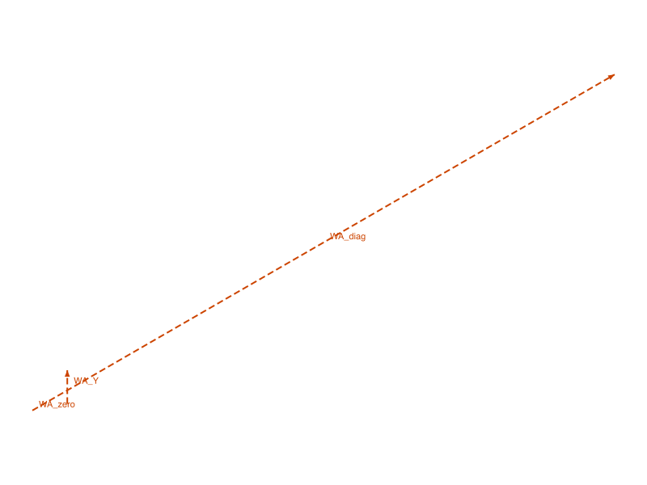 |
|---|

**📌 LLM doc:** Zero direction vector is a silent no-op — creates a feature but it's degenerate. Direction doesn't need normalization.

---

## 03 — expression params

Script: `scripts/03-expression-params.mjs` — ❌ Both approaches fail.

- `@expr` references in position array: ERROR — "A variable of the type String ("@expr.posX") has been defined as type Gleitkommazahl"
- Inline formulas like `'10+20'`: Same error — position/direction arrays must be numeric only.

**📌 LLM doc:** Unlike scalar params (e.g., `box.length`), the `position` and `direction` point arrays do NOT accept expression strings. Use numbers only. The `point | expression` type annotation in the docs is misleading for array elements.

---

## 04 — POINTDIRECTION type

Script: `scripts/04-pointdirection.mjs` — ✅ Works with both brep and work geometry refs.

- Brep: vertex (ID 59) + edge (ID 67) → result=91, maxLevel=31
- Work geometry: workPoint (ID 103) + workAxis (ID 111) → result=119, maxLevel=31

Both brep and work geometry IDs are valid references for POINTDIRECTION.

|  | 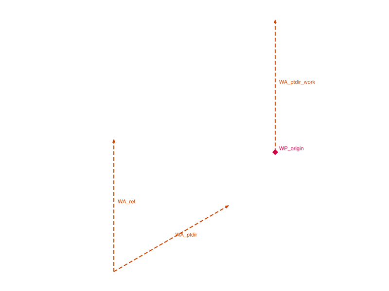 |
|---|---|

---

## 05 — CURVE type

Script: `scripts/05-curve-type.mjs` — ✅/❌ Mixed.

- Brep edge (ID 67): ✅ result=91, maxLevel=31
- Work axis as curve ref: ❌ maxLevel=51 — "The parameter \"references\" has a wrong id type! Provide only following id types: [\"sketch-arc\",\"sketch-circle\",\"edge-arc\",\"edge-circle\",\"edge-line\"]"

| 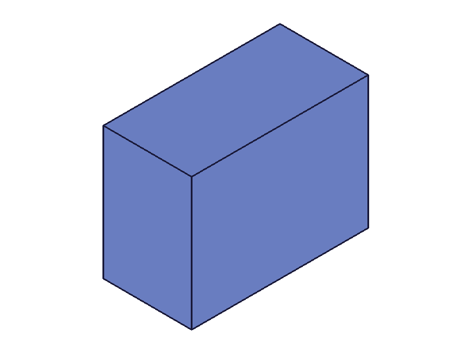 | 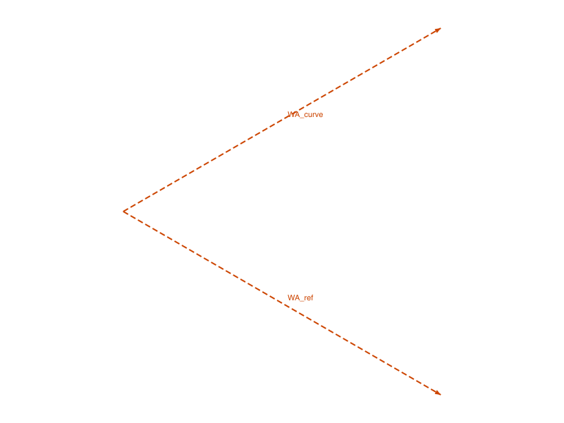 |
|---|---|

**📌 LLM doc:** CURVE type does NOT accept work axis IDs despite the docs saying "brep-edge, sketch-line or work-axis". Only sketch-arc, sketch-circle, edge-arc, edge-circle, and edge-line types are valid.

---

## 06 — 2POINTS type

Script: `scripts/06-2points.mjs` — ✅/❌ Mixed.

- Brep vertices: ✅ result=91, maxLevel=31
- Work points: ✅ result=119, maxLevel=31
- Same point twice: ❌ maxLevel=51 — "Direction cant be a null vector, check reference geometries"

|  | 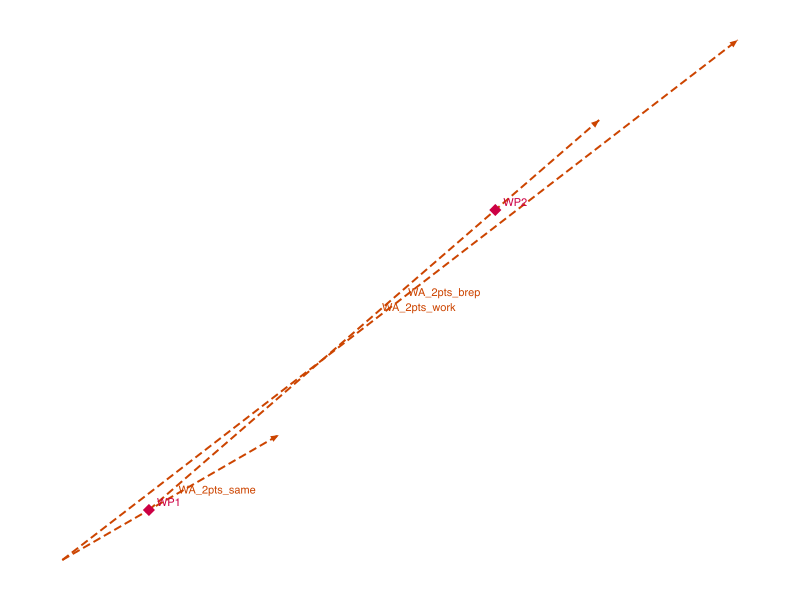 |
|---|---|

**📌 LLM doc:** Same point twice → error. Both brep vertices and work points accepted.

---

## 07 — 2PLANES type

Script: `scripts/07-2planes.mjs` — ✅/❌ Mixed.

- Brep faces: ✅ result=91, maxLevel=31
- Work planes (built-in Top + Front): ✅ result=103, maxLevel=31
- Mixed (brep face + work plane): ✅ result=111, maxLevel=31
- Parallel planes: ❌ maxLevel=51 — "The planes mustn't be parallel for this type of WA_parallel (CC_WorkAxis)."

|  | 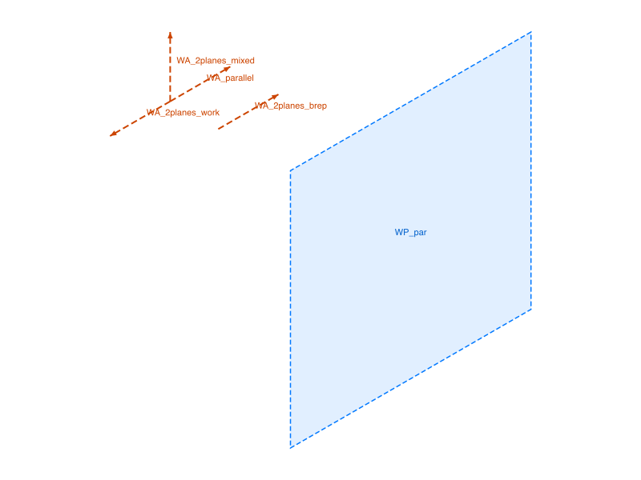 |
|---|---|

**📌 LLM doc:** Parallel planes produce a descriptive error. Mixed brep/work refs work fine.

---

## 08 — name duplicates and empty

Script: `scripts/08-name-dup.mjs` — ✅ All succeed.

- Default name ("WorkAxis"): works, duplicates allowed
- Custom name ("MyAxis"): works, duplicates allowed
- Empty string name (""): works silently
- `getWorkGeometry({ name: 'MyAxis' })` returns first match (ID 70)

Behavior matches workPlane — duplicate names are silently allowed, getWorkGeometry returns first match.

---

## 09 — updateWorkAxis: position and direction

Script: `scripts/09-update-pos-dir.mjs` — ✅ All work (with openFeature).

- Update position only: ✅ returns same ID, maxLevel=31
- Update direction only: ✅
- Update both: ✅
- Multiple updates in one open session work

| 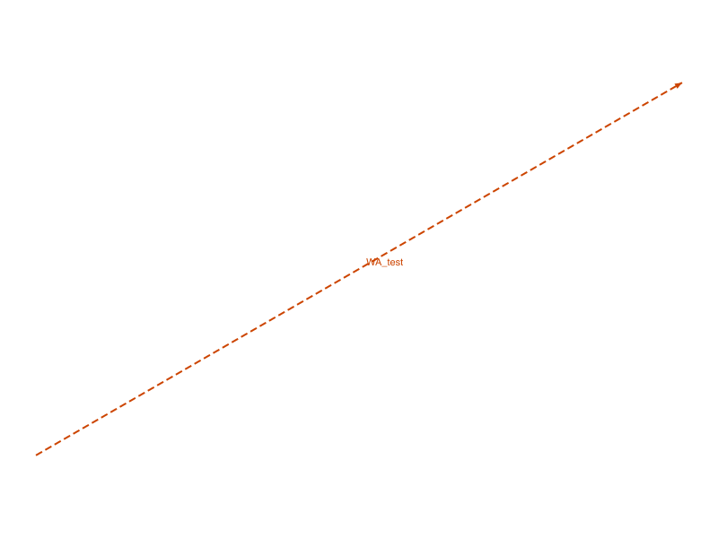 | 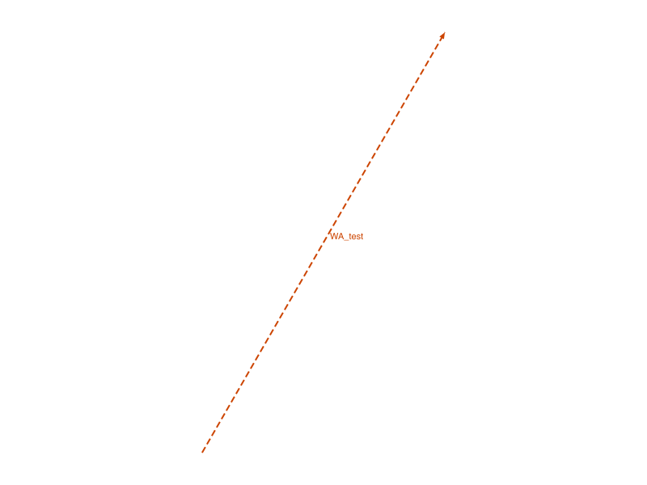 |
|---|---|

**📌 LLM doc:** `openFeature`/`closeFeature` required. Without it: "The provided feature is not allowed to update. It's not active and open."

---

## 10 — updateWorkAxis: type morphing

Script: `scripts/10-update-type.mjs` — ✅ All type transitions work.

- USERDEFINED → 2POINTS: ✅ maxLevel=31
- 2POINTS → USERDEFINED: ✅ maxLevel=31
- USERDEFINED → CURVE: ✅ maxLevel=31

Each transition requires separate open/close cycle. All succeeded.

| 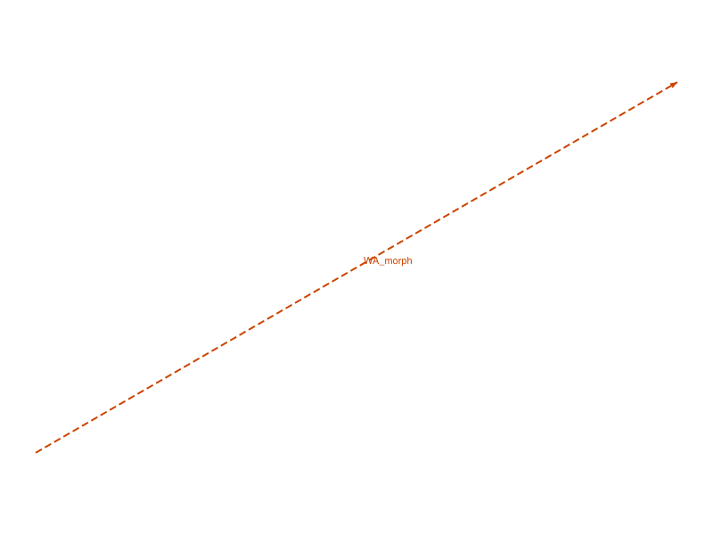 |
|---|

---

## 11 — updateWorkAxis: rename

Script: `scripts/11-update-name.mjs` — ✅ Rename works.

- Rename from "OrigName" to "NewName": result=54, maxLevel=31
- Old name not found: `getWorkGeometry({name:'OrigName'})` → null, maxLevel=51
- New name found: `getWorkGeometry({name:'NewName'})` → 54, maxLevel=31

---

## 12 — error cases

Script: `scripts/12-errors.mjs` — all error messages are descriptive.

- Missing id: "\"id\" must be provided to create CC_WorkAxis"
- Invalid type: "The provided value for parameter \"type\" is not valid. Possible values are: [\"USERDEFINED\",\"POINTDIRECTION\",\"CURVE\",\"2POINTS\",\"2PLANES\"]"
- Referenced type without references: "The parameter \"references\" must be provided in the api call!"
- 2PLANES with only 1 ref: "The parameter \"references\" has invalid number of elements! There should be 2 element(s) in this situation!"
- **POINTDIRECTION with two edges (instead of point+edge): ✅ succeeds** (maxLevel=31) — POINTDIRECTION is flexible about ref types

**📌 LLM doc:** POINTDIRECTION is surprisingly flexible — it accepted two edges. Error messages are descriptive for all other cases.

---

## 13 — built-in work axes

Script: `scripts/13-builtin-axes.mjs` — ✅ Found 3 built-in axes.

Every part has 3 built-in work axes:

| Name | ID | Direction |
|------|----|-----------|
| `XAxis` | 26 | [1,0,0] |
| `YAxis` | 30 | [0,1,0] |
| `ZAxis` | 34 | [0,0,1] |

Access via `getWorkGeometry({ id: partId, name: 'XAxis' })`.

Names are `XAxis`/`YAxis`/`ZAxis` — not `X`/`Y`/`Z`.

**📌 LLM doc:** Document built-in axes. These are usable as revolve axes, pattern directions, etc. without creating custom work geometry.

---

## 14-15 — revolve with workAxis

Scripts: `scripts/14-revolve-usage.mjs`, `scripts/15-revolve-v2.mjs` — ❌ Revolve failed.

Both attempts to use workAxis as revolve axis hit topology errors ("Brep after revolve operation not manifold", "Sketch.GetNormal: CCObject can not be opened"). The workAxis ID was accepted by revolve's `axisIds` parameter — the failure is revolve-specific (sketch normal issues, profile/axis geometry conflicts), not workAxis-related.

| 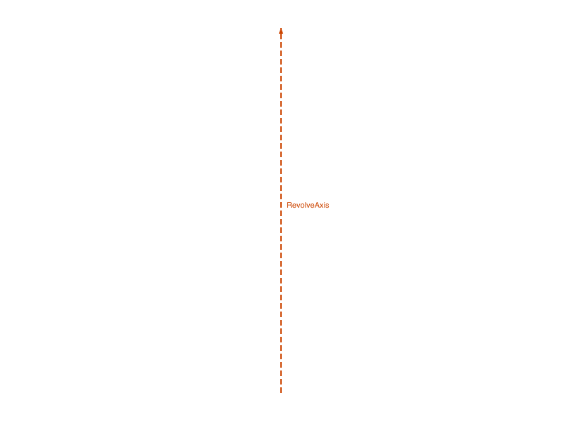 |
|---|

---

## 16 — linearPattern with workAxis

Script: `scripts/16-pattern-usage.mjs` — ✅ Works perfectly.

- Box (30x30x30) + workAxis along X → linearPattern with distance=50, count=3
- Result=128, maxLevel=31

| 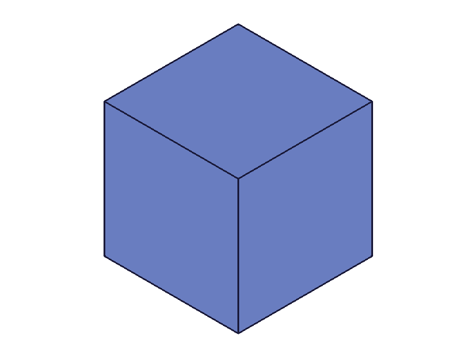 | 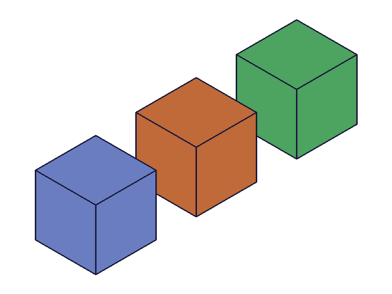 |
|---|---|

WorkAxis is accepted as `dir1.references` for linearPattern. This is a practical use case.
