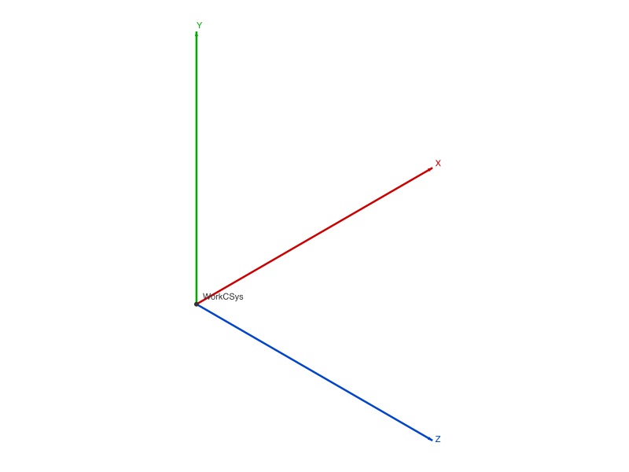
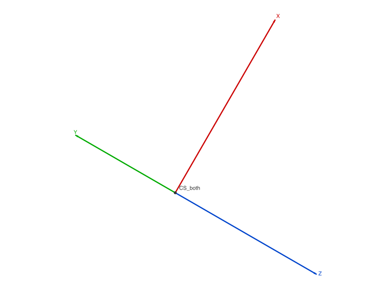
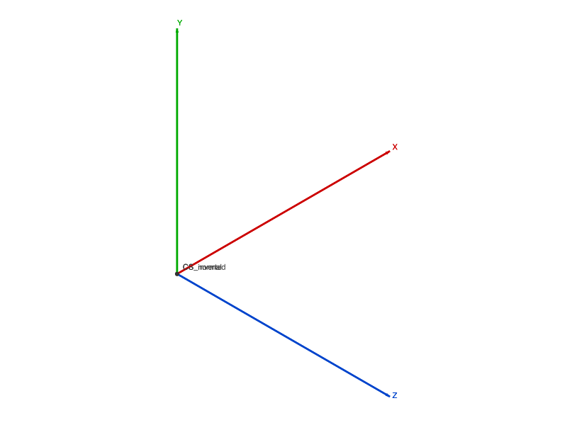

# Training: part.workCSys

**Date:** 2026-03-30

## Goal

Testing `v1.part.workCSys`.

**Coverage checklist:**

- [x] CUSTOM with defaults
- [x] CUSTOM with offset
- [x] CUSTOM with rotation
- [x] CUSTOM with rotation + offset combined
- [x] CUSTOM with inverted=true
- [x] XYAXISORIGIN with references (brep + work geometry)
- [x] Name param + duplicates
- [x] Error cases
- [x] Built-in CSys check
- [x] Expression params in offset/rotation
- [x] XYAXISORIGIN + offset/rotation

---

## 01 — CUSTOM with all defaults

Script: `scripts/01-defaults.mjs` — ✅ result=54, maxLevel=31. Default creates a CSys at origin with global XY directions.

|  |
|---|

---

## 02 — offset

Script: `scripts/02-offset.mjs` — ✅ all work. Offset is a translation vector: `[x,y,z]`. Negative values work.

---

## 03 — rotation

Script: `scripts/03-rotation.mjs` — ✅ all work. Rotation is Euler angles in radians: `[rx, ry, rz]`. Compound rotations work.

---

## 04 — offset + rotation combined

Script: `scripts/04-offset-rotation.mjs` — ✅ offset=[50,30,20] + rotation 45° around Z. maxLevel=31.

|  |
|---|

---

## 05 — inverted

Script: `scripts/05-inverted.mjs` — ✅ both normal and inverted succeed. `inverted: true` mirrors the X-axis (per docs: "inverted at x-axis").

|  |
|---|

---

## 06 — XYAXISORIGIN

Script: `scripts/06-xyaxisorigin.mjs` — ✅/❌ mixed.

- 3 brep refs (point + 2 edges): ✅ result=91, maxLevel=31
- 3 work refs (workPoint + XAxis + YAxis): ✅ result=113, maxLevel=31
- 2 refs: ❌ "references has invalid number of elements! There should be 3 element(s)"

XYAXISORIGIN requires exactly 3 references: origin point, first axis direction, second axis direction. Both brep and work geometry IDs work.

**📌 LLM doc:** XYAXISORIGIN needs exactly 3 refs: [origin, axis1, axis2]. Works with brep vertices/edges and work points/axes.

---

## 07 — errors

Script: `scripts/07-errors.mjs` — all descriptive.

- No id: "\"id\" must be provided to create CC_WorkCSys"
- Invalid type: "Possible values are: [\"CUSTOM\",\"XYAXISORIGIN\"]"
- XYAXISORIGIN without refs: "\"references\" must be provided"

---

## 08 — built-in CSys

Script: `scripts/08-builtin.mjs` — ✅ found one built-in: **`Origin` (ID 22)**.

No other common names found (WorkCSys, CSys, World, Global, Default, CS1 all null).

**📌 LLM doc:** Every part has one built-in work coordinate system named `Origin`. Access via `getWorkGeometry({ id: partId, name: 'Origin' })`.

---

## 09 — names

Script: `scripts/09-name-dup.mjs` — ✅ all work. Duplicates allowed, empty allowed, getWorkGeometry returns first match. Same pattern as all work geometry.

---

## 10 — expression params

Script: `scripts/10-expr-params.mjs` — ❌ all fail. Expression strings in offset/rotation arrays are rejected — same error as workAxis position/direction: "String has been defined as type Gleitkommazahl."

**📌 LLM doc:** offset and rotation arrays are numbers only, no expressions. Consistent with workAxis.

---

## 11 — XYAXISORIGIN with offset/rotation

Script: `scripts/11-xyaxisorigin-variations.mjs` — ✅ both work. Offset and rotation apply on top of the referenced coordinate system.
