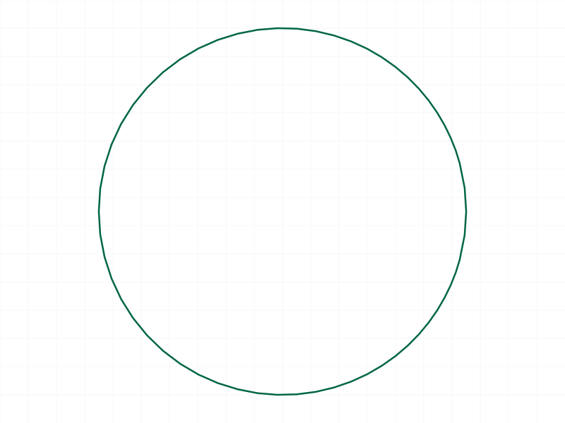
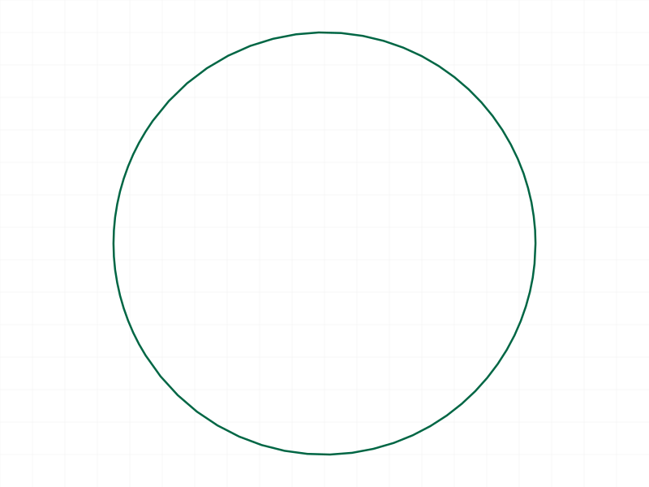

# Training: curve.circle

**Date:** 2026-03-31

## Goal

Testing `v1.curve.circle` — creating circles in shape containers.

**Methods to cover:**

- `circle` — basic creation with centerPos + radius
- `circle` params: id (shape), centerPos (point), normal (optional, default [0,0,1]), radius (real)
- Batch creation — array of objects
- Normal vector — orientation in 3D space

**Questions:**

- What does the normal param actually do? Does it tilt the circle plane?
- Can we create multiple circles in one call (batch)?
- What happens with radius=0? Negative radius?
- What errors come from bad params (wrong ID type, missing params)?
- Does the circle appear in the structure tree? How?
- What happens with non-unit normal vectors?
- Can circles be in non-XY planes?

---

## 01 — basic circle

Script: `scripts/01-basic-circle.mjs` — ✅ as documented. centerPos=[0,0,0], radius=20 creates a circle.

|  |
|---|

**Data:** result=null (VOID), maxLevel=31, messages=[] (see `files/01-basic-circle-circle-response.json`).

---

## 02 — offset center + multiple circles

Script: `scripts/02-offset-center.mjs` — ✅ Multiple circles in the same shape, separate calls. Both succeed with maxLevel 31.

|  |
|---|

**Data:** Both calls return null, maxLevel 31. Renderer auto-scales so two circles may overlap visually.

---

## 03 — normal vectors

Script: `scripts/03-normal-vector.mjs` — ✅ All normals work.

Tested: default (omitted), explicit [0,0,1], [1,0,0] (YZ plane), [0,1,0] (XZ plane), [1,1,1] (tilted). All return maxLevel 31.

**Learned:** The `normal` parameter defines the plane of the circle. All axis-aligned and tilted normals work.

---

## 04 — radius edge cases (UNRELIABLE)

Script: `scripts/04-radius-edge-cases.mjs` — ⚠️ DATA UNRELIABLE. This script ran during concurrent server connections that later crashed. The logged results (all maxLevel 31 for zero/negative radius) are untrustworthy. See scripts 08 for the real findings.

---

## 05 — batch circles

Script: `scripts/05-batch-circles.mjs` — ✅ Array syntax works.

**Data:** result=null, maxLevel=31, messages=[] (see `files/05-batch-circles-batch-response.json`). Batch of 2 circles in one call succeeds.

**📌 LLM doc:** Batch creation works — pass array of objects, same pattern as `curve.line`.

---

## 06 — error cases

Script: `scripts/06-error-cases.mjs` — ✅ All errors match expected pattern.

**Data** (from `files/06-error-cases-error-cases.json`):

| Condition | Code | Level | Message |
|-----------|------|-------|---------|
| Wrong ID (partId) | 1001 | 51 (ERROR) | `"...wrong id type! Provide only following id types: [\"shape\"]"` |
| Missing centerPos | 1004 | 51 | `"The parameter \"centerPos\" must be provided..."` |
| Missing radius | 1004 | 51 | `"The parameter \"radius\" must be provided..."` |
| Missing id | 1004 | 51 | `"The parameter \"id\" must be provided..."` |
| 2D point [x,y] | 0 | 51 | `"...must have exactly 3 real values"` |

**📌 LLM doc:** Error messages and codes — same pattern as other curve APIs.

---

## 07 — structure tree

Script: `scripts/07-structure-tree.mjs` — ✅ Structure after circle creation.

**Data:** Shape node has `geometryIdList: [61]` after one circle, still `[61]` after two circles. Circles share a single geometry entry — no individual circle IDs in the structure tree.

**Learned:** Like lines, circles don't get individual structure tree nodes. They're merged into the shape's geometry.

**📌 LLM doc:** Circles share geometry entry. No per-circle ID — can't individually address/delete circles.

---

## 08 — zero and negative radius (SERVER CRASH)

Script: `scripts/08-zero-negative-radius.mjs` and `scripts/08-negative-radius.mjs` — ❌ **SERVER CRASH.**

- `radius: 0` — call never returns, classcad-cli worker goes to 100% CPU infinite loop
- `radius: -15` — same behavior, infinite loop, server hangs

Both tested independently on fresh server instances. Both cause the worker to hang permanently. No error message is returned — the WebSocket call simply never resolves. The only recovery is to kill the worker process (`kill -9`) and restart it.

**Learned:** `radius <= 0` is a server bug — causes infinite loop, not a validation error.

**📌 LLM doc:** CRITICAL GOTCHA — never pass radius <= 0. It hangs the server with no error. Always validate radius > 0 before calling.

---

## 09 — non-unit normal edge cases

Script: `scripts/09-non-unit-normal.mjs` — ✅ All normal variants work.

**Data** (from `files/09-non-unit-normal-normal-edge-cases.json`):

| Normal | maxLevel | Messages |
|--------|----------|----------|
| [0,0,5] (non-unit) | 31 | [] |
| [0,0,0.001] (tiny) | 31 | [] |
| [0,0,0] (zero!) | 31 | [] |
| [0,0,-1] (negative) | 31 | [] |

**Learned:** Non-unit normals are auto-normalized. Even zero normal [0,0,0] succeeds with no error — unclear what plane it uses (possibly defaults to [0,0,1]). Negative normals work (flips orientation).

**📌 LLM doc:** Normal is auto-normalized. Zero normal silently succeeds. Negative normal flips circle orientation.

---

## 10 — batch across different shapes

Script: `scripts/10-batch-mixed-shapes.mjs` — ✅ Batch with different shape IDs works.

**Data:** result=null, maxLevel=31 (see `files/10-batch-mixed-shapes-mixed-batch.json`).

**📌 LLM doc:** Can mix shape IDs in batch calls.

---

## 11 — batch with one error

Script: `scripts/11-batch-with-error.mjs` — ✅ Per-item error handling confirmed.

**Data** (from `files/11-batch-with-error-batch-error.json`): maxLevel=51, one error message for the wrong ID type. Valid circles still created. Same behavior as `curve.line` batch.

**📌 LLM doc:** Batch errors are per-item — one bad entry doesn't block others.

---

## 12 — circle with lines in same shape

Script: `scripts/12-circle-with-line.mjs` — ✅ Mixed geometry types in same shape work.

|  |
|---|

**Note:** Renderer only shows line edges; circles may not render in curve plot mode. This is a renderer limitation, not an API issue.

---

## 13 — 3D circles

Script: `scripts/13-3d-circle.mjs` — ✅ Circles in multiple planes and with tilted normals.

|  |  |
|---|---|

Created circles in XY, YZ, and XZ planes (same center) and a tilted circle at [10,20,30] with normal [1,1,0]. All succeed.

---

## Coverage Checklist

- [x] The API has been called at least once successfully (01)
- [x] Every required parameter has been tested: id, centerPos, radius (01, 06)
- [x] Key optional parameters have been exercised: normal (03, 09, 13)
- [x] N/A — no enum values
- [x] N/A — no update/delete method for circle
- [x] At least one realistic usage: mixed geometry types (12), 3D orientation (13)
- [x] Behavioral claims verified with data: structure tree (07), error responses (06), batch (05, 11)
