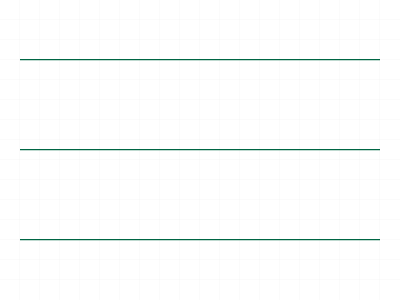
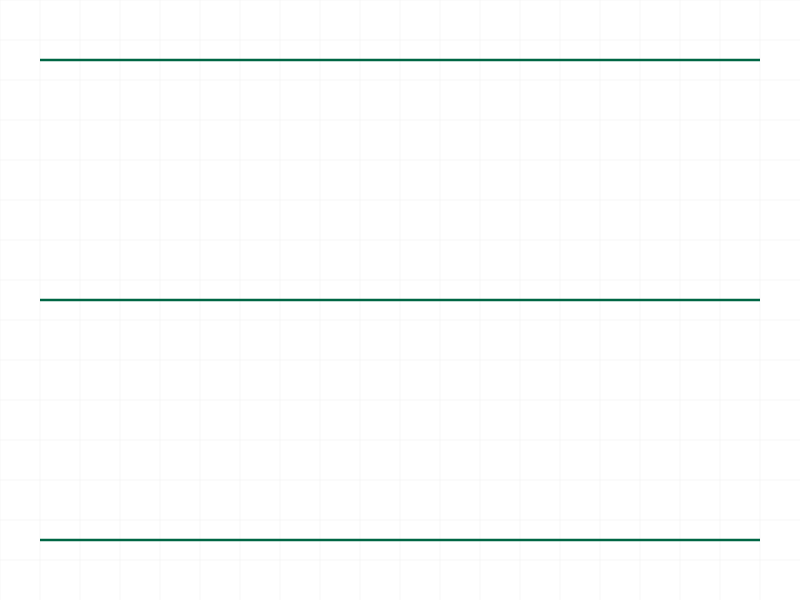

# Training: curve.line

**Date:** 2026-03-31

## Goal

Testing `v1.curve.line` — creating lines in shape containers.

**Methods to cover:**

- `line` — basic line creation with `startPos` and `endPos`
- `line` params: `id` (shape ID), `startPos` (point), `endPos` (point)
- Batch creation — `param` accepts `Array<object>` for multiple lines
- 3D lines — points with non-zero Z
- Edge cases: degenerate line (start==end), very long lines, negative coords

**Questions:**

- Does line return VOID or an ID?
- Does batch creation (array of objects) work? Does it add all lines to the same shape?
- What happens with a degenerate line (startPos == endPos)?
- Does it accept 3D points (non-zero Z)?
- What error codes come from wrong ID type, missing params?
- Does each line get its own geometry ID, or do they share like circle/line did in shape training?
- What does the structure tree look like after adding lines?

---

## 01 — Basic line creation

Script: `scripts/01-basic-line.mjs` — ✅ Line returns VOID (null), maxLevel 31 (info), empty messages.

|  |
|---|

**Data:** `result: null`, `maxLevel: 31`, `messages: []`. Line is added to shape but returns no ID.

## 02 — Multiple lines (triangle)

Script: `scripts/02-multiple-lines.mjs` — ✅ Three sequential line calls create a triangle.

|  |
|---|

**Note:** Snapshot shows a flat line due to 2D renderer projection. STEP file confirms triangle geometry.

## 03 — Batch creation (array of objects)

Script: `scripts/03-batch-lines.mjs` — ✅ Batch creation works. Returns single VOID, maxLevel 31.

|  |
|---|

**Data:** Passing array of 3 line objects creates all 3 lines in one call. Single response with `result: null`, `maxLevel: 31`.

**📌 LLM doc:** Batch creation works — pass an array of `{id, startPos, endPos}` objects.

## 04 — 3D lines (non-zero Z)

Script: `scripts/04-3d-lines.mjs` — ✅ 3D lines work fine. X/Y/Z axes and diagonal all created.

|  |
|---|

**Note:** Snapshot shows flat projection. 3D lines are supported — points with non-zero Z work.

## 05 — Degenerate line (start == end)

Script: `scripts/05-degenerate-line.mjs` — ⚠️ Degenerate line is an error. Near-degenerate (0.001) succeeds.

**Data:**
- `startPos == endPos` → maxLevel 51, ERROR: `"Start point and end point must not be equal"` (CurveBuilder.cpp line 349)
- `endPos = [0.001, 0, 0]` → maxLevel 31, success. Very short lines are fine.

**📌 LLM doc:** Degenerate lines (identical start/end) produce ERROR. Any non-zero-length line works.

## 06 — Error cases

Script: `scripts/06-error-cases.mjs` — ✅ All error paths documented.

**Data (see `files/06-error-cases-error-cases.json`):**
- Part ID as `id` → code 1001, level 51: `"Provide only following id types: [\"shape\"]"`
- EI ID as `id` → same code 1001 — only shape IDs accepted
- Missing `startPos` → code 1004, level 51: `"The parameter \"startPos\" must be provided"`
- Missing `endPos` → code 1004, level 51: `"The parameter \"endPos\" must be provided"`
- Missing `id` → code 1004, level 51: `"The parameter \"id\" must be provided"`
- Non-existent ID → code 1006, level 51: `"invalid id"` (with warning code 0)

**📌 LLM doc:** Document error codes — same pattern as shape APIs (1001 wrong type, 1004 missing, 1006 invalid).

## 07 — Structure tree (first attempt)

Script: `scripts/07-structure-tree.mjs` — ❌ Failed — structure tree is a flat map keyed by ID string, not a nested tree. findNode traversal was wrong.

## 08 — Negative and extreme coordinates

Script: `scripts/08-negative-coords.mjs` — ✅ All coordinate ranges work.

**Data (see `files/08-negative-coords-coord-tests.json`):**
- Negative coords `[-50, -30, 0]` → success, maxLevel 31
- Large coords `[100000, 0, 0]` → success, maxLevel 31
- Tiny coords `[0.0001, 0.0001, 0]` → success, maxLevel 31

## 09 — Batch with different shape IDs

Script: `scripts/09-batch-different-shapes.mjs` — ✅ Can mix shape IDs in a single batch call.

|  |
|---|

**Data:** Batch with lines targeting s1, s2, s1 → all created. `result: null`, `maxLevel: 31`.

**📌 LLM doc:** Batch calls can target different shapes in the same array.

## 10 — Batch with one degenerate line

Script: `scripts/10-batch-with-error.mjs` — ⚠️ Degenerate line fails but valid lines succeed.

|  |
|---|

**Data:** Batch of 3 lines (one degenerate) → `maxLevel: 51` with error for the degenerate. Snapshot shows 2 valid lines were created. Error does NOT abort the batch — valid items succeed.

**📌 LLM doc:** Batch errors are per-item. One bad line doesn't block the others.

## 11 — Lines mixed with circle

Script: `scripts/11-line-with-circle.mjs` — ✅ Rectangle + circle in same shape works.

|  |
|---|

**Note:** Snapshot shows a flat line (renderer issue with this geometry layout). Shape contains both line and circle curves.

## 12 — Point array length requirements

Script: `scripts/12-point-types.mjs` — ✅ Points must have exactly 3 elements.

**Data (see `files/12-point-types-point-types.json`):**
- 2 elements `[x, y]` → ERROR: `"If point is defined as array, it must have exactly 3 real values"`
- 4 elements `[x, y, z, w]` → same ERROR
- 1 element `[x]` → same ERROR

**📌 LLM doc:** Points must be `[x, y, z]` — no 2D shorthand allowed.

## 13 — Structure tree dump

Script: `scripts/13-dump-structure.mjs` — ✅ Structure tree is a flat map `{[id]: node}`.

**Data (see `files/13-dump-structure-full-structure.json`):** Shape node (ID 60) has `geometryIdList: [61]` after 2 lines — same single geometry ID. Lines don't create separate nodes. Structure keys: `root, currentProduct, currentInstance, testRoot, tree` where `tree` is the flat ID→node map.

---

## Coverage Summary

All questions answered:
- **Returns VOID** (null), maxLevel 31, no messages on success
- **Batch creation** works — pass array of objects. Can mix shape IDs. Errors are per-item (valid lines still created).
- **Degenerate line** (start==end) → ERROR. Near-degenerate (0.001) succeeds.
- **3D points** (non-zero Z) work fine
- **Error codes:** 1001 (wrong ID type), 1004 (missing required param), 1006 (invalid ID)
- **Points** must have exactly 3 elements — no 2D shorthand
- **Structure:** Lines share geometry IDs within a shape (no per-line nodes)
- **Coordinate ranges:** Negative, very large, very small all work
