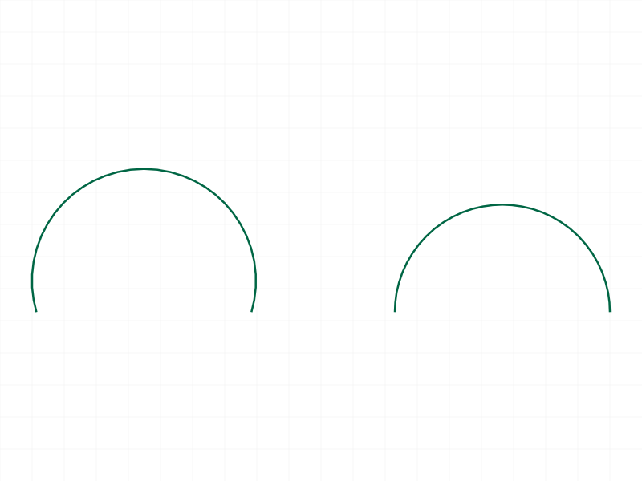
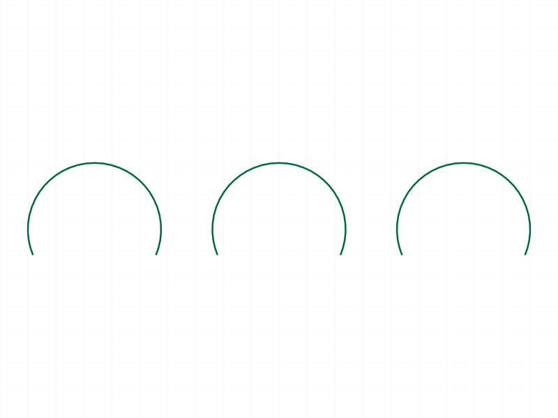
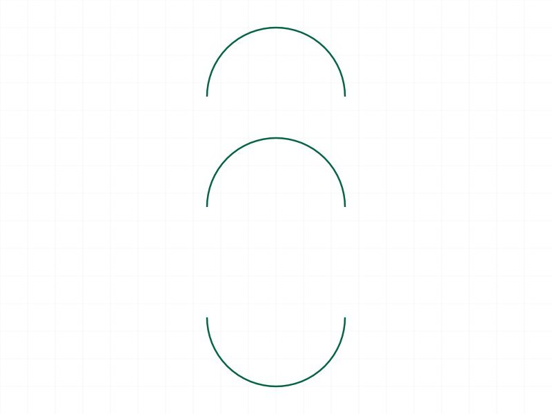
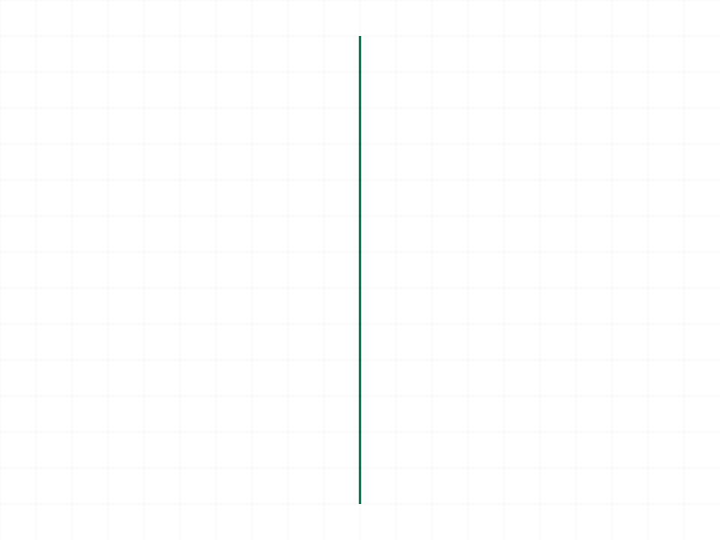
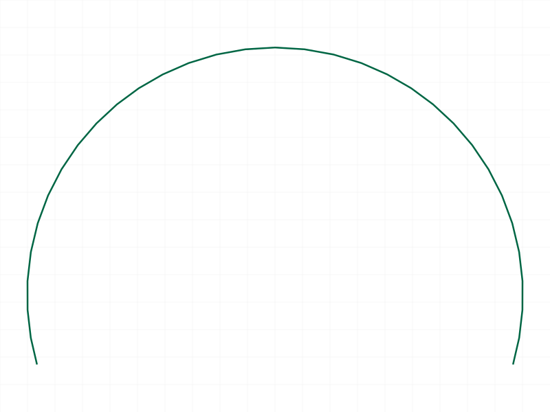

# Training: curve.arcBy3Points

**Date:** 2026-03-31

## Goal

Testing `v1.curve.arcBy3Points` — creates arcs defined by start, mid, and end points.

**Methods to cover:**

- `arcBy3Points` — basic arc creation with startPos, midPos, endPos
- All three params are required, no optional params
- Returns VOID

**Questions:**

- Does midPos have to be on the arc between start and end, or just define curvature direction?
- What happens with collinear points (start, mid, end on a line)?
- What happens with coincident points (e.g., start == mid)?
- Does point order matter (start/end swap)?
- Do 3D arcs work (non-zero Z)?
- Batch creation (array of objects)?
- What error messages are produced for invalid inputs?
- Does it share the same gotchas as line/circle (2D points, wrong ID type)?

---

## 01 — basic arc

Script: `scripts/01-basic-arc.mjs` — ✅ Works. result=null, maxLevel=31, no messages. Arc created in XY plane from (0,0,0) through (25,25,0) to (50,0,0). No PNG rendered for single-shape single-arc (renderer needs multiple curves or specific geometry to produce visible output). OFB and STEP were saved.

---

## 02 — multiple arcs

Script: `scripts/02-multiple-arcs.mjs` — ✅ Multiple arcs in same shape and across different shapes all succeed. maxLevel=31 for all three.

|  |
|---|

3 arcs visible: 2 in shape S1 (one upward, one downward), 1 in shape S2 (right side).

---

## 03 — batch creation

Script: `scripts/03-batch-creation.mjs` — ✅ Batch (array of 3 objects) works. Returns single VOID response, maxLevel=31, empty messages.

|  |
|---|

3 arcs created in one call.

---

## 04 — collinear points (unexpected)

Script: `scripts/04-collinear-points.mjs` — Collinear points (all 3 on X axis: (0,0,0), (25,0,0), (50,0,0)) produce ERROR.

**Data:** maxLevel=51, code=0. Error message: `"[Evaluation error in CurveAPI_v1.arcBy3Points::PROC:[Index 2 ausserhalb des Arraybereichs] not defined !]"`. This is a German internal error — "Index 2 out of array bounds". Not a clean user-facing error.

**Learned:** Collinear points fail with an internal error (not a proper validation error). The arc computation internally tries to compute a circle from 3 collinear points, which is geometrically impossible (infinite radius), and the internal algorithm crashes with an array index error.

**📌 LLM doc:** Document collinear point error — not a clean error, but an internal crash-style message.

---

## 05 — coincident points

Script: `scripts/05-coincident-points.mjs` — All three cases produce the same internal error as collinear:
- **Case A (start==mid):** maxLevel=51, same internal error
- **Case B (start==end):** maxLevel=51, same internal error
- **Case C (all equal):** maxLevel=51, same internal error

**Learned:** Any degenerate point configuration (collinear or coincident) produces the same internal "Index 2 ausserhalb des Arraybereichs" error. The server does not validate point geometry before attempting arc computation.

**📌 LLM doc:** Document all degenerate point cases — they share the same error.

---

## 06 — 3D arcs

Script: `scripts/06-3d-arcs.mjs` — ✅ All 3D arcs succeed. maxLevel=31, no messages for all three:
- XZ plane arc (Y=0, Z varies)
- YZ plane arc (X=0)
- Fully 3D arc (all coordinates vary)

|  |
|---|

**Learned:** `arcBy3Points` is fully 3D — the three points define the arc's plane implicitly. No need for a normal parameter.

---

## 07 — point order

Script: `scripts/07-point-order.mjs` — ✅ All succeed. Point order affects arc direction/orientation but all configurations work.

|  |
|---|

Three arcs: original (upward), swapped start/end (still upward — same circle, different traversal direction), mid-below (downward). The midPos determines which side of the chord the arc curves toward.

**Learned:** midPos controls curvature direction. It must lie on the desired arc. Swapping start/end doesn't flip the arc — only midPos placement determines which of the two possible arcs (major/minor) is created.

**📌 LLM doc:** Document that midPos controls arc direction (which side of the chord).

---

## 08 — wrong ID type

Script: `scripts/08-wrong-id-type.mjs` — ✅ Expected errors.
- Part ID → error 1001: `"Provide only following id types: [\"shape\"]"`
- EI ID → same error 1001

Standard behavior, matches line/circle.

---

## 09 — missing parameters

Script: `scripts/09-missing-params.mjs` — ✅ All four missing-param cases produce error 1004:
- No midPos: `"The parameter \"midPos\" must be provided in the api call!"`
- No startPos: `"The parameter \"startPos\" must be provided in the api call!"`
- No endPos: `"The parameter \"endPos\" must be provided in the api call!"`
- No id: `"The parameter \"id\" must be provided in the api call!"`

Standard behavior.

---

## 10 — 2D points

Script: `scripts/10-2d-points.mjs` — ✅ Expected error: `"If point is defined as array, it must have exactly 3 real values"`. maxLevel=51, code=0. Standard behavior.

---

## 11 — large and tiny arcs

Script: `scripts/11-large-arc.mjs` — ✅ Both succeed. maxLevel=31.
- Nearly-full-circle arc (start (1,0,0), mid (0,-25,0), end (-1,0,0)) — works
- Tiny arc (points ~0.002 apart) — works

**Learned:** No minimum or maximum arc size. Very small and very large arcs are both accepted.

---

## 12 — realistic usage (D-profile)

Script: `scripts/12-with-other-curves.mjs` — ✅ D-shape profile: 3 lines + 1 arc combined in same shape. All succeed.

|  |
|---|

Snapshot only shows one vertical line — rendering issue with mixed curve types (the arc and horizontal lines are not visible in the renderer output). The OFB/STEP files were exported correctly. API works fine with mixed curve types.

---

## 13 — semicircle

Script: `scripts/13-semicircle.mjs` — ✅ Perfect semicircle works: start=(0,0,0), mid=(25,25,0) [top of R=25 circle], end=(50,0,0). maxLevel=31.

---

## 14 — deleted shape

Script: `scripts/14-deleted-shape.mjs` — ✅ Expected error. maxLevel=51. Two messages:
- WARNING (41): `"ToId()/TOID() didn't get an existing or valid id."`
- ERROR (1006): `"An element of parameter \"id\" has an invalid id!"`

Standard behavior matching other curve APIs.

---

## 15 — batch with mixed valid/invalid

Script: `scripts/15-batch-mixed-errors.mjs` — Batch of 3: valid, collinear (invalid), valid. maxLevel=51 (error from collinear entry). Only one error message in response.

|  |
|---|

**Data:** Snapshot shows 2 arcs (the valid ones). The collinear entry was skipped. This confirms: **errors are per-item in batch mode** — valid entries are still created despite one failing.

**📌 LLM doc:** Document batch error isolation behavior.

---

## Coverage Checklist

- [x] API called successfully (01, 02, 03)
- [x] Every required parameter tested (09 — missing each one)
- [x] No optional parameters (API has none)
- [x] No enum values (API has none)
- [x] No update/delete method for individual arcs (documented in shape.md)
- [x] Realistic usage combining with lines (12)
- [x] Edge cases: collinear (04), coincident (05), 3D (06), point order (07), large/tiny (11)
- [x] Error cases: wrong ID (08), missing params (09), 2D points (10), deleted shape (14)
- [x] Batch creation and batch error isolation (03, 15)
- [x] Behavioral claims verified with data (filewrite dumps, log values)
