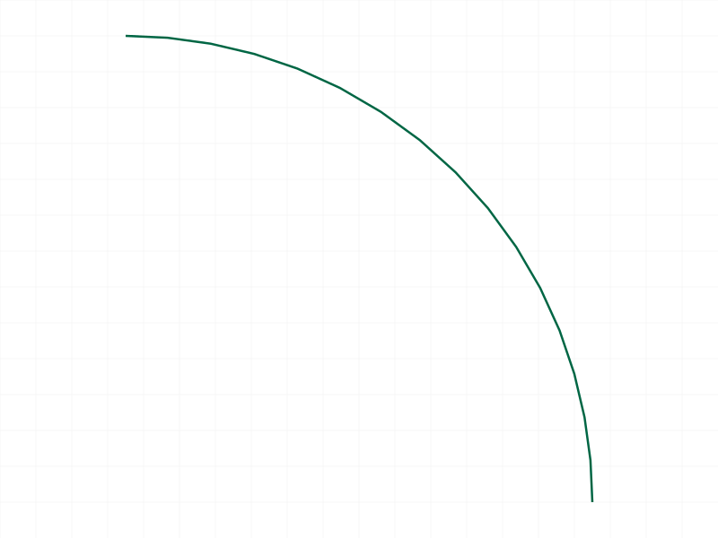
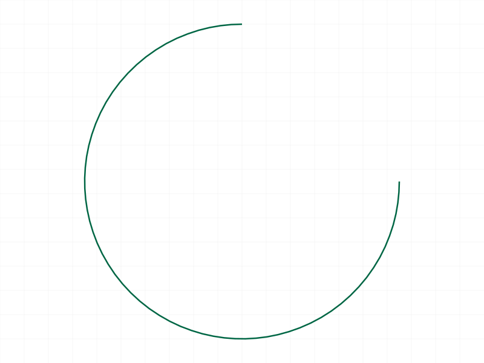
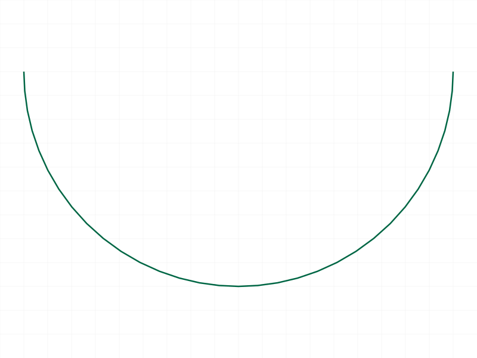
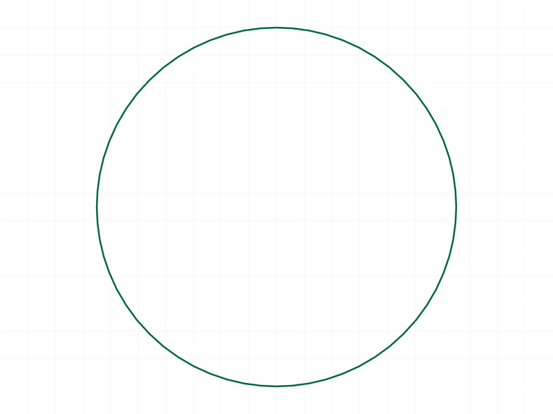
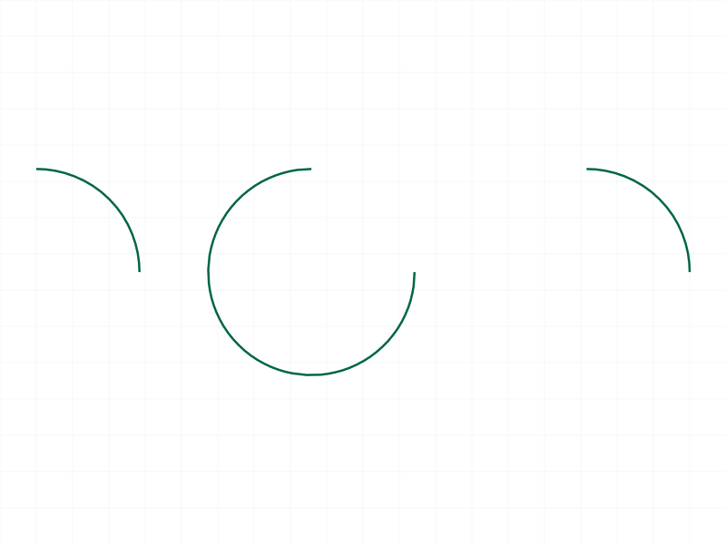
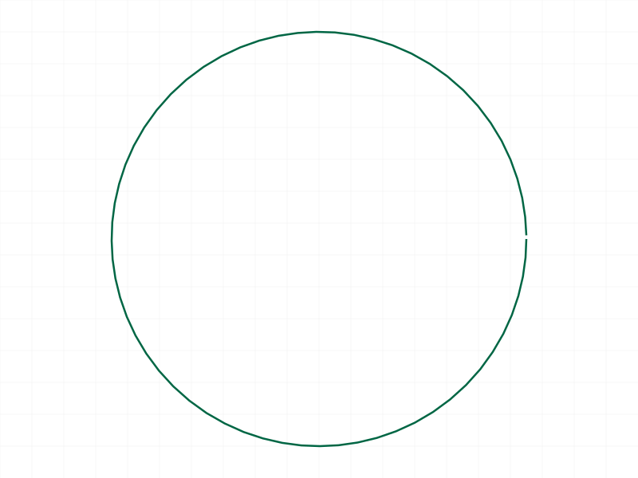

# Training: curve.arcByCenter

**Date:** 2026-03-31

## Goal

Testing `v1.curve.arcByCenter` — arc creation by center, start, end points with clockwise flag.

**Methods to cover:**

- `arcByCenter` — basic arc creation with centerPos, startPos, endPos
- `isClockwise` param: TRUE (default) vs FALSE
- Batch creation (array of objects)
- 3D support (non-XY-plane arcs)

**Questions:**

- How does the isClockwise flag affect the arc direction?
- What happens when startPos and endPos are equidistant from centerPos (valid) vs not equidistant (invalid)?
- What happens with degenerate cases: coincident points, collinear, start==end?
- Does it support 180-degree arcs? Full circles (start==end)?
- How does it compare to arcBy3Points for the same arc?

---

## 01 — Basic arc (default isClockwise=TRUE)

Script: `scripts/01-basic.mjs` — ✅ Arc created successfully. Returns VOID, maxLevel=31.

|  |
|---|

**Data:** result=null, maxLevel=31, messages=[] (see `files/01-basic-response.json`).

**Learned:** With center=(0,0,0), start=(10,0,0), end=(0,10,0) and default isClockwise=TRUE, the arc sweeps 270° clockwise (the major arc). The arc goes from start to end the "long way around".

📌 LLM doc: isClockwise=TRUE produces the clockwise arc from start to end — for a 90° angle between start and end vectors, this is the 270° major arc.

## 02 — Counterclockwise (isClockwise=FALSE)

Script: `scripts/02-counterclockwise.mjs` — ✅ Returns VOID, maxLevel=31.

|  |
|---|

**Learned:** Same geometry with isClockwise=false produces the 90° minor arc (counterclockwise from start to end). The two directions are complementary — together they form a full circle.

📌 LLM doc: Document the relationship between isClockwise and arc sweep direction.

## 03 — Both directions side by side

Script: `scripts/03-both-directions.mjs` — ✅ Two arcs in the same shape, one CW (major) and one CCW (minor), offset horizontally.

|  |
|---|

## 04 — Semicircle (180°)

Script: `scripts/04-semicircle.mjs` — ✅ Both CW and CCW 180° arcs work. maxLevel=31 for both.

|  |
|---|

**Learned:** When start and end are diametrically opposite (180° apart), both CW and CCW produce a semicircle. The isClockwise flag determines which semicircle.

## 05 — Full circle (startPos == endPos)

Script: `scripts/05-full-circle.mjs` — ✅ **startPos == endPos produces a full circle!** maxLevel=31, no errors.

|  |
|---|

**Data:** result=null, maxLevel=31, messages=[] (see `files/05-full-circle-response.json`).

**Learned:** Unlike `arcBy3Points` (which requires 3 distinct points), `arcByCenter` with startPos==endPos creates a complete circle. This is a valid way to create circles using `arcByCenter` instead of `curve.circle`. The radius is the distance from centerPos to startPos.

📌 LLM doc: startPos==endPos creates a full circle. This is unique behavior — not an error.

## 06 — Degenerate: coincident points (SERVER HANG)

Script: `scripts/06-degenerate-coincident.mjs` — ❌ **Server hung at 100% CPU.** Timeout after 30s. Had to kill and restart the worker.

**Learned:** Passing center==start (zero radius) causes the ClassCAD worker to hang. Same pattern as `arcBy3Points` with collinear points, but worse — no error message, just an infinite loop. The first sub-call (all three points identical) likely triggered the hang before reaching the other test cases.

📌 LLM doc: **CRITICAL** — center==start or center==end (zero radius) hangs the server. No error returned. Must kill worker.

## 07 — Non-equidistant radii

Script: `scripts/07-unequal-radii.mjs` — ❌ ERROR maxLevel=51. Message: `"Created end point differs from the input values: {10,0,0} Offset: 10"`.

**Data:** No geometry created (no snapshot). See `files/07-unequal-radii-response.json`.

**Learned:** The server uses startPos distance as the radius. If endPos is not at the same radius from centerPos, it errors with code=0, level=51. The error message reports the offset between the expected end point (on the circle) and the actual endPos.

📌 LLM doc: startPos and endPos must be equidistant from centerPos. Server uses start radius as the circle radius.

## 08 — Batch creation

Script: `scripts/08-batch.mjs` — ✅ Three arcs created in one call. maxLevel=31.

|  |
|---|

**Data:** result=null, maxLevel=31, messages=[] (see `files/08-batch-response.json`).

**Learned:** Array parameter works as documented. Can mix different centers, radii, and isClockwise values in one batch.

## 09 — Wrong ID type

Script: `scripts/09-wrong-id.mjs` — ❌ Both partId and eifId produce code=1001, level=51: `"wrong id type! Provide only following id types: [\"shape\"]"`.

**Data:** See `files/09-wrong-id-wrong-id-results.json`.

## 10 — 3D arcs

Script: `scripts/10-3d-arc.mjs` — ✅ Both XZ-plane and arbitrary 3D arcs succeed. maxLevel=31.

|  |
|---|

**Learned:** Fully 3D. The arc plane is defined by the three points (center, start, end). No normal vector needed. Snapshot looks flat because the 2D renderer projects 3D curves.

## 11 — Missing required parameters

Script: `scripts/11-missing-params.mjs` — ❌ All four missing-param cases produce code=1004, level=51 with clear messages:

- No centerPos: `"The parameter \"centerPos\" must be provided in the api call!"`
- No startPos: `"The parameter \"startPos\" must be provided in the api call!"`
- No endPos: `"The parameter \"endPos\" must be provided in the api call!"`
- No id: `"The parameter \"id\" must be provided in the api call!"`

**Data:** See `files/11-missing-params-missing-params.json`.

## 12 — Realistic profile (rounded rectangle)

Script: `scripts/12-realistic-profile.mjs` — ✅ Created a rounded rectangle (80x40, r=10 corners) using 4 lines + 4 arcByCenter calls. All maxLevel=31.

|  |
|---|

**Learned:** `arcByCenter` with `isClockwise: false` works naturally for rounded corners. The key: center at the corner fillet center, start at the end of one edge, end at the start of the next edge, CCW for convex corners. Snapshot looks flat (aspect ratio) but STEP/OFB files confirm geometry.

📌 LLM doc: Practical example — rounded rectangle with arcByCenter.

## 13 — 2D point shorthand

Script: `scripts/13-2d-point.mjs` — ❌ `[x,y]` arrays fail with code=0, level=51: `"If point is defined as array, it must have exactly 3 real values"`.

**Data:** See `files/13-2d-point-response.json`.

## 14 — Near-full circle (~359° arc)

Script: `scripts/14-near-full-circle.mjs` — ✅ Both near-full CW (~359°) and tiny CCW (~1°) arcs succeed. maxLevel=31.

|  |
|---|

**Learned:** Very small angular differences work fine. No minimum angle limit observed.

## 15 — isClockwise value types

Script: `scripts/15-isClockwise-TRUE-constant.mjs` — ✅ All three variants work: `true` (boolean), `1` (number), `0` (number). maxLevel=31.

|  |
|---|

**Learned:** `isClockwise` accepts JS booleans and numeric truthy/falsy values interchangeably.

---

## Coverage Checklist

- [x] Basic successful call
- [x] Every required parameter tested (id, centerPos, startPos, endPos)
- [x] Optional parameter exercised (isClockwise: true, false, 1, 0)
- [x] No enum values (N/A)
- [x] No update/delete methods exist for arcs
- [x] Realistic usage (rounded rectangle profile)
- [x] Behavioral claims verified with data (response JSON files)
- [x] Error cases: wrong ID, missing params, non-equidistant radii, degenerate points
- [x] Edge cases: semicircle, full circle, near-full circle, 3D
- [x] Batch creation
