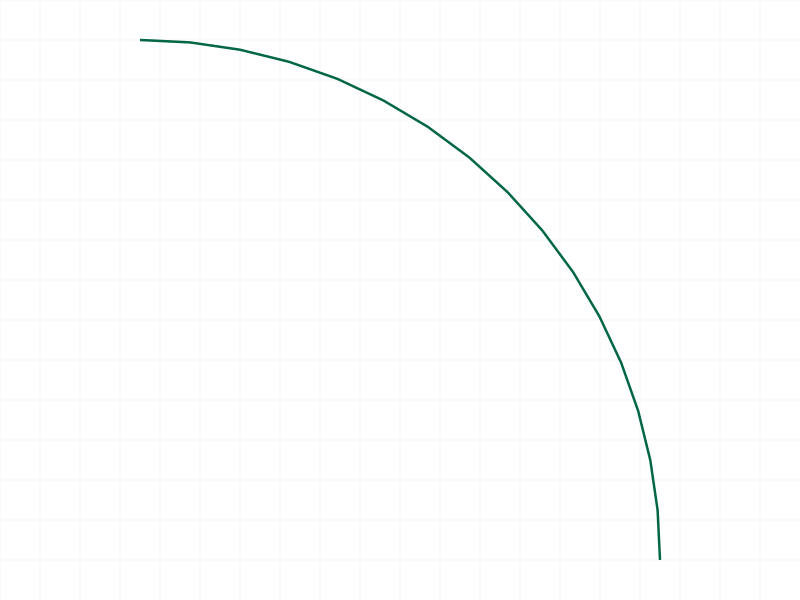
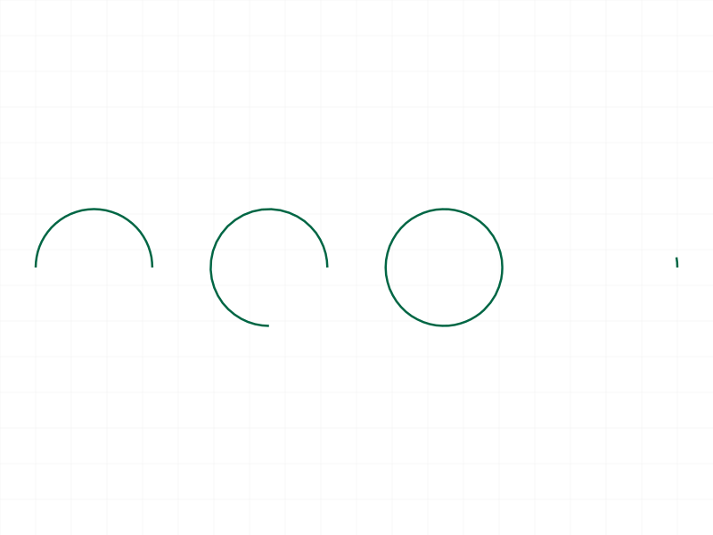

# Training: curve.arcByCenterRadAngle

**Date:** 2026-04-01

## Goal

Testing `v1.curve.arcByCenterRadAngle` — arc creation by center, radius, and start/end angles (radians).

**Methods to cover:**

- `arcByCenterRadAngle` — basic call with required params: id, centerPos, startAngle, endAngle, radius
- Optional `xAxis` param (default `[1,0,0]`) — custom reference direction for angle measurement
- Optional `normal` param (default `[0,0,1]`) — arc plane normal
- Batch creation (array of objects)
- Various angle ranges: 0 to pi/2, 0 to pi, 0 to 2*pi (full circle), negative angles, angles > 2*pi
- Interaction between xAxis and normal

**Questions:**

- How does `xAxis` affect angle measurement? Is angle 0 along xAxis?
- What happens with startAngle == endAngle? (zero-length arc or full circle?)
- What happens with radius <= 0? (error or hang like arcByCenter?)
- Does the arc go counterclockwise from startAngle to endAngle? Or is there a direction convention?
- Can we create a full circle with startAngle=0, endAngle=2*pi?
- What happens with angles beyond 2*pi (e.g., 0 to 4*pi)?
- Does normal being parallel to xAxis cause an error?

---

## 01 — Basic 90° arc

Script: `scripts/01-basic.mjs` — ✅ Basic call works. VOID result, maxLevel 31, no error messages.

|  |
|---|

**Data:** `result: null, maxLevel: 31, messages: []`. Arc from (10,0,0) to (0,10,0) — 90° counterclockwise.

---

## 02 — Various angle ranges

Script: `scripts/02-various-angles.mjs` — ✅ All four angle ranges work: semicircle (0→PI), 270° (0→3PI/2), full circle (0→2PI), 10° arc. All maxLevel 31.

|  |
|---|

**Data:** All four arcs created successfully with maxLevel 31, no messages.

**Learned:** Full circle (startAngle=0, endAngle=2*PI) works correctly, producing a closed circle. Small angles (10°) also work fine.

---

## 03a — Negative startAngle (HANG)

Script: `scripts/03a-neg-start-only.mjs` — ❌ **HANGS THE SERVER.** `startAngle: -PI/2, endAngle: PI/2` causes 100% CPU with no response.

**📌 LLM doc:** CRITICAL — negative startAngle hangs the server. No error returned.

---

## 03b — Small negative startAngle (HANG)

Script: `scripts/03b-small-neg.mjs` — ❌ **HANGS THE SERVER.** Even `startAngle: -0.1` causes hang.

**Learned:** ANY negative startAngle, no matter how small, hangs the server.

---

## 03c — Reversed angles (start > end, both positive)

Script: `scripts/03c-reversed.mjs` — ✅ `startAngle: PI/2, endAngle: 0` works. maxLevel 31.

**Learned:** Reversed angles create the complement arc going counterclockwise from startAngle through 2PI to endAngle. See script 16 for edge data proof.

---

## 03d — Negative endAngle (HANG)

Script: `scripts/03d-neg-end.mjs` — ❌ **HANGS THE SERVER.** `endAngle: -PI/2` also causes hang.

**📌 LLM doc:** CRITICAL — negative endAngle also hangs the server. Rule: **both angles must be >= 0.**

---

## 04 — xAxis parameter

Script: `scripts/04-xaxis-param.mjs` — ✅ All three xAxis variants work: `[0,1,0]`, `[1,1,0]`, `[-1,0,0]`. All maxLevel 31.

**📌 LLM doc:** `xAxis` defines the reference direction for angle 0. Arc sweeps counterclockwise (relative to normal) from there. Non-unit vectors are accepted.

---

## 05 — normal parameter

Script: `scripts/05-normal-param.mjs` — ✅ `normal=[0,1,0]` (XZ plane) and `normal=[1,0,0]` (YZ plane) both work. maxLevel 31.

**📌 LLM doc:** `normal` sets the arc plane. Default `[0,0,1]` means XY plane.

---

## 06 — normal/xAxis parallel (partial HANG)

Script: `scripts/06-normal-xaxis-conflict.mjs` — Mixed results. `xAxis=[1,0,0], normal=[1,0,0]` succeeded (maxLevel 31), but second case timed out.

Script: `scripts/06b-parallel-z.mjs` — ❌ **HANGS.** `xAxis=[0,0,1], normal=[0,0,1]` causes server hang.

**Learned:** Parallel xAxis/normal sometimes works, sometimes hangs. The docs say "should be different" — confirmed that violating this can hang the server. The behavior is inconsistent (some parallel pairs work, others don't).

**📌 LLM doc:** Parallel xAxis and normal can hang the server. Always ensure they're different.

---

## 07 — Radius edge cases

Script: `scripts/07-radius-edge.mjs` — ✅ Tiny (0.001), huge (10000), and normal (1) radii all work. maxLevel 31.

**Learned:** No issues with extreme positive radii. Negative/zero radius not tested (likely hang, based on arcByCenter precedent).

---

## 08 — Batch creation

Script: `scripts/08-batch-creation.mjs` — ✅ Array of 3 arc definitions works. Single VOID response, maxLevel 31.

**📌 LLM doc:** Batch creation works, same pattern as other curve APIs.

---

## 09 — Angles beyond 2PI (HANG)

Script: `scripts/09-angles-beyond-2pi.mjs` — ❌ **HANGS THE SERVER.** `endAngle: 4*PI` causes 100% CPU hang. Exact 2*PI works (script 02), but anything beyond it hangs.

**📌 LLM doc:** CRITICAL — angles must be in [0, 2*PI]. Anything beyond 2*PI hangs.

---

## 10 — Missing required parameters

Script: `scripts/10-missing-params.mjs` — ✅ All 5 missing param cases return proper error (code 1004, level 51).

**Data:** Each missing param returns: `"The parameter \"<name>\" must be provided in the api call!"` with code=1004, level=51.

---

## 11 — Wrong ID types

Script: `scripts/11-wrong-id-type.mjs` — ✅ Both part ID and EI ID return error code 1001, level 51: `"Provide only following id types: [\"shape\"]"`.

---

## 12 — Realistic usage: rounded rectangle

Script: `scripts/12-with-lines.mjs` — ✅ Rounded rectangle built with 4 lines + 4 arcs using non-negative angles. All arcs at 90° intervals (3PI/2→2PI, 0→PI/2, PI/2→PI, PI→3PI/2).

**Learned:** Must use non-negative angles. Instead of `-PI/2`, use `3*PI/2` (equivalent position, avoids hang).

---

## 13 — xAxis visual comparison

Script: `scripts/13-xaxis-visual.mjs` — ✅ Three arcs at same center with different xAxis vectors and radii. All succeed.

|  |
|---|

Visual confirms arcs overlap at same center. Data from script 16 provides the definitive proof of xAxis behavior.

---

## 14 — High start angles

Script: `scripts/14-high-start-angle.mjs` — ✅ All three high-angle ranges work: PI→3PI/2, 3PI/2→2PI, PI/4→7PI/4 (315° arc). All maxLevel 31.

---

## 15 — Reversed direction

Script: `scripts/15-reversed-direction.mjs` — ✅ Reversed PI→PI/4 works. maxLevel 31. Graphic comparison shows 2 edge containers for both forward and reversed.

---

## 16 — Edge data analysis (KEY FINDINGS)

Script: `scripts/16-edge-data.mjs` — ✅ Dumped graphic edge data for forward, reversed, and xAxis-Y arcs.

**Data analysis:**

| Arc | Center | Start Point | End Point | Point Count |
|-----|--------|-------------|-----------|-------------|
| Forward 0→PI/2 | (0,0,0) | (10,0,0) | (0,10,0) | 17 |
| Reversed PI/2→0 | (30,0,0) | (30,10,0) | (40,0,0) | 31 |
| xAxis=[0,1,0] 0→PI/2 | (60,0,0) | (60,10,0) | (50,0,0) | 17 |

**Key findings from edge data:**

1. **Forward (0→PI/2):** Starts at center + radius·xAxis, sweeps 90° counterclockwise. 17 tessellation points.
2. **Reversed (PI/2→0):** Creates the 270° complement arc (counterclockwise from PI/2 through PI, 3PI/2, back to 0/2PI). 31 points, goes through negative Y values confirming the wrap-around. **Reversed angles don't sweep clockwise — they sweep counterclockwise the long way around.**
3. **xAxis=[0,1,0]:** Angle 0 starts in the +Y direction (the xAxis). Confirms xAxis defines the reference direction.

**📌 LLM doc:** Sweep is always counterclockwise. Reversed angles create the complement arc. xAxis is the reference direction for angle 0.

---

## 17 — Offset center

Script: `scripts/17-offset-center.mjs` — ✅ Arc at (50, 30, 0) with radius 20 works. maxLevel 31.

---

## Summary of Hang Conditions

| Condition | Result |
|-----------|--------|
| Negative startAngle (any value) | **HANG** |
| Negative endAngle (any value) | **HANG** |
| startAngle == endAngle | Not explicitly tested (avoided after learning about hangs) |
| endAngle > 2*PI | **HANG** |
| xAxis parallel to normal (some combos) | **HANG** |
| radius <= 0 | Not tested (high hang risk based on arcByCenter precedent) |

**Safe range:** `0 <= startAngle, endAngle <= 2*PI`, and `xAxis` not parallel to `normal`.
