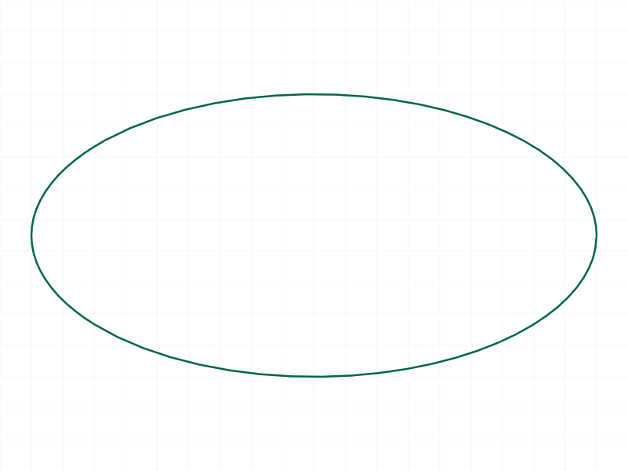
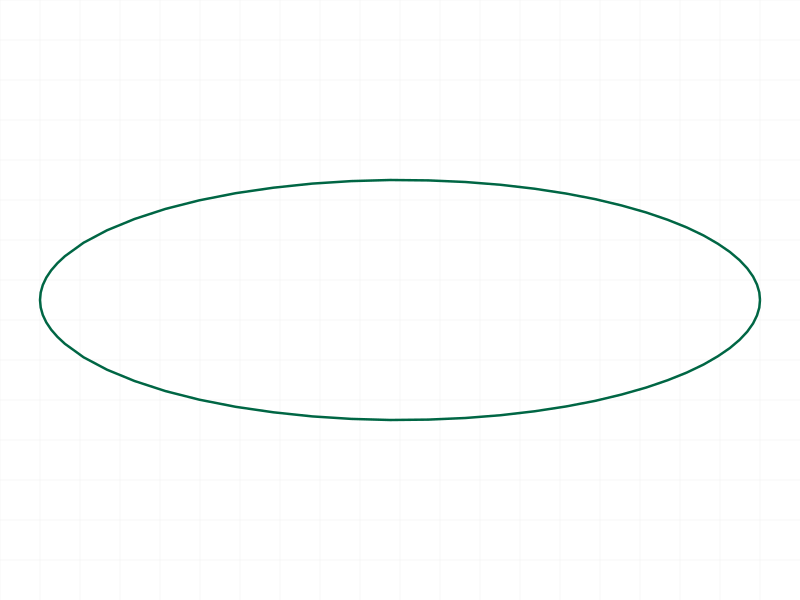
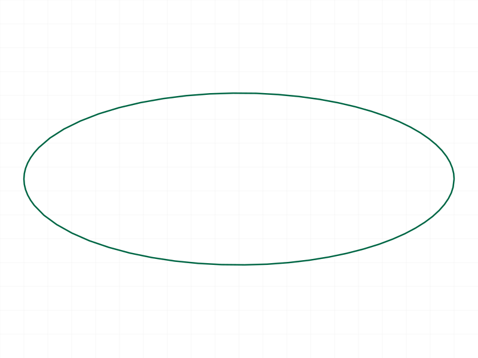
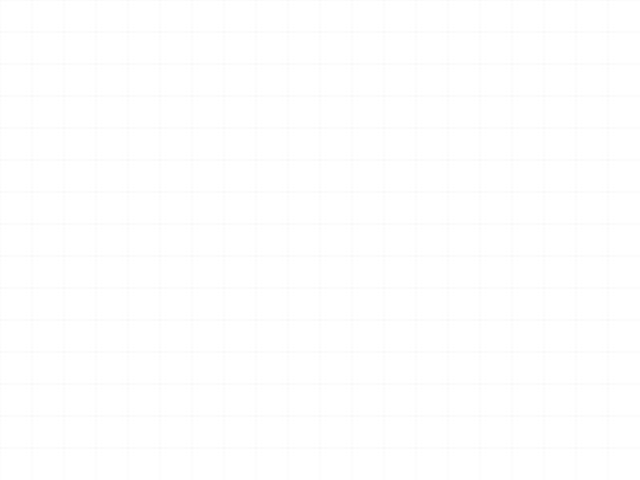
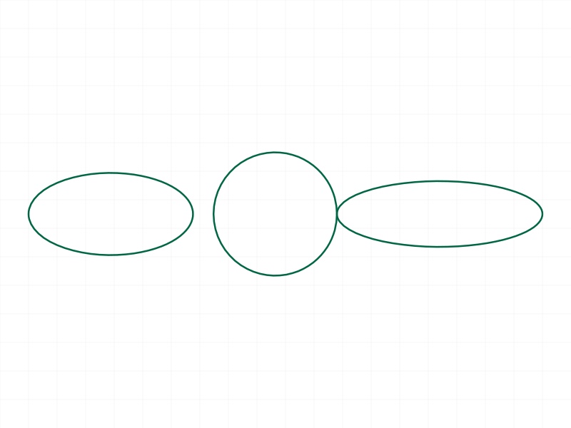
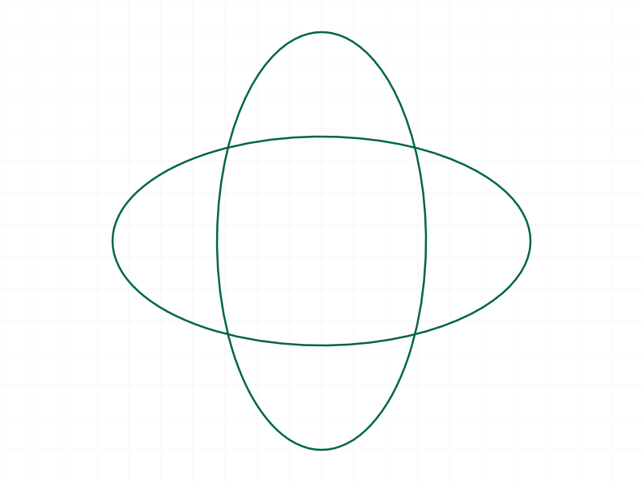

# Training: curve.ellipse

**Date:** 2026-04-01 (resumed 2026-04-06)

## Goal

Testing `v1.curve.ellipse` — creating ellipse curves in shape containers.

**Methods to cover:**

- `ellipse` — basic creation with required params (id, centerPos, radius1, radius2)
- `ellipse` optional params: `xAxis`, `normal`
- Batch creation (array of objects)
- Edge cases: equal radii (circle), zero/negative radii, swapped radius1/radius2

**Questions:**

- Does radius1 vs radius2 matter (which is major, which is minor)?
- What does xAxis do exactly — orient the major axis?
- Can normal and xAxis interact (same vector, orthogonal, parallel)?
- Batch creation behavior — errors per-item or all-or-nothing?
- Does radius <= 0 hang the server like circle does?

---

## 01 — basic ellipse

Script: `scripts/01-basic-ellipse.mjs` — ✅ basic ellipse with r1=30, r2=15 works. Returns null, maxLevel 31 (info).

|  |
|---|

**Data:** `result: null`, `messages: []`, `maxLevel: 31`. Ellipse renders as expected — horizontal major axis along X (default xAxis).

---

## 02 — radius variants

Script: `scripts/02-radius-variants.mjs` — ✅ all 3 variants work (r1>r2, r1<r2, r1==r2). All maxLevel 31.

|  |
|---|

**Learned:** `radius1` and `radius2` are interchangeable in terms of "major" vs "minor" — the larger one is always the major axis. `r1==r2` produces a circle. Swapping r1/r2 is allowed — no error. The snapshot auto-scales to fit all 3 ellipses but they overlap visually.

---

## 03 — xAxis parameter

Script: `scripts/03-xaxis-param.mjs` — ✅ xAxis controls direction of radius1. All maxLevel 31.

|  |
|---|

**Learned:** `xAxis` orients the direction of `radius1`. Default is `[1,0,0]` (radius1 along X). Setting `xAxis: [0,1,0]` puts radius1 along Y. Non-unit vectors like `[1,1,0]` work — the vector is normalized internally.

**📌 LLM doc:** `xAxis` defines the direction of `radius1`, not necessarily the "major" axis. If r2 > r1, the major axis is perpendicular to xAxis.

---

## 04 — normal parameter

Script: `scripts/04-normal-param.mjs` — ✅ normal controls the ellipse plane. All maxLevel 31.

|  |
|---|

**Learned:** `normal` defines the plane the ellipse lies in. Default `[0,0,1]` = XY plane. `[1,0,0]` = YZ plane. `[0,1,0]` = XZ plane.

---

## 05 — xAxis and normal interaction

Script: `scripts/05-xaxis-normal-interaction.mjs` — ⚠️ xAxis==normal produces degenerate geometry. maxLevel 31 (no error!).

|  |
|---|

**Data:** When xAxis==normal==[0,0,1]: result null, messages [], maxLevel 31. No error reported, but the ellipse degenerates. Graphic data (see `files/05-xaxis-normal-interaction-xaxis-eq-normal.json`) shows result null with no messages.

**📌 LLM doc:** When `xAxis` equals `normal`, the ellipse degenerates silently — no error (maxLevel 31), but the geometry collapses to a line. The docs say "should be different to xAxis" — this is a soft constraint, not enforced.

---

## 06 — edge cases (extreme radii)

Script: `scripts/06-edge-negative-radius.mjs` — ✅ tiny, large, and extreme-ratio radii all work. maxLevel 31.

**Data:** `radius1: 0.001, radius2: 0.0005` — works. `radius1: 1000, radius2: 500` — works. `radius1: 100, radius2: 1` — works (extreme eccentricity).

**Prior finding:** The original script 06 tested negative radius and timed out — server hung at 100% CPU. This matches the known `curve.circle` behavior: **radius <= 0 hangs the server**.

**📌 LLM doc:** Negative or zero radius hangs the server (same as `curve.circle`). Always validate radius > 0 before calling.

---

## 07 — batch creation

Script: `scripts/07-batch-creation.mjs` — ✅ batch of 3 ellipses via array param works. Returns single null result.

|  |
|---|

**Data:** Batch result: `{ result: null, messages: [], maxLevel: 31 }`. All 3 ellipses created in same shape. Snapshot clearly shows 3 distinct shapes: vertical ellipse, circle, and flat ellipse.

**Learned:** Batch creation via array param works as expected. Returns single envelope with null result (not array of results). All curves added to the same shape.

---

## 08 — error cases

Script: `scripts/08-error-cases.mjs` — ✅ all errors properly reported with maxLevel 51.

**Data:**
- Missing `radius1`: error 1004 — `"The parameter \"radius1\" must be provided in the api call!"`
- Missing `radius2`: error 1004 — same pattern for radius2
- Missing `centerPos`: error 1004 — same pattern for centerPos
- Wrong ID type (part ID): error 1001 — `"The parameter \"id\" has a wrong id type! Provide only following id types: [\"shape\"]"`
- 2D point `[0,0]`: error code 0 — `"If point is defined as array, it must have exactly 3 real values"`

**📌 LLM doc:** All required params (id, centerPos, radius1, radius2) are strictly enforced with clear error messages (level 51). Points must be 3-element arrays. ID must be a shape ID.

---

## 09 — xAxis==normal isolated investigation

Script: `scripts/09-xaxis-eq-normal-isolated.mjs` — ✅ confirmed degenerate behavior with graphic data.

**Data:** Degenerate ellipse graphic (1193 bytes) vs normal ellipse (4840 bytes). Degenerate case: bounding box is `[0,0,25]` to `[0,0,35.34]` — all X and Y coordinates are 0. The ellipse collapses to points along the Z-axis only. Normal case: bounding box `[38.6,0,0]` to `[75,10,0]` — proper 2D extent.

**📌 LLM doc:** xAxis==normal produces a degenerate ellipse that collapses to a line segment on the normal axis. No error is raised. The graphic data has ~4x fewer bytes. This is a silent failure mode.

---

## 10 — graphic data capture

Script: `scripts/10-graphic-data.mjs` — ✅ graphic/structure data captured for verification.

|  |
|---|

**Data:** Default ellipse (r1=40, r2=20): graphic 5721 bytes, bounding box [-26,0,0] to [40,20,0]. Rotated ellipse (xAxis=[0,1,0]): graphic 5722 bytes (nearly identical size), but major axis now along Y. Snapshot shows two overlapping ellipses rotated 90° from each other, confirming xAxis effect.

**Learned:** The graphic data size is consistent for same-size ellipses regardless of orientation. The structure tree is ~21KB.

---

## Coverage Checklist

- [x] API called successfully
- [x] All required params tested (id, centerPos, radius1, radius2)
- [x] Optional params tested (xAxis, normal)
- [x] Batch creation tested
- [x] Edge cases: extreme radii, equal radii, swapped radii
- [x] Error cases: missing params, wrong ID, 2D points
- [x] Degenerate case: xAxis==normal
- [x] Negative/zero radius → server hang (documented, not retested)
- [x] Behavioral claims verified with graphic data dumps
- [ ] No `update*` or `delete*` method exists for ellipse (correct — curves have no update API)
