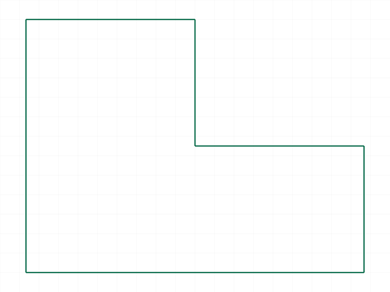
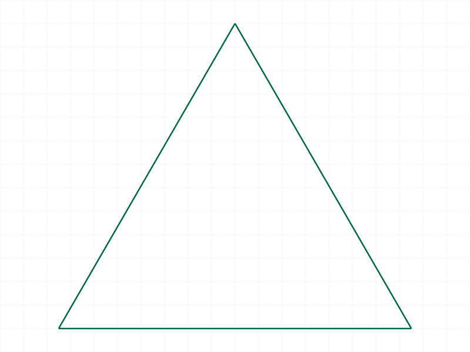
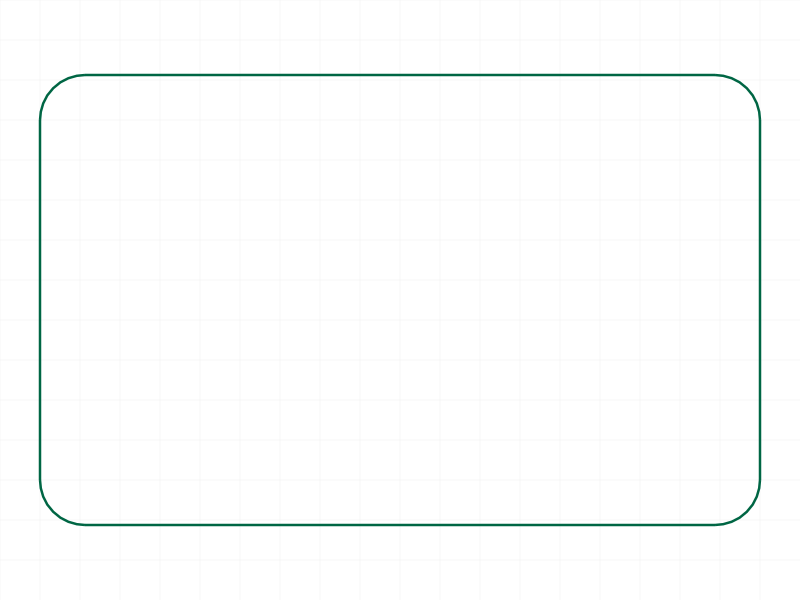
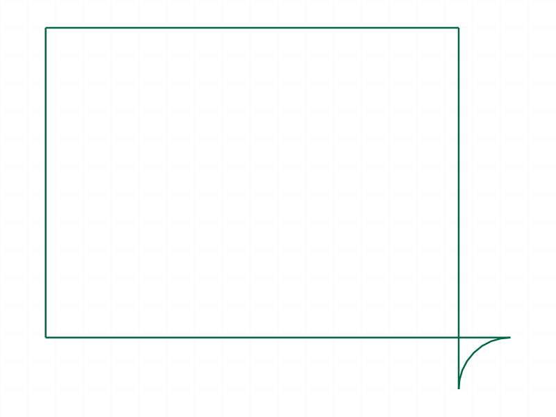
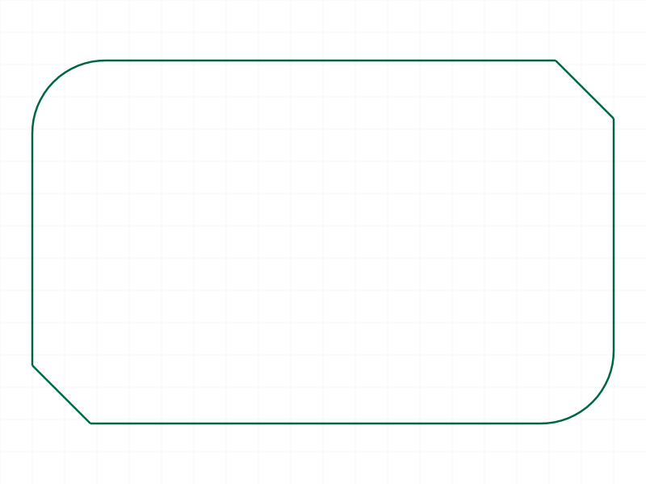
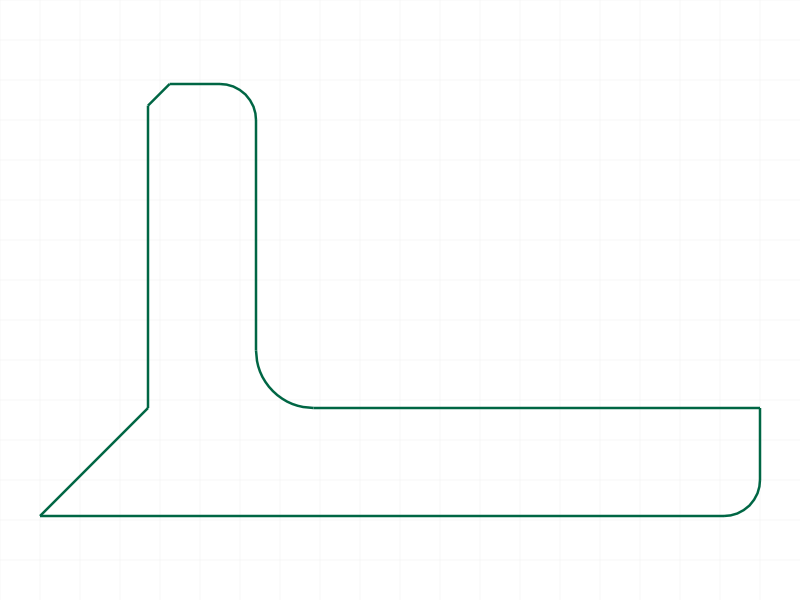

# Training: curve.advancedPolyline

**Date:** 2026-04-07

## Goal

Testing `v1.curve.advancedPolyline` — the PLD (PointLineDefinition) system for creating polylines with absolute/relative coordinates, angle+length segments, radius fillets, and chamfers.

**Methods to cover:**

- `advancedPolyline` with absolute coords (`xa`/`ya`)
- `advancedPolyline` with relative coords (`xr`/`yr`)
- `advancedPolyline` with mixed coords (`xa`/`yr`, `xr`/`ya`)
- `advancedPolyline` with absolute angle+length (`l`/`a`)
- `advancedPolyline` with relative angle+length (`l`/`ar`)
- `advancedPolyline` with movement+angle combos (`xa`+`a`, `xr`+`a`, `yr`+`ar`, etc.)
- Radius fillets (`r`) on vertices
- Chamfers (`c`) on vertices
- `close: true` / `close: false`
- Radius on first point when closed

**Questions:**

- Can radius and chamfer coexist on a single vertex? (docs say no — verify)
- What happens with `r: 0` or `c: 0`?
- How does `r` on the first point work when closed?
- What happens with open polyline + radius?
- Edge cases: negative radius? negative chamfer? very large radius?
- Does the PLD support 3D (z coordinates) or is it strictly 2D?
- What error messages come back for invalid PLD combos?

---

## 01 — basic absolute coords (xa/ya)

Script: `scripts/01-basic-absolute.mjs` — ✅ as documented. Closed rectangle at (0,0)-(60,40).
Result: VOID, maxLevel: 31.

## 02 — relative coords (xr/yr)

Script: `scripts/02-relative-coords.mjs` — ✅ as documented. Same rectangle using relative movements.
Result: VOID, maxLevel: 31.

## 03 — mixed coords (xa/yr, xr/ya)

Script: `scripts/03-mixed-coords.mjs` — ✅ as documented. L-shape using mixed absolute/relative coords.

|  |
|---|

## 04 — absolute angle + length (l/a)

Script: `scripts/04-angle-length-absolute.mjs` — ✅ equilateral triangle using `l: 60, a: 0` and `l: 60, a: 2π/3`.

|  |
|---|

## 05 — relative angle + length (l/ar)

Script: `scripts/05-angle-length-relative.mjs` — ✅ square using first segment `l: 50, a: 0` then two `l: 50, ar: π/2` turns.

## 06 — radius fillets (r)

Script: `scripts/06-radius-fillets.mjs` — ✅ rounded rectangle with `r: 5` on all 4 corners.

|  |
|---|

## 07 — chamfers (c)

Script: `scripts/07-chamfers.mjs` — ✅ rectangle with `c: 8` on all 4 corners. Visible chamfered corners.

|  |
|---|

## 08 — movement + angle combos

Script: `scripts/08-movement-angle-combos.mjs` — ✅ reproduces docs example 4. Uses `ya+a`, `xr+a`, `yr+ar` combos.

## 09 — open polyline

Script: `scripts/09-open-polyline.mjs` — ✅ open zigzag (5 points, no close). Result: VOID, maxLevel 31.

## 10 — radius on first point (closed)

Script: `scripts/10-radius-on-first-closed.mjs` — ✅ `r: 10` on first point with `close: true`. Fillet applied at the closing junction (last→first→second). maxLevel 31, no errors.

**📌 LLM doc:** Radius on first point works when closed — creates fillet at the close junction.

## 11 — edge cases: radius (zero, negative, oversized)

Script: `scripts/11-edge-negative-radius.mjs`

- **`r: 0`** → ERROR (maxLevel 51): `"[Evaluation error in CurveHelper.ComputeFillet:[Index 2 ausserhalb des Arraybereichs] not defined !]"` — array index out of bounds. Zero radius crashes the fillet computation.
- **`r: -5`** → maxLevel 31, **accepted silently**. Snapshot shows an inverted/outward fillet arc on the corner. Negative radius creates an arc that bulges outward instead of inward.
- **`r: 50` on 20-unit edge** → ERROR: `"Can't create a fillet with offset larger than line length!"`

|  |
|---|

**📌 LLM doc:** `r: 0` is an error (crashes fillet computation). `r: negative` is silently accepted and produces an outward-bulging arc. Oversized radius gives a clear error.

## 12 — edge cases: chamfer (zero, negative, oversized)

Script: `scripts/12-edge-negative-chamfer.mjs`

- **`c: 0`** → maxLevel 31, accepted. Seems to be a no-op (no chamfer visible).
- **`c: -5`** → maxLevel 31, accepted silently. Needs further investigation whether it does anything visible.
- **`c: 50` on 20-unit edge** → ERROR: `"Can't create a chamfer with offset larger than line length!"`

**📌 LLM doc:** `c: 0` is a no-op. Negative chamfer is accepted silently (unclear effect). Oversized chamfer gives a clear error.

## 13 — radius + chamfer conflict

Script: `scripts/13-radius-chamfer-conflict.mjs` — ERROR as expected: `"Both 'r' and 'c' must not be specified for the same point in PointLineDefinition!"` (maxLevel 51).

**📌 LLM doc:** Confirmed: cannot use both `r` and `c` on the same PLD point.

## 14 — minimum PLD

Script: `scripts/14-min-pld.mjs`

- **2 points** → ✅ valid, creates a single line segment. maxLevel 31.
- **1 point** → ERROR: `"[Evaluation error in CurveAPI_v1.advancedPolyline::PROC:[Index 0 ausserhalb des Arraybereichs] not defined !]"`
- **empty pld `[]`** → maxLevel 31, accepted silently. No-op — no curves created.

**📌 LLM doc:** Minimum 2 PLDs required. 1 point crashes. Empty array is silently accepted but creates nothing.

## 15 — mixed radius + chamfer on different corners

Script: `scripts/15-mixed-radius-chamfer.mjs` — ✅ chamfer on bottom-left and top-right, radius on bottom-right and top-left. All applied correctly.

|  |
|---|

## 16 — realistic bracket profile

Script: `scripts/16-realistic-bracket.mjs` — ✅ L-bracket with fillets (r:5, r:8), chamfer (c:3), mixed absolute+relative coords. All applied correctly.

|  |
|---|

## 17 — no absolute start

Script: `scripts/17-no-start-absolute.mjs` — ERROR as expected: `"First point must be defined in absolute coordinates ('xa', 'ya') in PointLineDefinition!"` (maxLevel 51).

**📌 LLM doc:** First PLD must use absolute coordinates (xa, ya). Relative-only start is explicitly rejected.
