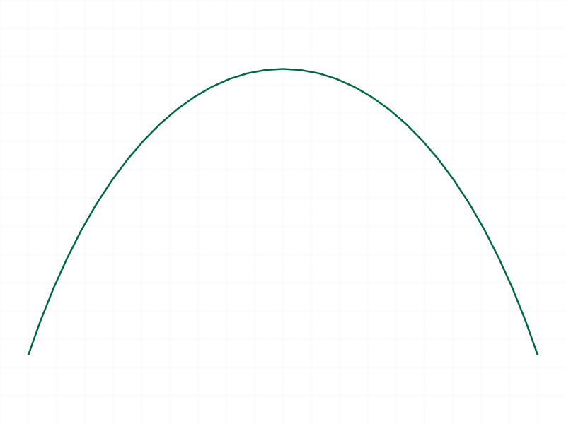
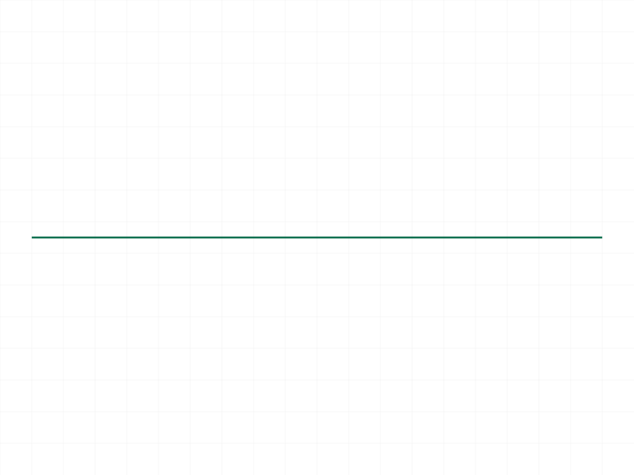
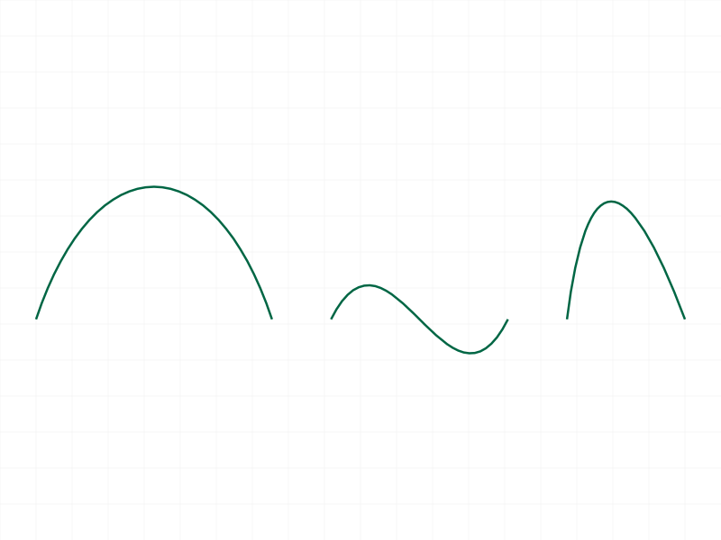
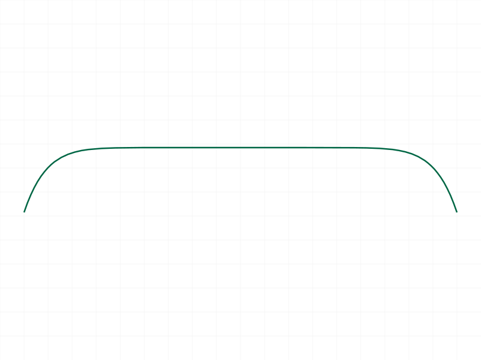

# Training: curve.bezierCurve

**Date:** 2026-04-07

## Goal

Testing `v1.curve.bezierCurve` — creates Bezier curves of degree n (n+1 control points).

**Methods to cover:**

- `bezierCurve` — basic call with 4 control points (cubic Bezier, degree 3)
- Different degrees: 2 points (linear/degree 1), 3 points (quadratic/degree 2), 4+ points (higher degree)
- Control point positioning — how curve shape responds to control point placement
- Batch creation — passing an array of bezier param objects
- Edge cases: 1 point only, 0 points, duplicate points, collinear points
- Error handling — wrong ID type, missing params, invalid points

**Questions:**

- What is the minimum number of control points? (1? 2?)
- Does it support high-degree curves (10+ points)?
- What happens with 2D points `[x,y]` instead of `[x,y,z]`?
- Does it return VOID like other curve APIs?
- Can we create multiple bezier segments in one shape?

---

## 01 — basic cubic bezier

Script: `scripts/01-basic-cubic.mjs` — ✅ Cubic Bezier (4 control points, degree 3) works as documented. Returns null (VOID), maxLevel 31.

|  |
|---|

**Data:** result=null, maxLevel=31, messages=[]. See `files/01-basic-cubic-response.json`.

## 02 — degree variants

Script: `scripts/02-degree-variants.mjs` — ✅ All degree variants succeed: linear (2 pts), quadratic (3 pts), quintic (6 pts). All return null, maxLevel 31.

|  |
|---|

**Data:** All three calls returned `{result: null, maxLevel: 31, messages: []}`. See `files/02-degree-variants-degree-results.json`. The snapshot shows curves compressed vertically due to auto-scaling — the linear segment at Y=0 dominates the viewport.

**Learned:** Minimum 2 control points for a valid Bezier. Linear (degree 1) = straight line. All work.

## 03 — single point (edge case)

Script: `scripts/03-single-point.mjs` — ❌ Error. 1 control point fails with error code 0, level 51.

**Data:** maxLevel=51. Error message: `"creation of nurbs curve failed with error: 1007"` from `CADH_CreateBezierCurve`. See `files/03-single-point-single-pt-response.json`.

**Learned:** Minimum is 2 control points. 1 point = error (code 1007 internally, surfaced as level 51 ERROR).
**📌 LLM doc:** Minimum 2 control points required. Single point = error.

## 04 — empty points array (edge case)

Script: `scripts/04-empty-points.mjs` — ❌ **HANG.** Empty points array `[]` hangs the server. Worker hit 100% CPU, had to `kill -9` and restart.

**Learned:** Empty points array is a **critical hang**. Same pattern as other curve APIs with invalid inputs.
**📌 LLM doc:** CRITICAL — empty points array hangs the server.

## 05 — batch creation

Script: `scripts/05-batch-creation.mjs` — ✅ Batch creation works. Passed array of 3 bezier objects (cubic, S-curve, quadratic). Single VOID response, maxLevel 31.

|  |
|---|

**Data:** result=null, maxLevel=31, messages=[]. See `files/05-batch-creation-batch-response.json`. Snapshot clearly shows 3 distinct curves.

**Learned:** Batch creation works as expected — pass array of param objects, get single response.

## 06 — wrong ID type

Script: `scripts/06-wrong-id-type.mjs` — ❌ Expected error. Passing part ID instead of shape ID returns error code 1001, level 51.

**Data:** Error message: `"The parameter \"id\" has a wrong id type! Provide only following id types: [\"shape\"]"`. See `files/06-wrong-id-type-wrong-id-response.json`.

**Learned:** Consistent with all other curve APIs — requires shape ID.

## 07 — 2D points

Script: `scripts/07-2d-points.mjs` — ❌ Expected error. 2D points `[x,y]` return error level 51.

**Data:** Error message: `"If point is defined as array, it must have exactly 3 real values"`. See `files/07-2d-points-2d-pts-response.json`.

**Learned:** Points must be 3-element arrays. Consistent with all curve APIs.

## 08 — duplicate points

Script: `scripts/08-duplicate-points.mjs` — ✅ All 4 control points identical `[10,10,0]` succeeds silently. maxLevel 31, no error.

**Data:** result=null, maxLevel=31, messages=[]. See `files/08-duplicate-points-dup-pts-response.json`.

**Learned:** Duplicate/degenerate control points don't cause errors. The resulting "curve" is a zero-length degenerate Bezier at a single point. No warning issued.
**📌 LLM doc:** Duplicate control points accepted silently — creates degenerate zero-length curve.

## 09 — high degree bezier (degree 10)

Script: `scripts/09-high-degree.mjs` — ✅ 11 control points (degree 10) works fine. maxLevel 31.

|  |
|---|

**Data:** result=null, maxLevel=31, messages=[]. See `files/09-high-degree-high-degree-response.json`. Snapshot shows a smooth curve that barely oscillates — high-degree Bezier averaging effect.

**Learned:** High-degree curves are supported. The alternating Y=0/Y=30 control points produce a very smooth, nearly flat curve due to Bezier averaging at high degrees.

## 10 — 3D bezier

Script: `scripts/10-3d-bezier.mjs` — ✅ Non-planar 3D control points work. maxLevel 31.

**Data:** result=null, maxLevel=31, messages=[]. See `files/10-3d-bezier-3d-response.json`.

**Learned:** bezierCurve works in full 3D — control points don't need to be coplanar.

## 11 — missing points parameter

Script: `scripts/11-missing-points.mjs` — ❌ Expected error. Missing `points` param returns error code 1004, level 51.

**Data:** Error message: `"The parameter \"points\" must be provided in the api call!"`. See `files/11-missing-points-no-pts-response.json`.

**Learned:** `points` is required. Clear error message.

---

## Coverage Check

- [x] The API has been called at least once successfully
- [x] Every required parameter has been tested (id, points)
- [x] Key optional parameters — none exist (only id + points)
- [x] Degree variants exercised: 1 (linear), 2 (quadratic), 3 (cubic), 5 (quintic), 10 (degree 10)
- [x] No update/delete method exists for individual curves
- [x] Batch creation tested
- [x] Realistic usage combining with prerequisites (part → EIF → shape → bezierCurve)
- [x] Edge cases: single point, empty array, duplicate points, 2D points, wrong ID, missing params, 3D points
- [x] Behavioral claims verified with data (filewrite dumps, log values)

