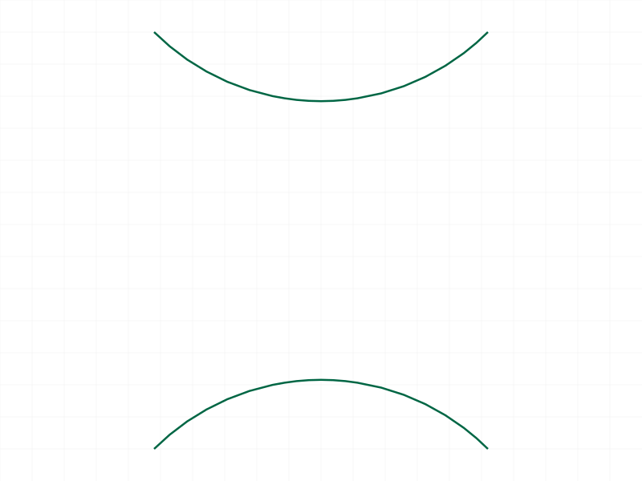
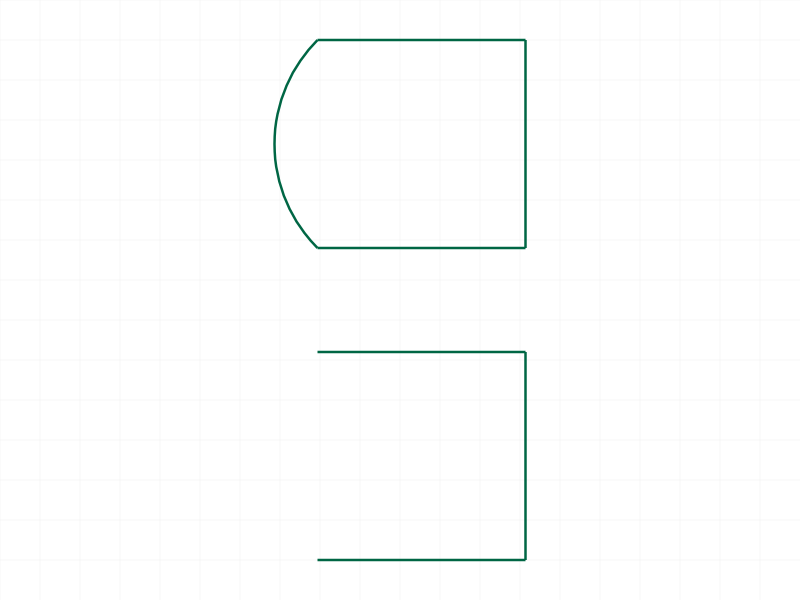
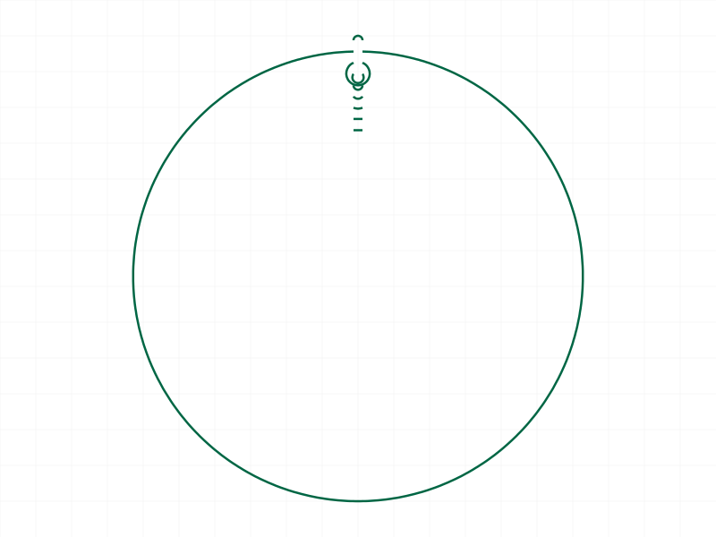
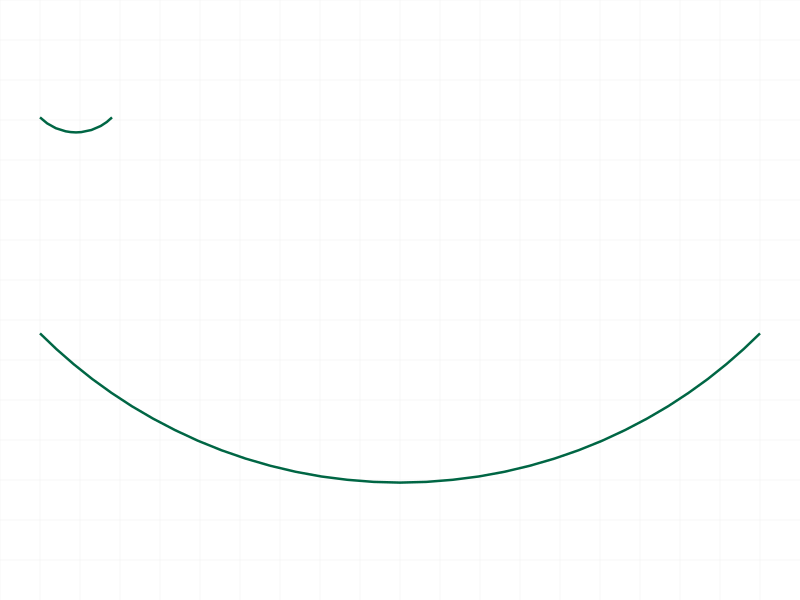
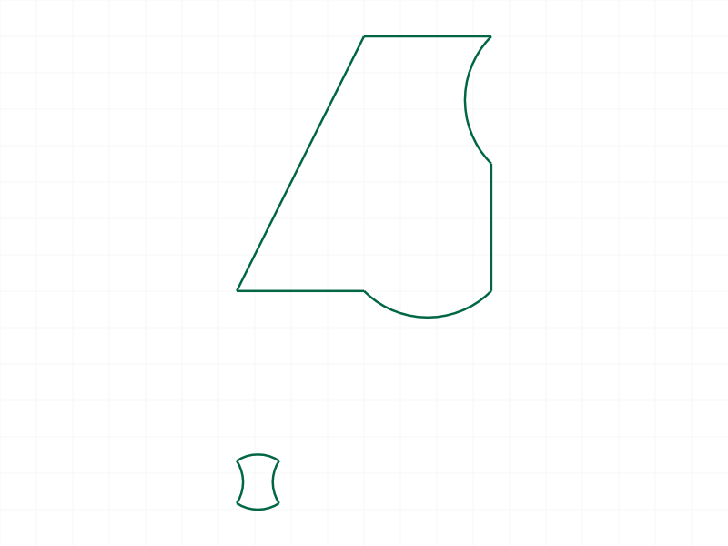
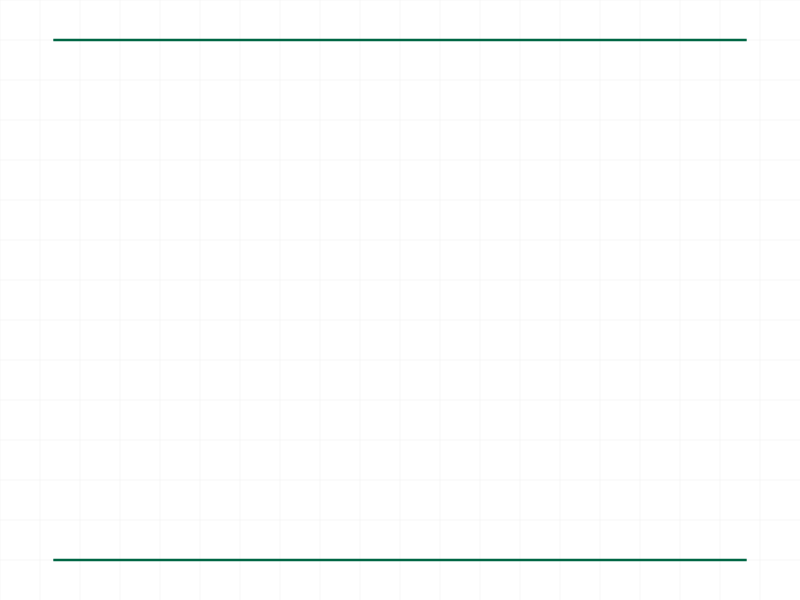
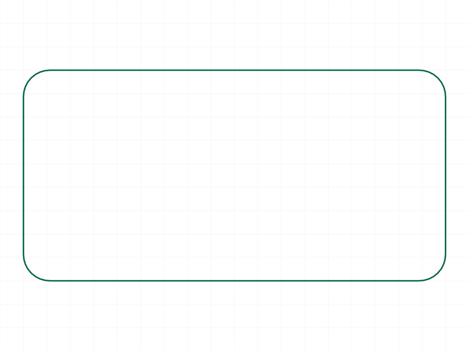

# Training: Bulge Values (polyline2d)

**Date:** 2026-04-07

## Goal

Deep study of the bulge parameter system in `curve.polyline2d`. The formula is `bulge = tan(a/4)` where `a` is the included arc angle.

**Questions to answer:**

- Does `tan(a/4)` produce the expected arcs for known angles (45, 90, 120, 180, 270)?
- What happens at extreme bulge values (very large, very small, near-zero)?
- Does negative bulge reliably flip arc direction (clockwise vs counterclockwise)?
- How does bulge interact with `close: true` on the last segment?
- What does bulge > 1 look like (arcs > 180)?
- What happens with bulge on zero-length segments (duplicate points)?
- Is the formula truly `tan(a/4)` or are there precision edge cases?
- How does bulge interact with segment length (short vs long segments)?

---

## 01 — known angles

Script: `scripts/01-known-angles.mjs` — ✅ `tan(a/4)` produces valid arcs for all tested angles.

**Data:** All calls return maxLevel=31 (info, success). See `files/01-known-angles-known-angles.json`.

| Angle | Bulge value |
|-------|-------------|
| 45° | 0.198912 |
| 90° | 0.414214 |
| 120° | 0.577350 |
| 180° | 1.000000 |
| 270° | 2.414214 |
| 359.9° | 2291.831 |

No PNG generated (shapes too spread out vertically for renderer).

**Learned:** The formula works precisely. Even extreme values like 359.9° (bulge≈2292) are accepted without error.

---

## 02 — negative bulge (direction flip)

Script: `scripts/02-negative-bulge.mjs` — ✅ Negative bulge reliably flips arc direction.

|  |
|---|

**Data:** Both maxLevel=31. Bounding boxes from graphic data confirm geometrically different arcs: CCW arc (positive) min.y=-7.684, CW arc (negative) extends in opposite y-direction. Visual confirmation: top arc curves one way, bottom arc curves the other.

**Learned:** Negative bulge = clockwise. Same magnitude = same angle. Just mirrored direction.

---

## 03 — close with bulge

Script: `scripts/03-close-with-bulge.mjs` — ✅ Last bulge controls closing arc when `close: true`.

|  |
|---|

**Data:** Both maxLevel=31. Closed graphic has 2618 bytes (more edges — includes closing arc), open graphic has 1243 bytes (no closing arc despite bulge on last point).

**Learned:** With `close: true`, the last point's bulge controls the closing segment's arc. With `close: false`, the last point's bulge is silently ignored (no next point to arc to). Confirmed existing LLM doc claim.

---

## 04 — extreme bulge values

Script: `scripts/04-extreme-bulge.mjs` — ✅ All extreme values accepted.

|  |
|---|

**Data:** All 9 test cases return maxLevel=31 (success). See `files/04-extreme-bulge-extreme-bulge.json`. Tested: 0, 0.001, 0.199, 0.5, 1.0, 2.0, 5.0, 100, -1.0.

**Learned:** No clamping, no errors, no warnings for any bulge magnitude. The engine handles the full range from 0 (straight) through tiny (barely curved) to 100 (nearly full circle) gracefully.

---

## 05 — formula verification

Script: `scripts/05-bulge-formula-verify.mjs` — ✅ Formula `bulge = tan(a/4)` confirmed bidirectionally.

**Data:** Inverse check `a = 4*atan(bulge)`:
- bulge=0 → 0° (straight line)
- bulge=0.2 → 45.24°
- bulge=0.41421 → 90° (exact)
- bulge=0.5773 → 119.99° (≈120°)
- bulge=1 → 180° (semicircle, exact)
- bulge=2 → 253.74°
- bulge=5 → 314.76°

Sagitta verification: 180° arc on 40-unit chord has sagitta=20 (equals radius=half-chord). Correct.

360° bulge = tan(90°) → infinity (JS returns ~1.6×10^16). Cannot create a full circle with bulge; use `curve.circle` instead.

**📌 LLM doc:** Add inverse formula and the 360° limitation to polyline2d docs.

---

## 06 — segment length independence

Script: `scripts/06-segment-length.mjs` — ✅ Same bulge produces same angle regardless of segment length.

|  |
|---|

**Data:** Both maxLevel=31. Short (10 unit) and long (100 unit) segments both produce 90° arcs. The arc radius/sagitta scales with segment length, but the angle is determined solely by the bulge value.

**Learned:** Bulge is a pure angle parameter, independent of segment length. The geometry scales proportionally.

---

## 07 — mixed bulges in single polyline

Script: `scripts/07-mixed-bulges.mjs` — ✅ Mixed positive/negative/zero bulges work in a single call.

|  |
|---|

**Data:** Both calls maxLevel=31. Docs example bulge=0.3 → 66.80° arc angle.

**Learned:** Each segment independently respects its own bulge value. You can mix straight lines, CCW arcs, and CW arcs in one polyline. No interaction between adjacent segments' bulge values.

---

## 08 — duplicate points with bulge

Script: `scripts/08-duplicate-points-bulge.mjs` — ✅ No error, even with bulge on zero-length segment.

|  |
|---|

**Data:** Both maxLevel=31. No error messages. Duplicate points with a non-zero bulge are silently accepted (likely creates a degenerate zero-radius arc).

**Learned:** The engine is tolerant of degenerate geometry. This is consistent with the existing LLM doc finding about duplicate points.

---

## 09 — practical reference table and rounded rectangle

Script: `scripts/09-practical-reference.mjs` — ✅ Complete bulge reference table and working rounded rectangle.

|  |
|---|

**Key bulge values (from table, see `files/09-practical-reference-bulge-table.json`):**

| Angle | Bulge |
|-------|-------|
| 10° | 0.043661 |
| 30° | 0.131652 |
| 45° | 0.198912 |
| 60° | 0.267949 |
| 90° | 0.414214 |
| 120° | 0.57735 |
| 180° | 1.0 |
| 270° | 2.414214 |

Rounded rectangle pattern: offset corners by radius, use `b90 = tan(π/8) ≈ 0.41421` at each corner with `close: true`.

**📌 LLM doc:** Add reference table and rounded rectangle pattern to polyline2d docs.

---

## Coverage checklist

- [x] Each stated question answered with evidence
- [x] Edge cases probed (extreme values, zero-length segments, near-360°)
- [x] Findings grounded in server responses (maxLevel, graphic data, formulas)
- [x] Concept tested across multiple variations (9 scripts)
- [x] Key findings backed by filewrite data and logged values
