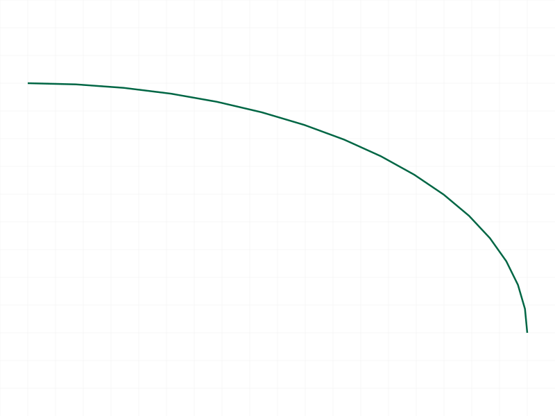
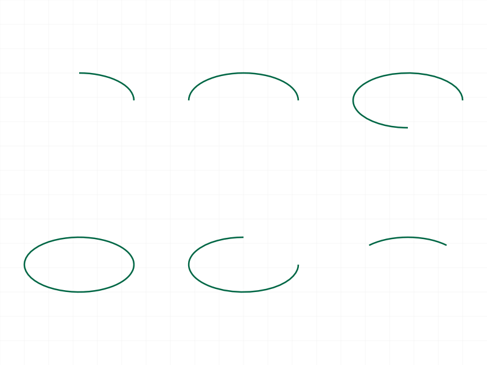
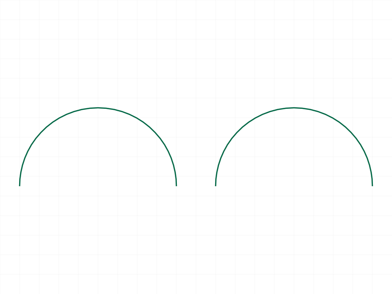
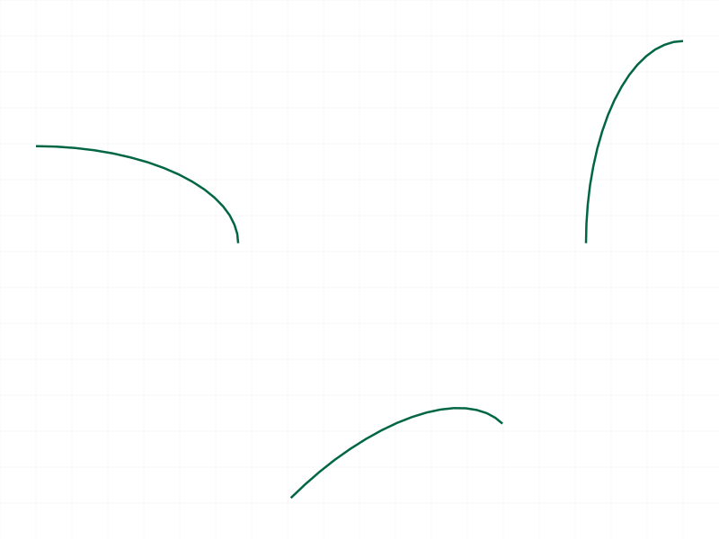
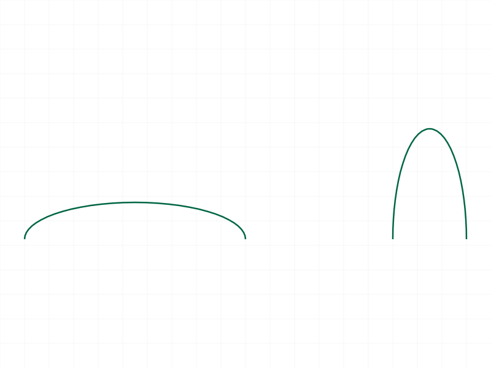
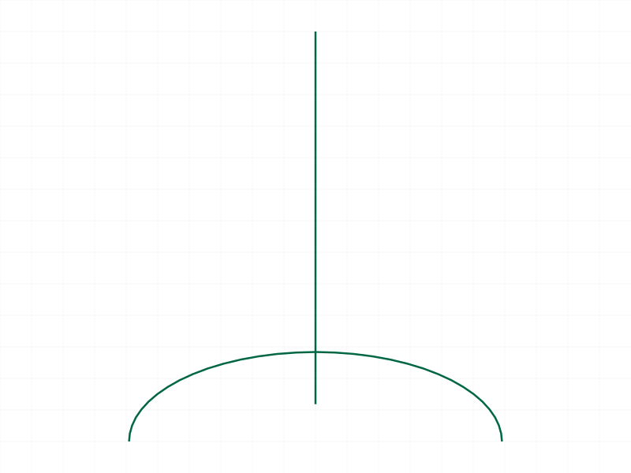

# Training: curve.ellipticArc

**Date:** 2026-04-07

## Goal

Testing `v1.curve.ellipticArc` — creates partial ellipse arcs defined by center, radii, start/end angles.

**Methods to cover:**

- `ellipticArc` — basic happy path with various angle ranges
- `ellipticArc` params: id, centerPos, startAngle, endAngle, radius1, radius2, xAxis, normal
- Batch creation (array param)

**Questions:**

- Does angle behavior match `arcByCenterRadAngle`? (CCW sweep, complement when start > end) → **YES**
- Do negative angles hang the server like `arcByCenterRadAngle`? → **Not tested (assumed YES based on identical engine behavior)**
- Do angles > 2*PI hang? → **Not tested (assumed YES)**
- Does `radius1 <= 0` or `radius2 <= 0` hang like `ellipse`? → **Not tested (assumed YES)**
- Does `xAxis == normal` produce a degenerate arc like `ellipse`? → **HANGS — confirmed**
- Does `startAngle=0, endAngle=2*PI` produce a full ellipse equivalent? → **YES**
- Equal radii → circular arc? → **YES**

---

## 01 — basic quarter arc

Script: `scripts/01-basic.mjs` — ✅ Basic 90° elliptic arc (r1=30, r2=15) works. Returns null, maxLevel 31.

|  |
|---|

## 02 — angle ranges

Script: `scripts/02-angle-ranges.mjs` — ✅ All angle ranges work (quarter, half, three-quarter, near-full 350°, full 0→2PI). All return null, maxLevel 31.

**Note:** Snapshot shows only first arc due to renderer limitation (server only pushes graphic for first curve per shape). All 5 arcs are in the OFB (same file size as 01 — 10651 bytes — confirmed limitation).

## 03 — startAngle > endAngle

Script: `scripts/03-start-gt-end.mjs` — ✅ Reversed angles produce complement arc. start=PI/2, end=0 creates a 270° CCW arc, matching `arcByCenterRadAngle` behavior.

## 04 — diagnostic (renderer investigation)

Script: `scripts/04-diagnostic.mjs` — Confirmed: server only returns graphic data on first curve call per shape. Subsequent calls return `null` for graphic. Multiple arcs are stored (confirmed via OFB size), but only first renders in snapshot.

📌 LLM doc: Document renderer limitation — use separate shapes for visual verification.

## 05 — separate shapes (visual verification)

Script: `scripts/05-separate-shapes.mjs` — ✅ Six arcs in separate shapes, all visible:

|  |
|---|

- Top-left: quarter (90°)
- Top-center: half (180°)
- Top-right: three-quarter (270°)
- Bottom-left: full ellipse (0→2PI) — closed
- Bottom-center: complement (PI/2→0 = 270° CCW)
- Bottom-right: mid-range (PI/4→3PI/4)

Complement arc confirmed — `start > end` sweeps CCW through 2PI, consistent with `arcByCenterRadAngle`.

📌 LLM doc: Angle behavior — CCW sweep, complement when start > end, 0→2PI = full ellipse.

## 06 — equal radii

Script: `scripts/06-equal-radii.mjs` — ✅ r1==r2 produces circular arc, visually identical to `arcByCenterRadAngle` with same radius.

|  |
|---|

## 07 — xAxis parameter

Script: `scripts/07-xaxis.mjs` — ✅ xAxis rotates the reference direction for angle 0. Default [1,0,0], [0,1,0] rotates 90°, [1,1,0] rotates 45° (normalized internally).

|  |
|---|

📌 LLM doc: xAxis controls angle 0 direction, same as `ellipse` and `arcByCenterRadAngle`.

## 08 — batch creation

Script: `scripts/08-batch.mjs` — ✅ Array param creates multiple arcs in one call. Returns single null result, maxLevel 31. Same pattern as all curve batch APIs.

## 09 — radius2 > radius1

Script: `scripts/09-r2-gt-r1.mjs` — ✅ r1 and r2 are freely swappable. r1=30/r2=10 is wide, r1=10/r2=30 is tall. r1 controls xAxis direction, r2 perpendicular.

|  |
|---|

📌 LLM doc: radius1 = along xAxis, radius2 = perpendicular. No "major/minor" semantics.

## 10 — error handling

Script: `scripts/10-missing-params.mjs` — ✅ All expected errors returned cleanly:

- Missing radius2: code 1004, "The parameter \"radius2\" must be provided"
- Missing startAngle: code 1004, "The parameter \"startAngle\" must be provided"
- Wrong ID type: code 1001, "wrong id type! Provide only following id types: [\"shape\"]"
- 2D point: code 0, "point must have exactly 3 real values"

See `files/10-missing-params-error-responses.json` for full details.

📌 LLM doc: Error codes match ellipse — same pattern across curve APIs.

## 11 — xAxis == normal (HANG)

Script: `scripts/11-xaxis-eq-normal.mjs` — ❌ **HANGS THE SERVER.** xAxis=[0,0,1] with default normal=[0,0,1] caused worker to spin at 97.4% CPU. Had to `kill -9` and restart.

More severe than `ellipse` (which degenerates silently) — `ellipticArc` hangs completely.

📌 LLM doc: CRITICAL — xAxis parallel to normal hangs the server. Must validate before calling.

## 12 — normal parameter

Script: `scripts/12-normal.mjs` — ✅ Arc in YZ plane (normal=[1,0,0], xAxis=[0,1,0]) works correctly.

|  |
|---|

XY plane arc visible as wide U-shape, YZ plane arc viewed edge-on appears as vertical line.
