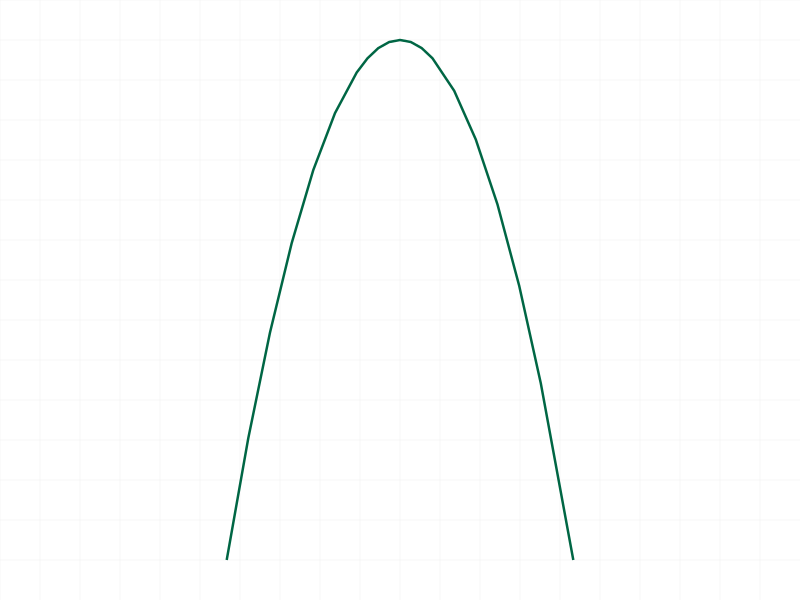
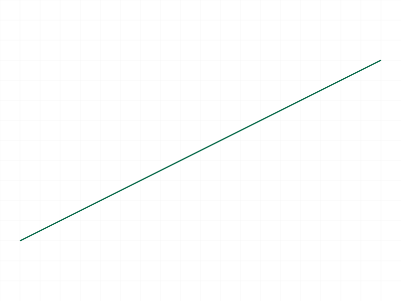
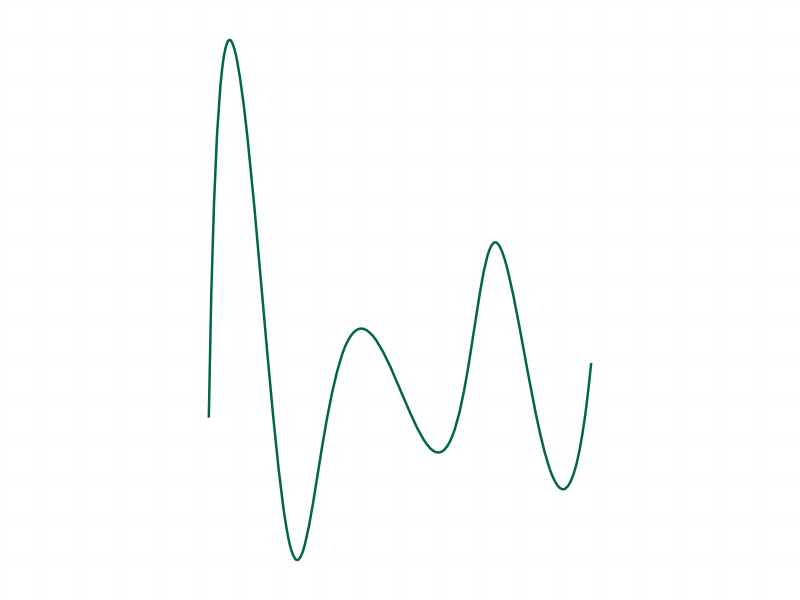
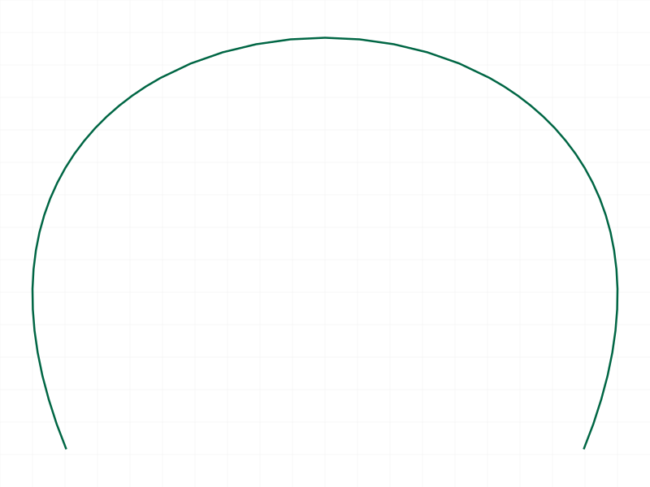
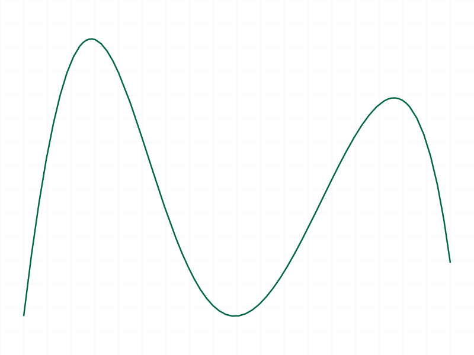
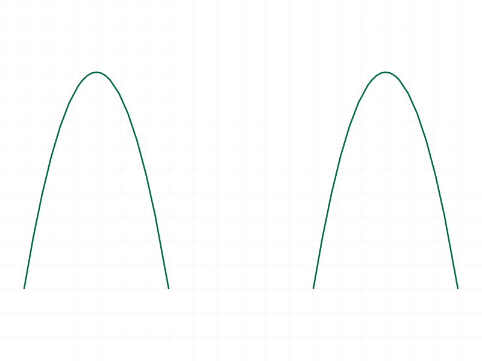
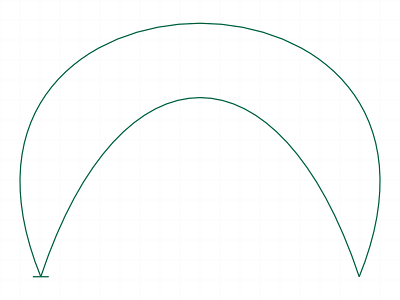

# Training: curve.interpolationCurve

**Date:** 2026-04-07

## Goal

Testing `v1.curve.interpolationCurve` — creates an interpolation curve (spline that passes through given points).

**Methods to cover:**

- `interpolationCurve` — basic usage with 3+ points
- Points count edge cases (minimum, 1 point, 2 points, many points)
- Empty points array (potential hang based on bezierCurve findings)
- Degree relationship ("needs always degree + 1 points" — what does this mean?)
- Duplicate/coincident points
- 3D (non-coplanar) points
- Batch creation (array of params)
- Return value and messages

**Questions:**

- Is degree configurable or always fixed? The docs say "needs always degree + 1 points" but don't show a degree param
- What's the minimum number of points?
- Does empty `[]` hang the server like bezierCurve?
- Does the curve actually pass through all points (interpolation vs approximation)?
- Batch creation support?

---

## 01 — basic 3 points

Script: `scripts/01-basic-3points.mjs` — ✅ Works as documented. Returns null (VOID), maxLevel 31, empty messages.

|  |
|---|

Smooth parabolic arch through [0,0,0], [5,15,0], [10,0,0]. Curve clearly passes through all 3 points.

## 02 — two points (minimum)

Script: `scripts/02-two-points.mjs` — ✅ Works. 2 points creates a straight line (degree 1 interpolation).

|  |
|---|

**Learned:** Minimum point count is 2. Produces a simple line segment. The docs say "needs always degree + 1 points" — with 2 points that means degree 1.

## 03 — single point (hang)

Script: `scripts/03-one-point.mjs` — ❌ **HANGS THE SERVER.** Timeout after 30s, worker at 100% CPU. Required `kill -9` and restart.

**📌 LLM doc:** Single point hangs the server — same behavior as `bezierCurve` with empty array. No error returned, no way to recover without killing the worker.

## 04 — 8 points (many)

Script: `scripts/04-many-points.mjs` — ✅ Works. 8 points produce a smooth wavy S-curve.

|  |
|---|

Curve passes through all 8 points. Higher point counts increase degree and produce more oscillatory behavior.

## 05 — 4 points (cubic)

Script: `scripts/05-4points-cubic.mjs` — ✅ Works. 4 points = degree 3 (cubic) interpolation.

|  |
|---|

Smooth arch. Noticeably different from bezierCurve with same points — the interpolation curve reaches higher because it passes THROUGH the interior points.

## 06 — all duplicate points (hang)

Script: `scripts/06-duplicate-points.mjs` — ❌ **HANGS THE SERVER.** 3 identical points at [10,10,0] causes timeout at 100% CPU. Required kill and restart.

**📌 LLM doc:** All-duplicate points hang the server. Unlike `bezierCurve` which silently accepts duplicate points and creates a degenerate curve, `interpolationCurve` hangs.

## 07 — 3D non-coplanar points

Script: `scripts/07-3d-points.mjs` — ✅ Works. 5 non-coplanar points with varying Z produce a valid 3D space curve.

|  |
|---|

3D curves are fully supported.

## 08 — wrong ID type

Script: `scripts/08-wrong-id.mjs` — ✅ Proper error. Both EI ID and part ID fail with code 1001, level 51: `"Provide only following id types: [\"shape\"]"`.

## 09 — batch creation

Script: `scripts/09-batch.mjs` — ✅ Works. Array of 2 param objects creates 2 separate interpolation curves in the same shape.

|  |
|---|

Returns single VOID response, maxLevel 31.

## 10 — 2D points (error)

Script: `scripts/10-2d-points.mjs` — ✅ Proper error. `[x, y]` arrays fail with code 0, level 51: `"If point is defined as array, it must have exactly 3 real values"`.

## 11 — missing points parameter

Script: `scripts/11-missing-points.mjs` — ✅ Proper error. Code 1004, level 51: `"The parameter \"points\" must be provided in the api call!"`.

## 12 — interpolation vs bezier comparison

Script: `scripts/12-compare-bezier.mjs` — ✅ Visual comparison with same 4 control points.

|  |
|---|

**Learned:** The interpolation curve (outer/taller arch) passes THROUGH all 4 points. The Bezier curve (inner/lower arch) only approximates toward the interior control points. Small cross markers at the endpoints confirm both curves share the same start/end.

**📌 LLM doc:** Key difference from bezierCurve — interpolation passes through all points, Bezier approximates.

## 13 — partial duplicate points (hang)

Script: `scripts/13-partial-duplicates.mjs` — ❌ **HANGS THE SERVER.** Even 2 consecutive duplicate points `[10,20,0], [10,20,0]` among 4 total points causes a hang at 100% CPU.

**📌 LLM doc:** CRITICAL — any duplicate consecutive points hang the server. This is stricter than bezierCurve which tolerates duplicates. Agents must ensure ALL points are distinct before calling.

## 14 — large point count (not tested)

Script: `scripts/14-large-point-count.mjs` — ⚠️ Could not test. Worker was in uninterruptible state (UE) from script 13 hang, holding port 9094. Could not restart.

**Note:** Based on 8-point success (script 04), large point counts likely work as long as no duplicate points exist.

---

## Coverage Assessment

- [x] Basic happy path (3, 4, 8 points)
- [x] Minimum points (2 = line)
- [x] Single point → HANG
- [x] Duplicate points → HANG (all-duplicate AND partial consecutive duplicates)
- [x] 3D non-coplanar points
- [x] Batch creation
- [x] Wrong ID types → proper error
- [x] 2D points → proper error
- [x] Missing params → proper error
- [x] Comparison with bezierCurve (interpolation vs approximation)
- [ ] Large point count (20) — untested due to worker crash
- [ ] Empty array `[]` — skipped to avoid certain hang (same pattern as bezierCurve)

## Answers to Questions

1. **Is degree configurable?** No — only `id` and `points` params exist. Degree = (number of points - 1) automatically.
2. **Minimum points?** 2 (produces a line). Single point hangs.
3. **Does empty `[]` hang?** Not tested directly, but highly likely based on bezierCurve behavior and the single-point hang pattern.
4. **Does the curve pass through all points?** YES — confirmed visually in comparison with bezierCurve (script 12).
5. **Batch support?** Yes — pass array of param objects.
