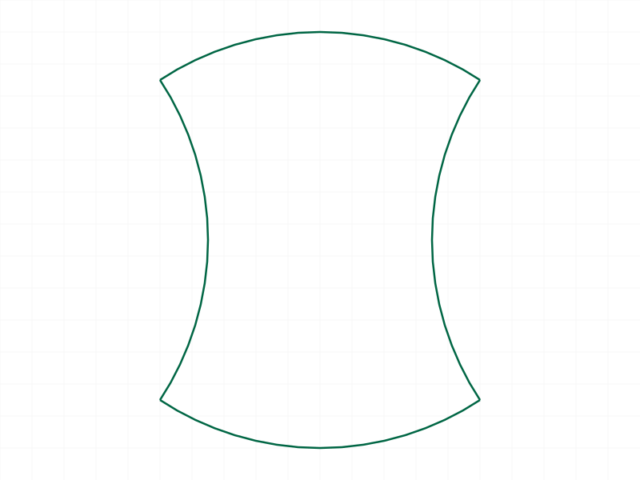
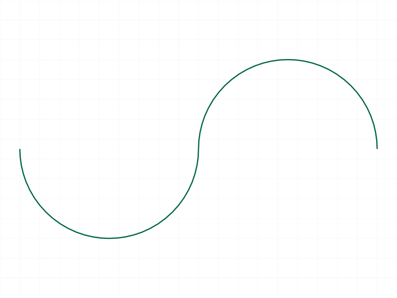
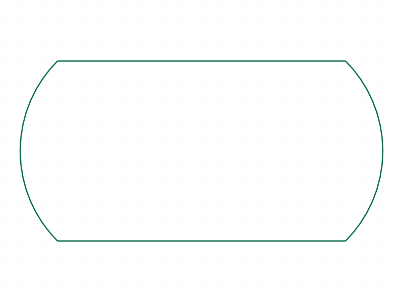
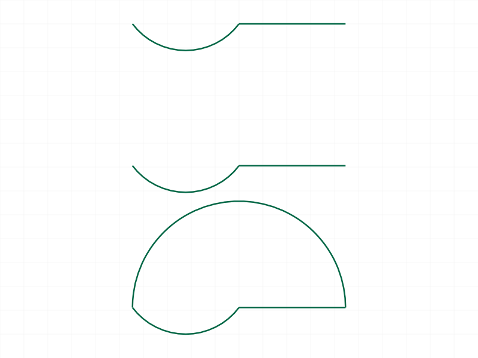
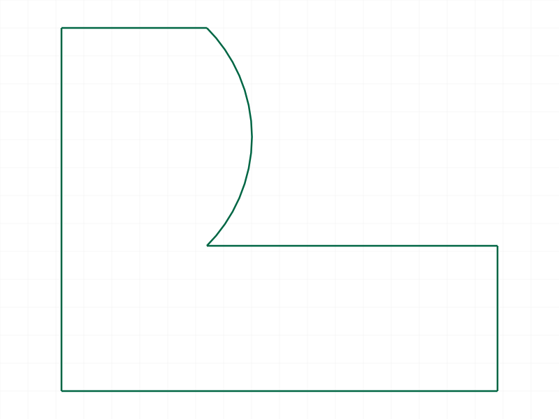
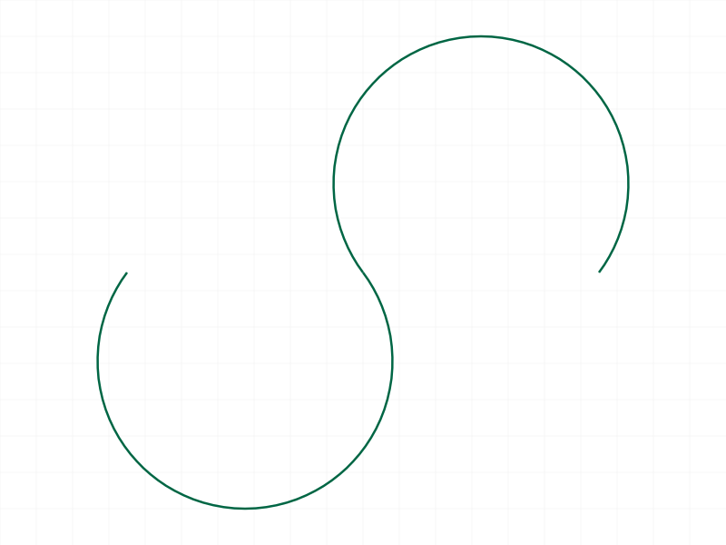

# Training: curve.polyline2d

**Date:** 2026-04-07

## Goal

Testing `v1.curve.polyline2d` — creating polylines from point arrays with optional bulge values and close flag.

**Methods to cover:**

- `polyline2d` — basic point array (open polyline)
- `polyline2d` — with `close: true` (closed polyline)
- `polyline2d` — with `bulges` array (arc segments)
- `polyline2d` — bulge values: 0=line, 1=semicircle, negative=clockwise, fractional values
- `polyline2d` — edge cases: minimum points, duplicate points, non-planar points

**Questions:**

- What happens with only 2 points? 1 point?
- What happens if bulges array length doesn't match points length?
- What happens with non-planar points (docs say "must lie in same plane")?
- Does the bulge on the last point matter for an open polyline?
- What does `close: true` do to the last bulge value?
- Can you pass an empty bulges array or omit it entirely?

---

## 01 — basic open polyline

Script: `scripts/01-basic-open.mjs` — ✅ 4 points, no bulges, no close. Result: null (VOID), maxLevel: 31. No PNG rendered (renderer may not render open straight-line polylines). OFB and STP produced.

## 02 — closed polyline

Script: `scripts/02-closed.mjs` — ✅ Same 4 points with `close: true`. Creates a closed rectangle.

|  |
|---|

## 03 — bulges with alternating arcs

Script: `scripts/03-bulges-arcs.mjs` — ✅ 5-point closed polyline (first=last) with bulges `[0.3, -0.3, 0.3, -0.3, 0]`. Produces alternating convex/concave arcs as expected. Matches docs example.

|  |
|---|

## 04 — semicircle bulges (1 and -1)

Script: `scripts/04-bulge-semicircle.mjs` — ✅ Three collinear points with bulges `[1, -1, 0]`. Bulge=1 → CCW semicircle, bulge=-1 → CW semicircle. Produces S-curve shape.

|  |
|---|

## 05 — closed polyline with 90° arc bulges

Script: `scripts/05-closed-with-bulges.mjs` — ✅ 4-point closed rectangle with `bulges[1]` and `bulges[3]` set to `tan(π/8) ≈ 0.41421`. Produces rounded rectangle with 90° arcs on 2 corners.

**Data:** `tan(π/8) = 0.41421356237309503` confirmed as the correct 90° arc bulge.

|  |
|---|

## 06 — two points (minimum viable)

Script: `scripts/06-two-points.mjs` — ✅ 2 points, no bulges. Result: null, maxLevel: 31. Works — creates a single line segment.

## 07 — one point (error)

Script: `scripts/07-one-point.mjs` — ❌ Single point. maxLevel: 51, error: "Uninitialized MemberPTR" from `CADH_CreatePolyline`. Minimum is 2 points.

**📌 LLM doc:** Minimum 2 points required. 1 point crashes with internal error.

## 08 — bulge array length mismatch (error)

Script: `scripts/08-bulge-mismatch.mjs` — ❌ Both fewer and more bulges than points fail with maxLevel 51, error: "For creating a polyline there must be as many bulges as positions". Strict length match enforced.

**📌 LLM doc:** Bulges array must be exactly the same length as points array. No partial or excess bulges allowed.

## 09 — empty bulges array

Script: `scripts/09-empty-bulges.mjs` — ✅ Passing `bulges: []` works (maxLevel 31). Treated as "no bulges" — all straight segments. Equivalent to omitting `bulges` entirely.

**📌 LLM doc:** Empty bulges array is valid and equivalent to omitting the parameter.

## 10 — last bulge behavior (open vs closed)

Script: `scripts/10-last-bulge-open.mjs` — ✅ Three tests comparing last bulge behavior:
- `bulges: [0.5, 0, 0]` (open) — arc on first segment, straight rest
- `bulges: [0.5, 0, 1]` (open) — identical to above. Last bulge=1 is **ignored** on open polyline
- `bulges: [0.5, 0, 1]` (closed) — arc on first segment, straight second, semicircle closing segment

|  |
|---|

**📌 LLM doc:** On open polylines, the last bulge value is ignored (no next point). With `close: true`, the last bulge controls the arc from the last point back to the first point.

## 11 — duplicate consecutive points

Script: `scripts/11-duplicate-points.mjs` — ✅ Duplicate point `[30, 0, 0]` in sequence. Succeeds (maxLevel 31), creates zero-length segment. Silent acceptance, no warning.

**📌 LLM doc:** Duplicate consecutive points are silently accepted (zero-length segment). No error or warning.

## 12 — non-planar points (error)

Script: `scripts/12-non-planar.mjs` — ❌ Points with varying Z values. maxLevel 51, error code 1014: "polyline2d is not planar!". Planarity is enforced as documented.

**📌 LLM doc:** All points must be coplanar. Non-planar points produce error 1014.

## 13 — realistic L-bracket profile

Script: `scripts/13-realistic-profile.mjs` — ✅ L-shaped bracket with one rounded inner corner (bulge = tan(π/8) for 90° arc). Clean closed profile suitable for extrusion.

|  |
|---|

## 14 — large bulge values (>1)

Script: `scripts/14-large-bulge.mjs` — ✅ Bulge=2 and bulge=-2 on collinear points. Creates arcs > 180° (~254°). Large bulge values are valid and produce major arcs.

**Data:** `bulge=2 → angle = 4*atan(2) ≈ 4.43 rad ≈ 253.7°`

|  |
|---|

**📌 LLM doc:** Bulge values > 1 are valid and create arcs > 180°.

---

## Coverage checklist

- [x] API called successfully (scripts 01-06, 09-11, 13-14)
- [x] Every required parameter tested (id, points)
- [x] Key optional parameters exercised (bulges, close)
- [x] Bulge value variants: 0 (line), 0.3 (small), 0.414 (90°), 1 (semicircle), 2 (>180°), negative (CW)
- [x] No update/delete method exists for polyline2d specifically (use deleteShape to remove)
- [x] Realistic usage (L-bracket profile, script 13)
- [x] Behavioral claims verified with data (error messages, maxLevel values, bulge math)

All questions from the goal section answered.
