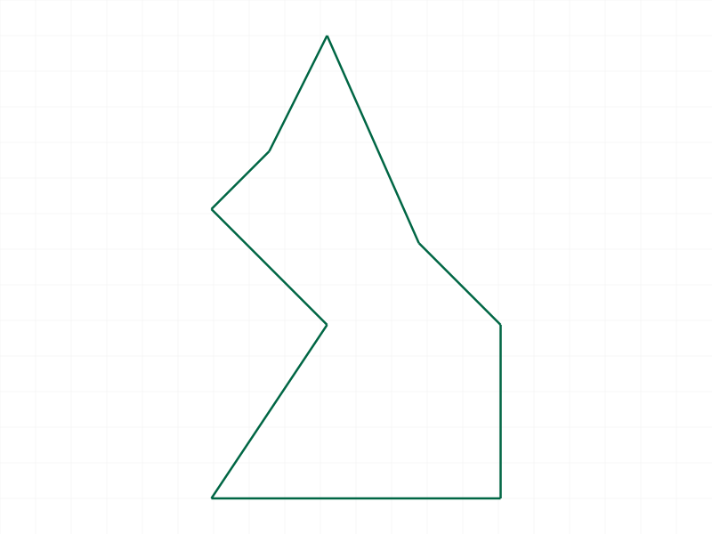
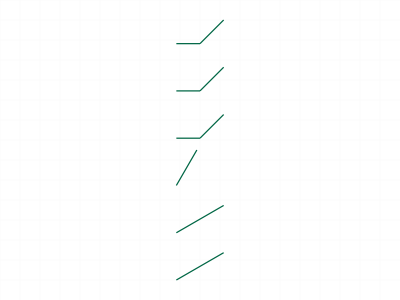
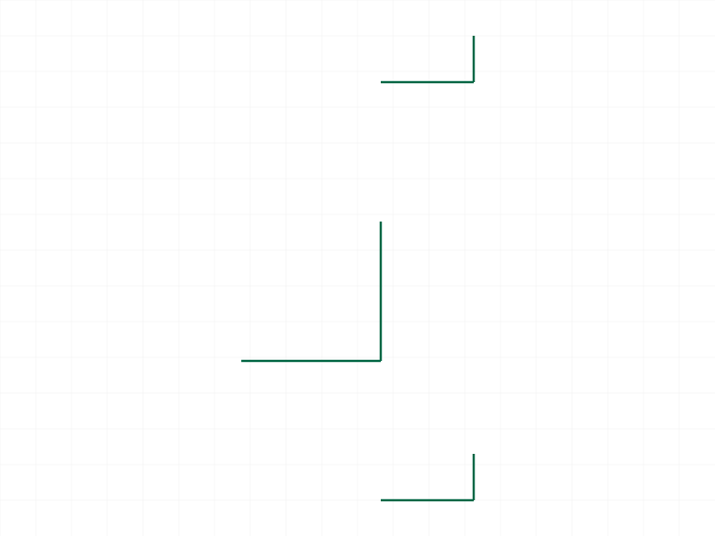
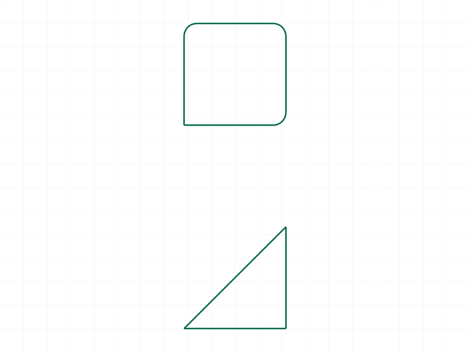
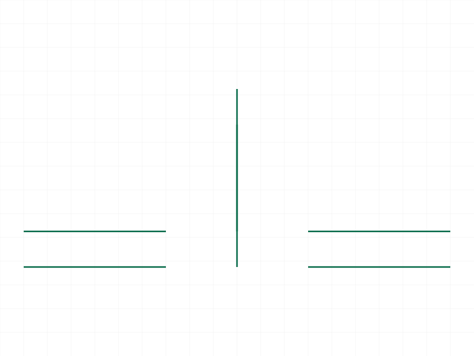
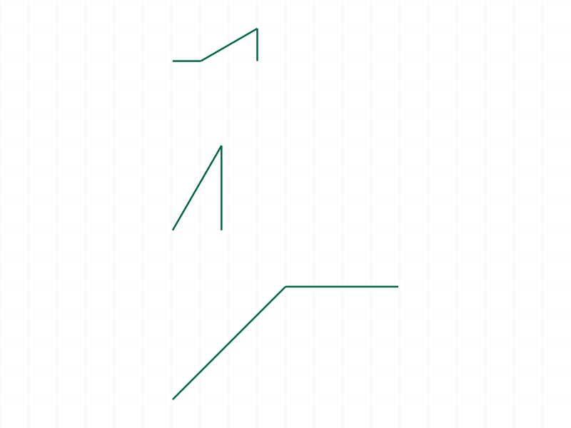
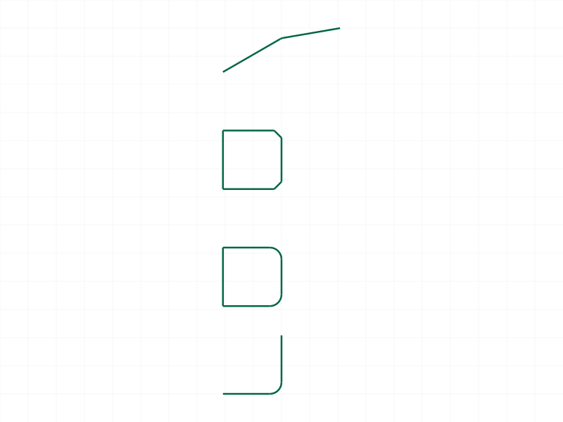
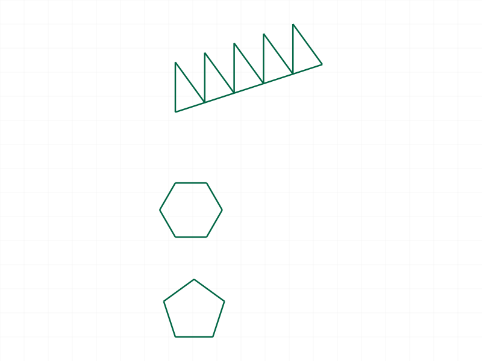
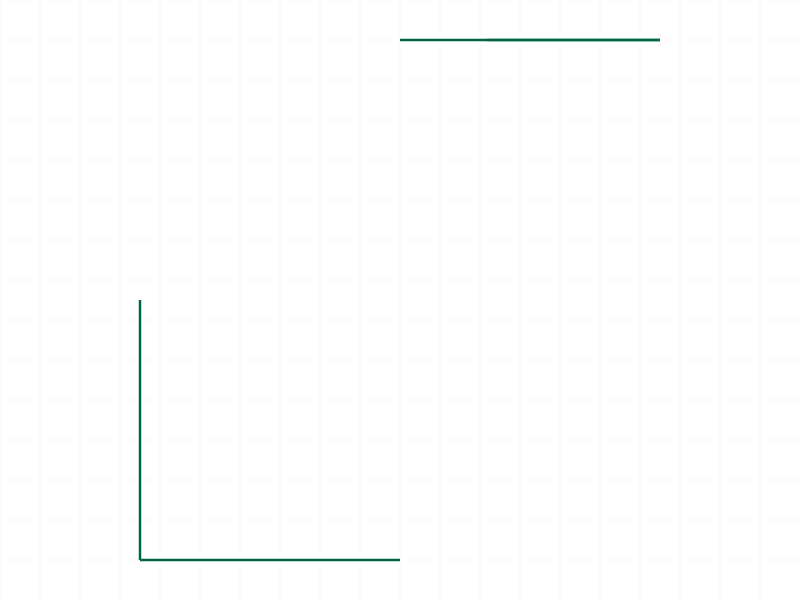

# Training: Advanced Polyline PLD Modes

**Date:** 2026-04-07

## Goal

Deep study of the PLD (PointLineDefinition) coordinate modes in `curve.advancedPolyline`. The prior session (3.4 #2) tested each mode once — this session digs into edge cases, combinations, and behavioral details.

**Questions to answer:**

- Does `l/ar` work from the first segment (no "previous direction" reference)?
- What is the implicit "previous direction" for the first `ar` segment?
- Can you freely mix all PLD modes within a single polyline?
- What happens with `l: 0`? What about `a` without `l`?
- What happens with `xr: 0, yr: 0` (zero relative movement)?
- Do movement+angle combos (`xa+a`, `yr+ar`, etc.) behave correctly with obtuse/acute angles?
- What invalid PLD combinations produce errors vs silent behavior?
- Does the PLD support z-coordinates or is it strictly 2D?
- How does `ar` accumulate direction through multiple relative turns?
- Can `close: true` interact with the last segment being `l/ar` mode?
- What error messages appear for underspecified PLDs (e.g., `{ l: 10 }` with no angle)?

---

## 01 — ar from first segment

Script: `scripts/01-ar-from-first-segment.mjs` — ✅ `l/ar` works from the first segment. maxLevel 31, no errors. Created 3 shapes: ar=0 from start, absolute-angle reference, and ar chain with multiple 45° turns.

## 02 — ar direction tracking

Script: `scripts/02-ar-direction-tracking.mjs` — ✅ `ar` accumulates direction correctly. Built a square using 4 turns of PI/2 (closed), an equivalent absolute-angle square, and a regular octagon with 8 turns of PI/4. All maxLevel 31.

## 03 — l:0, invalid/underspecified PLDs

Script: `scripts/03-l-zero-and-invalid.mjs` — Multiple edge cases tested:

- **`l: 0`** → maxLevel 31, accepted. Creates a degenerate zero-length segment (no visible geometry but no error).
- **`a` without `l`** → ERROR (51): `"Not enough data in PointLineDefinition!"`
- **`l` without `a` or `ar`** → ERROR (51): `"'l' must not be used without either 'a' or 'ar' in PointLineDefinition!"`
- **empty PLD `{}`** → ERROR (51): `"The object \"pld\" is empty!"`
- **`xr: 0, yr: 0`** → maxLevel 31, accepted. Zero relative movement creates a degenerate point (no visible segment).

**📌 LLM doc:** Document all underspecified PLD error messages. `l: 0` and `xr:0,yr:0` are silent degeneracies, not errors.

## 04 — mixed modes in one polyline

Script: `scripts/04-mixed-modes-in-one-polyline.mjs` — ✅ All modes mixed freely in a single closed polyline: absolute, relative, l/a, l/ar, absolute jump, mixed xa/yr, mixed xa+yr, yr+a. maxLevel 31.

|  |
|---|

**📌 LLM doc:** All PLD modes can be freely mixed within a single polyline.

## 05 — movement+angle combos detail

Script: `scripts/05-movement-angle-combos-detail.mjs` — ✅ All 6 movement+angle combinations tested: `xa+a`, `xr+a`, `yr+a`, `ya+ar`, `yr+ar`, `xa+ar`. All maxLevel 31.

|  |
|---|

## 06 — ar without prior direction

Script: `scripts/06-ar-without-prior-direction.mjs` — ✅ `ar` works as the first segment (after start point). All variants (ar=0, ar=PI/2, ar=PI) accepted. maxLevel 31.

|  |
|---|

## 07 — z-coordinates

Script: `scripts/07-z-coordinates.mjs` — ✅ Both `z` and `za` fields silently ignored. maxLevel 31 for both. The PLD system is strictly 2D — extra fields don't cause errors but have no effect.

**📌 LLM doc:** PLD is strictly 2D. Extra z/za fields are silently ignored.

## 08 — close with angle modes

Script: `scripts/08-close-with-angle-modes.mjs` — Mixed results:

- **close after l/ar** → maxLevel 31. Works correctly.
- **close with ar + radius on vertices** → maxLevel 31. Fillets applied at each l/ar corner.
- **close with first-point radius on a perfect square** → ERROR (51): `"Can't create a fillet between parallel lines!"` — because the last l/ar segment returns exactly to the start point, making the closing segment zero-length (parallel to adjacent edges).

|  |
|---|

**📌 LLM doc:** When using close:true with l/ar and the path already returns exactly to origin, the closing segment is zero-length → fillet on first point fails with "parallel lines" error. Don't use `r` on first point when the path already closes geometrically.

## 09 — overspecified PLDs

Script: `scripts/09-conflicting-overspecified.mjs` — All overspecified combinations produce clear errors:

- **`xa` + `xr`** → `"Both 'xa' and 'xr' must not be specified for the same point"`
- **`ya` + `yr`** → `"Both 'ya' and 'yr' must not be specified for the same point"`
- **`l` + `xa`/`ya`** → `"'l' must be used without 'xa' / 'xr' / 'ya' / 'yr'"`
- **`a` + `ar`** → `"Both 'a' and 'ar' must not be specified for the same point"`

**📌 LLM doc:** Document all overspecification errors. The PLD system validates conflicts and gives specific error messages.

## 10 — impossible movement+angle combos

Script: `scripts/10-movement-angle-impossible.mjs` — Interesting behavior:

- **`ya: 50, a: 0`** (horizontal angle, need to reach y=50) → ERROR: `"Angle must not be too close (<1e-6) to 0 or PI if 'xa' / 'xr' is undefined"`
- **`xa: 50, a: PI/2`** (vertical angle, need to reach x=50) → ERROR: `"Angle must not be too close (<1e-6) to PI/2 or 3PI/2 if 'ya' / 'yr' is undefined"`
- **`yr: 30, a: -PI/4`** (angle points down-right but yr=30 up) → maxLevel 31, **accepted**. System computes negative length internally to satisfy the constraint.
- **`yr: -20, a: PI/2`** (straight up but yr=-20 down) → maxLevel 31, **accepted**. Likely produces a negative-length segment.

**📌 LLM doc:** Movement+angle combos only error when the angle makes the missing coordinate axis *impossible to compute* (division by zero — angle exactly parallel to the constrained axis). Other geometrically contradictory cases produce negative-length segments silently.

## 11 — ar default direction verification

Script: `scripts/11-ar-default-direction-verify.mjs` — ✅ Visual confirmation that `ar` defaults to east (positive X, 0 radians) when there's no prior segment. Pairs of shapes (ar=N vs a=N for N=0, PI/2, PI) produce identical lines.

|  |
|---|

**📌 LLM doc:** When `ar` is used as the first segment after the start point, the implicit "previous direction" is east (0 radians). `ar` behaves identically to `a` in this position.

## 12 — movement+angle computed length verification

Script: `scripts/12-movement-angle-computed-length.mjs` — ✅ Verified geometrically: `xa: 40, a: PI/4` correctly reaches (40, 40); `yr: 30, a: PI/3` correctly computes dx; `xr: 20, ar: PI/6` from east correctly computes dy. All maxLevel 31.

|  |
|---|

## 13 — radius/chamfer with angle modes

Script: `scripts/13-radius-with-angle-modes.mjs` — ✅ Radius and chamfer work correctly on vertices defined by l/a, l/ar, and movement+angle modes. All maxLevel 31.

|  |
|---|

## 14 — regular polygons (practical test)

Script: `scripts/14-regular-polygons.mjs` — ✅ Pentagon (5 sides, ar=2π/5), hexagon (6 sides, ar=2π/6), and 5-point star (alternating sharp/wide ar turns) all produced correctly. Demonstrates `ar` accumulation for real-world use.

|  |
|---|

## 15 — negative length

Script: `scripts/15-negative-length.mjs` — ✅ Negative `l` values are accepted (maxLevel 31) and reverse the segment direction. `l: -30, a: 0` goes west instead of east. `l: -20, ar: 0` backtracks along the current direction.

|  |
|---|

**📌 LLM doc:** Negative `l` is accepted and reverses direction. Useful for backtracking.
