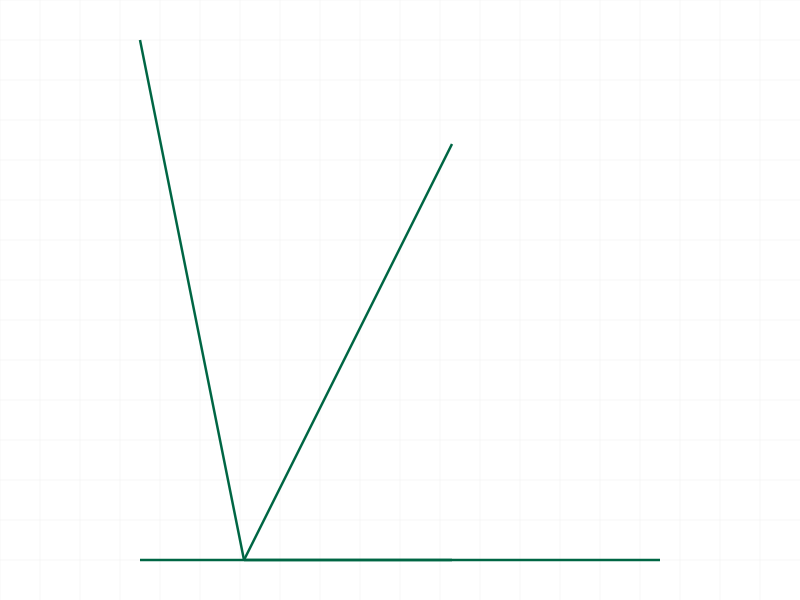
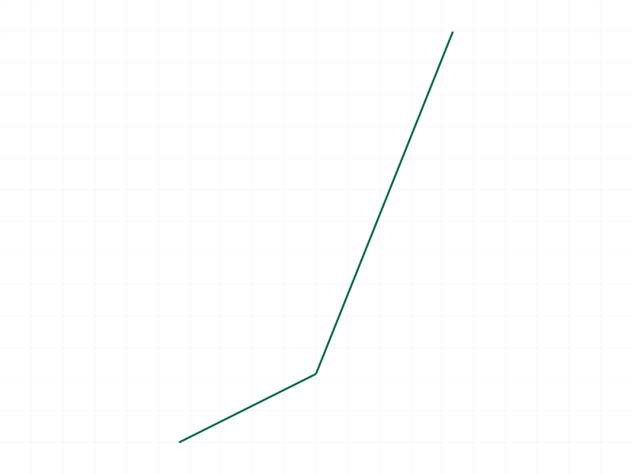
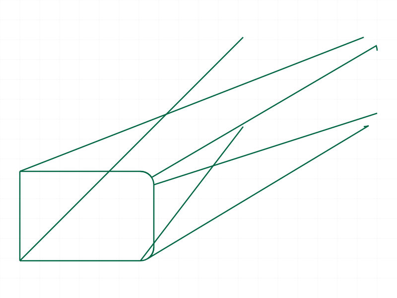

# Training: curve.translateShape

**Date:** 2026-04-07

## Goal

Testing `v1.curve.translateShape` — translates a shape by a vector in part coordinates.

**Methods to cover:**

- `translateShape` — basic translation along each axis
- `translateShape` — combined X+Y+Z translation
- `translateShape` — zero vector (noop)
- `translateShape` — negative values
- `translateShape` — multiple sequential translations (cumulative?)
- `translateShape` — translation of shape with multiple curves
- `translateShape` — error cases (invalid ID, missing params)

**Questions:**

- Does translation modify the shape in-place or return a new shape?
- Is the translation cumulative (relative to current position) or absolute?
- What happens with a zero vector?
- Can you translate a shape that has no curves (empty shape)?
- Does translation affect all curves in the shape?
- What does the structure tree look like after translation?

---

## 01 — basic translate X (initial failure)

Script: `scripts/01-basic-translate-x.mjs` — ❌ Error 1006 "An element of parameter `ids` has an invalid id!"

Unexpected failure. Created 4-line closed rectangle, took snapshot, then called translateShape. The error references `ids` (plural) even though we passed `id` (singular).

## 02 — try ids array

Script: `scripts/02-ids-array.mjs` — ❌ Error 1004 "parameter `id` must be provided" when using `ids` array.

Confirms the API expects `id` (singular), not `ids`. The error in 01 is misleading — the server internally maps `id` → `ids`.

## 03 — debug shape ID types

Script: `scripts/03-debug-shapeid.mjs` — ✅ translateShape works with shapeId (maxLevel 31), fails with eifId and partId (error 1001: wrong id type, requires "shape").

**Learned:** Only shape IDs are accepted. EI/part IDs give clear error 1001. The shape ID was 60 (numeric).

## 04 — translate without pre-snapshot

Script: `scripts/04-no-pre-snapshot.mjs` — ✅ maxLevel 31. Translate works when no snapshot taken before.

## 05 — snapshot invalidation test (1 line)

Script: `scripts/05-snapshot-invalidation.mjs` — ✅ All operations succeed. 1 line + snapshot + add another line + translate = works.

## 06 — closed rectangle + snapshot + translate

Script: `scripts/06-closed-rect.mjs` — ❌ Same error as 01. 4 lines + snapshot + translate = fails.

## 07 — 4 lines without snapshot

Script: `scripts/07-4lines-no-snap.mjs` — ✅ Works (maxLevel 31). Problem is snapshot, not line count.

## 08 — translate all axes + sequential

Script: `scripts/08-translate-xyz.mjs` — ✅ All axes work. Sequential translations are cumulative (3x [10,0,0] = [30,0,0] total).

|  |
|---|

**📌 LLM doc:** Translation is cumulative/relative, not absolute.

## 09 — edge cases

Script: `scripts/09-edge-cases.mjs` — Mixed results.

- Zero vector [0,0,0]: ✅ maxLevel 31 (silent noop)
- Negative values [-30,-20,-10]: ✅ works
- Empty shape (no curves): ❌ error 1006 "invalid id" — empty shapes can't be translated
- Missing `translation` param: ❌ error 1004 as expected
- Invalid shape ID (99999): ❌ error 1006 with warning
- Large values [100000,100000,100000]: ✅ works

**📌 LLM doc:** Empty shapes cannot be translated (error 1006). Zero vector is a silent noop.

## 10–11 — verify position with graphic data

Script: `scripts/11-verify-with-graphic.mjs` — ✅ Translation verified. Graphic data from translateShape response shows edge starting at [20,30,0] (original [0,0,0] + translation [20,30,0]). Snapshot confirms two distinct line positions.

|  |
|---|

**Data:** Graphic `min/max` bounding box in response: `[20,30,0]`. Edge points: `[20,30,0]` to `[10,5,0]` (partial update — graphic is incremental, not full geometry).

## 12 — multi-curve shape

Script: `scripts/12-multi-curve.mjs` — ✅ maxLevel 31. All curves in a shape (line + circle) translate together as a unit.

## 13 — snapshot + closed shape bug (broader test)

Script: `scripts/13-snapshot-closed-shape-bug.mjs` — ❌ ALL shapes fail after snapshot regardless of curve type: open 3-line, closed 4-line, and single circle all give error 1006.

## 14 — line count threshold

Script: `scripts/14-line-count-threshold.mjs` — ❌ Even 1-line shapes fail after snapshot when tested in this pattern (multiple shapes created sequentially with snapshots between).

## 15 — add-line-refreshes hypothesis

Script: `scripts/15-add-line-refreshes.mjs` — Key finding:

- snapshot → translate: ❌ FAILS
- snapshot → add line → translate: ✅ WORKS
- snapshot → setDatabaseSettings → translate: ❌ FAILS

**📌 LLM doc:** Adding a curve to a shape after a snapshot/recalc "refreshes" the internal shape state, re-enabling translateShape.

## 16 — setDatabaseSettings / save alone

Script: `scripts/16-setdb-causes-bug.mjs` — ✅ `setDatabaseSettings` alone, `save(STP)` alone, and `save(OFB)` alone do NOT cause the bug. The issue is specifically in the render pipeline.

## 17 — recalc is the root cause

Script: `scripts/17-recalc-causes-bug.mjs` — Root cause confirmed:

- `recalc` → translate: ❌ FAILS (error 1006)
- no recalc → translate: ✅ WORKS
- `recalc` → add curve → translate: ✅ WORKS (adding curve refreshes)

**📌 LLM doc:** `v1.common.recalc` invalidates shape IDs for `translateShape` (and likely other shape transform APIs). Workaround: do NOT call recalc between shape creation and shape transforms. If recalc is unavoidable, adding any curve to the shape re-validates its ID.

## 18 — realistic workflow

Script: `scripts/18-realistic-workflow.mjs` — ✅ Complex shape (rounded rectangle polyline + circle) translates correctly. Result is `null` (VOID). maxLevel 31.

|  |
|---|

**Data:** `result: null`, `resultIsNull: true`, `maxLevel: 31`, no messages.

---

## Summary of Answers

1. **In-place or new?** — In-place. Returns VOID (null). Shape ID stays the same.
2. **Cumulative or absolute?** — Cumulative (relative). Each call adds to current position.
3. **Zero vector?** — Silent noop (maxLevel 31).
4. **Empty shape?** — Error 1006. Cannot translate shapes with no curves.
5. **All curves move?** — Yes. All curves in the shape translate as a unit.
6. **Structure tree?** — Not directly examined, but graphic data confirms position change.

## Coverage Checklist

- [x] API called successfully
- [x] Required params tested (id, translation)
- [x] Translation along X, Y, Z, combined, negative, large values
- [x] Sequential translations (cumulative)
- [x] Multi-curve shapes
- [x] Edge cases: zero vector, empty shape, missing params, invalid ID
- [x] Error cases documented
- [x] Realistic workflow with complex shape
- [x] Major gotcha discovered: recalc invalidates shape IDs
