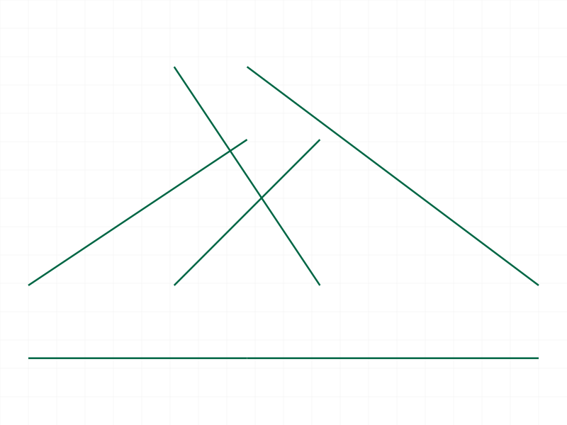
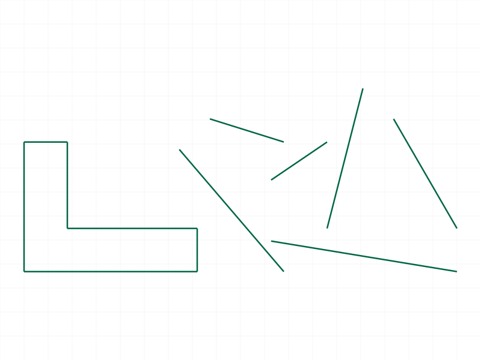
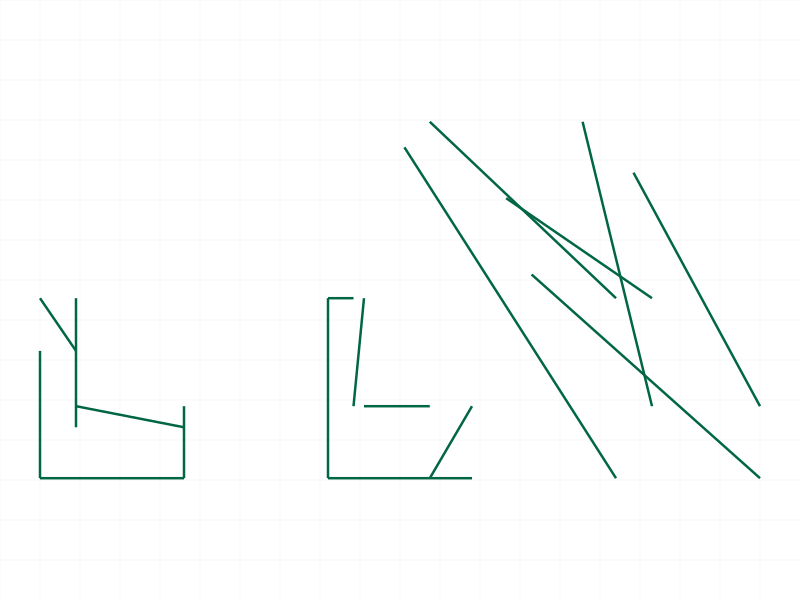
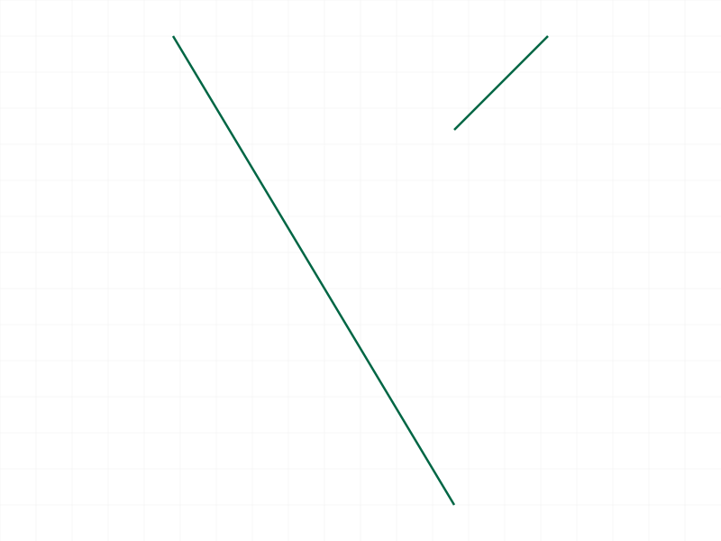
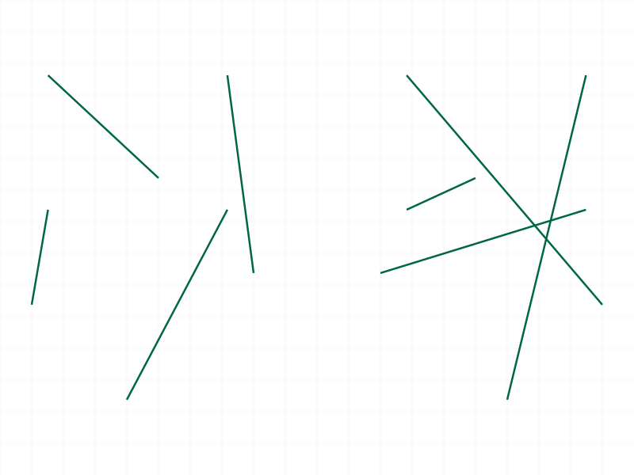
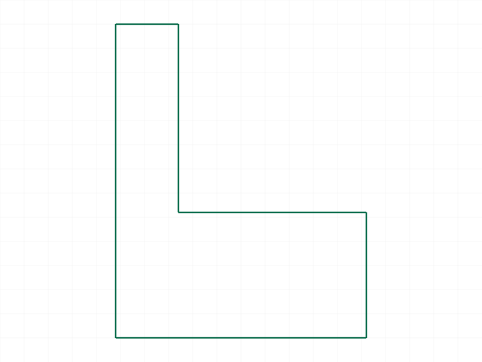
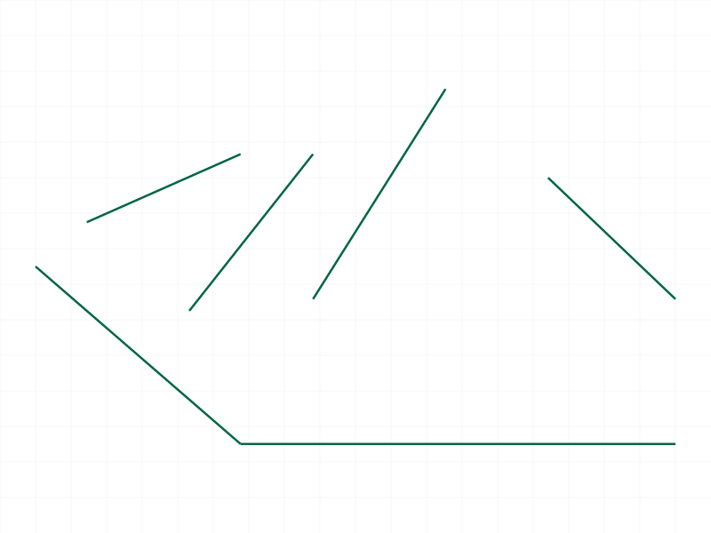
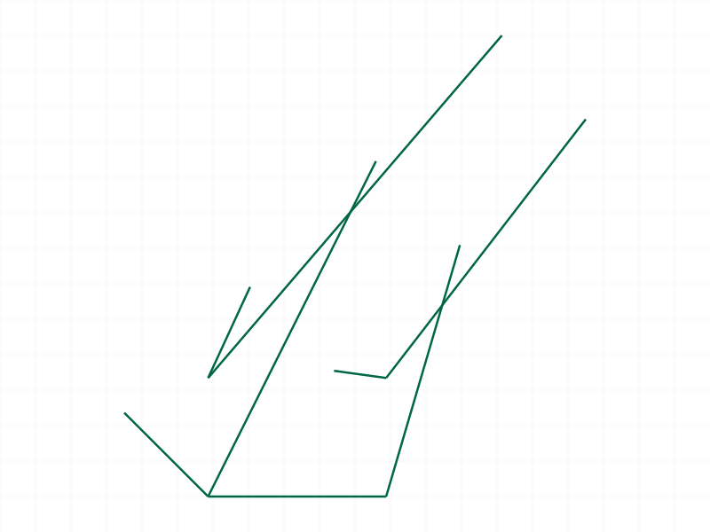
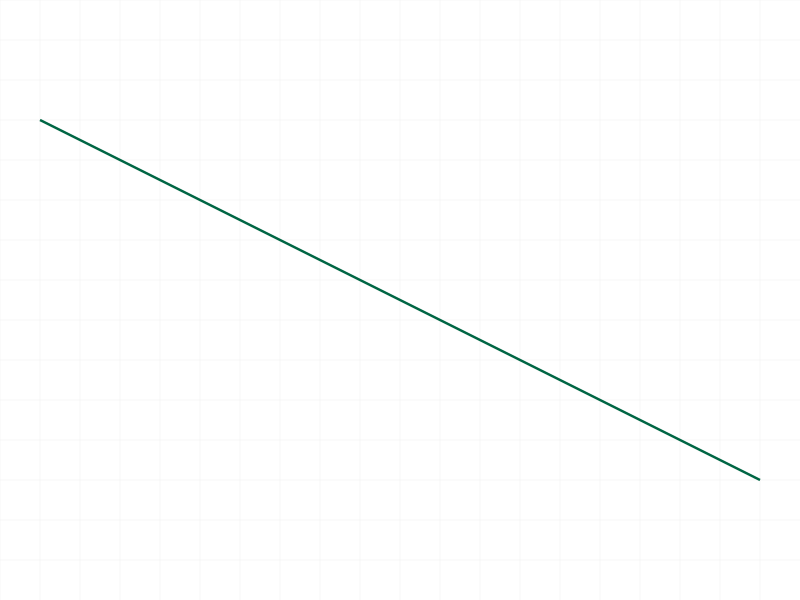
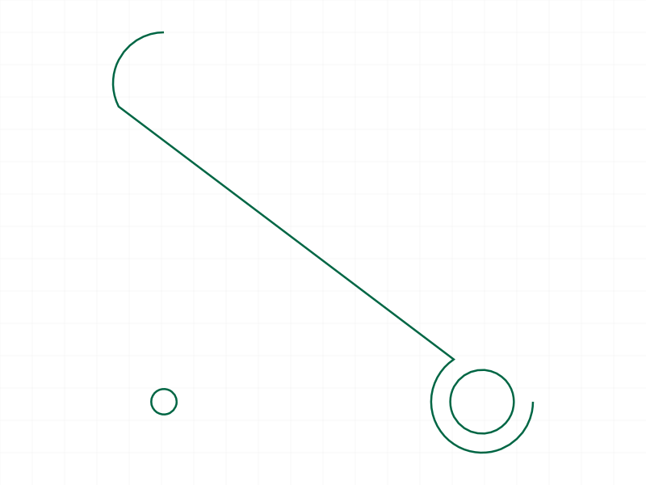

# Training: curve.rotateShape

**Date:** 2026-04-07

## Goal

Testing `v1.curve.rotateShape` — rotating shapes by Euler angle vectors.

**Methods to cover:**

- `rotateShape` — param `id` (shape ID), param `rotation` as `[rx, ry, rz]` Euler angles
- Rotation around each individual axis (X, Y, Z)
- Combined rotations (multiple axes at once)
- Multiple sequential rotations (cumulative behavior?)
- Zero rotation vector
- Large/small angle values
- Negative angles
- Full rotations (2*PI)
- Interaction with `translateShape` (translate then rotate, rotate then translate)
- Error cases: invalid ID, missing params, non-shape ID
- Rotation center: origin vs shape center

**Questions:**

- Is rotation in-place like `translateShape`? Does the shape ID remain valid?
- Are angles in radians (as the docs suggest)?
- Is rotation relative/cumulative like translateShape, or absolute?
- What order are X/Y/Z rotations applied in (rotation order matters for Euler angles)?
- Does `recalc` invalidate shape IDs for rotateShape too (like translateShape)?
- What does maxLevel look like on success?
- Is rotation around the origin or the shape's center?

---

## 01 — basic Z rotation (90°)

Script: `scripts/01-basic-z-rotation.mjs` — ✅ L-shape rotated 90° CCW around Z. First attempt failed with error 1006 because `snapshot()` was called before rotation (triggers recalc → invalidates shape ID). Fixed by rotating BEFORE any snapshot.

- result: `null` (VOID), maxLevel: 31 (info), no messages
- Same return pattern as `translateShape`

|  |
|---|

**📌 LLM doc:** Same recalc/snapshot gotcha as translateShape — do transforms BEFORE snapshots.

---

## 02 — before/after comparison (45° Z)

Script: `scripts/02-before-after-comparison.mjs` — ✅ Two shapes side by side: original L-shape (left) untouched, second L-shape (right) rotated 45° around Z. Visual confirms rotation works.

|  |
|---|

---

## 03 — each axis individually (45°)

Script: `scripts/03-each-axis.mjs` — ✅ Three L-shapes, each rotated 45° around a different axis (X, Y, Z). All succeeded with maxLevel 31.

- X rotation: rotates shape out of XY plane (visible in 2D plot as compression along one axis)
- Y rotation: same effect, different axis
- Z rotation: standard 2D rotation in the XY plane

|  |
|---|

---

## 04 — cumulative rotations

Script: `scripts/04-cumulative.mjs` — ✅ Two 45° rotations vs one 90° rotation. Both shapes were created identically, one got two sequential 45° calls, the other one 90° call. Both returned maxLevel 31.

Visual shows both shapes ended up in the same orientation — **rotation is cumulative/relative**, just like translateShape.

|  |
|---|

**📌 LLM doc:** Rotation is cumulative. Two 45° rotations = one 90° rotation.

---

## 05 — zero rotation

Script: `scripts/05-zero-rotation.mjs` — ✅ `[0, 0, 0]` is a silent noop. result: null, maxLevel: 31, no messages. Same behavior as translateShape with zero vector.

---

## 06 — negative angles

Script: `scripts/06-negative-angles.mjs` — ✅ Positive 45° and negative 45° around Z. Both succeeded with maxLevel 31. Negative angles rotate in the opposite direction (clockwise vs counterclockwise).

|  |
|---|

---

## 07 — full rotation (2π) and large angles

Script: `scripts/07-full-rotation.mjs` — ✅ Full 2π rotation and 10π rotation both succeeded with maxLevel 31. Shape returns to original position after full rotations. Large angles work without error.

|  |
|---|

---

## 08 — combined axes

Script: `scripts/08-combined-axes.mjs` — ✅ Rotation with `[π/6, 0, π/4]` (30° X + 45° Z simultaneously) succeeded with maxLevel 31.

|  |
|---|

---

## 09 — error cases

Script: `scripts/09-error-cases.mjs` — ✅ All error cases tested:

| Test | Code | Level | Message |
|------|------|-------|---------|
| Missing `rotation` | 1004 | 51 (ERROR) | "The parameter \"rotation\" must be provided in the api call!" |
| Missing `id` | 1004 | 51 (ERROR) | "The parameter \"id\" must be provided in the api call!" |
| Part ID | 1001 | 51 (ERROR) | "The parameter \"id\" has a wrong id type! Provide only following id types: [\"shape\"]" |
| EI ID | 1001 | 51 (ERROR) | Same as part ID |
| Garbage string | 0+1006 | 41+51 | Warning about string conversion + invalid id error |

**Data:** See `files/09-error-cases-error-cases.json` for full response objects.

**Learned:** Error messages are identical to translateShape errors. Note that for `id` type errors, the message says `"id"` (singular), while for invalid ID values it says `"ids"` (plural) — same internal mapping as translateShape.

**📌 LLM doc:** Document all error codes. Same patterns as translateShape.

---

## 10 — recalc invalidation

Script: `scripts/10-recalc-invalidation.mjs` — ✅ Confirmed: `common.recalc()` invalidates shape IDs for rotateShape too. After recalc, rotateShape fails with error 1006 ("An element of parameter \"ids\" has an invalid id!").

**Data:** `files/10-recalc-invalidation-recalc-response.json` — maxLevel: 51, code 1006.

**📌 LLM doc:** Same recalc invalidation behavior as translateShape. Always do shape transforms BEFORE recalc/snapshot.

---

## 11 — translate then rotate

Script: `scripts/11-translate-then-rotate.mjs` — ✅ Shape 1: just rotated 45° around Z at origin. Shape 2: translated [30, 0, 0] then rotated 45° around Z. Different results confirm rotation is around the origin, not the shape center.

|  |
|---|

**📌 LLM doc:** Rotation is around the part origin, not the shape center. Order of transforms matters.

---

## 12 — rotation center (line test)

Script: `scripts/12-rotation-center.mjs` — Line from (20, 0) to (20, 10) rotated 90° around Z. Visual shows a diagonal line, not obviously horizontal. Structure data dumped but doesn't contain easily accessible coordinate data.

|  |
|---|

---

## 13 — empty shape

Script: `scripts/13-empty-shape.mjs` — ✅ Rotating an empty shape (no curves) fails with error 1006 ("An element of parameter \"ids\" has an invalid id!"). Same behavior as translateShape.

**📌 LLM doc:** Empty shapes cannot be rotated.

---

## 14 — various curve types

Script: `scripts/14-various-curve-types.mjs` — ✅ Shape with line, circle, and advancedPolyline (with fillets), all rotated 60° around Z together. maxLevel: 31, all curve types rotated successfully as a unit.

|  |
|---|

---

## 15 — rotation center verify (graphic data)

Script: `scripts/15-rotation-center-verify.mjs` — Attempted to extract edge coordinates from graphic data after recalc. Recalc graphic returned null (empty). Inconclusive for numerical verification.

---

## 16 — rotation center (circle test, definitive)

Script: `scripts/16-circle-rotation-center.mjs` — ✅ **Definitive test.** Three shapes: tiny circle at origin (marker), medium circle at (50, 0) (reference, untouched), large circle at (50, 0) (rotated 90° Z).

Result: the large circle moved from bottom-right to upper-left — from (50, 0) to approximately (0, 50). This conclusively proves **rotation is around the origin (0, 0, 0)**, not around the shape's center.

|  |
|---|

**📌 LLM doc:** Rotation is around the origin. To rotate around a different point, translate to origin first, rotate, then translate back.

---

## Summary

| Finding | Evidence |
|---------|----------|
| Returns VOID (null), maxLevel 31 on success | Scripts 01-08 |
| Rotation is **cumulative/relative** | Script 04 |
| Rotation is around the **origin (0,0,0)** | Script 16 (circle test) |
| Angles in **radians** | All scripts (π/2 = 90° confirmed) |
| Zero rotation is silent noop | Script 05 |
| Negative angles = opposite direction | Script 06 |
| Full rotations (2π, 10π) work fine | Script 07 |
| Combined multi-axis rotation works | Script 08 |
| All curve types rotate as a unit | Script 14 |
| `recalc` invalidates shape IDs | Script 10 |
| `snapshot()` invalidates shape IDs (calls recalc internally) | Script 01 (first attempt) |
| Empty shapes cannot be rotated (error 1006) | Script 13 |
| Error patterns match translateShape exactly | Script 09 |
| Shape ID remains valid after rotation (in-place mutation) | Scripts 04, 07 (multiple sequential calls) |
