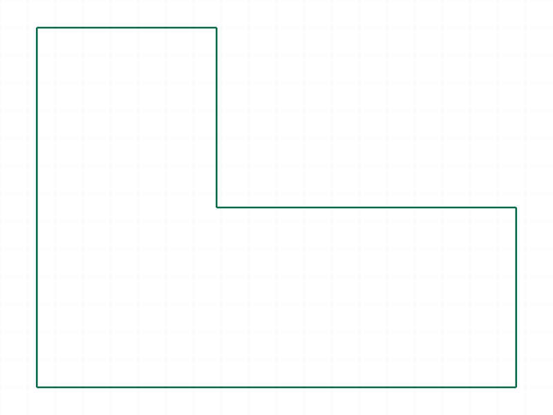
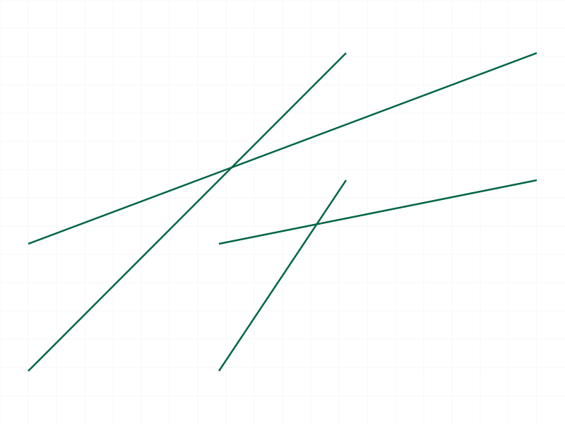
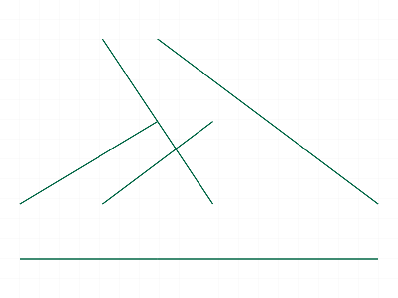
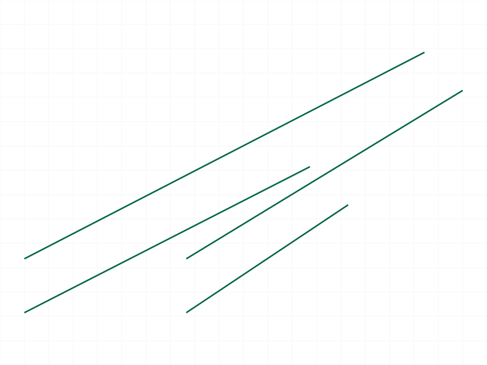
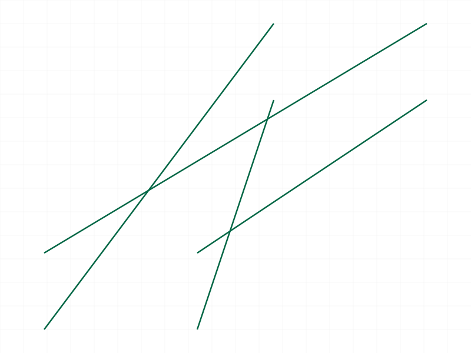
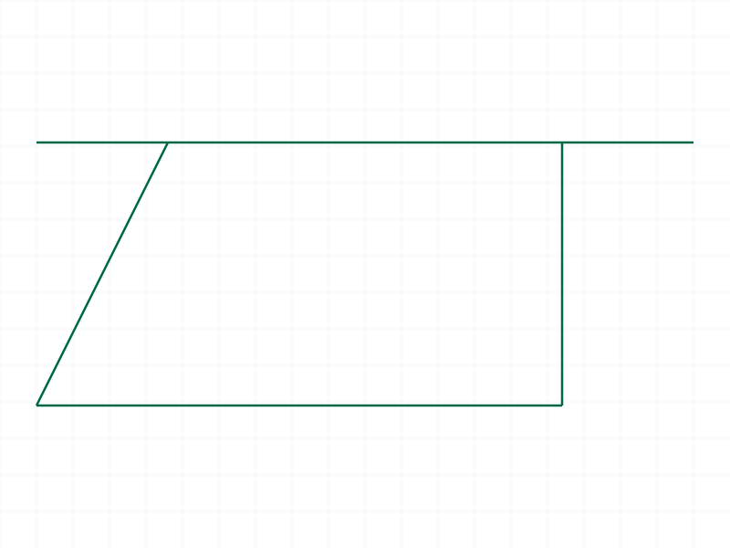
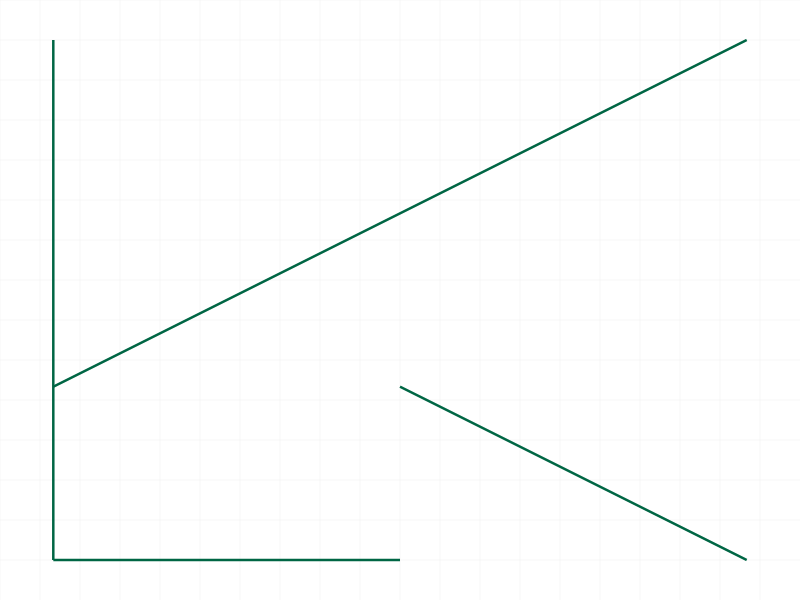
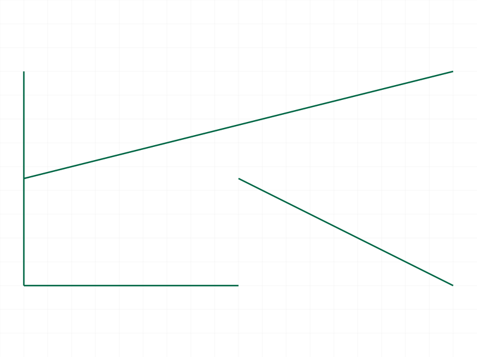

# Training: curve.transformShape

**Date:** 2026-04-07

## Goal

Testing `v1.curve.transformShape` — applies a 4x4 transformation matrix to a shape.

**Methods to cover:**

- `transformShape` — basic usage with identity matrix
- `transformShape` — pure translation via matrix (compare with `translateShape`)
- `transformShape` — pure rotation via matrix (compare with `rotateShape`)
- `transformShape` — combined translation + rotation in one matrix
- `transformShape` — cumulative behavior (multiple sequential calls)
- `transformShape` — matrix with scaling (docs say ignored)
- `transformShape` — non-orthogonal matrix (docs say must be orthogonal)
- `transformShape` — left-handed matrix (docs say not supported)
- `transformShape` — error cases: empty shape, invalid ID, missing params

**Questions:**

- Does the identity matrix produce a no-op?
- Is transform cumulative like translate/rotate?
- How exactly is scaling "ignored" — silently stripped, or error?
- What happens with a non-orthogonal matrix?
- What happens with a left-handed matrix?
- Does recalc invalidate shape IDs the same way as translate/rotate?
- Can we replicate translateShape and rotateShape results via transformShape?

---

## 01 — identity matrix

Script: `scripts/01-identity.mjs` — ✓ identity matrix is a no-op. Returns VOID, maxLevel 31, no messages.

|  |
|---|

**Note:** First attempt failed with error 1006 because `snapshot()` was called before `transformShape`, and snapshot triggers recalc which invalidates shape IDs. Same gotcha as translateShape/rotateShape. Fix: always transform BEFORE snapshots.

## 02 — pure translation via matrix

Script: `scripts/02-pure-translation.mjs` — ✓ translation via matrix works. Returns VOID, maxLevel 31. Translation `[50, 30, 0]` encoded as the 4th column of the identity matrix.

|  |
|---|

**Note:** Snapshot rendering of advancedPolyline after transforms produces scattered lines — this is a renderer limitation, not a transform bug. The graphic edge data from the response is an incremental/partial update, not the full transformed state.

## 03 — 90° rotation around Z via matrix

Script: `scripts/03-pure-rotation-z90.mjs` — ✓ rotation via matrix works. maxLevel 31. Used matrix `[[0,-1,0,0],[1,0,0,0],[0,0,1,0],[0,0,0,1]]` for 90° CCW around Z.

|  |
|---|

## 04 — combined rotation + translation

Script: `scripts/04-combined-rot-translate.mjs` — ✓ combined transform works. 45° Z rotation + (60, 20) translation in a single matrix. maxLevel 31.

|  |
|---|

## 05 — cumulative transforms

Script: `scripts/05-cumulative.mjs` — ✓ transforms are cumulative. Two sequential calls (translate +30 X, then translate +30 Y) both succeed with maxLevel 31. Behavior matches translateShape/rotateShape cumulative behavior.

|  |
|---|

## 06 — scaling matrix (doc discrepancy)

Script: `scripts/06-scaling-matrix.mjs` — **Surprising!** Docs say "Scaling part of the 4x4 matrix will be ignored" and "Matrices must be orthogonal". But a 2x X / 3x Y scaling matrix `[[2,0,0,0],[0,3,0,0],[0,0,1,0],[0,0,0,1]]` was ACCEPTED with maxLevel 31, no error, no warning.

|  |
|---|

**Data:** maxLevel=0 (no error), messages=[] (see `files/06-scaling-matrix-scaling-response.json`). Visual output shows distorted geometry — diagonal lines instead of a scaled rectangle. The scaling IS being applied (no silent ignore), but the result is geometrically corrupted.

**📌 LLM doc:** Docs are wrong on two counts: (1) scaling is NOT "ignored" — it's silently applied and produces corrupted geometry, (2) non-orthogonal matrices are NOT rejected — they're accepted without error.

## 07 — non-orthogonal (shear) matrix

Script: `scripts/07-non-orthogonal.mjs` — **Accepted without error!** Shear matrix `[[1,0.5,0,0],[0,1,0,0],[0,0,1,0],[0,0,0,1]]` returns maxLevel 31 with no messages. Visual output shows a parallelogram — the shear was actually applied.

|  |
|---|

**Data:** maxLevel=31, messages=[] (see `files/07-non-orthogonal-non-orthogonal-response.json`).

**📌 LLM doc:** Non-orthogonal matrices are silently accepted. Shear actually produces visible results. The doc claim "matrices must be orthogonal" is not enforced at the API level.

## 08 — left-handed matrix

Script: `scripts/08-left-handed.mjs` — ✓ error as documented. Mirror matrix `[[-1,0,0,0],[0,1,0,0],[0,0,1,0],[0,0,0,1]]` returns error 1014: "The provided matrix is left-handed. This is not yet supported."

**Data:** maxLevel=51, code 1014 (see `files/08-left-handed-left-handed-response.json`).

**📌 LLM doc:** Left-handed detection works correctly. Error code 1014 with clear message.

## 09 — scaling data verification

Script: `scripts/09-scaling-data.mjs` — Confirmed: scaling matrix succeeds (maxLevel 31) even with non-orthogonal 2x/3x scaling. Graphic data from recalc is null in CLI mode — can't extract coordinates this way.

|  |
|---|

Visual shows distorted lines, consistent with script 06 findings.

## 10 — shear data verification

Script: `scripts/10-shear-data.mjs` — Confirmed shear succeeds (maxLevel 31). Dumped structure tree to `files/10-shear-data-shear-structure.json` (20KB). Structure contains `CC_CurveEntity` for the shape but doesn't store per-vertex coordinates — curve geometry is at a lower level not exposed in the structure tree.

## 11 — empty shape error

Script: `scripts/11-error-empty-shape.mjs` — ✓ error 1006 "An element of parameter `ids` has an invalid id!". Same behavior as translateShape/rotateShape.

## 12 — wrong ID types

Script: `scripts/12-error-wrong-id.mjs` — ✓ Both part ID and EI ID produce error 1001: "The parameter `id` has a wrong id type! Provide only following id types: [`shape`]". Same wording as translateShape/rotateShape.

## 13 — missing parameters

Script: `scripts/13-error-missing-params.mjs` — ✓ Missing `matrix` → error 1004. Missing `id` → error 1004. Clean error messages.

## 14 — uniform scaling

Script: `scripts/14-uniform-scale.mjs` — Uniform 2x scaling `[[2,0,0,0],[0,2,0,0],[0,0,2,0],[0,0,0,1]]` also accepted (maxLevel 31). Same distorted visual output.

|  |
|---|

**📌 LLM doc:** Even uniform scaling is not handled correctly. Use `scaleShape` instead.

## 15 — orthogonal rotation comparison

Script: `scripts/15-rot-then-scale-comparison.mjs` — First shape's transformShape (orthogonal 45° Z rotation) succeeded (maxLevel 31). Second shape's rotateShape FAILED (maxLevel 51) — because `snapshot()` after the first transform called recalc, invalidating the second shape's ID. This confirms the cross-shape recalc invalidation behavior.

## 16 — recalc invalidation

Script: `scripts/16-recalc-invalidation.mjs` — ✓ Confirmed: `common.recalc()` invalidates shape IDs for transformShape. Error 1006, same as translateShape/rotateShape.

**Data:** See `files/16-recalc-invalidation-recalc-invalidation-response.json`.

## 17 — rotation around X axis

Script: `scripts/17-rotation-x.mjs` — ✓ 90° X rotation matrix succeeds (maxLevel 31). Lifts the shape out of the XY plane into XZ.

## 18 — 180° rotation

Script: `scripts/18-180-rotation.mjs` — ✓ 180° Z rotation matrix `[[-1,0,0,0],[0,-1,0,0],[0,0,1,0],[0,0,0,1]]` succeeds (maxLevel 31). This is right-handed (det=+1) so no left-handed error.

## 19 — coordinate verification via graphic edge data

Script: `scripts/19-verify-coords.mjs` — Tested with a single line (10,5,0)→(30,5,0). After translate +20x +10y, graphic edge shows `[30,15,0, 30,5,0]` — first point correctly translated, second point shows ORIGINAL position. After subsequent 90° Z rotation, graphic shows `[-15,30,0, 30,5,0]` — again first point correctly transformed, second unchanged.

**Data:** See `files/19-verify-coords-after-translate-graphic.json` and `files/19-verify-coords-after-rotate-graphic.json`.

**📌 LLM doc:** The graphic data from transformShape (and translateShape) response is an incremental/partial update — it only updates the first control point of each edge, not the full tessellation. Do NOT use response graphic data to verify transform results. Use snapshot STEP files or subsequent API queries instead.

## 20 — equivalence test

Script: `scripts/20-equivalence-test.mjs` — translateShape on shape A succeeded (maxLevel 31, full graphic with circle tessellation). transformShape on shape B failed (maxLevel 51) because the `snapshot()` after shape A triggered recalc, invalidating shape B. Confirms: **recalc invalidation affects ALL shapes in the drawing, not just the one being operated on.**

**Data:** `files/20-equivalence-test-edge-comparison.json` — shape A graphic has full circle tessellation data. Shape B graphic is null.

**📌 LLM doc:** Snapshot/recalc invalidates ALL shape IDs in the entire drawing, not just the shape you're working with.

---

## Summary of Findings

### Confirmed from docs:
- Takes `id` (shape ID) and `matrix` (4x4, row-major)
- Returns VOID, maxLevel 31 on success
- Left-handed matrices rejected (error 1014)
- Transforms are cumulative (like translateShape/rotateShape)
- In-place mutation — shape ID remains valid
- Same recalc invalidation bug as translateShape/rotateShape

### Doc discrepancies:
1. **"Scaling part of the 4x4 matrix will be ignored"** — FALSE. Scaling matrices are silently accepted but produce corrupted/distorted geometry. No error, no warning. Use `scaleShape` for scaling.
2. **"Matrices must be orthogonal"** — NOT ENFORCED. Non-orthogonal matrices (shear, scale) are accepted without error. Results are unreliable.

### Error codes:
| Code | Level | Message | Cause |
|------|-------|---------|-------|
| 1014 | ERROR | "The provided matrix is left-handed. This is not yet supported" | Matrix determinant < 0 (reflection/mirror) |
| 1006 | ERROR | "An element of parameter `ids` has an invalid id!" | Shape ID invalid (after recalc, empty shape, deleted) |
| 1001 | ERROR | "The parameter `id` has a wrong id type!" | Part ID or EI ID instead of shape ID |
| 1004 | ERROR | "The parameter `matrix` must be provided" | Missing matrix |
| 1004 | ERROR | "The parameter `id` must be provided" | Missing id |

### Graphic data caveat:
The `graphic` field in the transformShape response is an incremental/partial update. It does NOT contain the full transformed geometry. Only the first control point of each edge is updated in the response. Don't use it for coordinate verification.
