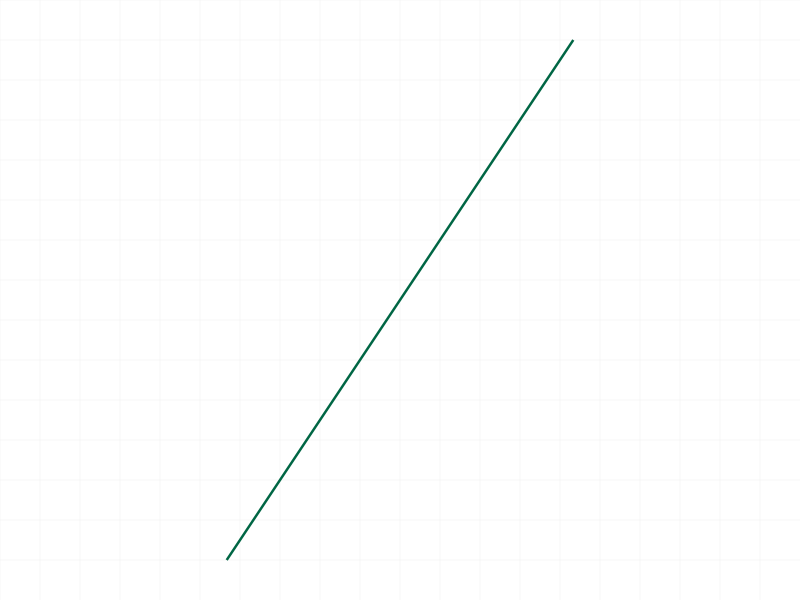
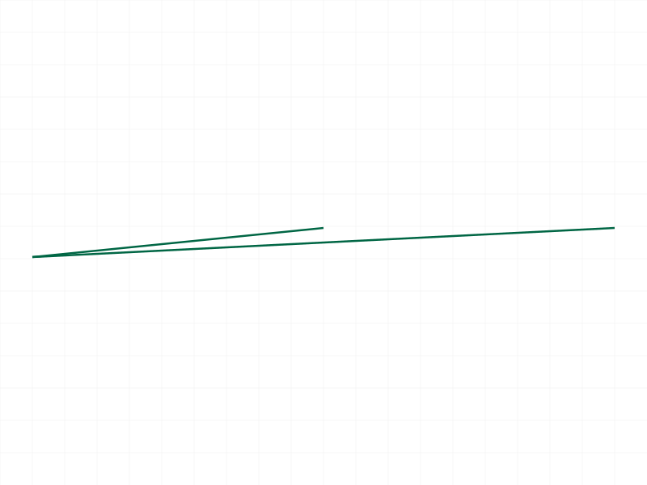
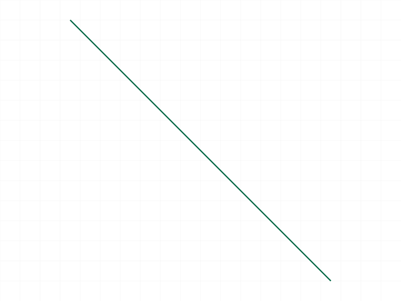
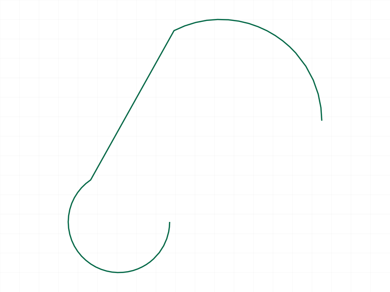
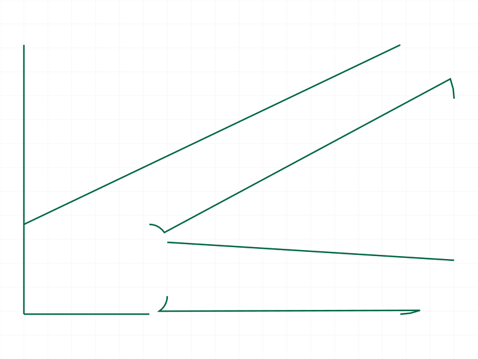
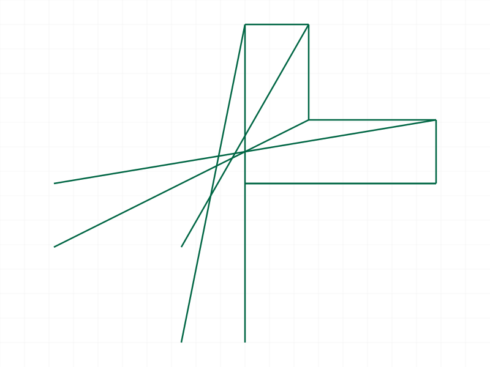

# Training: curve.scaleShape

**Date:** 2026-04-07

## Goal

Testing `v1.curve.scaleShape` — scales all curves in a shape by a factor.

**Methods to cover:**

- `scaleShape` — basic scaling with factor > 1
- `scaleShape` — shrink with factor < 1
- `scaleShape` — factor = 1.0 (identity/noop)
- `scaleShape` — factor = 0 (edge case)
- `scaleShape` — negative factor (mirror?)
- `scaleShape` — large factor
- `scaleShape` — very small factor
- `scaleShape` — cumulative (multiple calls)
- `scaleShape` — scale center (origin or shape center?)
- `scaleShape` — different curve types (lines, circles, arcs, polylines)
- `scaleShape` — empty shape
- `scaleShape` — wrong ID type (EI/part)
- `scaleShape` — missing params
- `scaleShape` — after recalc (ID invalidation bug?)
- `scaleShape` — data verification with filewrite

**Questions:**

- Is the scale center the origin (0,0,0) like rotateShape, or the shape's center?
- Does factor=0 error or silently produce degenerate geometry?
- Does negative factor work (mirror) or error?
- Is the recalc invalidation bug present here too?
- Is scaling cumulative like translate/rotate?

---

## 01-03 — basic scale up/down/identity (FAILED — recalc bug)

Scripts: `scripts/01-basic-scale-up.mjs`, `scripts/02-scale-down.mjs`, `scripts/03-factor-one.mjs` — ❌ All failed with error 1006 because `snapshot()` was called before `scaleShape()`. Snapshot triggers recalc, which invalidates shape IDs. Same bug as translateShape/rotateShape.

**Learned:** The recalc invalidation bug applies to scaleShape too. Must do ALL shape transforms BEFORE any snapshot/recalc.

## 04 — factor zero

Script: `scripts/04-factor-zero.mjs` — ✅ factor=0 accepted silently. maxLevel=31, no error messages.

**Learned:** Factor 0 is a silent operation — produces degenerate geometry (all points collapsed to origin). No error or warning.
**📌 LLM doc:** Document factor=0 behavior — silent, produces degenerate geometry.

## 05 — negative factor (FAILED — recalc bug, not factor)

Script: `scripts/05-negative-factor.mjs` — ❌ Error 1006. Initially suspected negative factor caused the error, but later confirmed it was the pre-snapshot recalc bug. See script 22 for the corrected test.

## 06 — large factor (1000x)

Script: `scripts/06-large-factor.mjs` — ✅ maxLevel=31. Factor 1000 works without issue.

## 07 — tiny factor (0.001)

Script: `scripts/07-tiny-factor.mjs` — ✅ maxLevel=31. Factor 0.001 works without issue.

## 08 — cumulative scaling

Script: `scripts/08-cumulative.mjs` — ✅ Two calls with factor 2.0 both succeed (maxLevel 31).

**Data:** After first 2x scale, `min` field in graphic: `[20, 20, 0]` (original start was (10,10), confirming origin-centered: 10×2=20). After second 2x, `min` moves to `[40, 40, 0]` (10×4=40). See `files/08-cumulative-after-first-scale-graphic.json` and `files/08-cumulative-after-second-scale-graphic.json`.

|  |
|---|

**Learned:** Scaling is cumulative. Two 2x calls = one 4x call. Consistent with translateShape/rotateShape.
**📌 LLM doc:** Scaling is cumulative — each call multiplies the current state.

## 09 — scale center test (FAILED — recalc bug)

Script: `scripts/09-scale-center.mjs` — ❌ Both shapes failed with error 51 due to pre-snapshot recalc bug. See script 26 for corrected test.

## 10 — recalc invalidation

Script: `scripts/10-recalc-invalidation.mjs` — ✅ (expected failure) Error 1006 after explicit `common.recalc()` call, confirming the bug.

**Learned:** Confirmed: `common.recalc()` invalidates shape IDs for scaleShape. Error 1006 "An element of parameter `ids` has an invalid id!"
**📌 LLM doc:** Document recalc invalidation bug — same as translateShape/rotateShape.

## 11 — empty shape

Script: `scripts/11-empty-shape.mjs` — ✅ Error 1006 on empty shape. Same as other transforms.

## 12 — wrong ID type

Script: `scripts/12-wrong-id-type.mjs` — ✅ Both EI ID and part ID give error 1001: "The parameter `id` has a wrong id type! Provide only following id types: [`shape`]"

## 13 — missing parameters

Script: `scripts/13-missing-params.mjs` — ✅ All three cases correctly error:
- Missing `factor`: error 1004 "The parameter `factor` must be provided in the api call!"
- Missing `id`: error 1004 "The parameter `id` must be provided in the api call!"
- Empty object: error 1004 (id checked first)

## 14-15, 17 — circles/polylines (FAILED — recalc bug)

Scripts had pre-snapshot calls. See scripts 24-25 for corrected versions.

## 16 — scale then translate (order matters)

Script: `scripts/16-scale-then-translate.mjs` — ✅ Both shapes rendered at different positions, confirming transform order matters with origin-centered scaling.

|  |
|---|

**Learned:** Scale-then-translate ≠ translate-then-scale (because scale is origin-centered). Two shapes at different positions confirm this.
**📌 LLM doc:** Document that transform order matters — scale is origin-centered.

## 19 — fractional factor (1/3)

Script: `scripts/19-fractional-precise.mjs` — ✅ maxLevel=31. Fractional factors work correctly.

## 20 — scale undo (5x then 0.2x) — FAILED recalc bug

Script: `scripts/20-scale-undo-invert.mjs` — ❌ Second scale failed because `snapshot('scaled-5x')` was called between the two scale calls. The intermediate snapshot invalidated the shape ID.

**Learned:** Cannot interleave snapshots between scale calls on the same shape.

## 21 — verified scale 2x (corrected)

Script: `scripts/21-scale-verify-coords.mjs` — ✅ maxLevel=31. Scale 2x on rectangle from (10,10)-(30,20) succeeded without pre-snapshot.

|  |
|---|

## 22 — negative factors (corrected, all pass!)

Script: `scripts/22-neg-factor-no-presnapshot.mjs` — ✅ ALL negative factors succeed:
- factor -1.0: maxLevel=31, no messages
- factor -2.0: maxLevel=31, no messages
- factor -0.5: maxLevel=31, no messages

**Learned:** Negative factors work! They produce a point reflection through the origin (mirror + scale). This is different from `transformShape`, which rejects left-handed matrices. `scaleShape` is the only way to do point reflections.
**📌 LLM doc:** Document negative factors — they work and produce point reflections through origin.

## 23 — scale center verification

Script: `scripts/23-scale-center-verify.mjs` — ✅ maxLevel=31. Line from (10,5) to (20,5) scaled 3x.

## 24 — circles scaled (corrected)

Script: `scripts/24-circles-no-presnapshot.mjs` — ✅ maxLevel=31. Circle and arc both scale correctly.

|  |
|---|

**Learned:** Circles scale both center position and radius. Arcs scale center, radius, and endpoints.

## 25 — polyline with fillets scaled (corrected)

Script: `scripts/25-polyline-no-presnapshot.mjs` — ✅ maxLevel=31. Polyline with fillets scales correctly — fillet radii scale proportionally.

|  |
|---|

## 26 — coordinate verification via graphic data

Script: `scripts/26-coord-dump.mjs` — ✅ Both shapes scaled 3x successfully.

**Data:** S1 (line from (10,5) to (20,5)) after 3x: incremental graphic `min` field = `[30, 15, 0]` = (10×3, 5×3). S2 (line from (0,0) to (10,0)) after 3x: `min` = `[0, 0, 0]` = (0×3, 0×3). See `files/26-coord-dump-r1-incremental-graphic.json`.

**Learned:** **Scale center is the origin (0,0,0)**, same as rotateShape. Verified numerically: coordinates are multiplied by the factor relative to origin. Shapes offset from origin move further away when scaled up.
**📌 LLM doc:** Scale center is the origin. To scale around a custom point P: translate(-P), scale, translate(+P).

## 27 — negative factor visual

Script: `scripts/27-neg-factor-visual.mjs` — ✅ maxLevel=31. Reference L-shape + target L-shape scaled by -1.

|  |
|---|

**Learned:** Factor -1.0 produces a point reflection through the origin — the L-shape is mirrored in both X and Y, appearing in the opposite quadrant. This is visually confirmed.

---

## Summary of Findings

| Question | Answer |
|----------|--------|
| Scale center? | **Origin (0,0,0)** — verified numerically |
| Factor=0? | Silent success, degenerate geometry |
| Negative factor? | Works! Point reflection through origin |
| Recalc bug? | Yes, same as translateShape/rotateShape |
| Cumulative? | Yes, each call multiplies current state |
| Return value? | VOID (null), maxLevel 31 on success |
| Curve types? | All work: lines, circles, arcs, polylines with fillets |

**Key difference from transformShape:** Negative factors are accepted by scaleShape but rejected by transformShape (left-handed matrix error 1014). scaleShape is the only way to do point reflections.
