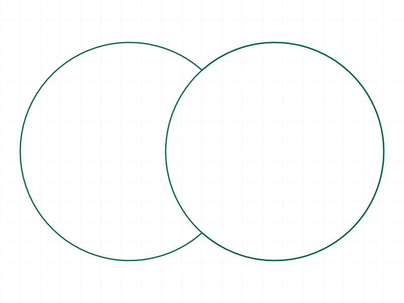
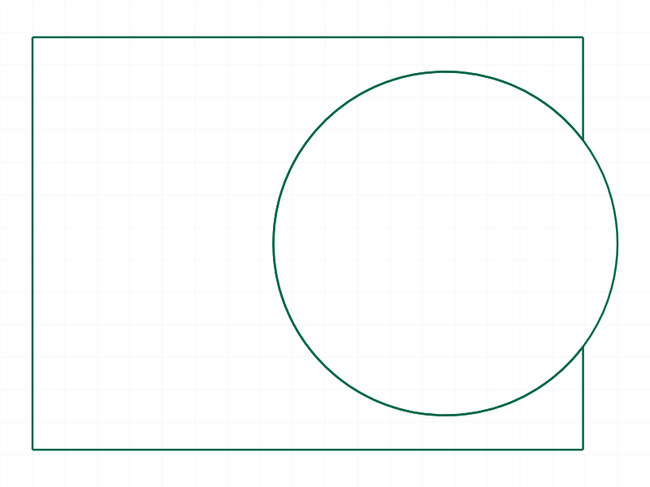
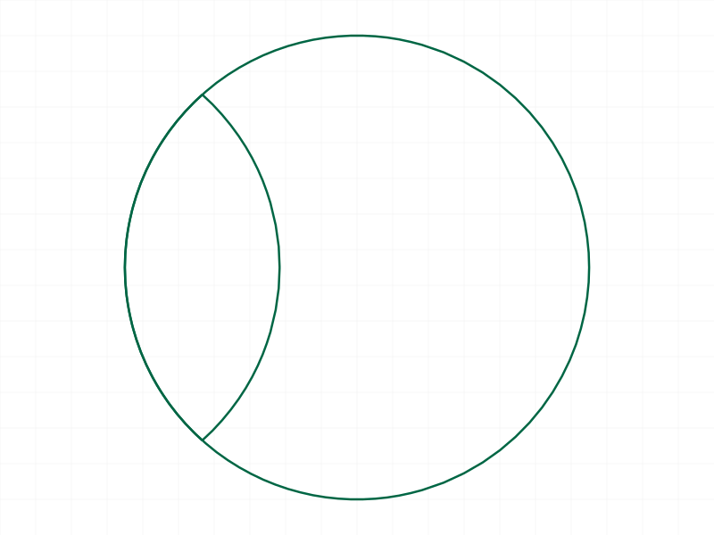
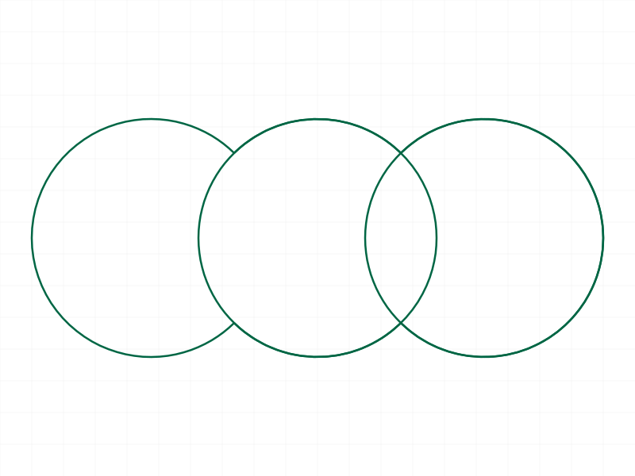

# Training: 2D Boolean Operations on Shapes

**Date:** 2026-04-07

## Goal

Testing `v1.curve.union2d`, `v1.curve.subtraction2d`, and `v1.curve.intersection2d`.

**Methods to cover:**

- `union2d` — merge two overlapping closed shapes into one
- `subtraction2d` — subtract tool shape from target shape
- `intersection2d` — keep only the overlapping region
- All three: `target`, `tool`, `keepShape` params
- All three: return value (VOID), effect on target/tool shapes

**Questions:**

- Does `target` get modified in-place? Is its shape ID still valid after the operation?
- Is the `tool` shape consumed (deleted) by default? What does `keepShape: true` do exactly?
- What happens with non-overlapping shapes?
- What happens with identical/coincident shapes?
- What happens with partially overlapping shapes?
- What does the result structure look like after each boolean?
- Can you chain booleans (union A+B, then union result+C)?
- What error messages appear for invalid inputs?
- Do these require closed shapes, or do open curves work too?

---

## 01-04 — Initial debugging: snapshot invalidation discovery

Scripts: `scripts/01-basic-union.mjs` through `scripts/04-try-approaches.mjs`

These scripts explored why union2d was failing with `NULLID not allowed` in `CADH_AddSolid`. The root cause was calling `snapshot()` between shape creation and the boolean operation.

## 05 — Snapshot effect confirmation

Script: `scripts/05-snapshot-effect.mjs` — Confirmed the root cause.

**Data:**
- Test A (no snapshot before union): maxLevel=31 (SUCCESS)
- Test B (snapshot before union): maxLevel=51 (NULLID error)
- Test C (snapshot + openFeature before union): maxLevel=51 (NULLID error, openFeature did NOT help)

**Learned:** `snapshot()` (which triggers rendering/geometry evaluation) invalidates the internal solid body references that 2D booleans depend on. Once invalidated, `openFeature` cannot recover them. **All 2D boolean operations must be performed BEFORE any snapshot call.**

**📌 LLM doc:** Critical gotcha — snapshot before boolean causes NULLID error.

---

## 06 — Basic union2d (success)

Script: `scripts/06-union-basic.mjs` — ✅ Two overlapping circles, union succeeds.

|  |
|---|

**Data:** result=null, maxLevel=31, messages=[]. Target shape (s1) still exists with same geoIds [61]. Tool shape (s2) completely removed from structure tree.

**📌 LLM doc:** union2d returns VOID. Target modified in-place. Tool consumed by default.

---

## 07 — union2d with keepShape: true

Script: `scripts/07-union-keepshape.mjs` — ✅ keepShape preserves the tool.

**Data:** maxLevel=31. s1 exists with geoIds [61]. s2 also still exists with geoIds [64]. Both shapes preserved in the structure tree.

**📌 LLM doc:** keepShape: true preserves the tool shape.

---

## 08 — Basic subtraction2d

Script: `scripts/08-subtraction-basic.mjs` — ✅ Rectangle minus circle.

|  |
|---|

**Data:** maxLevel=31. Target (s1) exists with geoIds [61]. Tool (s2) consumed (not in tree).

---

## 09 — Basic intersection2d

Script: `scripts/09-intersection-basic.mjs` — ✅ Intersection of two circles.

|  |
|---|

**Data:** maxLevel=31. Target (s1) exists with geoIds [61]. Tool (s2) consumed.

The snapshot shows the lens-shaped overlap between the two circles — correct intersection result.

---

## 10 — Non-overlapping shapes

Script: `scripts/10-non-overlapping.mjs` — ✅ All three operations succeed with no overlap.

**Data:**
- union non-overlap: maxLevel=31, s1 exists, s2 consumed
- subtraction non-overlap: maxLevel=31
- intersection non-overlap: maxLevel=31

**Learned:** Non-overlapping shapes don't produce errors. The operations succeed silently. For union, both sets of curves end up in the target. For subtraction, target is unchanged (nothing to subtract). For intersection, the target likely ends up empty (no overlap).

**📌 LLM doc:** Non-overlapping shapes are not an error — operations succeed silently.

---

## 11 — Chained booleans

Script: `scripts/11-chained-union.mjs` — ✅ Three circles, chained union.

|  |
|---|

**Data:** First union maxLevel=31. Second union (result + s3) maxLevel=31. Final: s1 exists, s2 and s3 both consumed.

**📌 LLM doc:** Chaining works — union into target, then union again into same target.

---

## 12 — keepShape with subtraction and intersection

Script: `scripts/12-sub-keepshape.mjs` — ✅ keepShape works for all three operations.

**Data:**
- subtraction keepShape: maxLevel=31. s1 exists, s2 exists with geoIds [64].
- intersection keepShape: maxLevel=31. s3 exists, s4 exists with geoIds [80].

---

## 13 — Self-boolean (target = tool)

Script: `scripts/13-same-target-tool.mjs` — ❌ **CRASHES THE WORKER** (100% CPU hang).

Passing the same shape ID as both target and tool causes an infinite loop in the ClassCAD kernel. Worker had to be killed with `kill -9`. This is a server bug, not a user error, but agents must never do this.

**📌 LLM doc:** CRITICAL — never pass same ID as target and tool. Crashes the worker.

---

## 14 — Cross-EI boolean

Script: `scripts/14-cross-ei.mjs` — ✅ Shapes from different entity injections can be boolean'd.

**Data:** maxLevel=31. Target (s1 in eif1) exists. Tool (s2 in eif2) consumed.

**📌 LLM doc:** Cross-EI booleans work — shapes don't need to be in the same EI.

---

## 15 — Open curves

Script: `scripts/15-open-curves.mjs` — ❌ Both tests fail.

**Data:**
- Open target + closed tool: maxLevel=51, "Could not create plane with 3D curves"
- Closed target + open tool (single line): maxLevel=51, same error

**📌 LLM doc:** Both shapes must contain closed curves. Open curves fail.

---

## 16 — Different planes

Script: `scripts/16-different-planes.mjs` — ❌ Shapes in different planes fail.

**Data:** maxLevel=51, "Boolean operation failed with error 1001". XY-plane rectangle vs XZ-plane rectangle.

**📌 LLM doc:** Shapes must be coplanar. Different planes produce error 1001.

---

## 17 — Error cases

Script: `scripts/17-error-cases.mjs` — Error messages documented.

**Data:**
- Missing tool: "The parameter \"tool\" must be provided in the api call!" (maxLevel=51)
- Missing target: "The parameter \"target\" must be provided in the api call!" (maxLevel=51)
- Invalid ID: "ToId()/TOID() didn't get an existing or valid id." (maxLevel=51)
- Empty shape as tool: NULLID error (shapes must contain curves)
- Empty shape as target: NULLID error (same)

**📌 LLM doc:** Document error messages.

---

## 18 — Geometry data verification

Script: `scripts/18-geometry-data.mjs` — ✅ Verified structural and geometric changes with filewrite data.

**Data (union of two rectangles):**
- Before: EI children=[60,63]. s1 geoIds=[61], s2 geoIds=[64].
- After: EI children=[60]. s1 geoIds=[61]. s2 gone. s1 bounding box expanded from [0,0,0]-[60,40,0] to [0,0,0]-[90,60,0].

**Data (subtraction rect minus circle):**
- maxLevel=31. s3 geoIds after sub: [75]. Geometry ID changed from original — the subtraction creates a new geometry entity.

**Learned:** Bounding box changes confirm the geometry is actually modified. The subtraction may create a new geometry ID (s3 had geoId 75 after, different from original).

---

## Coverage Checklist

- [x] union2d called successfully
- [x] subtraction2d called successfully
- [x] intersection2d called successfully
- [x] target param tested (shape IDs only, EI/part IDs rejected)
- [x] tool param tested
- [x] keepShape param tested (true and false/default) for all three operations
- [x] Return value verified (VOID/null)
- [x] Tool consumption verified (default: consumed; keepShape: preserved)
- [x] Cross-EI booleans tested
- [x] Chained booleans tested
- [x] Non-overlapping shapes tested
- [x] Self-boolean tested (crashes worker — documented)
- [x] Open curves tested (fail — documented)
- [x] Different planes tested (fail — documented)
- [x] Error cases: missing params, invalid IDs, empty shapes
- [x] Geometry data verification with filewrite (bounding box changes)
- [x] Snapshot invalidation bug discovered and documented
