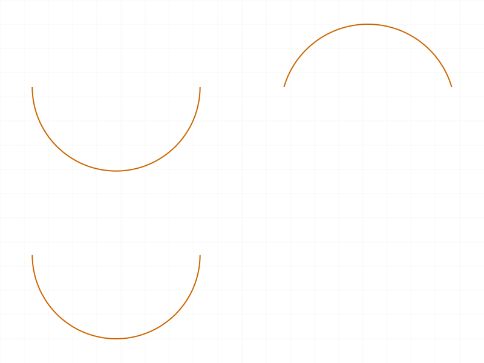
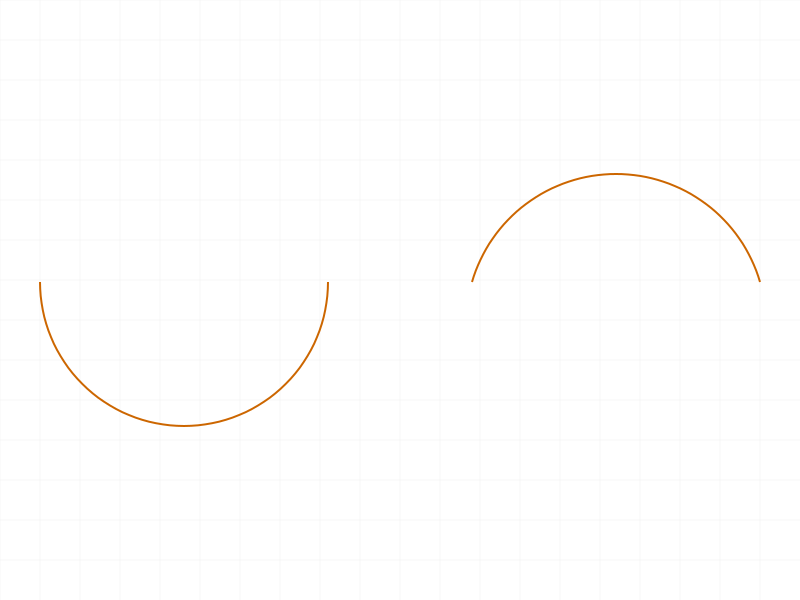
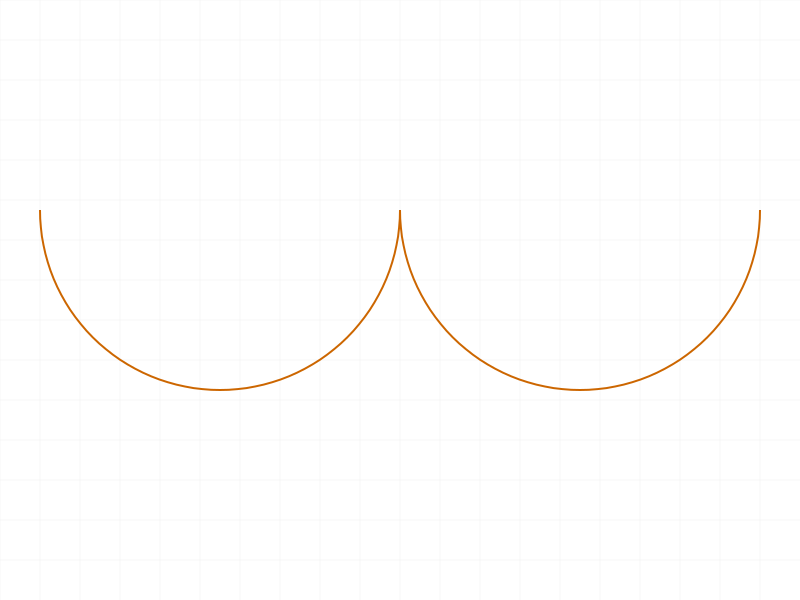
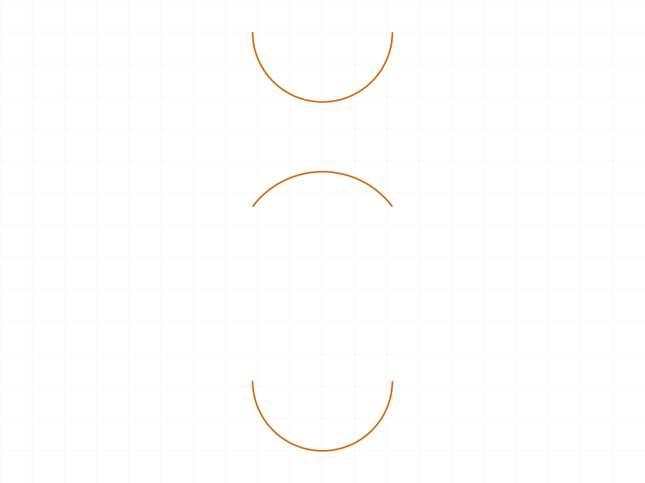
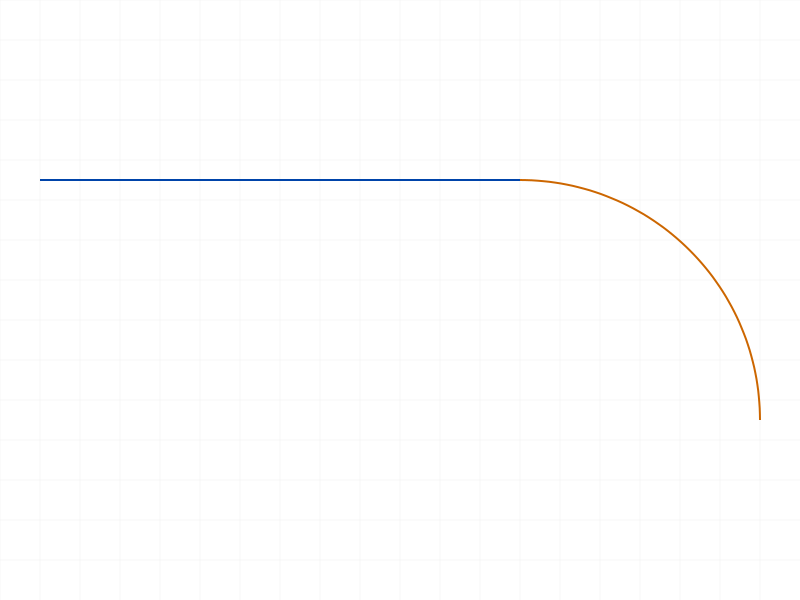
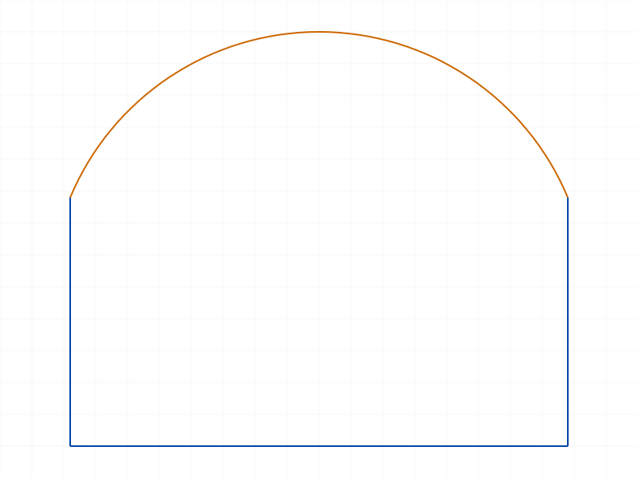

# Training: sketch.arcBy3Points

**Date:** 2026-04-08

## Goal

Testing `v1.sketch.arcBy3Points` — creates arcs defined by start, mid, and end positions within a sketch context.

**Methods to cover:**

- `arcBy3Points` — basic arc creation with startPos, midPos, endPos
- `genFixation` (default TRUE) — auto-generates fixation constraints at origin
- `genIncidence` (default TRUE) — auto-generates coincidence constraints with existing points
- `genTangency` (default FALSE) — auto-generates tangency constraints with existing curves
- Batch creation (array of param objects)
- Return value: `id | VOID | Array<id|VOID>`

**Questions:**

- Does midPos have to be exactly on the arc, or just define curvature direction?
- What structure does the arc create? (CC_CircularArc like arcByCenter?)
- Does getPositions work on 3-point arcs?
- Does getPoints return startId, endId, centerId (same as arcByCenter)?
- How does updateGeometry work for 3-point arcs? (`arcsByCenter` array or different key?)
- What happens with collinear/coincident points?
- Non-zero Z behavior?
- genTangency: what does it actually generate when adjacent to a line?

---

## 01 — basic arc

Script: `scripts/01-basic-arc.mjs` — ✅ Arc created. result=58, maxLevel=31, no messages.

|  |
|---|

---

## 02 — structure inspection

Script: `scripts/02-structure-inspect.mjs` — ✅ Key findings about internal representation.

**Data:**
- arcId: 58
- `getPoints(arcId)`: `{centerId: 61, endId: 59, startId: 60}` — server computes center from 3 points
- `getPositions(arcId)`: `{centerPos: {x:20, y:0, z:0}, endPos: {x:40, y:0, z:0}, startPos: {x:0, y:0, z:0}}` — works directly on arc ID
- `getGeometry(skId)`: arc appears in `arcs` array, not `lines` or `points`

**Learned:** arcBy3Points internally creates the same `CC_CircularArc` structure as arcByCenter. The server computes the center from the 3 input points. `getPositions` and `getPoints` work identically to arcByCenter arcs.

**📌 LLM doc:** Document that arcBy3Points arcs are identical to arcByCenter arcs internally — same structure, same query methods, same center point computed.

---

## 03 — genFixation

Script: `scripts/03-genFixation.mjs` — ✅ genFixation behavior matches arcByCenter.

**Data:** Counted `CC_2DFixationConstraint` across structures:
- Sketch 1 (origin, genFix=TRUE): 1 fixation ("Auto_Fix")
- Sketch 2 (origin, genFix=FALSE): 0 new fixation (cumulative still 1 from sketch 1)
- Sketch 3 (off-origin, genFix=TRUE): 0 new fixation

**Learned:** Same behavior as arcByCenter — genFixation only generates `CC_2DFixationConstraint` when a point is at origin. genFixation=FALSE suppresses it.

---

## 04 — genIncidence

Script: `scripts/04-genIncidence.mjs` — ✅ genIncidence generates `CC_2DCoincidentConstraint` when arc endpoint matches existing geometry.

**Data:** Compared constraint counts between genIncidence=TRUE and genIncidence=FALSE. genIncidence=FALSE sketch had no additional coincident constraints vs the line's own constraints.

**Learned:** Same behavior as arcByCenter — auto-generates coincident constraints when arc endpoint exactly matches an existing point.

---

## 05 — genTangency (non-tangent arc)

Script: `scripts/05-genTangency.mjs` — No tangency constraint generated. Arc starts at line endpoint (40,0,0) and goes to (80,0,0) through (60,20,0). Structure shows only coincident, fixation, horizontal constraints — no `CC_2DTangentSketchConstraint`.

**Learned:** genTangency=TRUE does NOT automatically generate tangency constraints for all adjacent geometry.

---

## 06 — genTangency (tangent arc to line)

Script: `scripts/06-genTangency-tangent-arc.mjs` — ✅ No tangency constraint generated, even though the arc is geometrically tangent to the line at the junction point.

**Data:** Structure has only coincident + fixation + horizontal constraints, no tangent.

---

## 07 — collinear and coincident points

Script: `scripts/07-collinear-coincident.mjs` — All degenerate cases fail with ERROR (maxLevel=51, code=0): `"Invalid arc parameters"`.

**Data (see `files/07-collinear-coincident-edge-cases.json`):**
- Collinear (all on X axis): ERROR
- start==mid: ERROR
- start==end: ERROR
- all three identical: ERROR

**Learned:** All degenerate point configurations produce the same "Invalid arc parameters" error. Unlike `curve.arcBy3Points` which gave a German internal error, `sketch.arcBy3Points` gives a cleaner English error message.

**📌 LLM doc:** Document all degenerate cases and the error message.

---

## 08 — non-zero Z

Script: `scripts/08-nonzero-z.mjs` — ✅ Expected error: `"startPos which is a 2D point, must have a z-value of 0!"` (code 1014, level 51).

---

## 09 — batch creation

Script: `scripts/09-batch-creation.mjs` — ✅ Batch of 3 arcs. result=[58, 65, 70], maxLevel=31, no messages.

|  |
|---|

---

## 10 — batch mixed valid/invalid

Script: `scripts/10-batch-mixed-errors.mjs` — ✅ Batch of 3 (valid, collinear/invalid, valid). result=[58, null, 70], maxLevel=51.

|  |
|---|

**Learned:** Error isolation works — valid entries succeed, invalid entry returns null. maxLevel reflects the worst error across all entries.

**📌 LLM doc:** Document batch error isolation behavior.

---

## 11 — genTangency (arc-to-arc)

Script: `scripts/11-genTangency-arc-to-arc.mjs` — ✅ **Tangency constraint IS generated** when genTangency=TRUE and the arc is adjacent to another arc.

|  |
|---|

**Data:** Structure contains `CC_2DTangentSketchConstraint` + `CC_2DCoincidentConstraint` + `CC_2DFixationConstraint`.

**Learned:** genTangency generates tangent constraints for arc-to-arc adjacency but NOT for line-to-arc adjacency (tested in 05, 06, 16).

**📌 LLM doc:** Document that genTangency only generates tangency for curve-to-curve (arc-to-arc), not line-to-arc.

---

## 12 — midPos role

Script: `scripts/12-midpos-role.mjs` — ✅ midPos fully defines the arc circle.

**Data (see `files/12-midpos-role-midpos-comparison.json`):**
- Arc1: start(0,0), mid(20,20), end(40,0) → center(20, 0) — semicircle upward
- Arc2: start(0,-50), mid(20,-40), end(40,-50) → center(20, -65) — shallow arc upward
- Arc3: start(0,-100), mid(20,-120), end(40,-100) → center(20, -100) — arc downward

|  |
|---|

**Learned:** midPos must be exactly on the desired arc. It defines which of the possible circles passing through start and end is used, and which of the two arcs on that circle. Different midPos values with same start/end produce completely different arcs.

**📌 LLM doc:** Document midPos behavior — controls both the circle AND which arc (major/minor).

---

## 13 — updateGeometry

Script: `scripts/13-updateGeometry.mjs` — ✅ Update works via `arcsByCenter` key.

|  |  |
|---|---|

**Data (see `files/13-updateGeometry-update-result.json`):**
- Before: centerPos(20,0,0), startPos(0,0,0), endPos(40,0,0)
- After: centerPos(0,0,0), startPos(-20,0,0), endPos(20,0,0)
- Update result: null, maxLevel=31

**Learned:** arcBy3Points arcs are updated using the **`arcsByCenter` key** in updateGeometry (not a hypothetical `arcsByCenter` variant). All three positions (startPos, endPos, centerPos) are required for update.

**📌 LLM doc:** Document that update uses `arcsByCenter` key regardless of creation method.

---

## 14 — delete

Script: `scripts/14-delete.mjs` — ✅ Delete via `deleteObject` works.

|  |
|---|

**Data:**
- Before: arcs=[58, 65]
- After delete(arc1): arcs=[65]
- getPositions(deleted): null, maxLevel=51

---

## 15 — missing parameters

Script: `scripts/15-missing-params.mjs` — ✅ All four cases produce error 1004 with specific parameter name.

**Data:**
- No midPos: `"The parameter \"midPos\" must be provided in the api call!"`
- No startPos: `"The parameter \"startPos\" must be provided in the api call!"`
- No endPos: `"The parameter \"endPos\" must be provided in the api call!"`
- No id: `"The parameter \"id\" must be provided in the api call!"`

---

## 16 — genTangency (exact tangent to line)

Script: `scripts/16-genTangency-line-exact.mjs` — ✅ Still no tangency constraint generated, even with an arc that is geometrically tangent to the line at the junction.

|  |
|---|

**Data:** Structure has coincident + fixation + horizontal constraints only. Confirms: genTangency does NOT generate tangent constraints for line-to-arc adjacency.

---

## 17 — wrong ID type

Script: `scripts/17-wrong-id-type.mjs` — ✅ Expected error 1001: `"Provide only following id types: [\"sketch\"]"`.

---

## 18 — realistic profile

Script: `scripts/18-realistic-profile.mjs` — ✅ Closed profile with 3 lines + 1 arc. sketch.sketchRegion succeeds with mixed geometry.

|  |  |
|---|---|

**Data:** geometry = `{arcs: [74], circles: [], lines: [58, 66, 81], points: []}`, regionId = 93.

**Learned:** arcBy3Points integrates seamlessly with lines for closed profiles. sketchRegion accepts mixed arcs + lines.

---

## Coverage Checklist

- [x] API called successfully (01, 02, 09)
- [x] Every required parameter tested (startPos, midPos, endPos, id) — scripts 01, 15
- [x] Optional params: genFixation (03), genIncidence (04), genTangency (05, 06, 11, 16)
- [x] No enum values (API has none)
- [x] updateGeometry tested (13)
- [x] deleteObject tested (14)
- [x] Realistic usage with sketchRegion (18)
- [x] Edge cases: collinear/coincident (07), non-zero Z (08), wrong ID (17)
- [x] Batch creation and error isolation (09, 10)
- [x] Behavioral claims verified with data (filewrite dumps, logged values)
