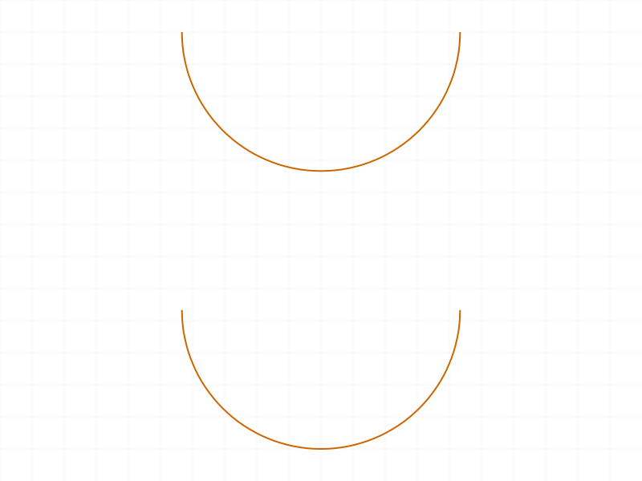
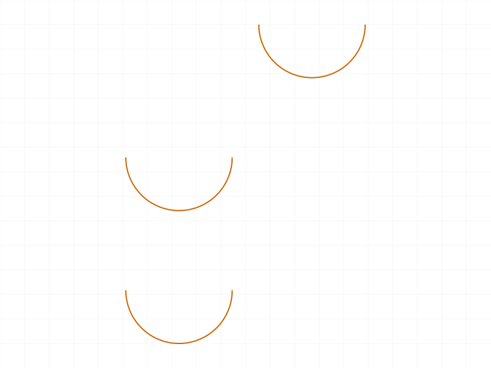
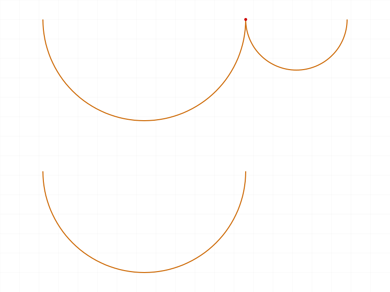
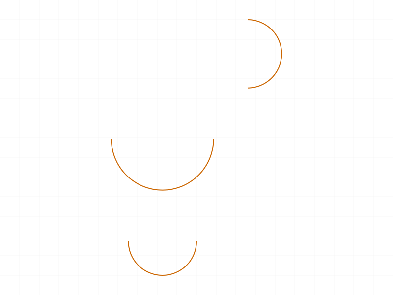
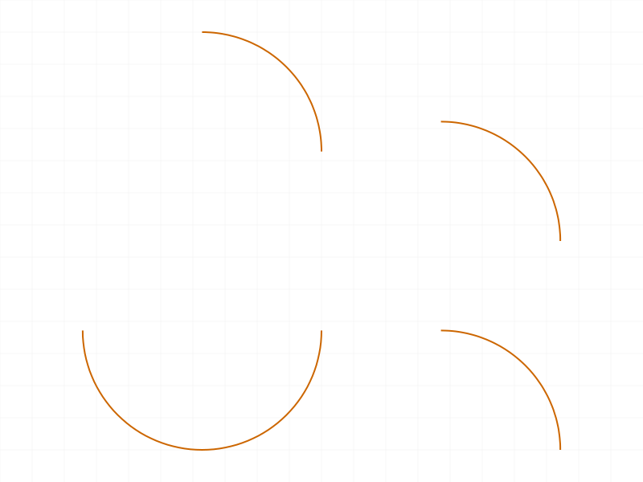
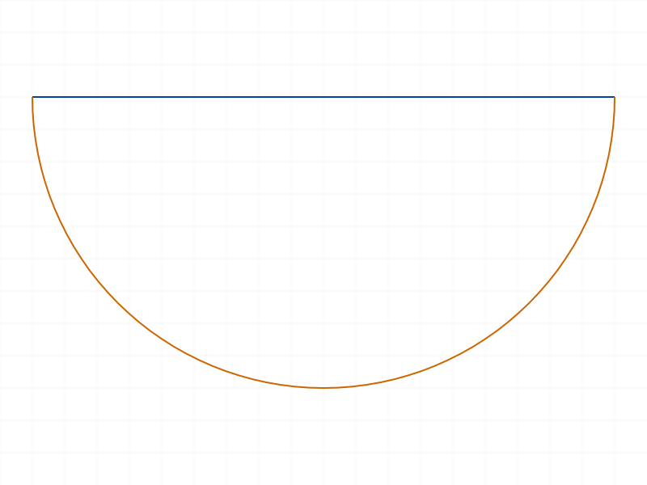
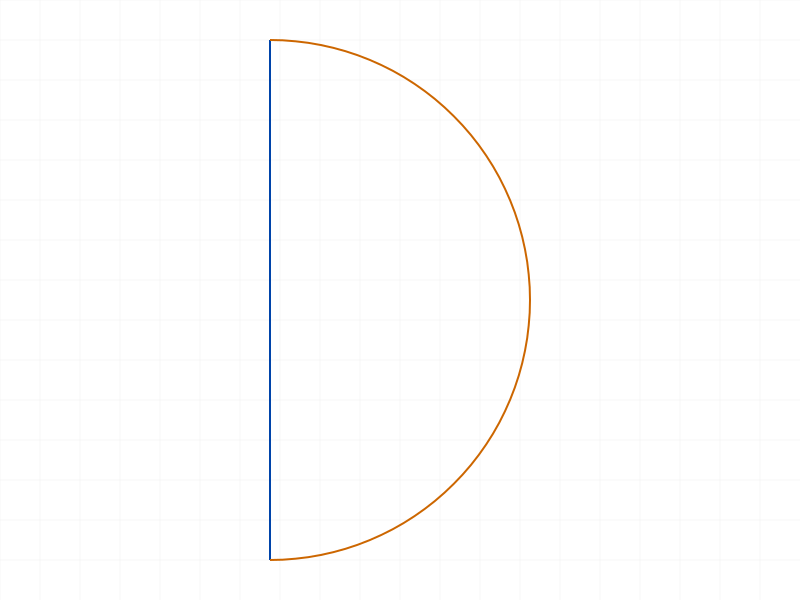

# Training: sketch.arcByCenter

**Date:** 2026-04-08

## Goal

Testing `v1.sketch.arcByCenter` and updating arcs via `v1.sketch.updateGeometry` (arcsByCenter array).

**Methods to cover:**

- `arcByCenter` — basic arc creation with startPos, endPos, centerPos
- `arcByCenter` params: isClockwise (TRUE/FALSE), genFixation, genIncidence
- Batch creation (array of param objects)
- `updateGeometry` with `arcsByCenter` array — move/reshape arcs after creation
- `getPoints` / `getPositions` on arc IDs — querying arc data
- `getGeometry` — arcs appear in which array?
- `deleteObject` on arc IDs

**Questions:**

- What structure nodes does an arc create? How many IDs consumed?
- Does `getPositions` work on arc IDs directly (or fail like circles)?
- What does `getPoints` return for an arc (startId, endId, centerId)?
- Does isClockwise=FALSE reverse the arc direction or produce a different arc?
- What happens with degenerate cases (start==end, zero-radius, collinear points)?
- Does genFixation only trigger at origin like other sketch geometry?
- Does genIncidence detect overlapping endpoints with existing geometry?

---

## 01 — Basic arc creation

Script: `scripts/01-basic-arc.mjs` — ✅ Arc created successfully with default params.

|  |
|---|

**Data:** arcId=58, maxLevel=31 (info), no messages. `getPoints` returns `{centerId: 61, endId: 59, startId: 60}`. `getPositions` works directly on arc ID — returns `{startPos, endPos, centerPos}` as xyz objects. Arc appears in `getGeometry.arcs` array.

**Learned:** Unlike circles, `getPositions` works directly on arc IDs — no two-step workaround needed. `getPoints` returns three point IDs: `startId`, `endId`, `centerId`.

**📌 LLM doc:** `getPositions` works on arcs (unlike circles). Document `getPoints` return shape.

---

## 02 — isClockwise comparison

Script: `scripts/02-clockwise-false.mjs` — ✅ Both CW (default) and CCW arcs created.

|  |
|---|

**Data:** CW arc (id=58) and CCW arc (id=65) both succeed with maxLevel=31. Positions stored are the input points in both cases. The visual difference: CW goes one way, CCW goes the other. Note minor floating-point noise on CCW centerPos x-coordinate (2.84e-15 instead of 0).

**Learned:** `isClockwise` controls arc direction. Default is TRUE (clockwise). The same start/center/end points with CW vs CCW produce complementary arcs (together they'd form a full circle).

**📌 LLM doc:** Document isClockwise behavior — CW and CCW produce complementary arcs.

---

## 03 — genFixation behavior

Script: `scripts/03-genFixation.mjs` — ✅ genFixation only triggers at origin.

|  |
|---|

**Data:** Structure inspection shows exactly one `CC_2DFixationConstraint` (`Auto_Fix`, id=63) — only for the arc whose center is at origin. Arc off-origin (genFix=default) got none. Arc with genFix=false got none.

**Learned:** Consistent with point/circle behavior — genFixation only auto-generates a fixation constraint when the center is at origin (0,0,0).

**📌 LLM doc:** genFixation behavior — same as point/circle, origin-only.

---

## 04 — genIncidence behavior

Script: `scripts/04-genIncidence.mjs` — ✅ Auto-coincidence works for overlapping endpoints.

|  |
|---|

**Data:** Structure shows `CC_2DCoincidentConstraint` (`Auto_Coinc`, id=65) where arc1's endPos matched a standalone point at (40,0,0). Also `Auto_Coinc0` (id=79) where arc3's startPos matched arc1's endPos. The genIncidence=false arc (r2) has no auto-coinc despite overlapping positions.

**Learned:** genIncidence works cross-geometry (point ↔ arc endpoint, arc endpoint ↔ arc endpoint). Exact-match only. Setting genIncidence=false suppresses it.

**📌 LLM doc:** genIncidence cross-geometry behavior.

---

## 05 — Batch creation

Script: `scripts/05-batch.mjs` — ✅ Batch works as expected.

|  |
|---|

**Data:** `result: [58, 65, 70]`, array of IDs matching input order. maxLevel=31, no messages.

**Learned:** Pass array of param objects → get array of IDs back. Same pattern as line, point, circle.

---

## 06 — updateGeometry with arcsByCenter

Script: `scripts/06-update.mjs` — ✅ Update works, partial update fails, isClockwise can be flipped.

|  |  |  |
|---|---|---|

**Data:** Full update (all three positions) succeeds — positions change from `(-40,0,0)/(0,0,0)/(40,0,0)` to `(-20,20,0)/(0,20,0)/(20,20,0)`. Returns VOID with maxLevel=31. **Partial update (omitting centerPos) → error 1004**: "centerPos must be provided in the api call!" Update with `isClockwise: false` succeeds — flips arc direction.

**Learned:** All three positions (startPos, endPos, centerPos) are required for update — no partial updates. isClockwise can be changed via updateGeometry.

**📌 LLM doc:** updateGeometry requires all three positions. isClockwise updatable. Error 1004 on missing params.

---

## 07 — Delete arc

Script: `scripts/07-delete.mjs` — ✅ As documented.

**Data:** `deleteObject({ids: [arcId]})` returns VOID, maxLevel=31. `getGeometry` shows empty arcs array after deletion. `getPoints` on deleted arc returns null with maxLevel=51.

**Learned:** Standard deletion behavior — same as point/line/circle.

---

## 08 — Degenerate cases

Script: `scripts/08-degenerate.mjs` — ✅ All degenerate cases properly rejected.

|  |
|---|

**Data:**
- **start==end**: ERROR (level 51) "Invalid arc parameters"
- **center==start** (zero radius from start side): WARNING (level 41, code 1014) "Start-, center- and end-pos do not fit together"
- **all three same**: ERROR (level 51) "Invalid arc parameters"
- **non-zero Z**: ERROR (level 51, code 1014) "startPos which is a 2D point, must have a z-value of 0!"

**Learned:** Degenerate arcs are properly rejected with descriptive errors. Two different error paths: "Invalid arc parameters" (start==end, all same) vs "do not fit together" (center==start). Non-zero Z error is same as all other sketch geometry.

**📌 LLM doc:** Document degenerate case errors — start==end, center==start, non-zero Z.

---

## 09 — Structure and ID consumption

Script: `scripts/09-structure.mjs` — ✅ Arc structure understood.

**Data:** Arc ID=58, endId=59 (+1), startId=60 (+2), centerId=61 (+3). Second arc at ID=65, gap of 7 from first arc (with auto-constraints consuming IDs in between).

**Learned:** Each arc creates: `CC_CircularArc` node with three child points (end, start, center at offsets +1, +2, +3). Note the unusual ordering: end point gets the ID closest to the arc, then start, then center. Total ID consumption depends on auto-constraints (base ~4 IDs for the arc + 3 points, plus ~2-3 for constraints).

**📌 LLM doc:** Arc structure — CC_CircularArc with three child points. ID layout: arc, end(+1), start(+2), center(+3).

---

## 10 — Unequal radii

Script: `scripts/10-different-radii.mjs` — ✅ Unequal radii properly rejected.

|  |
|---|

**Data:** Equal radii (|start-center|=|end-center|=40) succeeds. Unequal radii (|start-center|=40, |end-center|=20) → WARNING (level 41, code 1014) "Start-, center- and end-pos do not fit together". Result is null.

**Learned:** `arcByCenter` requires `|startPos - centerPos| == |endPos - centerPos|`. The center truly defines the arc radius, and both endpoints must lie on the circle.

**📌 LLM doc:** Start and end must be equidistant from center. Unequal distances → error 1014.

---

## 11 — Various arc angles

Script: `scripts/11-quarter-half-arcs.mjs` — ✅ All angle variants work.

|  |
|---|

**Data:** Quarter circle (90° CW), half circle (180° CW), 270° CW, and 90° CCW all succeed with maxLevel=31. Visual confirms correct arc sweeps.

**Learned:** All standard angles work. CW 270° from right to top = long way around. CCW 90° with same points = short way. isClockwise determines which arc of the two possible arcs you get.

---

## 12 — Arc + region (failed)

Script: `scripts/12-arc-with-region.mjs` — ❌ sketchRegion needs `geomIds` parameter.

**Data:** Error 1004: "geomIds must be provided in the api call!" — this is a sketchRegion requirement, not arc-specific.

---

## 13 — Arc + region (fixed)

Script: `scripts/13-arc-region-fixed.mjs` — ✅ Arc + line closed profile → sketchRegion works.

|  |
|---|

**Data:** arcId=58, lineId=65, regionId=75 (maxLevel=31). Passing `geomIds: [arcId, lineId]` creates a valid sketch region from the D-shaped profile.

**Learned:** Arcs can participate in closed profiles for sketchRegion. Must pass geomIds explicitly.

**📌 LLM doc:** Arcs work with sketchRegion — pass arc + closing geometry IDs in geomIds.

---

## 14 — setObjectName

Script: `scripts/14-setObjectName.mjs` — ⚠️ setObjectName works, getObjectName doesn't exist.

**Data:** `setObjectName({id: arcId, name: 'MyArc'})` returns VOID, maxLevel=31. `getObjectName` is not a function in the API wrapper.

**Learned:** Can name arcs with setObjectName. No getObjectName method available.

---

## 15 — Realistic workflow (D-shape)

Script: `scripts/15-realistic-workflow.mjs` — ✅ D-shape profile created with arc + line + region.

|  |
|---|

**Data:** Arc (CCW from bottom to top, radius=30), closing line, sketchRegion with geomIds all succeed. `getGeometry` shows `{arcs:[58], circles:[], lines:[65], points:[]}`.

**Learned:** Practical workflow confirmed: create arc → create closing geometry → sketchRegion with geomIds → ready for extrusion.

