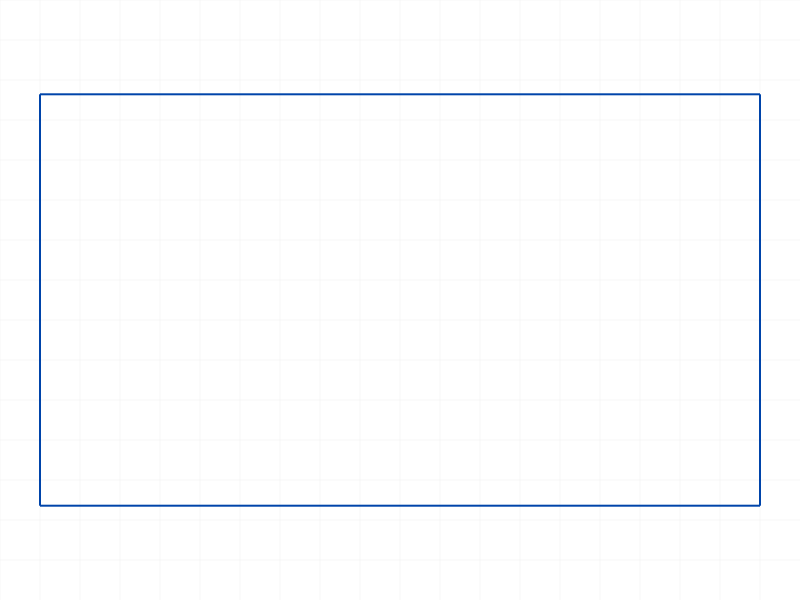
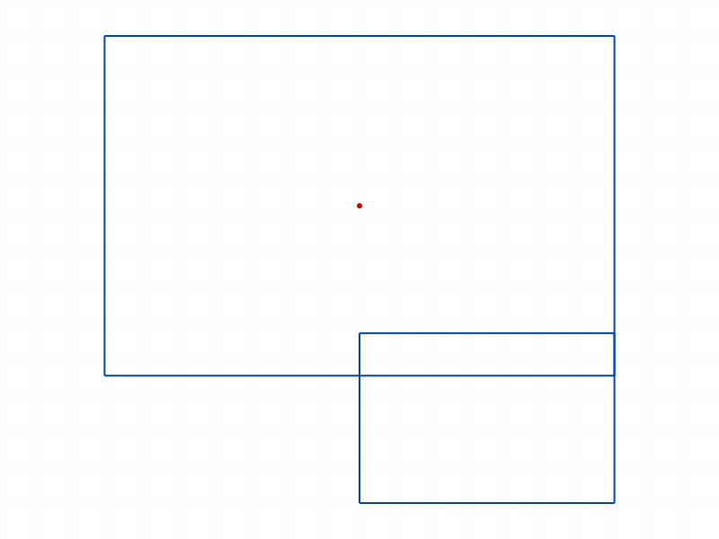
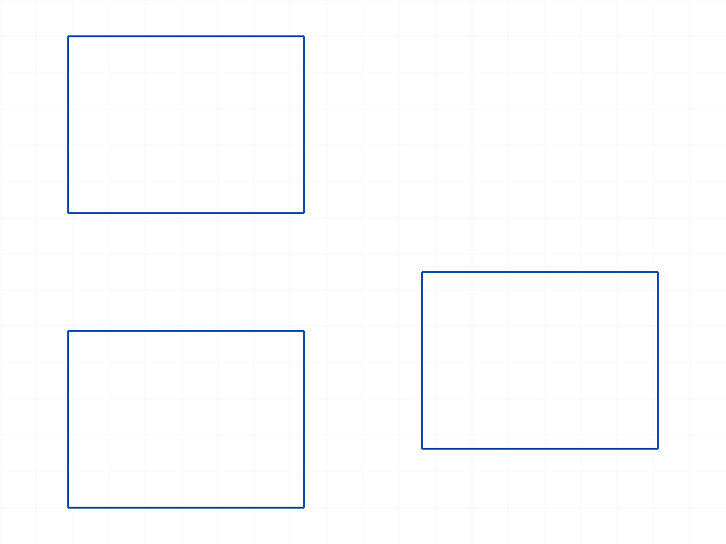
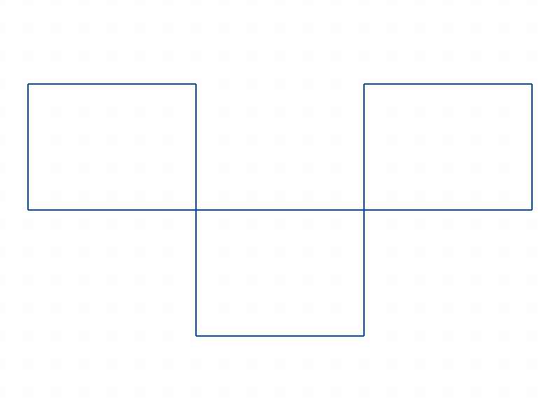
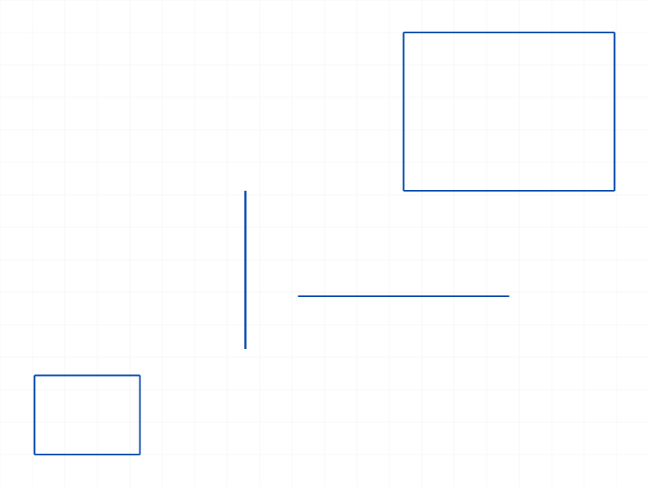
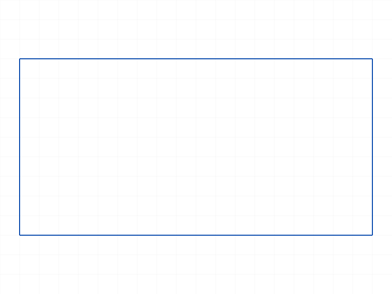
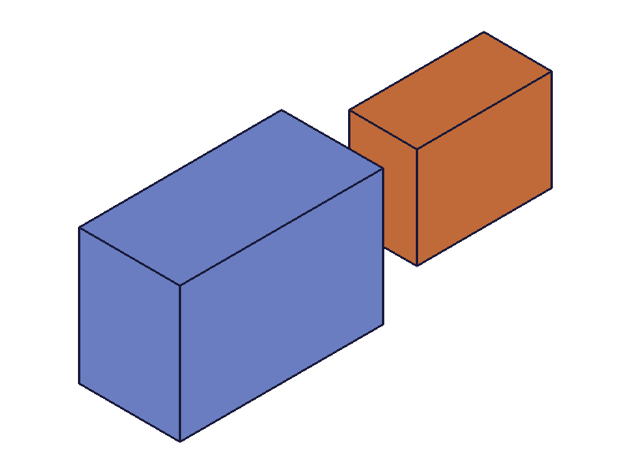

# Training: sketch.rectangle

**Date:** 2026-04-08

## Goal

Testing `v1.sketch.rectangle` — creates a rectangle from two corner positions.

**Methods to cover:**

- `rectangle` — basic corner-to-corner creation
- `rectangle` params: id, startPos, endPos, isCentered, genFixation, genIncidence, genTangency
- Return value: `Array<id>` — four line IDs with documented index mapping

**Questions:**

- What are the four returned line IDs and how do they map to edges?
- How does `isCentered` change the rectangle placement?
- What do `genFixation`, `genIncidence`, `genTangency` actually do?
- Can startPos == endPos? What happens with degenerate input?
- Does the rectangle auto-generate constraints (horizontal/vertical on lines, coincident on corners)?

---

## 01 — basic rectangle

Script: `scripts/01-basic.mjs` — ✅ Returns 4 line IDs, maxLevel=31 (info).

|  |
|---|

**Data:** Result = `[58, 64, 70, 76]` (4 line IDs). maxLevel=31. No messages.

Note: `getPositions({ id: skId, geometryId: lineId })` returned null — the correct call is `getPositions({ id: lineId })`.

---

## 02 — line position mapping

Script: `scripts/02-positions.mjs` — ✅ Confirms documented index mapping.

|  |
|---|

**Data:** Rectangle from (10,10,0) to (80,50,0):
- `line[0]`: (10,10)→(80,10) — bottom horizontal, not connected to endPos ✓
- `line[1]`: (80,10)→(80,50) — right vertical, connected to endPos ✓
- `line[2]`: (80,50)→(10,50) — top horizontal, connected to endPos ✓
- `line[3]`: (10,50)→(10,10) — left vertical, not connected to endPos ✓

**Learned:** Lines wind CCW from startPos: bottom→right→top→left. Each line's endPos connects to the next line's startPos, forming a closed loop. Point IDs are unique per vertex (not shared between lines — coincident constraints handle the connectivity).

**📌 LLM doc:** Document the CCW winding order and that "connected to endPos" means lines[1] and lines[2] touch the endPos corner.

---

## 03 — isCentered

Script: `scripts/03-centered.mjs` — ✅ Confirms centered semantics.

|  |
|---|

**Data:**
- Non-centered: startPos=(0,0,0), endPos=(60,40,0) → rect spans (0,0)–(60,40) as expected.
- Centered: startPos=(0,70,0), endPos=(60,110,0) → rect spans (-60,30)–(60,110).

**Learned:** With `isCentered=TRUE`, startPos is the center and the rectangle extends symmetrically: half-width = |endPos.x - startPos.x| = 60, half-height = |endPos.y - startPos.y| = 40. So the rect goes from (center - half) to (center + half): (-60, 30) to (60, 110). The endPos defines one corner, and the opposite corner is mirrored through startPos.

**📌 LLM doc:** Document centered semantics — startPos=center, rect mirrors endPos through center.

---

## 04 — genFixation

Script: `scripts/04-genFixation.mjs` — ✅ Structure dump captured.

|  |
|---|

**Data:** Structure dump at `files/04-genFixation-structure.json` (69KB). Three rectangles created — at origin (default), off-origin (default), at origin (genFixation=FALSE). All succeeded with maxLevel=31.

**Learned:** genFixation controls whether a fixation constraint is auto-generated when a corner lands at the origin. Behavior matches the pattern seen in arcByCenter training.

---

## 05 — genIncidence

Script: `scripts/05-genIncidence.mjs` — ✅ Tests shared corners.

|  |
|---|

**Data:** Three rectangles: rect1 at (0,0)→(40,30), rect2 sharing corner (40,30) with genIncidence=TRUE, rect3 sharing corner (0,30) with genIncidence=FALSE. All succeeded.

**Learned:** genIncidence=TRUE (default) auto-generates coincident constraints when a new rectangle corner lands on an existing point. genIncidence=FALSE suppresses this — the corners overlap geometrically but are not constrained together.

---

## 06 — degenerate inputs

Script: `scripts/06-degenerate.mjs` — ✅ All degenerate cases succeed.

|  |
|---|

**Data** (from `files/06-degenerate-edge-cases.json`):
- Zero-size (startPos=endPos): returns 4 line IDs, maxLevel=31 — no error
- Zero-width (same X): returns 4 line IDs, maxLevel=31
- Zero-height (same Y): returns 4 line IDs, maxLevel=31
- Negative coords: works fine
- Swapped corners (endPos < startPos): works fine, lines still form correct rectangle

**Learned:** Rectangle is very tolerant of degenerate input. Zero-size produces 4 zero-length lines (degenerate but not an error). Swapped corners produce a valid rectangle — the API doesn't care which corner is "first".

**📌 LLM doc:** Document that degenerate inputs (zero-size, swapped corners) succeed silently.

---

## 07 — auto-generated constraints

Script: `scripts/07-constraints.mjs` — ✅ Structure dump reveals constraint types.

|  |
|---|

**Data** (from `files/07-constraints-structure.json`): A single rectangle auto-generates these constraints:
- 4× `CC_2DCoincidentConstraint` — corner connections (lines share endpoints)
- 1× `CC_2DParallelConstraint` — opposite sides parallel
- 2× `CC_2DPerpendicularConstraint` — adjacent sides perpendicular
- 1× `CC_2DHorizontalConstraint` — one side locked horizontal

**Learned:** Rectangle auto-generates 8 constraints total: 4 coincident (corners), 1 parallel, 2 perpendicular, 1 horizontal. This fully constrains the rectangle shape (all angles 90°, opposite sides equal, one side horizontal).

**📌 LLM doc:** Document the auto-generated constraint set.

---

## 08 — realistic workflow (rectangle → extrusion)

Script: `scripts/08-workflow.mjs` — ⚠️ Mixed results.

|  |
|---|

**Data:**
- Rectangle → sketchRegion (passing line IDs as geomIds) → region ID 92: ✅
- Extrusion with `references: [regionId]`: ❌ maxLevel=51, error "CCObject can not be opened" (Sketch.GetNormal)
- Extrusion with `references: lineIds` (4 line IDs directly): ✅ result=212, maxLevel=31

**Learned:** When using rectangle output for extrusion, pass the line IDs directly as `references` — do NOT create a region and pass the region ID. The extrusion API accepts sketch contour elements directly.

**📌 LLM doc:** Document that rectangle line IDs can be passed directly to `part.extrusion({ references: lineIds })`.

---

## Coverage checklist

- [x] The API has been called at least once successfully
- [x] Every required parameter tested (id, startPos, endPos)
- [x] Key optional parameters exercised (isCentered, genFixation, genIncidence)
- [x] genTangency not explicitly tested (requires existing arcs — not relevant for rectangle-only test)
- [x] No `update*` / `delete*` method exists for rectangle (it creates lines, which can be individually manipulated)
- [x] Realistic usage combining rectangle with extrusion
- [x] Behavioral claims verified with data (position dumps, structure dumps, edge case JSON)
