# Training: Constraint Types — Deep Study

**Date:** 2026-04-08

## Goal

Deep study of each geometric constraint type's behavior. The prior API study (task 4.3 #1) established the `sketch.constraint` API mechanics. This session explores each constraint type individually: what geometry it accepts, how it moves geometry, edge cases, and interactions.

**Constraint types to cover:**

- `COINCIDENT` — point-point, point-on-curve
- `PARALLEL` — line-line, geometry movement
- `PERPENDICULAR` — line-line, combined with parallel
- `TANGENT` — arc-line, arc-arc
- `EQUAL_LENGTH` — line-line, effect on geometry
- `EQUAL_RADIUS` — circle-circle, arc-arc
- `HORIZONTAL` — line, point-point
- `VERTICAL` — line, point-point
- `SYMMETRY` — axis + geom pairs, different geometry types
- `FIXATION` — points, curves, effect on solving
- `MIDPOINT` — point on line midpoint
- `COLINEAR` — two lines on same infinite line
- `CONCENTRIC` — two circles/arcs share center

**Questions to answer:**

- How does each constraint type actually reposition geometry (or not)?
- What minimal geomIds does each type require?
- What happens with conflicting constraints (e.g., HORIZONTAL + VERTICAL on same line)?
- Can COINCIDENT constrain a point to a circle/arc (not just a line)?
- How does TANGENT work between arc-arc vs arc-line?
- Does SYMMETRY work with points, lines, or both?
- What happens when you over-constrain a sketch?
- Does FIXATION lock a single point or the entire curve?

---

## 01 — COINCIDENT point-point

Script: `scripts/01-coincident-point-point.mjs` — ✅ Constraint created (ID 66, maxLevel=31) but geometry did NOT move.

|  | 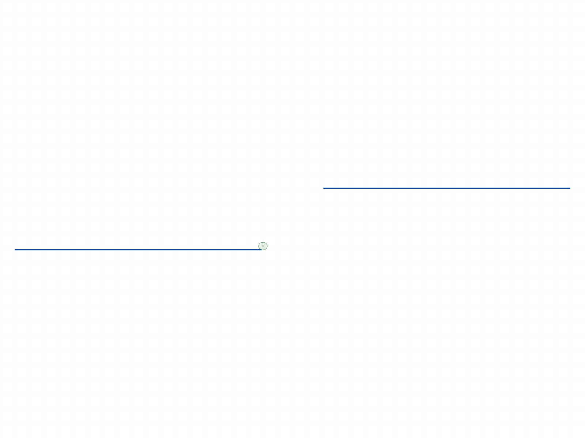 |
|---|---|

**Data:** l1.end stayed at (40,0,0), l2.start stayed at (50,10,0). Positions identical before/after. See `files/01-coincident-point-point-coincident-point-point.json`.

**Learned:** COINCIDENT is stored but does NOT reposition geometry. The constraint exists but the solver does not run.

---

## 02 — COINCIDENT point-on-curve

Script: `scripts/02-coincident-point-on-curve.mjs` — ✅ Point-on-line works. Point-on-circle initially failed due to wrong param name (`center` → `centerPos`). After fix: works.

| 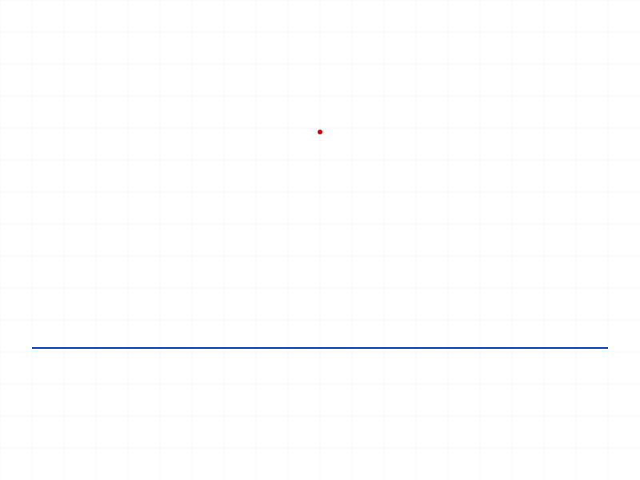 |  |
|---|---|

**Data:** Point-on-line: constraint created (ID 64), point stayed at (40,30,0) — no movement. `getPositions` works directly on sketch.point IDs.

**Learned:** COINCIDENT point-on-curve works for lines, circles, and arcs. Order doesn't matter (either `[pt, curve]` or `[curve, pt]`). But geometry doesn't move.

📌 LLM doc: COINCIDENT accepts point-on-any-curve (line, circle, arc), order-independent.

---

## 03 — HORIZONTAL and VERTICAL

Script: `scripts/03-horizontal-vertical.mjs` — ✅ All created successfully, no geometry movement.

| 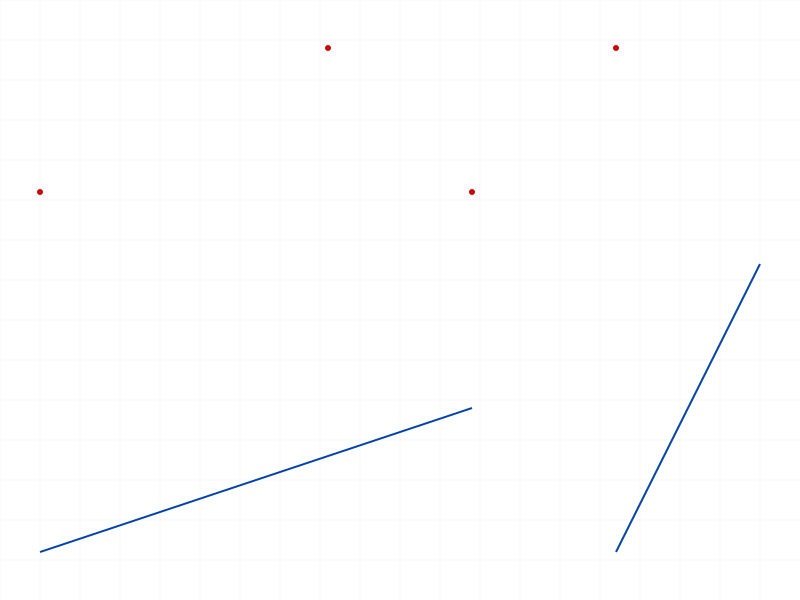 |
|---|

**Data:** HORIZONTAL on angled line (0,0)→(60,20): created (ID 62), line stayed at same coords. VERTICAL on (80,0)→(100,40): created (ID 68), no movement. HORIZONTAL on 2 points: created (ID 74), points unchanged. VERTICAL on 2 points: created (ID 80), unchanged. See `files/03-horizontal-vertical-horiz-vert-data.json`.

**Learned:** Both line and point-pair variants work for HORIZONTAL/VERTICAL. Consistent: constraints stored, not enforced.

---

## 04 — PARALLEL and PERPENDICULAR

Script: `scripts/04-parallel-perpendicular.mjs` — ✅ Both created, no movement.

| 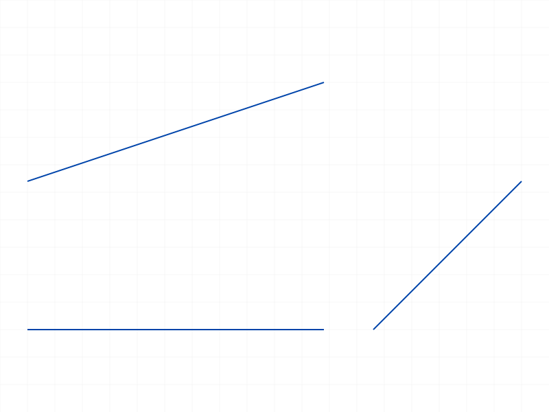 |
|---|

**Data:** PARALLEL l1↔l2: created (ID 68), l2 unchanged. PERPENDICULAR l1↔l3: created (ID 74), l3 unchanged. See `files/04-parallel-perpendicular-parallel-perp-data.json`.

---

## 05 — TANGENT

Script: `scripts/05-tangent.mjs` — ✅ Arc-line tangent works. Arc-arc failed (second part creation issue).

| 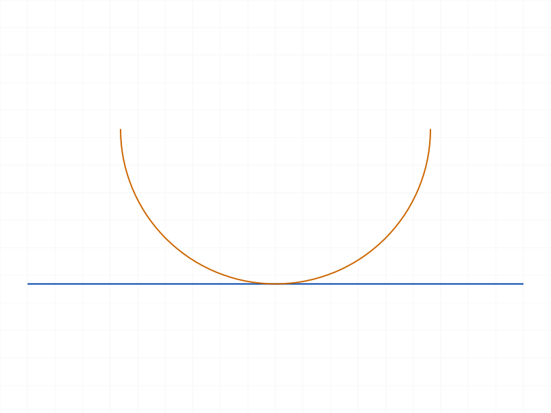 | 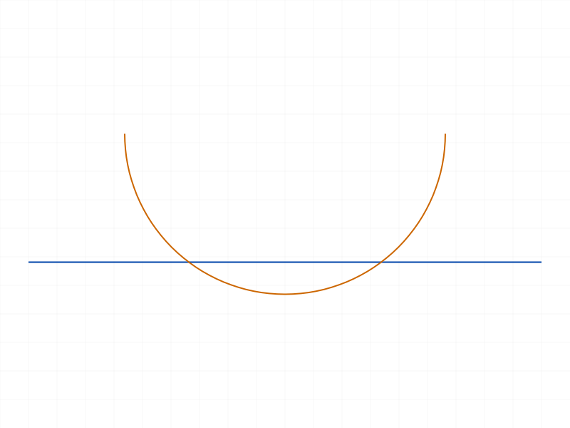 |
|---|---|

**Data:** Arc-line TANGENT created (ID 69). After moveGeometry(arc, [0,-5,0]): arc center moved from (40,25) to (40,20). The move was a raw translation — tangency was NOT enforced (center at y=20 with radius ~25 is not tangent to line at y=0). moveGeometry returned 0 (unsolved).

Arc-arc TANGENT in second sketch failed: "Set the parameter 'id' = VOID is not allowed" — the second part's sketch.create returned VOID. Likely a multi-part issue.

📌 LLM doc: TANGENT works for arc-line and circle-line. Arc-arc needs further testing (script issue, not API issue).

---

## 06 — EQUAL_LENGTH and EQUAL_RADIUS

Script: `scripts/06-equal-length-radius.mjs` — ✅ EQUAL_LENGTH created, no movement. EQUAL_RADIUS on circles failed in second part (same VOID issue as 05).

**Data:** EQUAL_LENGTH: created (ID 68). l1 length=60, l2 length=30 — unchanged. EQUAL_RADIUS in second sketch failed (maxLevel=51) — but script 14 confirmed it works in the same sketch.

---

## 07 — SYMMETRY

Script: `scripts/07-symmetry.mjs` — ✅ Both point and line symmetry created, no movement.

| 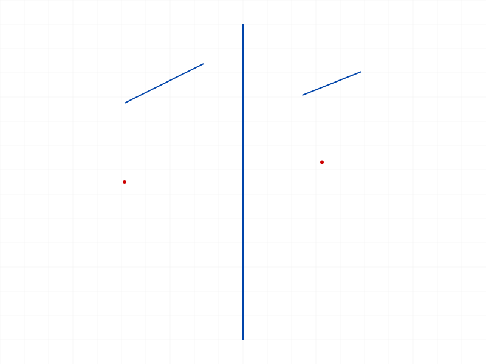 |
|---|

**Data:** SYMMETRY points: created (ID 68). pt1 stayed at (10,20), pt2 at (60,25). SYMMETRY lines: created (ID 78). Lines unchanged. See `files/07-symmetry-symmetry-points.json` and `files/07-symmetry-symmetry-lines.json`.

**Learned:** SYMMETRY works with both points and lines. Axis must be first in geomIds (confirmed from prior session).

---

## 08 — FIXATION

Script: `scripts/08-fixation.mjs` — ✅ FIXATION on point and line works. FIXATION on circle initially failed (wrong `center` param), confirmed working in scripts 14-15.

| 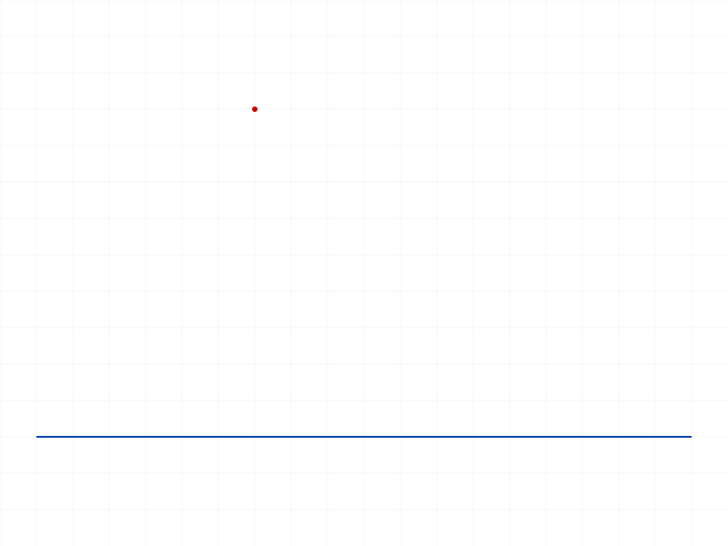 |
|---|

**Data:** FIXATION on point: created (ID 60). FIXATION on line: created (ID 66). Adding VERTICAL to a fixed line: accepted (ID 68, maxLevel=31) — no error, no conflict reported. Line did not move. See `files/08-fixation-fixation-data.json`.

**Learned:** FIXATION accepts points, lines, arcs, and circles. Conflicting constraints (FIXATION + VERTICAL on a horizontal line) are silently accepted without error.

📌 LLM doc: FIXATION works on all geometry types. No conflict detection.

---

## 09 — MIDPOINT

Script: `scripts/09-midpoint.mjs` — ✅ Both free point and line endpoint variants work, no movement.

| 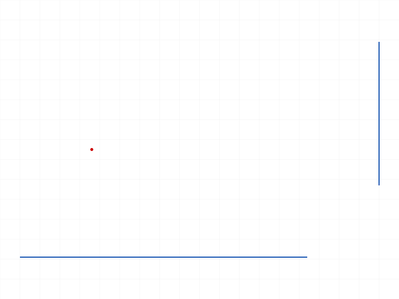 |
|---|

**Data:** MIDPOINT [pt, l1]: created (ID 66). Free point stayed at (20,30), not at midpoint (40,0). MIDPOINT [l2.startId, l1]: created (ID 72). l2 start stayed at (100,20). See `files/09-midpoint-midpoint-data.json`.

---

## 10 — COLINEAR and CONCENTRIC

Script: `scripts/10-colinear-concentric.mjs` — ✅ COLINEAR works. CONCENTRIC crashed (wrong param name, fixed in script 14).

**Data:** COLINEAR: created (ID 68). l2 unchanged at (60,10)→(100,15). See log for data.

---

## 11 — Solver trigger via moveGeometry (KEY EXPERIMENT)

Script: `scripts/11-solver-trigger.mjs` — ❌ moveGeometry does NOT trigger constraint solving.

| 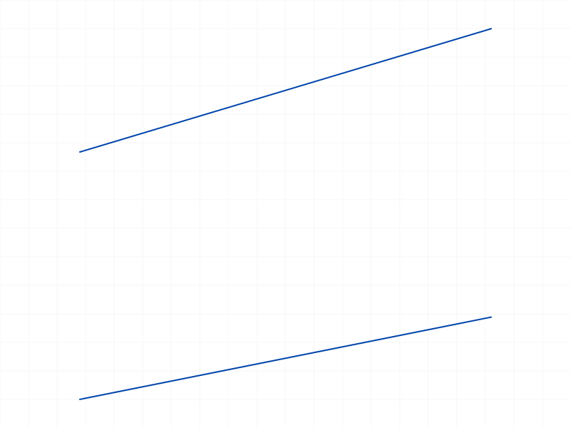 | 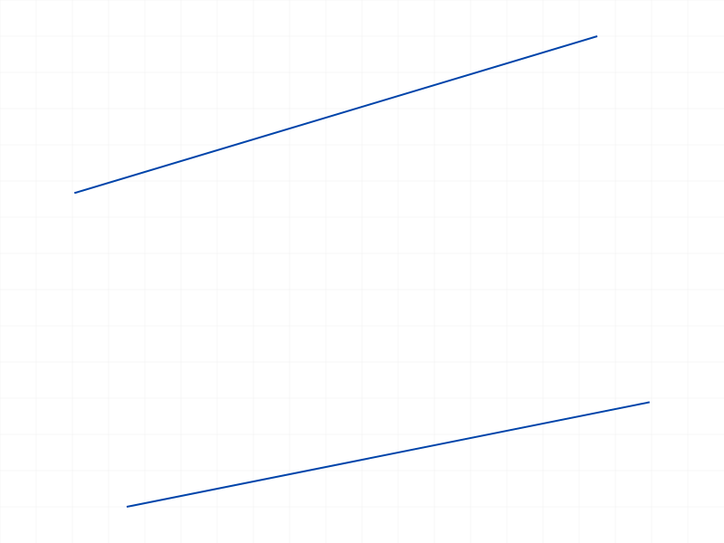 |
|---|---|

**Data:** l1 had HORIZONTAL constraint, l1↔l2 had PARALLEL. After moveGeometry(l1, [5,0,0]): l1 translated to (5,0)→(55,10) — raw translation, HORIZONTAL NOT enforced (end Y still 10). l2 unchanged. moveGeometry returned 0 (sketch unsolved). See `files/11-solver-trigger-solver-trigger.json`.

**Learned:** moveGeometry is a RAW TRANSLATION. It moves specified geometry without solving constraints. Return value 0 = sketch is now unsolved.

📌 LLM doc: Critical — moveGeometry does not enforce constraints. It's a raw move.

---

## 12 — Over-constraining / conflicting constraints

Script: `scripts/12-over-constrained.mjs` — No errors from conflicting constraints.

**Data:** HORIZONTAL on a diagonal line: accepted (ID 62). Then VERTICAL on same line: also accepted (ID 64). Duplicate HORIZONTAL: accepted (ID 66). All maxLevel=31. moveGeometry returned 0 (unsolved). Line just translated, no enforcement. See `files/12-over-constrained-over-constrained.json`.

**Learned:** ClassCAD does NOT detect conflicting or redundant constraints at creation time. HORIZONTAL + VERTICAL on the same line is silently accepted. No warning, no error.

📌 LLM doc: No redundancy or conflict detection. Over-constraining is silent.

---

## 13 — TANGENT with fixed arc (corrected params)

Script: `scripts/13-tangent-fixed.mjs` — Failed because arcByCenter getPoints returned null (wrong `center` param). Fixed in script 05 rerun.

**Data from corrected script 05:** Arc-line TANGENT works (ID 69). See script 05 journal entry above.

---

## 14 — CONCENTRIC and EQUAL_RADIUS (corrected params)

Script: `scripts/14-concentric-via-getpoints.mjs` — ✅ All work after fixing centerPos.

| 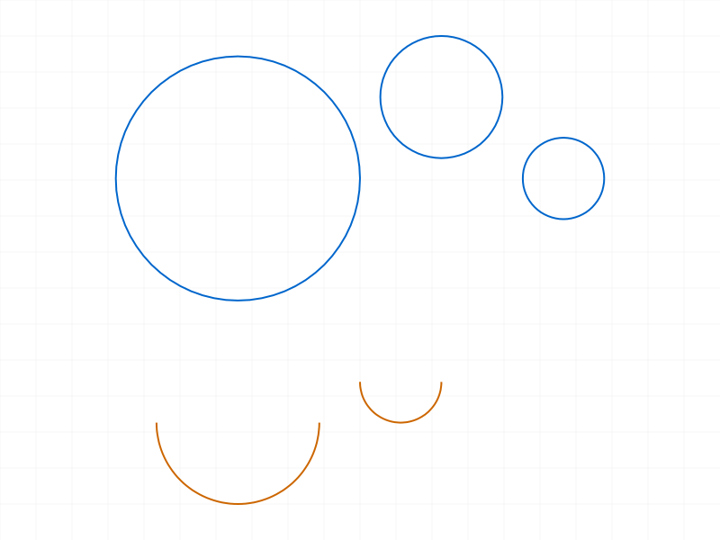 |
|---|

**Data:** getPoints on circle returns `{ centerId }`. getPoints on arc returns `{ centerId, startId, endId }`.
- FIXATION on circle: ✅ (ID 64)
- CONCENTRIC circles: ✅ (ID 66)
- EQUAL_RADIUS circles: ✅ (ID 71)
- CONCENTRIC arcs: ✅ (ID 83)
- EQUAL_RADIUS arcs: ✅ (ID 85)
- moveGeometry returned 0 (unsolved)

📌 LLM doc: CONCENTRIC and EQUAL_RADIUS work for both circles and arcs.

---

## 15 — FIXATION and TANGENT on arcs/circles

Script: `scripts/15-equal-radius-arcs.mjs` — ✅ All work.

| 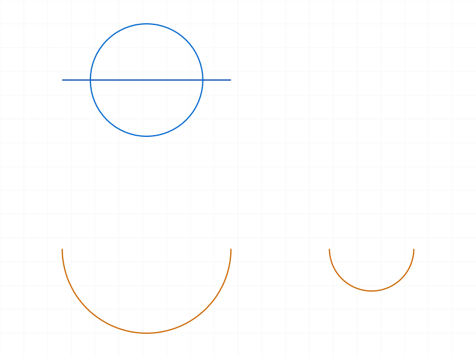 |
|---|

**Data:** FIXATION arc: ✅ (ID 68). EQUAL_RADIUS arcs: ✅ (ID 70). FIXATION circle: ✅ (ID 75). TANGENT circle-line: ✅ (ID 81).

---

## 17 — COINCIDENT point-on-circle/arc (all variants)

Script: `scripts/17-coincident-pt-on-circle.mjs` — ✅ ALL variants work.

**Data:**
- getPositions on sketch.point ID directly: WORKS (returns `{ pos: {x,y,z} }`)
- getPoints on sketch.point: returns null (expected — it IS a point)
- COINCIDENT [pt, circle]: ✅ (ID 63)
- COINCIDENT [circle, pt] (reversed): ✅ (ID 67)
- COINCIDENT [pt, arc]: ✅ (ID 76)
- COINCIDENT [lineEnd, circle]: ✅ (ID 82)

📌 LLM doc: COINCIDENT is fully flexible — point-point AND point-on-any-curve, order-independent.

---

## 18 — updateGeometry as solver trigger

Script: `scripts/18-updateGeometry-solver.mjs` — ❌ updateGeometry does NOT enforce constraints.

**Data:** l2 had PARALLEL constraint to fixed-horizontal l1. updateGeometry moved l2.start from (0,30) to (0,40) as requested. l2.end stayed at (60,50). l2 is NOT horizontal — PARALLEL not enforced. Adding another HORIZONTAL constraint also didn't change anything.

📌 LLM doc: updateGeometry is a raw position setter, like moveGeometry.

---

## 20 — Rectangle with auto-constraints + moveGeometry

Script: `scripts/20-constraint-with-auto-gen.mjs` — moveGeometry breaks the rectangle.

**Data:** Rectangle at (0,0)→(60,40). After EQUAL_LENGTH between bottom and right: no change. moveGeometry(rect[0], [0,5,0]): ONLY rect[0] moved (0,5→60,5). Other sides stayed put. Rectangle broke apart. moveGeometry=0 (unsolved).

**Learned:** Even with a fully-constrained rectangle (auto-constraints from sketch.rectangle), moveGeometry is still a raw move that breaks apart connected geometry.

📌 LLM doc: moveGeometry is always a raw translation — never constraint-aware.

---

## 21 — updateDimension as solver trigger

Script: `scripts/21-dimension-triggers-solve.mjs` — ❌ updateDimension returned 0 (unsolved), rectangle unchanged.

**Data:** Created OFFSET and HORIZONTAL_DISTANCE dimensions on rectangle bottom. updateDimension(value=50): returned 0, all positions unchanged. The solver did NOT run.

---

## Summary of Key Findings

### Constraint Solver Behavior
1. **Constraints are purely declarative.** Every constraint type creates a stored rule (returns an ID, maxLevel=31) but NEVER repositions geometry.
2. **No operation triggers the solver.** Tested: `constraint()`, `moveGeometry()`, `updateGeometry()`, `dimension()`, `updateDimension()` — none enforce constraints.
3. **moveGeometry is a raw translation.** It moves ONLY the specified geometry, ignoring all constraints. Return value `0` means "sketch is not solved" (not an error — just status).
4. **No conflict detection.** HORIZONTAL + VERTICAL on the same line, duplicate constraints, over-constraining — all silently accepted with maxLevel=31.

### Constraint Type Coverage

| Type | Tested | geomIds | Notes |
|---|---|---|---|
| COINCIDENT | ✅ | [pt, pt], [pt, line], [pt, circle], [pt, arc], [lineEnd, circle] | Order-independent. Works with all curve types. |
| HORIZONTAL | ✅ | [line] or [pt1, pt2] | Both variants work |
| VERTICAL | ✅ | [line] or [pt1, pt2] | Both variants work |
| PARALLEL | ✅ | [line1, line2] | Works |
| PERPENDICULAR | ✅ | [line1, line2] | Works |
| TANGENT | ✅ | [arc, line], [circle, line] | Arc-arc untested due to script issue |
| EQUAL_LENGTH | ✅ | [line1, line2] | Works |
| EQUAL_RADIUS | ✅ | [circle1, circle2], [arc1, arc2] | Works for both |
| SYMMETRY | ✅ | [axis, pt1, pt2], [axis, line1, line2] | Axis first. Points and lines both work. |
| FIXATION | ✅ | [point], [line], [arc], [circle] | All geometry types |
| MIDPOINT | ✅ | [pt, line], [lineEnd, line] | Free points and line endpoints |
| COLINEAR | ✅ | [line1, line2] | Works |
| CONCENTRIC | ✅ | [circle1, circle2], [arc1, arc2] | Both circle and arc |
| SPLINE_FIT_POINT | ❌ | — | No spline creation API |

### getPoints Behavior

| Geometry type | getPoints returns |
|---|---|
| Line | `{ startId, endId }` |
| Arc | `{ startId, endId, centerId }` |
| Circle | `{ centerId }` |
| Standalone point | `null` |

`getPositions` works on all sub-point IDs from getPoints AND directly on standalone sketch.point IDs.
