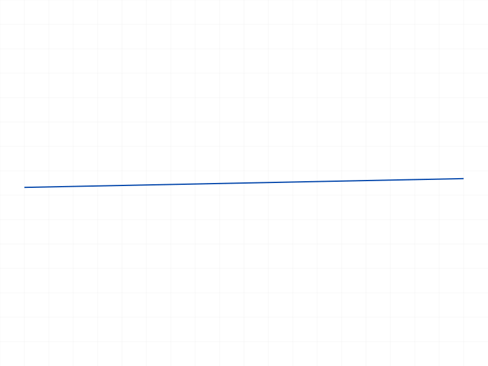
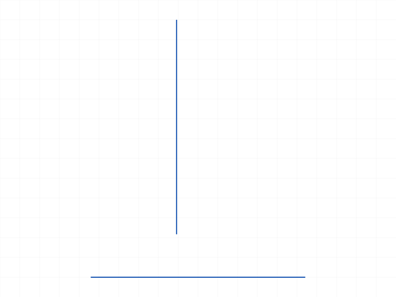
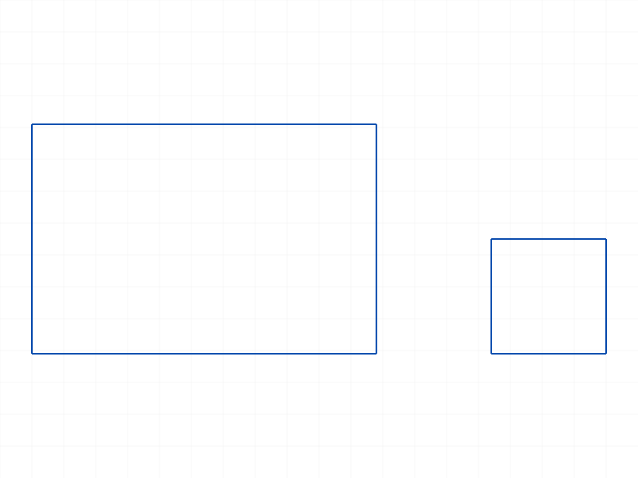
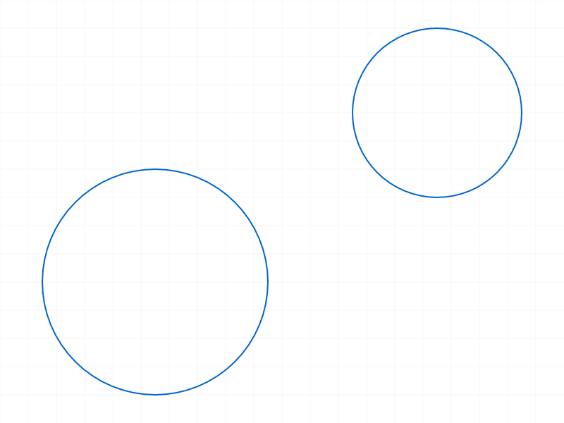

# Training: sketch.generateAutoConstraints

**Date:** 2026-04-08

## Goal

Testing `v1.sketch.generateAutoConstraints` — automatic constraint generation for sketch geometry.

**Methods to cover:**

- `generateAutoConstraints` — basic call with a single geometry ID
- `generateAutoConstraints` — call with sketch ID as `geomId` (auto-constrain all geometry)
- `genFixation` flag — toggle origin fixation
- `genIncidence` flag — toggle coincidence constraints
- `genTangency` flag — toggle tangency constraints
- `genVertAndHoriz` flag — toggle vertical/horizontal constraints

**Questions:**

- What constraints does it actually generate for a near-horizontal line? Near-vertical?
- Does passing the sketch ID as `geomId` constrain all geometry at once?
- What happens when geometry already has constraints — does it skip redundant ones?
- What does the return value look like (VOID per docs)?
- How do the boolean flags affect which constraints are generated?
- Does it work on circles, arcs, rectangles?
- What happens with overlapping/coincident points — does it generate COINCIDENT?
- How does `genTangency` work with arcs that are near-tangent to lines?

---

## 01 — basic line (near-horizontal)

Script: `scripts/01-basic-line.mjs` — ✅ Near-horizontal line (1° slope from origin) gets only fixation, NOT horizontal.

|  |
|---|

**Data:** Structure grew from 25491 to 26242 bytes. New object: `CC_2DFixationConstraint "Auto_Fix"` on entity 59 (start point at origin). No `CC_2DHorizontalConstraint` — the 1° slope is too much for horizontal detection.

**Learned:** Auto-constraint only detects EXACTLY horizontal/vertical lines, not approximately. Result is `null` (not VOID string), maxLevel=31.

---

## 02 — exact horizontal and vertical lines

Script: `scripts/02-exact-horizontal.mjs` — ✅ Exact H and V lines get proper constraints.

|  |
|---|

**Data:** Three new objects created:
- `CC_2DFixationConstraint "Auto_Fix"` on entity 59 (start point of hLine at origin)
- `CC_2DHorizontalConstraint "Auto_H"` on entity 58 (the horizontal line)
- `CC_2DVerticalConstraint "Auto_V"` on entity 62 (the vertical line)

**Learned:** Exact alignment → H/V constraint. Constraint names prefixed with "Auto_".
**📌 LLM doc:** Exact alignment required for H/V detection. Auto-generated constraints named "Auto_Fix", "Auto_H", "Auto_V".

---

## 03 — genFixation=false

Script: `scripts/03-flags-fixation.mjs` — ✅ `genFixation: false` suppresses fixation; only HORIZONTAL generated.

**Data:** 1 new object: `CC_2DHorizontalConstraint "Auto_H"`. No fixation constraint.

**Learned:** Flag works correctly with JS `false`. First attempt with string `'FALSE'` caused maxLevel=51 error.
**📌 LLM doc:** Boolean flags must be JS `false`/`true`, NOT string `'FALSE'`/`'TRUE'`.

---

## 04 — genVertAndHoriz=false

Script: `scripts/04-flags-vert-horiz.mjs` — ✅ `genVertAndHoriz: false` suppresses H/V; only fixation generated.

**Data:** 1 new object: `CC_2DFixationConstraint "Auto_Fix"`. No H/V constraint.

---

## 05 — all flags false

Script: `scripts/05-all-flags-false.mjs` — ✅ All flags false → nothing generated. maxLevel=31.

**Data:** 0 new objects. The call succeeds (maxLevel=31) but generates no constraints.

---

## 06 — sketch ID as geomId (doc discrepancy)

Script: `scripts/06-sketch-id-as-geomid.mjs` — ❌ Passing the sketch ID as `geomId` fails with error 1001.

**Data:** maxLevel=51. Error message: `"The parameter \"geomId\" has a wrong id type! Provide only following id types: [\"sketch-curve\",\"sketch-point\"]"`

**Learned:** Despite the docs saying "id of the sketch geometry to auto constraint or the sketch id itself to autoconstraint each of sketch's objects", passing the sketch ID is **rejected**. Only sketch-curve and sketch-point IDs are accepted.
**📌 LLM doc:** Doc discrepancy — sketch ID NOT accepted as geomId. Must pass individual geometry IDs.

---

## 07 — coincidence detection

Script: `scripts/07-coincidence.mjs` — ✅ Coincident endpoints between two lines detected.

|  |
|---|

**Data:** Auto-constraining l2 (vertical, starts at l1's endpoint) produced:
- `CC_2DCoincidentConstraint "Auto_Coinc"` on entities [63, 60] (start of l2, end of l1)
- `CC_2DVerticalConstraint "Auto_V"` on entity 62 (l2 is vertical)

Then auto-constraining l1 added: fixation + horizontal.

**Learned:** Coincidence detection works across geometries — auto-constraining one line detects overlap with other existing geometry.

---

## 08 — tangency (arc touching line)

Script: `scripts/08-tangency.mjs` — ✅ Arc with start point on line gets coincidence but not tangency with default flags.

**Data:** 1 new object: `CC_2DCoincidentConstraint "Auto_Coinc"` on entities [64, 58] (arc start point on line).

**Learned:** With default genTangency=true, this particular geometry produced coincidence but not tangency. Tangency detection may require specific geometric conditions. See script 18 for when tangency IS detected.

---

## 09 — rectangle

Script: `scripts/09-rectangle.mjs` — ✅ Auto-constraining each rect line individually.

|  |
|---|

**Data:** Rectangle (4 lines), constrained one-by-one:
- Line 0 (bottom, horizontal from origin): `Auto_Fix` only (no H — surprising?)
- Line 1 (right, vertical): `Auto_V`
- Line 2 (top, horizontal): `Auto_H`
- Line 3 (left, vertical): `Auto_Fix0` + `Auto_V0`

**Learned:** Auto-names de-duplicate with numeric suffix (Auto_Fix0, Auto_V0). Line 0 got fixation but no H — need to investigate. Line 3 got fixation because its endpoint touches origin corner via the rectangle structure.
**📌 LLM doc:** Auto-constraint names use "Auto_" prefix with numeric suffix for de-duplication.

---

## 10 — redundancy detection

Script: `scripts/10-already-constrained.mjs` — ✅ PASS — calling twice does not create duplicate constraints.

**Data:** First call: 2 new objects (fixation + horizontal). Second call: 0 new objects.

**Learned:** The API correctly avoids redundant constraints. This matches the docs: "doesn't add up redundancy".
**📌 LLM doc:** Idempotent — calling twice on the same geometry produces no duplicates.

---

## 11 — circle

Script: `scripts/11-circle.mjs` — ✅ Circle at origin gets fixation on center point. Off-origin circle gets nothing.

|  |
|---|

**Data:** Circle at origin → `CC_2DFixationConstraint "Auto_Fix"` on entity 59 (center point). Circle at (50,30) → no new objects.

**Learned:** Circles only get fixation (if center at origin). No H/V constraints (makes sense — circles have no direction).

---

## 12 — sketch point

Script: `scripts/12-point.mjs` — ✅ Point at origin gets fixation. Point off-origin gets nothing.

**Data:** Sketch point at (0,0,0) → fixation. Sketch point at (30,20,0) → nothing.

---

## 13 — diagonal lines

Script: `scripts/13-diagonal-no-hv.mjs` — ✅ Diagonal from origin → fixation only. Off-origin diagonal → nothing.

**Data:** 45° diagonal from origin: `CC_2DFixationConstraint`. Off-origin diagonal: 0 new objects.

---

## 14 — genIncidence=false

Script: `scripts/14-genincidence-false.mjs` — ✅ `genIncidence: false` suppresses coincidence detection.

**Data:** Two lines with coincident endpoint. Auto-constraining l2 with `genIncidence: false` → only `CC_2DVerticalConstraint "Auto_V"` (l2 is vertical). No coincidence constraint.

---

## 15 — near-origin line

Script: `scripts/15-near-origin.mjs` — ✅ Line starting at (0.001, 0, 0) → horizontal but no fixation.

**Data:** Start at (0.001, 0, 0) with end at (50, 0, 0): `CC_2DHorizontalConstraint "Auto_H"` — no fixation (0.001 offset from origin is enough to prevent it). The line IS perfectly horizontal (both endpoints Y=0).

**Learned:** Fixation requires a point EXACTLY at (0,0,0). Even 0.001 offset prevents it.

---

## 16 — point ID as geomId

Script: `scripts/16-point-as-geomid.mjs` — ✅ Passing a sketch-point ID works.

**Data:** Start point at origin → fixation. End point off-origin → nothing.

**Learned:** `geomId` accepts both sketch-curve IDs and sketch-point IDs (as documented by the error in script 06).
**📌 LLM doc:** geomId accepts sketch-curve or sketch-point IDs, NOT sketch IDs.

---

## 17 — fixation on end point at origin

Script: `scripts/17-fixation-origin-semantics.mjs` — ✅ Line ENDING at origin also gets fixation.

**Data:** Line from (50,50) to (0,0) → `CC_2DFixationConstraint "Auto_Fix"` on entity 60 (endId). The fixation was applied to the end point, not the start point.

**Learned:** Fixation checks ALL points of the geometry for origin proximity, not just the start point.
**📌 LLM doc:** Fixation checks all points of the geometry, not just start.

---

## 18 — tangency flag comparison

Script: `scripts/18-tangency-flag-false.mjs` — ✅ `genTangency=false` suppresses tangency; `genTangency=true` generates it.

**Data:**
- Arc 1 with `genTangency=false`: only `CC_2DCoincidentConstraint "Auto_Coinc"`
- Arc 2 with `genTangency=true`: `CC_2DTangentSketchConstraint "Auto_Tan"` + `CC_2DCoincidentConstraint "Auto_Coinc0"` + `CC_2DCoincidentConstraint "Auto_Coinc1"`

**Learned:** Tangency IS detected when enabled. The `genTangency` flag controls it. The tangency constraint class is `CC_2DTangentSketchConstraint`, named "Auto_Tan".
**📌 LLM doc:** Tangency detection works. Constraint class: `CC_2DTangentSketchConstraint`.

---

## Coverage Checklist

- [x] API called successfully
- [x] Required params tested (id, geomId)
- [x] All optional params tested (genFixation, genVertAndHoriz, genIncidence, genTangency)
- [x] Return value verified (null, not VOID; maxLevel=31 on success)
- [x] Doc discrepancy found: sketch ID not accepted as geomId
- [x] Boolean flag values: JS false/true work; string 'FALSE' causes error
- [x] Redundancy: idempotent, no duplicate constraints
- [x] Works on lines, circles, arcs, points, rectangles
- [x] Fixation: only at exact origin (0,0,0), checks all points of geometry
- [x] H/V: only exact alignment, not approximate
- [x] Coincidence: detects overlapping endpoints across geometries
- [x] Tangency: detects when arc is tangent to line/curve
- [x] Auto-names: "Auto_Fix", "Auto_H", "Auto_V", "Auto_Coinc", "Auto_Tan" with numeric suffix for de-dup
