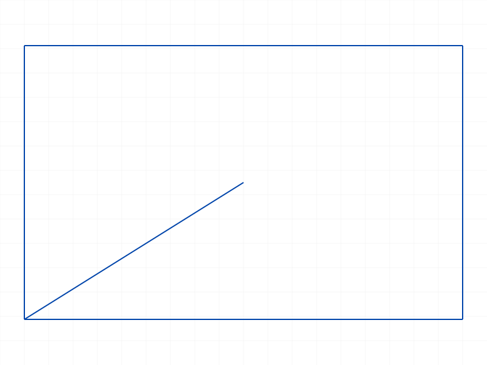
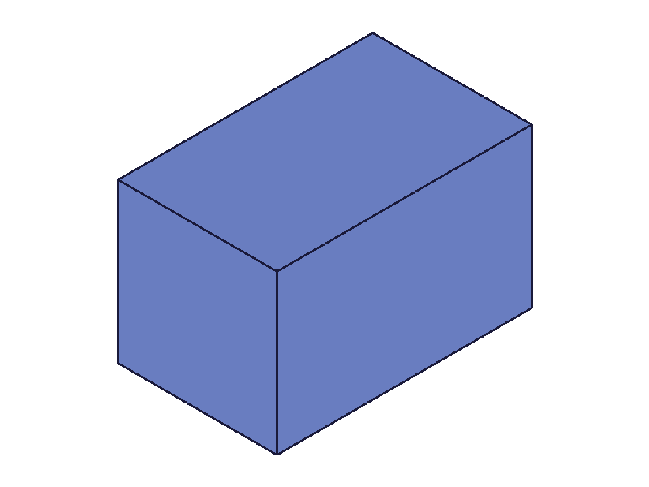

# Training: sketch.deleteSketch

**Date:** 2026-04-08

## Goal

Testing `v1.sketch.deleteSketch` — deletion of sketches by ID array.

**Methods to cover:**

- `deleteSketch` — single ID deletion
- `deleteSketch` — multiple IDs in one call
- `deleteSketch` — empty array behavior
- `deleteSketch` — invalid/already-deleted IDs
- `deleteSketch` — mixed valid + invalid IDs
- `deleteSketch` — sketch with geometry inside
- `deleteSketch` — sketch used as extrusion profile (feature dependency)
- `deleteSketch` — verify structure tree cleanup (all 3 internal objects removed)
- `deleteObject` vs `deleteSketch` — can deleteObject delete a whole sketch?

---

## 01 — basic single delete

Script: `scripts/01-basic-single-delete.mjs` — ✅ as documented.

Created sketch ID 52, deleted it. maxLevel=31 on success, empty messages array. After deletion, `part.getSketch({ name: 'ToDelete' })` returns null with error 1015 ("Sketch with name 'ToDelete' does not exist").

## 02 — multiple delete

Script: `scripts/02-multiple-delete.mjs` — ✅ as documented.

Created 3 sketches (52, 58, 64), deleted all in one call. maxLevel=31, all 3 confirmed gone via `getSketch`.

## 03 — empty array

Script: `scripts/03-empty-array.mjs` — ✅ matches existing doc.

`ids: []` → maxLevel=31, empty messages. Silent no-op.

## 04 — invalid IDs

Script: `scripts/04-invalid-id.mjs` — two sub-tests:

1. **Bogus numeric ID (99999):** maxLevel=51, two messages:
   - WARNING (41): "ToId()/TOID() didn't get an existing or valid id."
   - ERROR (51, code 1006): "An element of parameter 'ids' has an invalid id!"

2. **Part ID (not a sketch):** maxLevel=51, one message:
   - ERROR (51, code 1001): "The parameter 'ids' has a wrong id type! Provide only following id types: ['sketch']"

**📌 LLM doc:** The existing doc only mentions code 1006. Add the code 1001 "wrong id type" error for non-sketch IDs.

## 05 — already-deleted ID

Script: `scripts/05-already-deleted.mjs` — ✅ same error as bogus ID (code 1006).

## 06 — mixed valid + invalid IDs (critical finding)

Script: `scripts/06-mixed-valid-invalid.mjs` — **all-or-nothing behavior!**

Passed `[sk1, 99999, sk2]`. maxLevel=51. **Neither sk1 nor sk2 was deleted.** Both still exist after the call. The invalid ID caused the entire operation to abort.

**📌 LLM doc:** This is a critical finding. The existing doc doesn't mention that mixed valid/invalid IDs result in **no deletions at all**. This is all-or-nothing, not partial success.

## 07 — structure tree cleanup

Script: `scripts/07-structure-tree-cleanup.mjs` + post-hoc analysis of structure JSON.

After creating sketch ID 52, the structure tree contained 27 nodes. After deletion, 24 nodes. The 3 removed nodes:

| ID | Name | Class |
|----|------|-------|
| 52 | TreeTest | CC_Sketch |
| 54 | TreeTestRef | CC_SketchReference |
| 56 | TreeTest | CC_SketchDimensionSet |

**Data:** See `files/07-structure-tree-cleanup-structure-after-create.json` (27 nodes) and `files/07-structure-tree-cleanup-structure-after-delete.json` (24 nodes).

✅ Confirms existing doc claim: all 3 internal objects are removed.

## 08 — sketch with geometry inside

Script: `scripts/08-sketch-with-geometry.mjs` — ✅ deletes cleanly.

Created a sketch with rectangle (4 lines) and a diagonal line. Deletion succeeded with maxLevel=31, no errors. All geometry inside the sketch is deleted along with it.

|  |
|---|

## 09e — feature dependency (critical finding)

Scripts: `09c`, `09d` failed (extrusion setup issues). `09e` succeeded.

Created sketch → rectangle → extrusion(references=lineIds). Extrusion produced a solid (maxLevel=31, result=94, 6 meshes in graphic data).

Then deleted the sketch. Result:
- **maxLevel=51** — errors during re-evaluation
- **Sketch IS deleted** — no CC_Sketch nodes remain
- **Extrusion node persists** (CC_Extrusion, id=94) but errors on re-evaluation:
  - "CCObject 98 can not be opened" (the sketch region/reference that the extrusion depends on is gone)
- **Solid geometry persists visually** — the mesh data remains in the graphic output

|  |  |
|---|---|

**Data:** `files/09e-feature-dependency-delete-response.json` — maxLevel=51 with two error messages referencing CCObject 98.
`files/09e-feature-dependency-remaining-nodes.json` — CC_Extrusion node still in tree.

**📌 LLM doc:** Deleting a sketch with dependent features does NOT cascade-delete the features. The sketch is removed, but dependent features become broken (error on re-evaluation). The solid geometry persists as stale mesh data but cannot be regenerated.

## 10 — deleteObject vs deleteSketch

Script: `scripts/10-deleteObject-vs-deleteSketch.mjs` — `deleteObject` cannot delete sketches.

Error (code 1001): "The parameter 'ids' has a wrong id type! Provide only following id types: ['dimension', 'sketch-curve', 'sketch-point', '2dconstraint', 'sketchregion']"

Sketch still exists after the call.

**📌 LLM doc:** `deleteObject` handles sub-sketch items only (dimensions, curves, points, constraints, regions). To delete whole sketches, use `deleteSketch`.

## 11 — wrong ID types / missing param

Script: `scripts/11-wrong-id-types.mjs` — edge cases:

| Input | maxLevel | Error code | Message |
|-------|----------|------------|---------|
| string "not-an-id" | 51 | 1006 | "couldn't be converted to an id" + "invalid id" |
| 0 | 51 | 1006 | "invalid id" |
| -1 | 51 | 1001 | "wrong id type" |
| `ids` omitted | 51 | 1004 | "parameter 'ids' must be provided" |

**📌 LLM doc:** Document the full error code catalogue.

---

## Coverage Checklist

- [x] API called successfully
- [x] Required parameter `ids` tested
- [x] Multiple IDs in one call
- [x] Empty array edge case
- [x] Invalid/non-existent IDs
- [x] Already-deleted IDs
- [x] Wrong ID types (part ID, string, zero, negative)
- [x] Missing parameter
- [x] Mixed valid/invalid — all-or-nothing behavior
- [x] Structure tree cleanup (3 nodes removed)
- [x] Sketch with geometry inside
- [x] Feature dependency (sketch used by extrusion)
- [x] deleteObject vs deleteSketch
- [x] All findings backed by data (filewrite dumps, log values)
