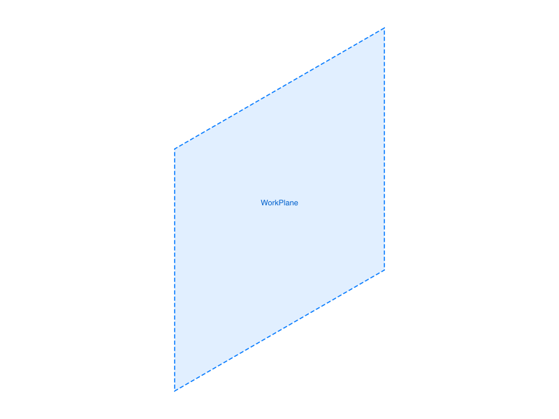
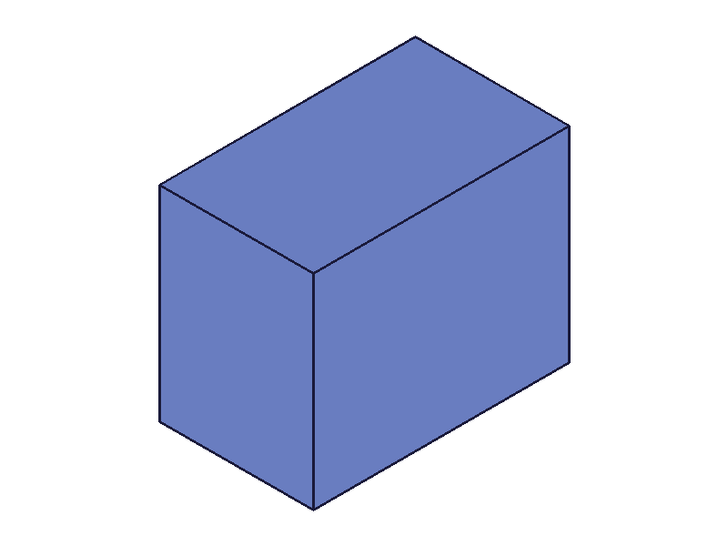
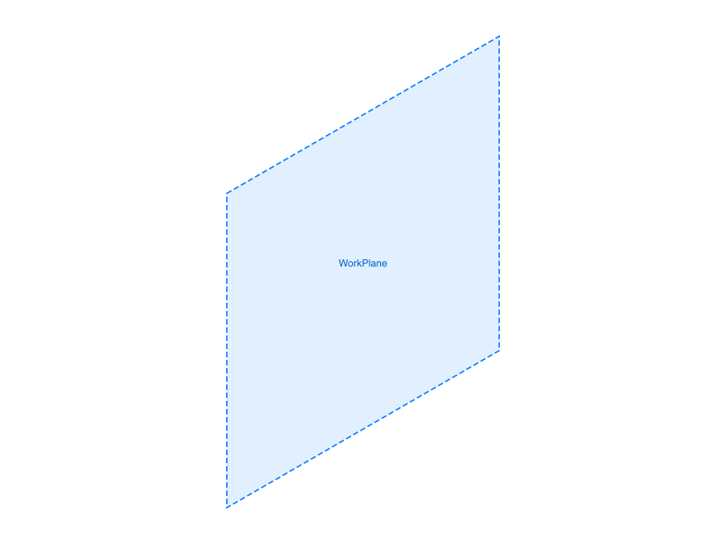
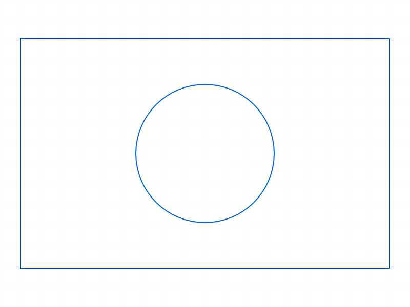

# Training: part.sketch

**Date:** 2026-04-08

## Goal

Testing `v1.part.sketch` — the part-namespace sketch creation API.

**Methods to cover:**

- `part.sketch` — basic call with just `id` (partId)
- `part.sketch` params: `id`, `planeId` (work plane), `planeId` (face), `name`
- Compare behavior with `sketch.create` — verify they are truly identical aliases
- `part.sketch` with duplicate names
- `part.sketch` with invalid IDs

**Questions:**

- Is `part.sketch` truly identical to `sketch.create` in behavior and return value?
- Does it create the same 3 internal objects (CC_Sketch, CC_SketchReference, CC_SketchDimensionSet)?
- Does `planeId` with a face auto-create a work plane the same way?
- What error codes does it return for invalid inputs?
- Can you mix sketches created via `part.sketch` and `sketch.create` in the same part?

---

## 01 — basic part.sketch

Script: `scripts/01-basic.mjs` — ✅ basic call works. Returns id=52, maxLevel=31, empty messages array. Structure dump confirms 3 objects created (CC_Sketch, CC_SketchReference, CC_SketchDimensionSet).

## 02 — named sketch

Script: `scripts/02-named.mjs` — ✅ `name: 'FrontProfile'` works as expected. Returns id=52, maxLevel=31.

## 03 — on work plane

Script: `scripts/03-on-workplane.mjs` — ✅ `planeId: wpId` places sketch on custom work plane. Work plane id=54, sketch id=60, maxLevel=31.

|  |
|---|

## 04 — compare with sketch.create

Script: `scripts/04-compare-with-sketch-create.mjs` — ✅ **Confirmed identical.** Both return the same envelope keys: `graphic, maxLevel, messages, result, structure`. Both return maxLevel=31. Both create separate sketches in the same part (id=52 and id=58).

**Data:** `part.sketch` keys = `sketch.create` keys = `graphic,maxLevel,messages,result,structure`. Same key check: `true`.

📌 LLM doc: Confirmed that `part.sketch` and `sketch.create` are identical aliases — same envelope, same behavior.

## 05 — duplicate names

Script: `scripts/05-duplicate-names.mjs` — ✅ as documented. Two sketches with name `'Profile'` created with different IDs (52, 58). No error, no warning. `getSketch` returns the first match (52).

## 06 — invalid ID errors

Script: `scripts/06-invalid-id.mjs` — ✅ all error cases documented.

| Case | maxLevel | Code | Message |
|------|----------|------|---------|
| Missing `id` | 51 | 1004 | "The parameter 'id' must be provided" |
| Non-existent id (99999) | 51 | 1006 | "invalid id" (with warning 41 "ToId() didn't get valid id") |
| Negative id (-1) | 51 | 1001 | "wrong id type! Provide only: ['part']" |

📌 LLM doc: Error code 1001 explicitly says accepted type is `['part']` — confirms this API requires a part ID.

## 07 — invalid planeId errors

Script: `scripts/07-invalid-planeid.mjs` — ✅ error handling documented.

| Case | maxLevel | Code | Message |
|------|----------|------|---------|
| Non-existent planeId (99999) | 51 | 1006 | "invalid id" for planeId |
| Part ID as planeId | 51 | 1001 | "wrong id type! Provide only: ['workplane', 'face-plane']" |

**Learned:** Error message reveals accepted types for `planeId`: `workplane` and `face-plane`. This matches the docs but the exact type names are useful.

📌 LLM doc: `planeId` accepted types are `workplane` and `face-plane` per error message.

## 08 — on solid face

Script: `scripts/08-on-face.mjs` — ✅ sketch placed on box face works. Box created 6 faces (mesh IDs 79-84). Sketch on face[0] (id=79) returned sketch id=89, maxLevel=31.

|  |  |
|---|---|

📌 LLM doc: Placing sketch on a face via `planeId` works — auto-creates work plane on the face.

## 09 — multiple sketches

Script: `scripts/09-multiple-sketches.mjs` — ✅ created 5 sketches in one part. IDs: 52, 58, 64, 70, 76. **ID gap is consistently 6** between sketches (each sketch creates 3 internal objects occupying ~6 ID slots).

## 10 — name edge cases

Script: `scripts/10-empty-name.mjs` — ✅ all edge cases succeed (maxLevel=31).

| Case | Result |
|------|--------|
| Empty string `''` | id=52, success |
| 200-char name | id=58, success |
| Special chars `'Sketch/Test (1)'` | id=64, success |
| Numeric string `'42'` | id=70, success |

**Learned:** Name validation is very permissive. Empty strings, very long strings, special characters — all accepted without error.

📌 LLM doc: Name accepts anything — empty strings, special chars, long strings. No validation.

## 11 — sketch then getSketch

Script: `scripts/11-sketch-then-getsketch.mjs` — ✅ Created via `part.sketch`, retrieved via `part.getSketch`. IDs match. Non-existent name returns `null` with error code 1015 ("Sketch with name 'DoesNotExist' does not exist").

## 12 — create-delete-get lifecycle

Script: `scripts/12-sketch-create-delete-get.mjs` — ✅ Full lifecycle: create → delete → getSketch confirms deletion (error 1015).

## 13 — add geometry to part.sketch-created sketch

Script: `scripts/13-add-geometry-via-part-sketch.mjs` — ✅ Sketch created via `part.sketch` accepts geometry normally. Rectangle (4 line IDs) and circle both created successfully.

|  |
|---|

**Note:** First run used wrong param name `center` instead of `centerPos` for `sketch.circle` — got maxLevel=51. Fixed to `centerPos` and it worked. This is a `sketch.circle` gotcha, not `part.sketch`.

---

## Coverage Checklist

- [x] The API has been called at least once successfully
- [x] Every required parameter tested (`id`)
- [x] Key optional parameters exercised (`planeId` with work plane, `planeId` with face, `name`)
- [x] No enum values (not applicable)
- [x] No corresponding `update*` / `delete*` for `part.sketch` itself (deletion uses `sketch.deleteSketch`)
- [x] Realistic usage: create sketch → add geometry (script 13)
- [x] Behavioral claims verified with data (structure dumps, return values, error codes)
- [x] Confirmed alias relationship with `sketch.create` (script 04)
