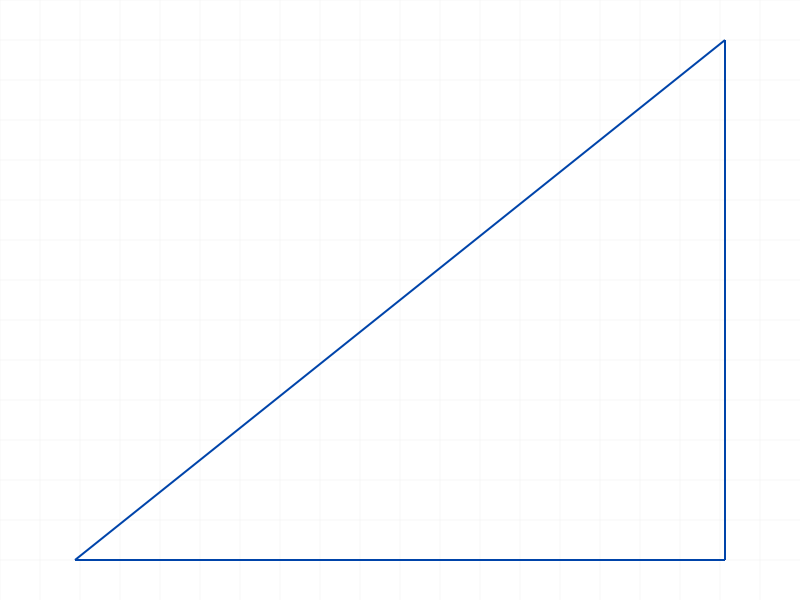
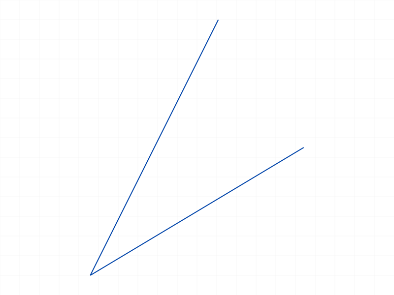
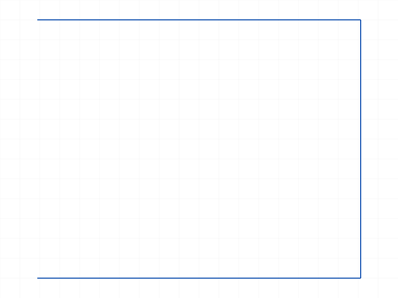
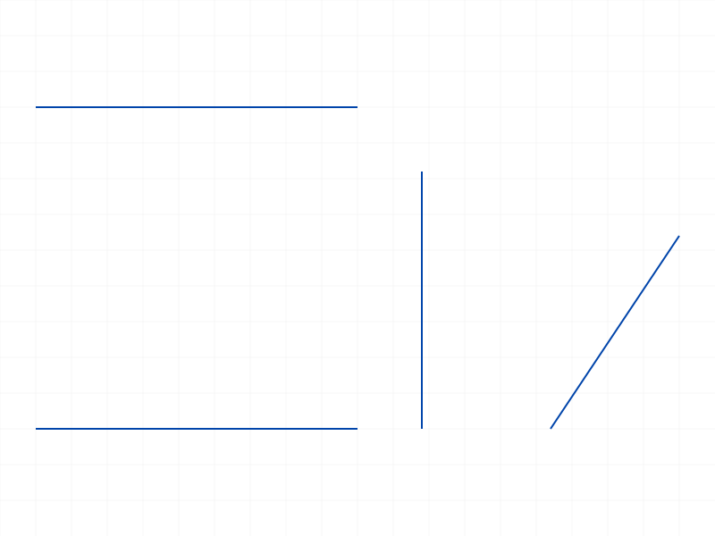
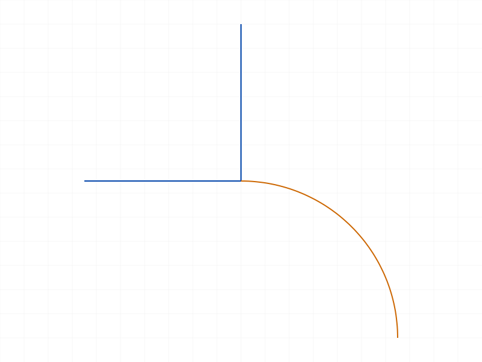
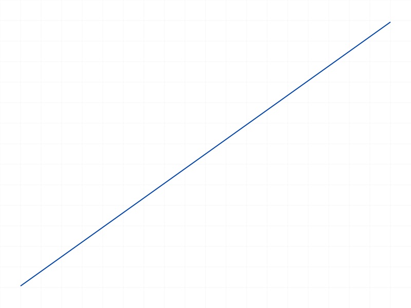
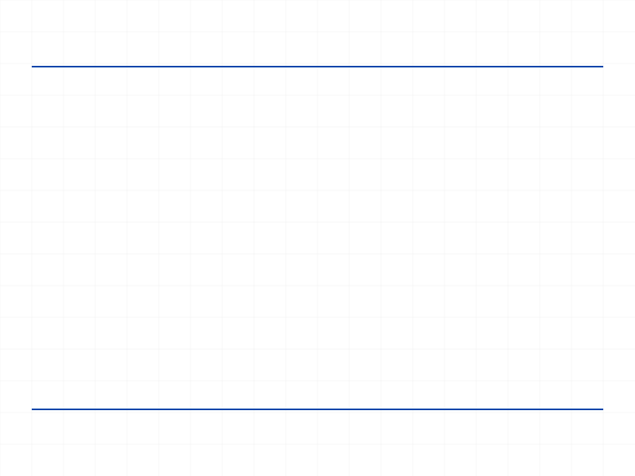

# Training: sketch.line

**Date:** 2026-04-08

## Goal

Testing `v1.sketch.line` and related update/query/delete operations.

**Methods to cover:**

- `line` — basic creation with startPos/endPos
- `line` — batch creation (array of params)
- `line` params: genFixation, genIncidence, genTangency, genVertAndHoriz
- `updateGeometry` — update line positions via `lines` array
- `getPoints` — retrieve startId/endId of a line
- `deleteObject` — delete a line

**Questions:**

- What structure nodes does a line create? (CC_Line + child CC_Points?)
- How does genVertAndHoriz work? (auto-generate horizontal/vertical constraints?)
- Does genTangency actually trigger for lines (only relevant if adjacent to arcs)?
- What IDs does a line consume? (line ID + 2 point IDs?)
- What happens with degenerate lines (startPos == endPos)?
- Can you update just startPos or endPos via updateGeometry, or must both be provided?

---

## 01 — basic line creation

Script: `scripts/01-basic-line.mjs` — ✅ line created from (0,0,0) to (50,30,0), returned ID 58.

|  |
|---|

**Data:**
- lineId=58, maxLevel=31 (info), no messages
- `getPoints` → `{ startId: 59, endId: 60 }`
- Start position: `{x:0, y:0, z:0}`, End position: `{x:50, y:30, z:0}`
- Structure: CC_Line (id=58, parent=sketch 52) with children [59, 60]
  - Child 59: CC_Point named "startPoint" at (0,0,0)
  - Child 60: CC_Point named "endPoint" at (50,30,0)
- Line members: `direction` (point: {50,30,0}), `alignment` (real: 1), `rigidSetId` (id: 0)
- Auto-constraint: node 62 is `CC_2DFixationConstraint` ("Auto_Fix") on point 59 (origin)

**📌 LLM doc:** Line creates CC_Line with two CC_Point children (startPoint, endPoint). Direction member stores the vector. Auto_Fix generated on origin point.

## 02 — batch line creation

Script: `scripts/02-batch-lines.mjs` — ✅ batch of 3 lines (triangle) returned array `[58, 66, 74]`.

|  |
|---|

**Data:**
- Result is array of 3 IDs: `[58, 66, 74]`
- Each line has its own start/end points: 58→(59,60), 66→(67,68), 74→(75,76)
- Auto-constraints generated between batch: coincidence at shared endpoints, horizontal/vertical where applicable
- ID gaps with auto-constraints: 8 between line 58 and 66 (6 IDs for constraints between them)

**📌 LLM doc:** Batch creation works — pass array of param objects. Returns array of IDs in matching order. Auto-constraints still generated between batch members.

## 03 — genFixation flag

Script: `scripts/03-genFixation-off.mjs` — ✅ genFixation=false prevents auto-fixation at origin.

|  |
|---|

**Data:**
- Line 1 (genFixation=false, from origin): 0 constraints generated
- Line 2 (default genFixation=true, from origin): Auto_Fix (CC_2DFixationConstraint) + Auto_Coinc (CC_2DCoincidentConstraint with line 1's start point)
- genFixation only applies when an endpoint touches the origin, consistent with point.md finding

## 04 — genIncidence flag

Script: `scripts/04-genIncidence.mjs` — ✅ coincidence auto-generated at shared endpoints.

|  |
|---|

**Data:**
- Line 1: (0,0,0)→(50,0,0) — Auto_Fix + Auto_H (horizontal)
- Line 2: (50,0,0)→(50,40,0) — Auto_Coinc at (50,0,0) + Auto_V (vertical)
- Line 3 (genIncidence=false): (50,40,0)→(0,40,0) — Auto_H0 (horizontal), but NO coincidence despite starting at line2's end
- 5 total constraints: Fix, H, Coinc, V, H0

**📌 LLM doc:** genIncidence=false suppresses coincidence constraint at shared endpoints. Other auto-constraints (H, V) are independent of genIncidence.

## 05 — genVertAndHoriz flag

Script: `scripts/05-genVertAndHoriz.mjs` — ✅ horizontal/vertical auto-constraints confirmed.

|  |
|---|

**Data:**
- Horizontal line (y=0 both ends): Auto_Fix + Auto_H (CC_2DHorizontalConstraint)
- Vertical line (x=60 both ends): Auto_V (CC_2DVerticalConstraint)
- Diagonal line: no H/V constraint generated (correct)
- Horizontal line with genVertAndHoriz=false: no H constraint generated despite being horizontal
- 3 total constraints: Fix, H, V (none from diagonal or genVertAndHoriz=false line)

**📌 LLM doc:** genVertAndHoriz controls horizontal/vertical auto-detection. Only triggers for axis-aligned lines. Diagonal lines are never affected.

## 06 — genTangency flag

Script: `scripts/06-genTangency.mjs` — ✅ tangency auto-constraint generated when line meets arc tangentially.

|  |
|---|

**Data:**
- Arc from (50,0,0) to (0,50,0) centered at origin
- Tangent line from (0,50,0) to (-50,50,0) — horizontal, tangent to arc end → Auto_Tan (CC_2DTangentSketchConstraint) + Auto_Coinc + Auto_H
- Non-tangent line (genTangency=false) from (0,50,0) to (0,100,0) → Auto_Coinc0 + Auto_V, NO tangency
- 6 total constraints: Fix, Tan, Coinc, H, Coinc0, V

**📌 LLM doc:** genTangency works with arcs. When a line's endpoint coincides with an arc endpoint and the line direction is tangent to the arc at that point, CC_2DTangentSketchConstraint is auto-generated.

## 07 — updateGeometry

Script: `scripts/07-update-geometry.mjs` — ✅ full update works; partial update fails.

|  |  |
| --- | --- |

**Data:**
- Full update (both startPos+endPos): result=null (VOID), maxLevel=31. Positions confirmed changed: (0,0,0)→(10,10,0) and (50,30,0)→(80,60,0)
- Partial update (startPos only, omit endPos): maxLevel=51, error 1004: `"The parameter 'endPos' must be provided in the api call!"`
- Positions unchanged after failed partial update

**📌 LLM doc:** updateGeometry for lines requires BOTH startPos and endPos. Partial updates are not supported — error 1004 if either is missing.

## 08 — deleteObject

Script: `scripts/08-delete-line.mjs` — ✅ deletion works, access to deleted line fails.

|  |  |
| --- | --- |

**Data:**
- deleteObject({ids: [line1]}) → result=null (VOID), maxLevel=31
- getPoints on deleted line → result=null, maxLevel=51
- Remaining line2 unaffected: getPoints still returns valid {startId, endId}

## 09 — edge cases

Script: `scripts/09-degenerate-line.mjs` — degenerate line succeeds (surprising), non-zero Z fails as expected.

|  |
|---|

**Data:**
- Degenerate line (start==end at (10,10,0)): result=58, maxLevel=31, NO error. Zero-length line is silently created.
- Micro line (0.001 length): result=62, maxLevel=31, succeeds
- Non-zero Z endPos: result=null, maxLevel=51, error 1014: `"The parameter 'endPos' which is a 2D point, must have a z-value of 0!"`

**📌 LLM doc:** Degenerate lines (startPos==endPos) are silently accepted — no error, no warning. Non-zero Z → error 1014 (same as sketch.point).

## 10 — ID increment pattern

Script: `scripts/10-id-increment.mjs` — ✅ consistent 4-ID gap per line with all gen flags off.

**Data:**
- All gen flags disabled (genFixation, genIncidence, genVertAndHoriz, genTangency all false)
- 5 lines: IDs 58, 62, 66, 70, 74. Gap = 4 consistently.
- Each line: lineId, lineId+1 (startPoint), lineId+2 (endPoint), lineId+3 (gap/internal)
- With auto-constraints enabled, additional IDs are consumed per constraint (2 IDs each)

**📌 LLM doc:** Each line consumes 4 IDs (line + 2 points + 1 internal). Auto-constraints add 2 IDs each on top.

---

## Coverage Checklist

- [x] line called successfully (01)
- [x] Required params tested: id, startPos, endPos (01)
- [x] genFixation tested (03)
- [x] genIncidence tested (04)
- [x] genTangency tested (06)
- [x] genVertAndHoriz tested (05)
- [x] Batch creation tested (02)
- [x] updateGeometry for lines tested (07)
- [x] getPoints for lines tested (01, 02)
- [x] deleteObject for lines tested (08)
- [x] Edge cases: degenerate, micro, non-zero Z (09)
- [x] ID increment pattern (10)
- [x] Behavioral claims verified with data
