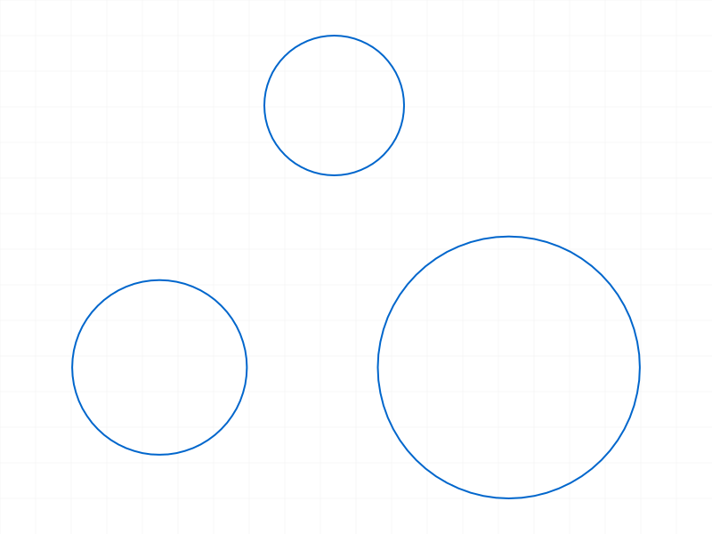
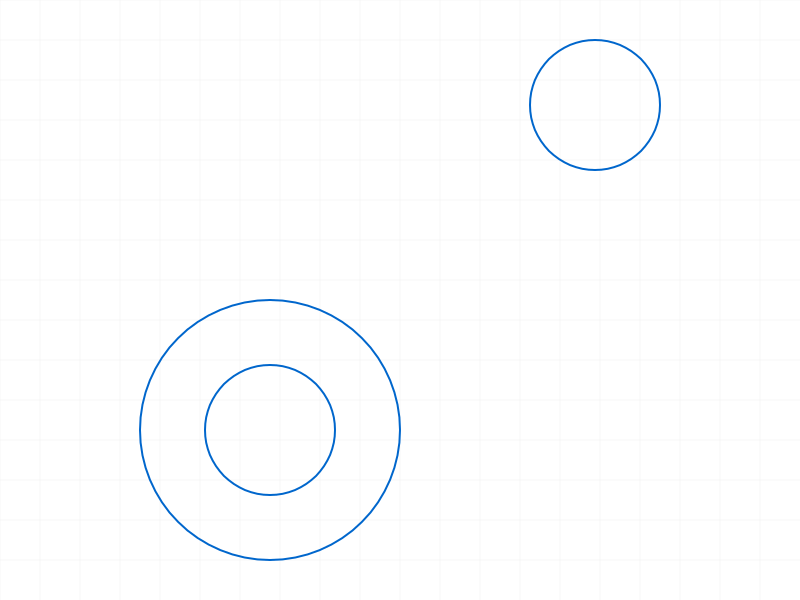
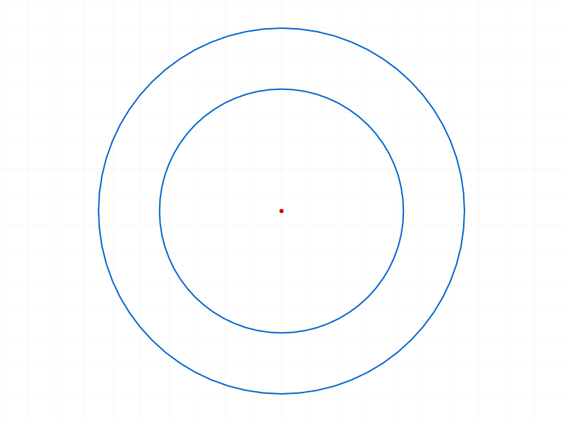
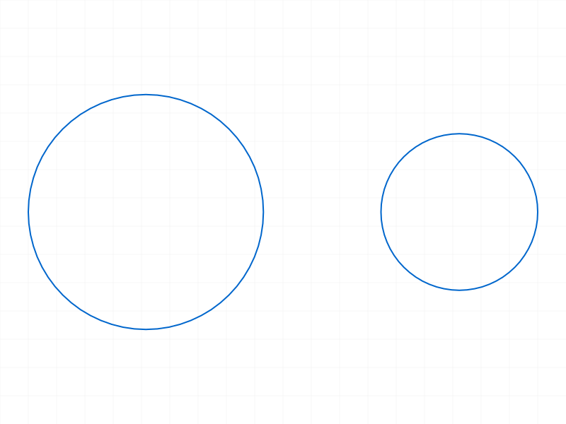
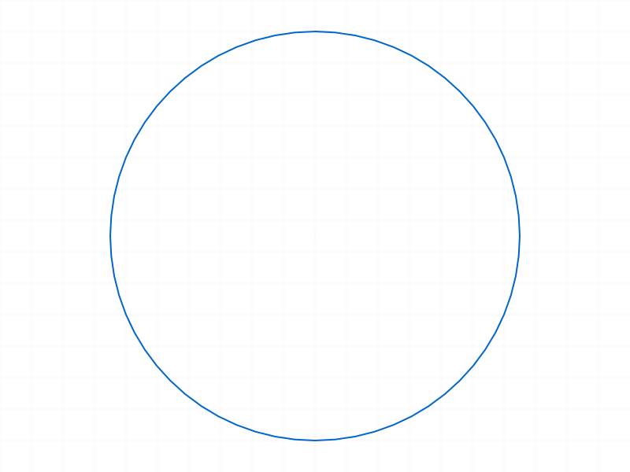
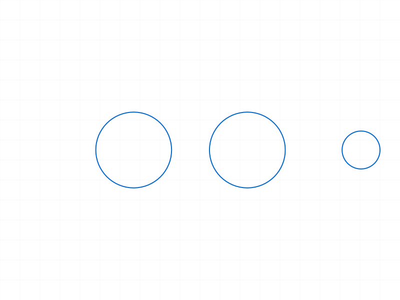

# Training: sketch.circle

**Date:** 2026-04-08

## Goal

Testing `v1.sketch.circle` and related update/query/delete operations.

**Methods to cover:**

- `circle` — basic creation with centerPos/radius
- `circle` — batch creation (array of params)
- `circle` params: genFixation, genIncidence
- `getPoints` — retrieve centerId of a circle
- `getPositions` — retrieve centerPos of a circle
- `updateGeometry` — update circle centerPos/radius
- `deleteObject` — delete a circle
- `getGeometry` — verify circle appears in circles array

**Questions:**

- What structure nodes does a circle create? (CC_Circle + child CC_Point for center?)
- How many IDs does a circle consume?
- What happens with zero/negative radius?
- Does genFixation apply when center is at origin?
- Does genIncidence trigger when center matches an existing point?
- Can you update just centerPos or just radius, or must both be provided?

---

## 01 — basic circle creation

Script: `scripts/01-basic-circle.mjs` — ✅ circle created at (30,20,0) radius 15, returned ID 58.

|  |
|---|

**Data:**
- circleId=58, maxLevel=31 (info), no messages
- `getPoints` → `{ centerId: 59 }`
- `getPositions(circleId)` → null, maxLevel=51 (ERROR — does not work on circle IDs directly)
- `getPositions(centerId=59)` → `{ pos: {x:30, y:20, z:0} }` ✅
- `getGeometry` → `{ arcs:[], circles:[58], lines:[], points:[] }`
- Structure: CC_Circle (id=58, parent=sketch 52) with one child:
  - Child 59: CC_Point named "center" at (30,20,0)
- Circle members: `radius` (real: 15), `rigidSetId` (id: 0)
- No auto-constraints (center is off-origin)

**📌 LLM doc:** Circle creates CC_Circle with one CC_Point child ("center"). getPositions does NOT work on circle IDs — must use getPoints→centerId→getPositions. This contradicts the docs which claim getPositions returns { centerPos } for circles.

## 02 — batch circle creation

Script: `scripts/02-batch-circles.mjs` — ✅ batch of 3 circles returned array `[58, 63, 66]`.

|  |
|---|

**Data:**
- Result: array of 3 IDs: `[58, 63, 66]`
- ID gaps: 5 (58→63), 3 (63→66). First gap larger due to auto-fixation at origin.
- `getGeometry` → `{ circles: [58, 63, 66] }`

**📌 LLM doc:** Batch creation works — pass array of param objects. Returns array of IDs in matching order.

## 03 — genFixation flag

Script: `scripts/03-genFixation.mjs` — ✅ genFixation controls auto-fixation at origin for circle center.

|  |
|---|

**Data:**
- Circle 1 (origin, genFix=true): ID 58 → Auto_Fix (CC_2DFixationConstraint, id=61)
- Circle 2 (origin, genFix=false): ID 63 → Auto_Coinc (CC_2DCoincidentConstraint, id=66, coincidence with circle1's center)
- Circle 3 (off-origin, genFix=true): ID 68 → no constraint
- genFixation only applies when center is at origin, consistent with point behavior

## 04 — genIncidence flag

Script: `scripts/04-genIncidence.mjs` — ✅ coincidence auto-generated when center matches existing point.

|  |
|---|

**Data:**
- Point at (30,20,0): ID 58
- Circle 1 (genInc=true, center at same pos): ID 60 → Auto_Coinc (CC_2DCoincidentConstraint, id=63)
- Circle 2 (genInc=false, center at same pos): ID 65 → no constraint
- genIncidence works cross-geometry between standalone points and circle centers

**📌 LLM doc:** genIncidence works between circle centers and existing points. Same exact-match semantics as sketch.point.

## 05 — updateGeometry

Script: `scripts/05-update-geometry.mjs` — ✅ full update works; partial updates fail.

|  |  |
| --- | --- |

**Data:**
- Full update (centerPos + radius): result=null (VOID), maxLevel=31. Center confirmed moved from (30,20,0) to (50,40,0), radius from 10 to 20.
- Radius-only update: maxLevel=51, error 1004: `"The parameter 'centerPos' must be provided in the api call!"`
- CenterPos-only update: maxLevel=51, error 1004: `"The parameter 'radius' must be provided in the api call!"`
- State unchanged after failed partial updates.

**📌 LLM doc:** updateGeometry for circles requires BOTH centerPos and radius. Partial updates are not supported — error 1004 if either is missing. Same pattern as lines.

## 06 — deleteObject

Script: `scripts/06-delete-circle.mjs` — ✅ deletion works, access to deleted circle fails.

|  |  |
| --- | --- |

**Data:**
- deleteObject({ids: [c1]}) → result=null (VOID), maxLevel=31
- getPoints on deleted circle → result=null, maxLevel=51
- Remaining circle unaffected: getPoints still returns valid { centerId }
- getGeometry shows only remaining circle

## 07 — edge cases

Script: `scripts/07-edge-cases.mjs` — zero and negative radius silently accepted; non-zero Z fails.

|  |
|---|

**Data:**
- Zero radius: result=58, maxLevel=31, NO error. Zero-radius circle created.
- Negative radius (-10): result=65, maxLevel=31, NO error. Negative radius accepted.
- Non-zero Z: result=null, maxLevel=51, error 1014: `"centerPos which is a 2D point, must have a z-value of 0!"`
- Micro radius (0.001): succeeds
- Huge radius (100000): succeeds

**📌 LLM doc:** Zero and negative radii are silently accepted — no error, no warning. Non-zero Z → error 1014.

## 08 — ID increment pattern

Script: `scripts/08-id-increment.mjs` — ✅ consistent 3-ID gap per circle with all gen flags off.

**Data:**
- All gen flags disabled: 5 circles → IDs 58, 61, 64, 67, 70. Gap = 3 consistently.
- Each circle: circleId, circleId+1 (center CC_Point), circleId+2 (internal)
- Auto-constraints add 2 IDs each on top.

**📌 LLM doc:** Each circle consumes 3 IDs (circle + center point + 1 internal). Auto-constraints add 2 IDs each.

## 09 — negative radius inspection

Script: `scripts/09-negative-radius-inspect.mjs` — negative radius stored as-is in structure.

|  |
|---|

**Data:**
- Zero radius: structure member value = 0
- Negative radius: structure member value = -10 (stored as-is, no normalization)
- Positive radius: structure member value = 10

## 10 — getPositions on circle ID

Script: `scripts/10-getPositions-circle.mjs` — confirmed: getPositions errors on circle IDs.

**Data:**
- getPositions(circleId) → null, maxLevel=51, error: `"Evaluation error in SketchAPI_v1.getPositions::PROC:[CCVM::lcm: objId not found]"`
- getPositions(centerId) → `{ pos: {x:30, y:20, z:0} }` ✅
- Docs claim getPositions returns `{ centerPos }` for circles, but the actual API errors out. Use getPoints→centerId→getPositions instead.

**📌 LLM doc:** getPositions does NOT work on circle IDs (doc discrepancy). Always use getPoints to get centerId first, then call getPositions on that.

---

## Coverage Checklist

- [x] circle called successfully (01)
- [x] Required params tested: id, centerPos, radius (01)
- [x] genFixation tested (03)
- [x] genIncidence tested (04)
- [x] Batch creation tested (02)
- [x] updateGeometry for circles tested (05)
- [x] getPoints for circles tested (01, 10)
- [x] getPositions for circles tested (01, 10) — documented discrepancy found
- [x] deleteObject for circles tested (06)
- [x] getGeometry verified (01, 02, 06)
- [x] Edge cases: zero radius, negative radius, non-zero Z, micro, huge (07, 09)
- [x] ID increment pattern (08)
- [x] Behavioral claims verified with data
