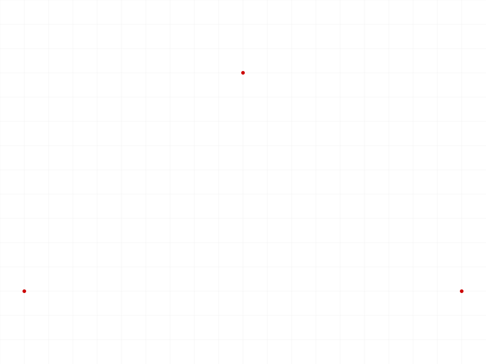
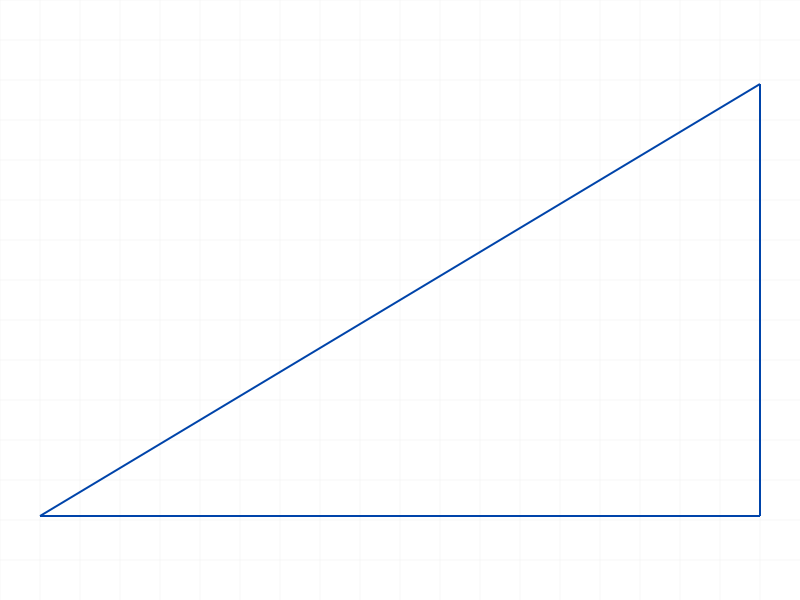
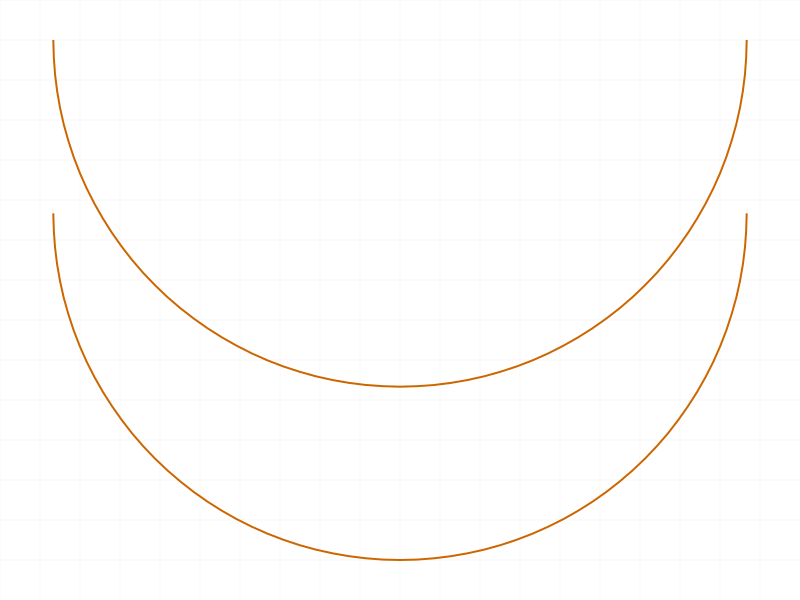
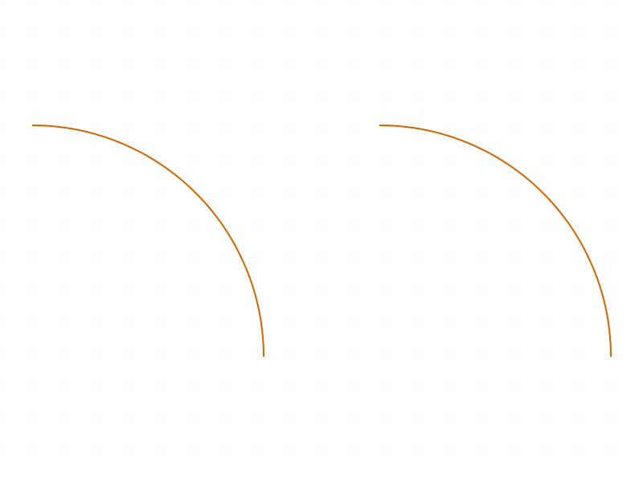
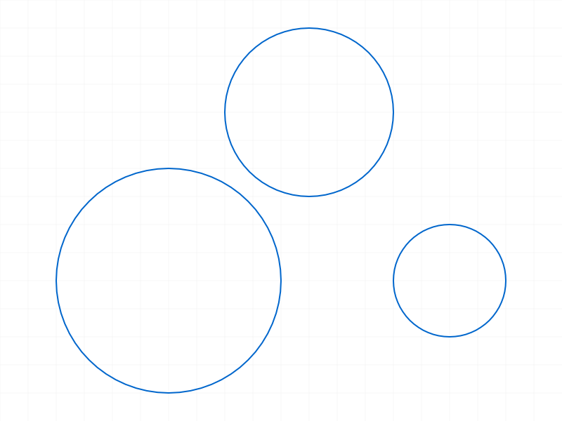
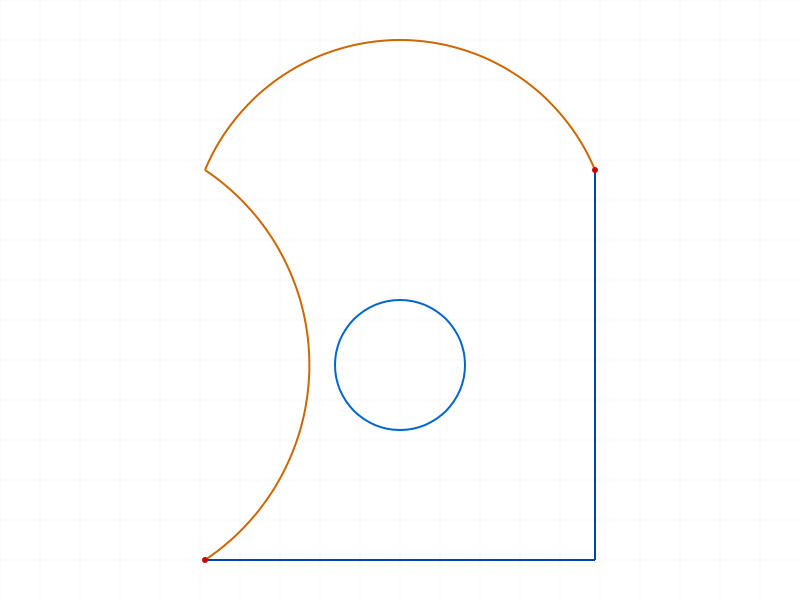

# Training: sketch.geometry

**Date:** 2026-04-08

## Goal

Testing `v1.sketch.geometry` — the batch/multi-type geometry creation API.

**Methods to cover:**

- `geometry` — create points via `points` array
- `geometry` — create lines via `lines` array
- `geometry` — create arcs via `arcsBy3Points` array
- `geometry` — create arcs via `arcsByCenter` array (with `isClockwise` flag)
- `geometry` — create circles via `circles` array
- `geometry` — mixed types in a single call (points + lines + arcs + circles)
- `geometry` — `genFixation` flag (auto-generate fixation constraints)
- `geometry` — `genIncidence` flag (auto-generate coincidence constraints)
- `geometry` — `genTangency` flag (auto-generate tangency constraints)
- `geometry` — `genVertAndHoriz` flag (auto-generate vertical/horizontal constraints)
- Return value structure: `{ points: id[], lines: id[], arcsBy3Points: id[], arcsByCenter: id[], circles: id[] }`

**Questions:**

- Does the return match the input type ordering? (Are IDs returned in input order?)
- How does this compare to calling individual `sketch.point`, `sketch.line`, etc.?
- What happens with empty arrays?
- What happens when mixing types — do auto-constraint flags apply across types?
- Do the genFixation/genIncidence/genTangency/genVertAndHoriz flags default to TRUE as documented?
- Edge cases: duplicate positions, overlapping geometry, zero-radius circles

---

## 01 — points

Script: `scripts/01-points.mjs` — ✅ Created 3 points. Result: `{ points: [58,62,64], lines: [], arcsBy3Points: [], arcsByCenter: [], circles: [] }`. maxLevel=31 (info).

|  |
|---|

**Data:** Return always includes all 5 type arrays even when only one type was created. Empty arrays for unused types.

---

## 02 — lines

Script: `scripts/02-lines.mjs` — ✅ Created 3 lines forming a triangle. Result: `{ lines: [58,66,74] }` (other arrays empty). maxLevel=31.

|  |
|---|

**Data:** Line IDs are spaced 8 apart (58→66→74), suggesting each line creates multiple internal objects (likely start/end points + the line itself).

---

## 03 — arcsBy3Points

Script: `scripts/03-arcsBy3Points.mjs` — ✅ Created 2 arcs by 3 points. Result: `{ arcsBy3Points: [58,65] }`. maxLevel=31.

|  |
|---|

**Data:** Arc IDs spaced 7 apart. Parameters: `startPos`, `endPos`, `midPos` (mid is a point ON the arc, not the center).

---

## 04 — arcsByCenter

Script: `scripts/04-arcsByCenter.mjs` — ✅ Created 2 arcs by center. First clockwise, second counter-clockwise. Result: `{ arcsByCenter: [58,65] }`. maxLevel=31.

|  |
|---|

**Data:** `isClockwise` defaults to TRUE per docs. Both arcs created successfully with different orientations.

---

## 05 — circles

Script: `scripts/05-circles.mjs` — ✅ Created 3 circles at different positions/radii. Result: `{ circles: [58,63,66] }`. maxLevel=31.

|  |
|---|

**Data:** Circle IDs not evenly spaced (58→63→66), spacing varies likely due to auto-constraint generation differences per circle.

---

## 06 — mixed types in a single call

Script: `scripts/06-mixed-types.mjs` — ✅ Created 2 points + 2 lines + 1 arcBy3Points + 1 arcByCenter + 1 circle in one call. All returned correctly in their respective arrays.

|  |
|---|

**Data:** Result: `{ points: [58,62], lines: [64,74], arcsBy3Points: [84], arcsByCenter: [91], circles: [102] }`. Counts match: 2+2+1+1+1=7 geometry items. IDs are in ascending order across all types. maxLevel=31.

📌 LLM doc: Document that mixed-type calls work — all 5 type arrays can be populated simultaneously.

---

## 07 — empty arrays and missing fields

Script: `scripts/07-empty-arrays.mjs` — ✅ Three tests:

1. **All empty arrays** (`points: [], lines: [], circles: []`): Returns `{ points: [], lines: [], ... }` with all 5 arrays empty. No error. maxLevel=31.
2. **No geometry arrays at all** (just `{ id: skId }`): Same — returns all 5 empty arrays. No error.
3. **Mix of empty and populated**: Only the populated array has IDs.

**Learned:** `geometry()` is tolerant — empty arrays, missing arrays, even no geometry arrays at all are valid. Always returns the full 5-array result object.

📌 LLM doc: Empty/missing arrays are fine — no error. Always returns full 5-array structure.

---

## 08–10 — genFlag structure dumps (initial attempt)

Scripts: `scripts/08-genFixation-off.mjs`, `scripts/09-genIncidence-off.mjs`, `scripts/10-genVertAndHoriz-off.mjs` — ✅ Ran successfully, dumped structure trees (27–42KB JSON files). These were my initial approach using `getSketchGeometry` (which doesn't exist — had to fix to dump `r.structure` instead).

Used as input for constraint analysis in scripts 16–18.

---

## 11–12 — constraint analysis (flawed approach)

Scripts: `scripts/11-constraint-analysis.mjs`, `scripts/12-genTangency-off.mjs` — Found 0 constraints because my tree-walking code searched for `typeName` instead of `class`. Later corrected in script 16.

---

## 13 — comparison: individual APIs vs batch geometry()

Script: `scripts/13-compare-individual.mjs` — ✅ Created identical geometry (1 line + 1 circle) via individual `sketch.line`/`sketch.circle` calls vs a single `geometry()` call.

**Data:**
- Individual: lineId=58, circleId=66. getGeometry: `{ lines: [58], circles: [66] }`
- Batch: result `{ lines: [75], circles: [83] }`. getGeometry: `{ lines: [75], circles: [83] }`
- Both produce equivalent results via `getGeometry`. IDs differ because they're separate sketches.

**Learned:** `geometry()` is functionally equivalent to calling individual APIs. It's a convenience batch wrapper.

📌 LLM doc: `geometry()` produces same results as individual sketch.line/sketch.circle/etc calls.

---

## 14 — return ID ordering

Script: `scripts/14-return-ordering.mjs` — ✅ Created 3 points + 2 lines + 2 circles. All ID arrays are in strictly ascending order.

**Data:** points=[58,62,64] (ascending ✓), lines=[66,78] (ascending ✓), circles=[86,89] (ascending ✓).

**Learned:** IDs are returned in creation order (ascending), matching input array order.

📌 LLM doc: Return IDs preserve input array ordering (ascending).

---

## 15 — edge cases: zero-radius, degenerate line, negative radius

Script: `scripts/15-edge-zero-radius.mjs` — ✅ All three edge cases succeed silently:

1. **Zero-radius circle**: Returns circle ID (58). maxLevel=31, no error messages.
2. **Degenerate line** (start==end): Returns line ID (65). maxLevel=31, no error.
3. **Negative radius circle**: Returns circle ID (69). maxLevel=31, no error.

**Learned:** `geometry()` does NOT validate degenerate input. Zero-length lines, zero-radius circles, and negative-radius circles are accepted silently. This matches behavior observed in individual `sketch.circle` training.

📌 LLM doc: No input validation for degenerate geometry — zero-radius circles, zero-length lines, negative radius all accepted silently.

---

## 16 — finding constraint representation in structure

Script: `scripts/16-find-constraints.mjs` — ✅ Deep-searched the structure tree for constraint-related strings.

**Key discovery:** Constraints are stored in `r.structure.tree[<id>]` nodes with `class` field (not `typeName`):
- `CC_2DFixationConstraint` (name: `Auto_Fix`)
- `CC_2DHorizontalConstraint` (name: `Auto_H`)
- `CC_2DCoincidentConstraint` (name: `Auto_Coinc`)
- `CC_2DVerticalConstraint` (name: `Auto_V`)

**Learned:** Structure tree uses `class` for constraint type identification, not `typeName`.

---

## 17–18 — constraint flag comparison (flawed multi-part approach)

Scripts: `scripts/17-constraint-flags-proper.mjs`, `scripts/18-constraint-flags-isolated.mjs` — Script 17 used multiple parts in one script, causing constraint accumulation in the shared structure tree. Script 18 also suffered from accumulation. Results were misleading. Fixed in scripts 19–20 with truly isolated runs.

---

## 19 — all gen flags OFF (isolated run)

Script: `scripts/19-allflags-off-isolated.mjs` — ✅ Single part, single sketch, all gen flags set to `false`.

**Data:** 0 constraints found in structure tree.

**Learned:** Setting all 4 gen flags to `false` completely suppresses auto-constraint generation. Confirmed working.

---

## 20 — all gen flags ON / defaults (isolated run)

Script: `scripts/20-allflags-on-isolated.mjs` — ✅ Single part, single sketch, all defaults (gen flags TRUE).

**Data:** 4 constraints found:
- `CC_2DFixationConstraint` (Auto_Fix) id=62
- `CC_2DHorizontalConstraint` (Auto_H) id=64
- `CC_2DCoincidentConstraint` (Auto_Coinc) id=70
- `CC_2DVerticalConstraint` (Auto_V) id=72

For 2 lines (one horizontal, one vertical, sharing an endpoint at origin):
- Fixation on the origin point
- Horizontal constraint on the horizontal line
- Coincident constraint on the shared endpoint
- Vertical constraint on the vertical line

📌 LLM doc: gen flags work as documented. Default TRUE generates fixation, h/v, coincidence, tangency constraints automatically. Set to false to suppress.

---

## Coverage Check

- [x] API called successfully (scripts 01-06)
- [x] Every required parameter tested (id + at least one geometry array)
- [x] All 5 geometry types tested individually (01-05) and mixed (06)
- [x] `isClockwise` flag tested (04)
- [x] All 4 gen flags tested (08-10, 17-20)
- [x] Empty/missing arrays tested (07)
- [x] Comparison with individual APIs (13)
- [x] Return ordering verified (14)
- [x] Edge cases tested (15)
- [x] Behavioral claims verified with data (filewrite dumps throughout)

**No update method exists for `geometry()`** — it's a creation-only API. Individual geometry items can be updated via `sketch.updateGeometry` (separate API, not in scope for this task).
