# Training: sketch.constraint — all constraint types

**Date:** 2026-04-08

## Goal

Testing `v1.sketch.constraint` across all 14 constraint types.

**Methods to cover:**

- `constraint` — types: COINCIDENT, COLINEAR, CONCENTRIC, EQUAL_LENGTH, EQUAL_RADIUS, FIXATION, HORIZONTAL, MIDPOINT, PARALLEL, PERPENDICULAR, SPLINE_FIT_POINT, SYMMETRY, TANGENT, VERTICAL
- `constraint` params: id, type, geomIds, name
- Batch creation (array of constraint params)
- Each constraint type's geomIds requirements (points vs curves vs mixed)

**Questions:**

- What geomIds does each constraint type expect? (points, lines, circles, arcs?)
- Can you name constraints? Does the name appear in the structure?
- What happens with invalid geomIds combinations (wrong count, wrong geometry type)?
- Does the constraint return an ID for all types, or VOID for some?
- Can you batch-create multiple constraints of different types in one call?
- What happens when a constraint is redundant or over-constraining?

---

## 01 — HORIZONTAL on a line

Script: `scripts/01-horizontal-line.mjs` — ✅ Works. Diagonal line constrained horizontal.

| 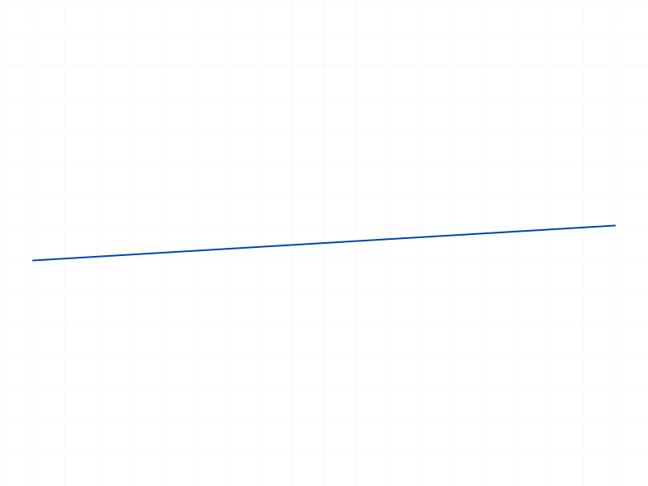 |
|---|

**Data:** result=62 (constraint ID), maxLevel=31 (info), no messages.

---

## 02 — VERTICAL on a line

Script: `scripts/02-vertical-line.mjs` — ✅ Works. Slightly off-vertical line constrained vertical.

| 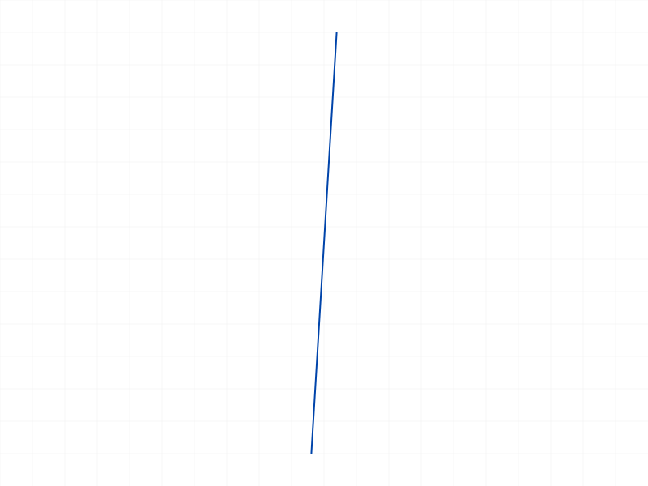 |
|---|

**Data:** result=62, maxLevel=31.

---

## 03 — COINCIDENT between two points

Script: `scripts/03-coincident-points.mjs` — ✅ Works after fixing `getPoints` call.

| 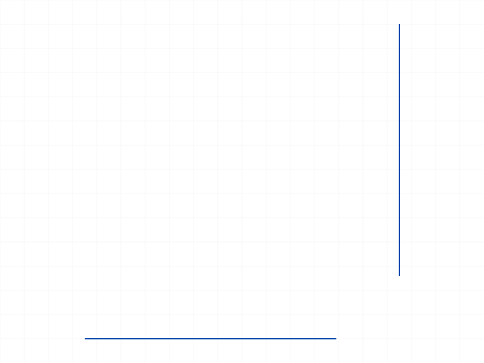 |
|---|

**Data:** `getPoints({ id: lineId })` returns `{ startId, endId }` — takes geometry ID directly, NOT sketch ID. Constraint result=66, maxLevel=31.

**📌 LLM doc:** `getPoints` takes geometry ID directly, returns `{ startId, endId }` for lines, `{ startId, endId, centerId }` for arcs, `{ centerId }` for circles. Document in constraint doc as prerequisite for point-based constraints.

---

## 04 — PARALLEL between two lines

Script: `scripts/04-parallel.mjs` — ✅ As documented.

| 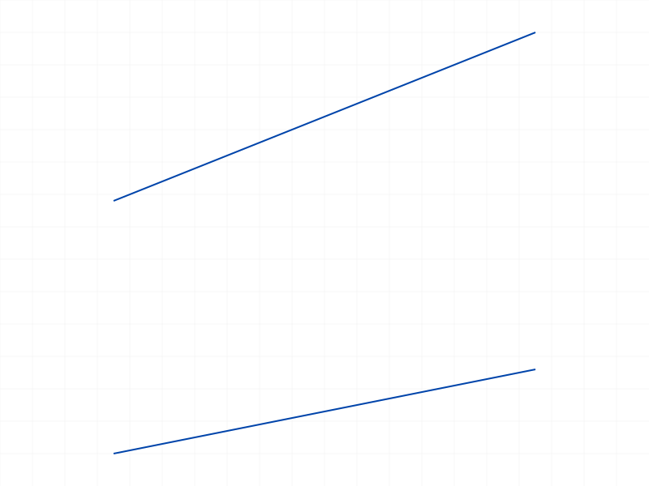 |
|---|

**Data:** result=66, maxLevel=31.

---

## 05 — PERPENDICULAR between two lines

Script: `scripts/05-perpendicular.mjs` — ✅ As documented.

| 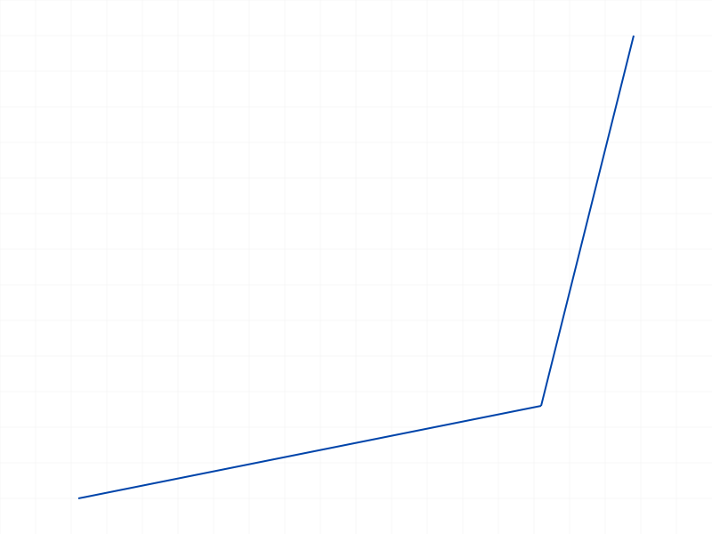 |
|---|

**Data:** result=66, maxLevel=31.

---

## 06 — FIXATION on point and line

Script: `scripts/06-fixation.mjs` — ✅ Works on both points and curves.

| 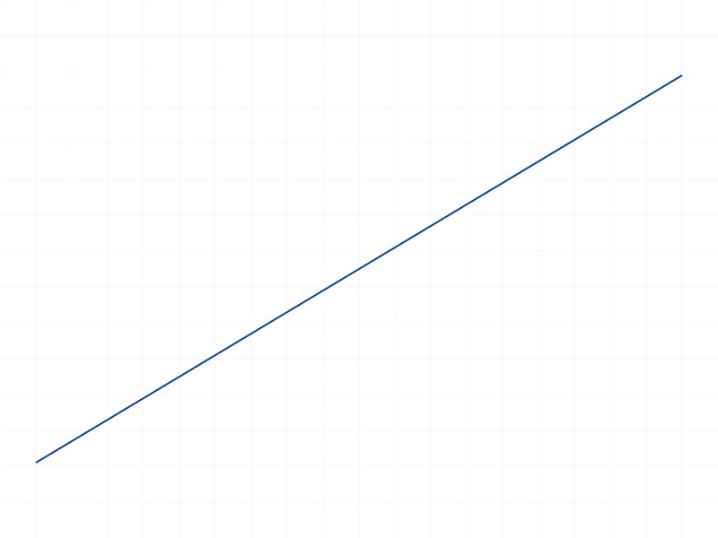 |
|---|

**Data:** Fix point: result=62, maxLevel=31. Fix line: result=64, maxLevel=31. Both return a constraint ID. FIXATION takes a single geomId.

**📌 LLM doc:** FIXATION works on both individual points and full curves. Takes exactly 1 geomId.

---

## 07 — COLINEAR between two lines

Script: `scripts/07-colinear.mjs` — ✅ As documented.

| 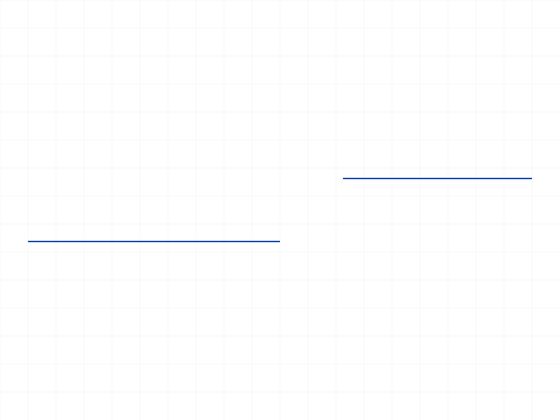 |
|---|

**Data:** result=66, maxLevel=31. Makes two separate lines lie on the same infinite line.

---

## 08 — EQUAL_LENGTH between two lines

Script: `scripts/08-equal-length.mjs` — ✅ Works. Positions unchanged because system is underconstrained.

| 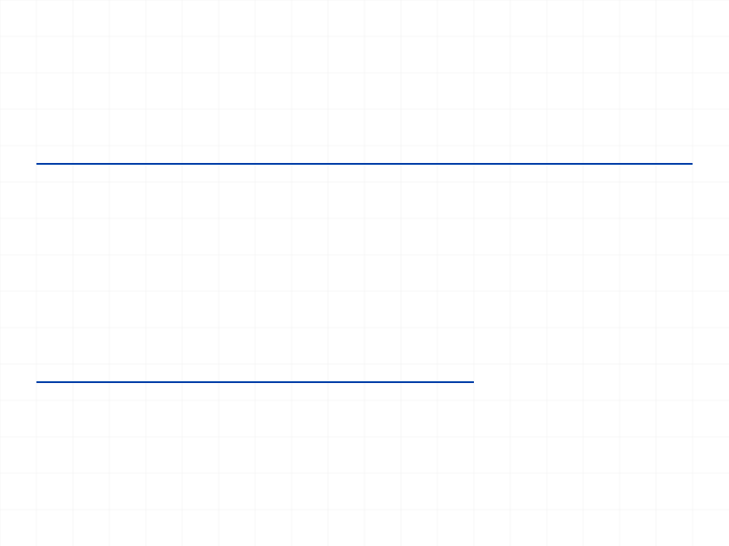 |
|---|

**Data:** result=66, maxLevel=31. Before: line1=40u, line2=60u. After: positions identical — constraint stored but solver has enough DOF to not move geometry. See `files/08-equal-length-equal-length-response.json`.

**📌 LLM doc:** Constraints don't necessarily move geometry immediately — in underconstrained systems the solver may leave geometry in place. The constraint is still active and will affect future solving.

---

## 09 — TANGENT between arc and line

Script: `scripts/09-tangent.mjs` — ✅ Works.

| 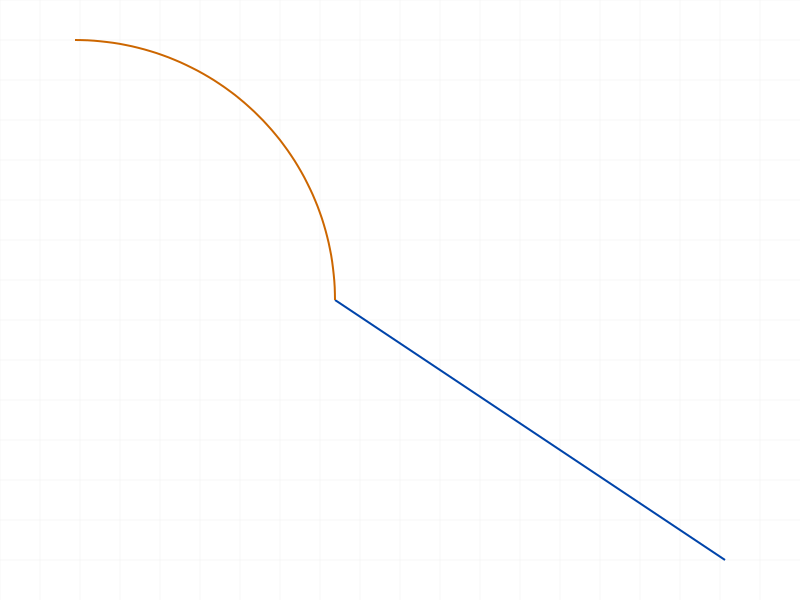 |
|---|

**Data:** result=67, maxLevel=31. geomIds: [arcId, lineId].

---

## 10 — CONCENTRIC between two circles

Script: `scripts/10-concentric.mjs` — ✅ Works.

| 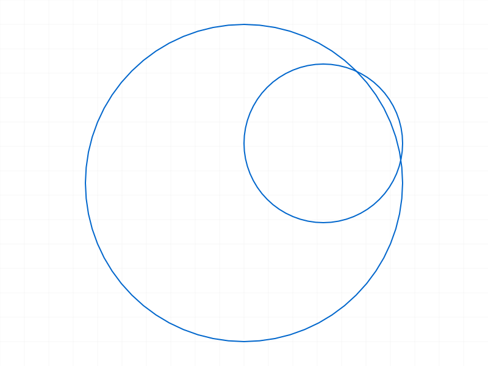 |
|---|

**Data:** result=64, maxLevel=31. geomIds: [circleId1, circleId2].

---

## 11 — EQUAL_RADIUS between two circles

Script: `scripts/11-equal-radius.mjs` — ✅ Works. `getPositions` returns null for circles.

| 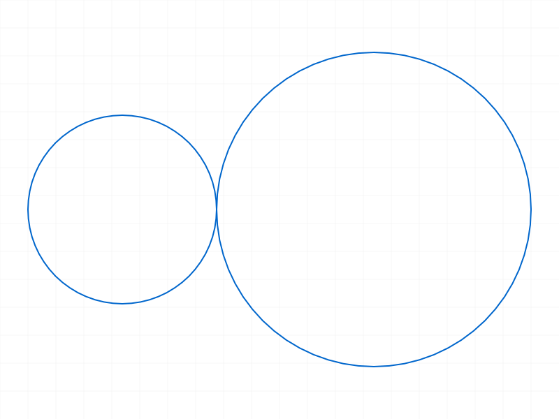 |
|---|

**Data:** result=64, maxLevel=31. `getPositions({ id: circleId })` returns null — circles don't have start/end positions. Use `getPoints` to get centerId instead. See `files/11-equal-radius-equal-radius-response.json`.

**📌 LLM doc:** `getPositions` returns null for circles. For circle position info, use `getPoints` (returns `{ centerId }`).

---

## 12 — SYMMETRY between two points about a line

Script: `scripts/12-symmetry.mjs` — ✅ after fixing geomIds order.

| 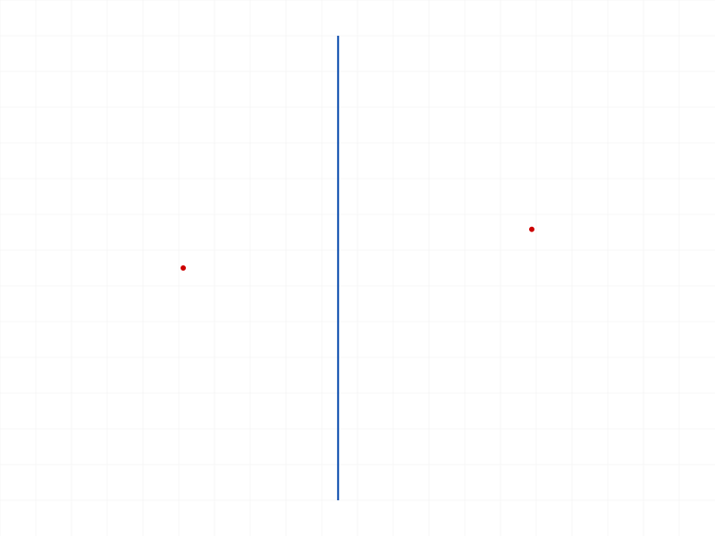 |
|---|

**Data:** First attempt with `[pt1, pt2, axis]` failed: "First geometry id of a symmetry constraint must be a line." Correct order: `[symmetryLine, geom1, geom2]`. result=66, maxLevel=31.

**📌 LLM doc:** SYMMETRY geomIds order is `[symmetryLine, geom1, geom2]` — the line MUST be first. Error message: "First geometry id of a symmetry constraint must be a line."

---

## 13 — MIDPOINT: point on midpoint of line

Script: `scripts/13-midpoint.mjs` — ✅ Works.

| 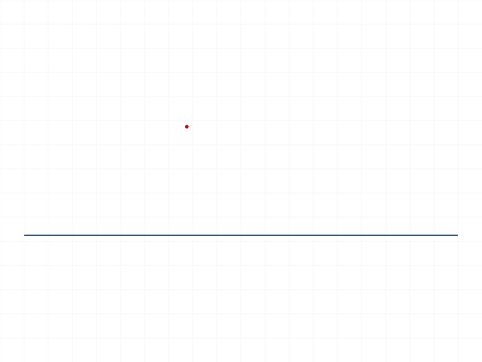 |
|---|

**Data:** result=64, maxLevel=31. geomIds: `[pointId, lineId]`. Point position unchanged at (30,20) despite line midpoint being at (40,0) — underconstrained system, constraint stored but not solved visually.

---

## 14 — Named constraint and batch creation

Script: `scripts/14-named-constraint.mjs` — ✅ Both work.

| 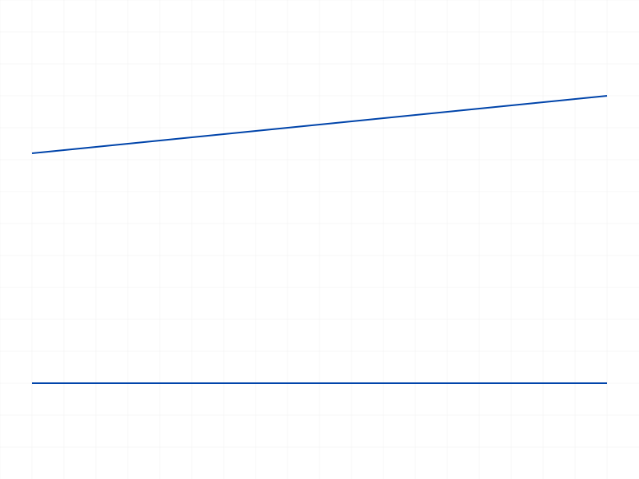 |
|---|

**Data:** Named: `name: 'MyHoriz'` accepted, result=66, maxLevel=31. Batch: passed array of 2 constraint objects (HORIZONTAL + PARALLEL), result=[68,70] — array of IDs in order. maxLevel=31.

**📌 LLM doc:** Batch creation works by passing an array of param objects. Returns array of IDs in matching order. Different constraint types can be mixed in one batch call.

---

## 15 — Error cases

Script: `scripts/15-error-cases.mjs` — Mixed results.

**PARALLEL with 1 line:** result=62, maxLevel=31 — **silently accepted!** No error. The constraint was created but is likely meaningless (or self-referential). This is surprising.

**Invalid type:** result=null, maxLevel=51 (ERROR). Message: code 1013, lists all valid type values.

**Redundant HORIZONTAL:** Both succeed — first result=64, second result=66. maxLevel=31 both. **No redundancy check.** Two identical constraints created on the same geometry.

**📌 LLM doc:** No validation on geomIds count for most constraint types — passing too few silently succeeds. No redundancy detection — duplicate constraints are silently created. Invalid `type` values return error code 1013 with the full enum list.

---

## 16 — HORIZONTAL/VERTICAL on two points

Script: `scripts/16-horiz-vert-points.mjs` — ✅ Both work.

| 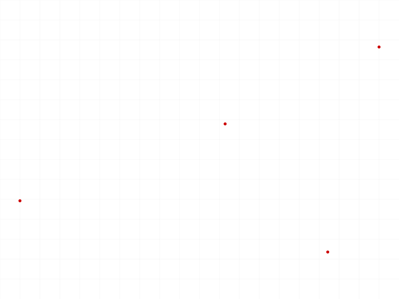 |
|---|

**Data:** HORIZONTAL on [pt1, pt2]: result=62, maxLevel=31. VERTICAL on [pt3, pt4]: result=68, maxLevel=31. Positions unchanged (underconstrained). Confirms that HORIZONTAL/VERTICAL work on both lines (1 geomId) and point pairs (2 geomIds).

**📌 LLM doc:** HORIZONTAL and VERTICAL accept either 1 geomId (a line) or 2 geomIds (two points). On a line: constrains the line direction. On two points: constrains them to same Y (HORIZONTAL) or same X (VERTICAL).

---

## 17 — COINCIDENT: point on line

Script: `scripts/17-coincident-point-on-line.mjs` — ✅ Works.

| 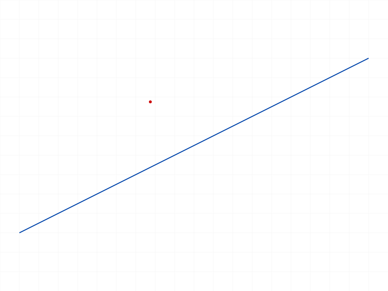 |
|---|

**Data:** result=64, maxLevel=31. COINCIDENT with `[pointId, lineId]` constrains the point to lie on the line. Position unchanged at (30,30) — underconstrained. COINCIDENT works for point-point AND point-on-curve.

**📌 LLM doc:** COINCIDENT works for point-point (2 point IDs) and point-on-curve (1 point ID + 1 curve ID).

---

## 18 — TANGENT between two arcs

Script: `scripts/18-tangent-arcs.mjs` — ✅ Works.

| 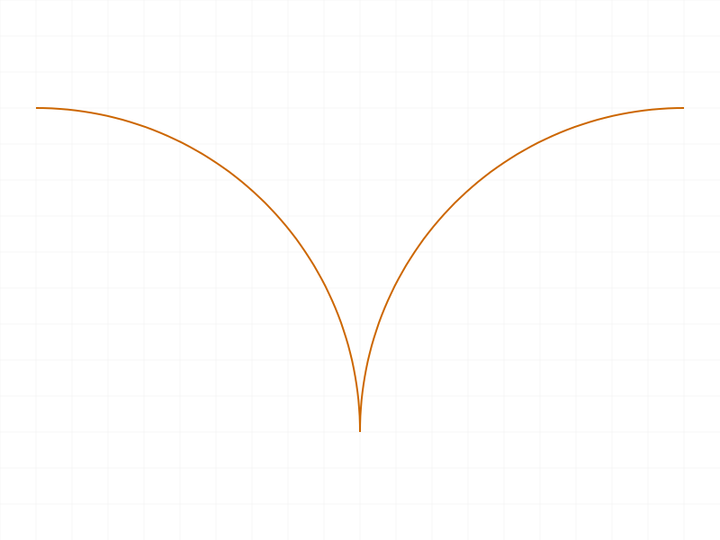 |
|---|

**Data:** result=70, maxLevel=31. TANGENT works between arc-line and arc-arc.

---

## 19 — SYMMETRY between two lines about an axis

Script: `scripts/19-symmetry-lines.mjs` — ✅ Works.

| 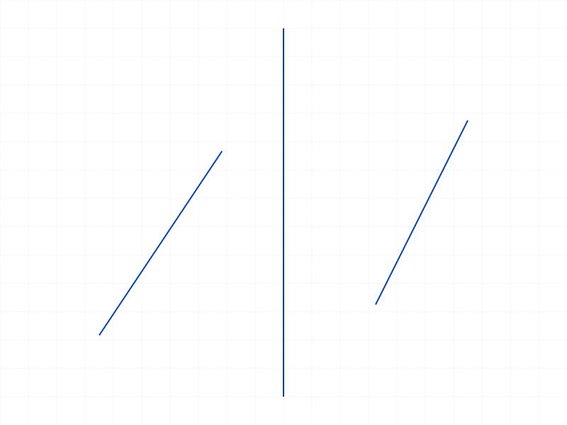 |
|---|

**Data:** result=70, maxLevel=31. SYMMETRY works with lines, not just points. geomIds: `[axisLine, line1, line2]`.

---

## 20 — SPLINE_FIT_POINT (untestable)

Script: `scripts/20-spline-fit-point.mjs` — ❌ Cannot test — no spline creation API found.

| 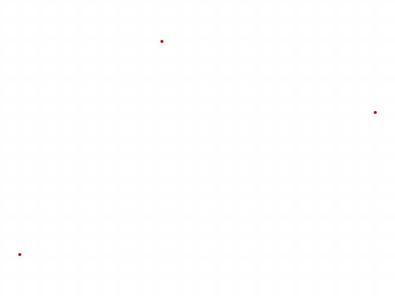 |
|---|

**Data:** Tried `sketch.geometry` with `splines` key (silently ignored, empty results) and with `type: 'SPLINE'` (treated as regular points). No sketch-level spline creation API exists in the documented API surface. SPLINE_FIT_POINT constraint type exists but is untestable without spline geometry.

**📌 LLM doc:** SPLINE_FIT_POINT is listed as a valid constraint type but there is no documented sketch spline creation API. May be for internal use or require undocumented APIs.

---

## Summary of constraint type geomIds requirements

| Type | geomIds | Notes |
|---|---|---|
| HORIZONTAL | `[lineId]` or `[pt1, pt2]` | Line direction or point-pair alignment |
| VERTICAL | `[lineId]` or `[pt1, pt2]` | Line direction or point-pair alignment |
| COINCIDENT | `[pt1, pt2]` or `[pt, curve]` | Point-point or point-on-curve |
| COLINEAR | `[line1, line2]` | Two lines on same infinite line |
| CONCENTRIC | `[circle1, circle2]` | Two circles/arcs share center |
| EQUAL_LENGTH | `[line1, line2]` | Two lines same length |
| EQUAL_RADIUS | `[circle1, circle2]` | Two circles/arcs same radius |
| FIXATION | `[geomId]` | Pin point or curve in place |
| MIDPOINT | `[pointId, lineId]` | Point at midpoint of line |
| PARALLEL | `[line1, line2]` | Two lines same direction |
| PERPENDICULAR | `[line1, line2]` | Two lines at 90° |
| SYMMETRY | `[axisLine, geom1, geom2]` | **Line MUST be first** |
| TANGENT | `[curve1, curve2]` | Arc-line or arc-arc tangency |
| SPLINE_FIT_POINT | `[spline, point]` (presumed) | **Untestable** — no spline creation API |

## Key behavioral findings

1. **All constraint types return a constraint ID** (never VOID), maxLevel=31 on success.
2. **No geomIds count validation** — passing too few geomIds silently succeeds for most types.
3. **No redundancy check** — duplicate constraints on the same geometry are silently created.
4. **Underconstrained systems** — constraints are stored but the solver may not move geometry when DOFs remain. The constraint is still active.
5. **SYMMETRY order matters** — axis line must be the first geomId or you get an error.
6. **Invalid type** returns error code 1013 with the full enum list.
7. **Batch creation** works — pass array of param objects, get array of IDs.
8. **Name parameter** accepted — names the constraint object.
