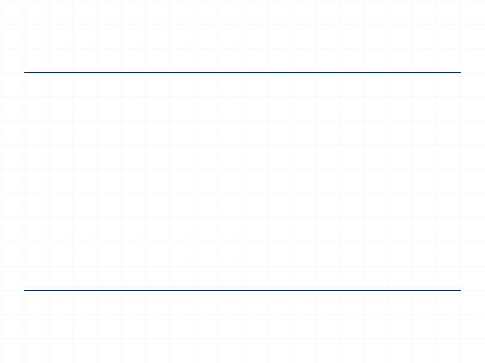
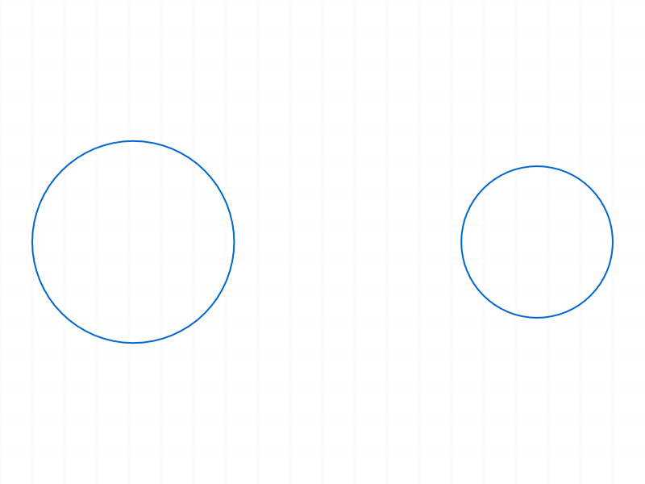
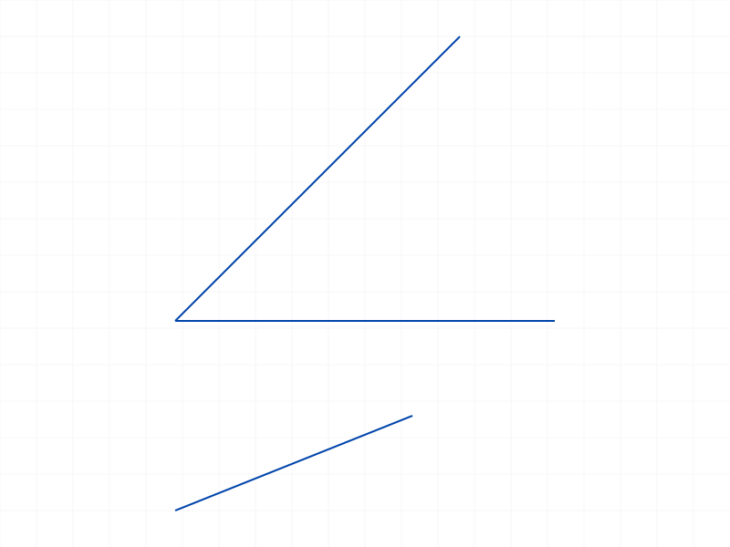
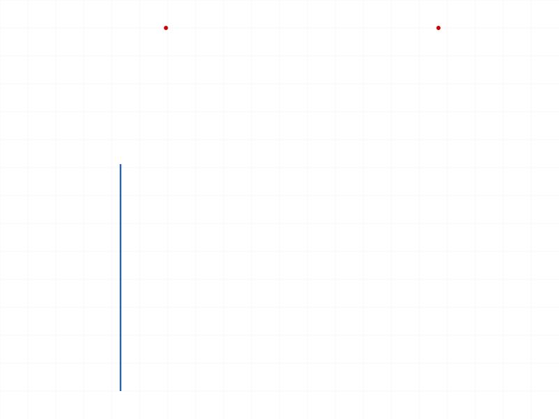

# Training: sketch.updateDimension

**Date:** 2026-04-09

## Goal

Deep dive into `v1.sketch.updateDimension`. Prior dimension session (2026-04-08) covered basics — this session focuses on edge cases, cross-type behavior, and expression handling.

**Methods to cover:**

- `updateDimension` — numeric value across all 7 dimension types
- `updateDimension` — expression value (`@expr.name` format)
- `updateDimension` — error paths (invalid ID, wrong ID type, missing params, zero/negative values)
- `updateDimension` — multiple updates, after feature close, deleted dimensions
- `updateDimension` — string formats ('45deg', '50mm'), batch mode

**Questions:**

- Does behavior differ across dimension types? → No, uniform behavior.
- What happens with zero, negative, very large values? → All accepted, no validation.
- What happens with non-existent expressions? → Accepted silently.
- Does batch mode work? → No.
- Can you update after closeFeature? → Yes.
- What does the structure tree show after update? → paramName changes on expression link.

---

## 01 — Basic OFFSET update (numeric)

Script: `scripts/01-basic-offset-update.mjs` — ✅ updateDimension works. Returns `result: 0` (number, not boolean false — it's the integer 0), `maxLevel: 31`, empty messages array. Two successive updates both succeed.

|  |
|---|

**Data:** Both updates return identical envelope: `{result: 0, messages: [], maxLevel: 31}` (see `files/01-basic-offset-update-update-response.json`, `files/01-basic-offset-update-second-update-response.json`).

---

## 02 — RADIUS and DIAMETER update

Script: `scripts/02-radius-diameter-update.mjs` — ✅ Both RADIUS and DIAMETER updates succeed with same envelope: result=0, maxLevel=31, empty messages.

|  |
|---|

---

## 03 — ANGLE and ANGLEOX update

Script: `scripts/03-angle-angleox-update.mjs` — ✅ ANGLE with numeric (radians), ANGLEOX with numeric, and ANGLE with string `'60deg'` all succeed. maxLevel=31 for all.

|  |
|---|

**Learned:** String degree format (`'60deg'`) works with updateDimension, not just numeric radians.

**📌 LLM doc:** updateDimension accepts both numeric radians and `'Ndeg'` string format for angle dimensions.

---

## 04 — HORIZONTAL_DISTANCE and VERTICAL_DISTANCE update

Script: `scripts/04-hdist-vdist-update.mjs` — ✅ Both succeed, same envelope.

|  |
|---|

---

## 05 — Error paths: invalid IDs and missing params

Script: `scripts/05-error-invalid-id.mjs` — All 6 error cases return `result: null, maxLevel: 51`.

| Wrong ID | Error code | Message |
|---|---|---|
| Sketch ID | 1001 | "wrong id type! Provide only following id types: ["dimension"]" |
| Part ID | 1001 | same |
| Line ID | 1001 | same |
| Bogus ID (99999) | 0+1006 | "ToId() didn't get an existing or valid id" + "invalid id" |
| Missing `value` | 1004 | "parameter 'value' must be provided" |
| Missing `id` | 1004 | "parameter 'id' must be provided" |

**📌 LLM doc:** Error code 1001 = wrong ID type (accepts only "dimension" type). Code 1004 = required param missing. Code 1006 = ID not found. Both `id` and `value` are required.

---

## 06 — Zero, negative, very large, very small values

Script: `scripts/06-zero-negative-values.mjs` — ✅ ALL accepted with maxLevel=31. Zero, negative, very large (999999), very small (0.0001). Even RADIUS with zero and negative values — no validation whatsoever.

**📌 LLM doc:** No server-side value validation. Zero, negative, and extreme values are silently accepted for all dimension types including RADIUS. The value is stored but the sketch solver doesn't run, so invalid values (like negative radius) don't cause immediate errors — they'd fail at solve time if the solver ever ran.

---

## 07 — Expression and string value formats

Script: `scripts/07-expression-values.mjs` — ✅ ALL formats accepted with maxLevel=31:

| Value | Accepted? |
|---|---|
| `'@expr.myWidth'` (valid expression) | ✅ |
| `'@expr.doesNotExist'` (non-existent) | ✅ |
| `'@'` (bare at-sign) | ✅ |
| `'@expr.myWidth * 2'` (math expression) | ✅ |
| `'hello'` (nonsense string) | ✅ |
| `'50'` (numeric string) | ✅ |

**📌 LLM doc:** updateDimension accepts ANY string value without validation. Non-existent expression references, malformed strings, and nonsense are all silently stored. Errors would only surface at solve time.

---

## 08 — After feature close/reopen

Script: `scripts/08-after-feature-close.mjs` — ✅ updateDimension works identically whether the sketch feature is open, closed (via `part.closeFeature`), or reopened. All return result=0, maxLevel=31.

**📌 LLM doc:** Feature open/close state does not affect updateDimension. Dimensions can be updated regardless of sketch feature state.

---

## 09 — Multiple rapid updates

Script: `scripts/09-multiple-rapid-updates.mjs` — ✅ 10 sequential updates (10, 20, 30...100) all succeed. No degradation.

**Data:** All 10 updates return `{result: 0, maxLevel: 31}` (see `files/09-multiple-rapid-updates-rapid-updates.json`).

---

## 10 — Return value structure deep inspection

Script: `scripts/10-return-value-structure.mjs` — Envelope keys: `result, messages, maxLevel, structure, graphic`. Structure is present (full tree), graphic is null/absent.

**Data:** `result` is `typeof number`, value `0`. Not a boolean false — it's the integer 0 which is "sketch not solved" as a solve-state indicator. Structure tree is ~34KB (see `files/10-return-value-structure-structure-after-update.json`).

**📌 LLM doc:** Return envelope includes full structure tree. `result` is number 0 (not boolean), meaning "sketch unsolved". `graphic` is absent. Structure includes the dimension node with `startPt`, `endPt`, `angle`, `paramName` members.

---

## 11 — Deleted dimension

Script: `scripts/11-deleted-dimension.mjs` — After `deleteObject({ids: [dimId]})`, updating returns maxLevel=51 with codes 0+1006 ("ToId() didn't get an existing or valid id" + "invalid id"). Same error as bogus ID.

---

## 12 — Expression readback via getExpression

Script: `scripts/12-structure-tree-dim-value.mjs` — `getExpression` with the dimension's name returns `{expression: "", value: null}` for all attempted names. The dimension's stored value is NOT accessible through the expression system by name alone.

**Learned:** Dimension names and expression names are separate namespaces. `getExpression({name: 'myDim'})` does not return the dimension's value.

---

## 13 — Batch mode (array input)

Script: `scripts/13-batch-update-attempt.mjs` — Batch update fails with maxLevel=51: "Evaluation error in SketchAPI_v1.updateDimension::PROC:[CCVM::ldm: objId not found]". The array is interpreted as a single param object, not as batch input.

**📌 LLM doc:** updateDimension does NOT support batch/array mode. Unlike `dimension()` which accepts arrays, `updateDimension` takes only a single `{id, value}` object. Passing an array causes an internal error.

---

## 14 — Structure tree dim node search (fixed format)

Script: `scripts/14-verify-value-in-structure.mjs` — Structure tree is `{root, tree: {"id": node, ...}}` flat dictionary, not nested. The findNode approach from earlier was wrong. Dimension nodes exist at `tree[dimId]`.

---

## 15 — Degree string and unit suffix formats

Script: `scripts/15-degree-string-format.mjs` — ALL formats accepted: '45deg', '90deg', '0deg', '360deg' for ANGLE, and '50mm' for OFFSET. All return maxLevel=31.

**📌 LLM doc:** updateDimension accepts unit-suffixed strings: `'45deg'` for angles, `'50mm'` for lengths. All accepted without error.

---

## 16 — Expression readback (v2)

Script: `scripts/16-verify-stored-value.mjs` — Confirmed that `getExpression` with common name patterns (myDim, Sketch.myDim, Dim1, distance1) all return `{expression: "", value: null}`. The dimension value is not readable through the expression API.

---

## 17 — Expression link in structure tree

Script: `scripts/17-expression-link-verify.mjs` — After `updateDimension({value: '@expr.myWidth'})`:
- `paramName.value` = `"@value"` — NOT the expression name, but the literal string `"@value"`
- After updating back to numeric (50), `paramName.value` = `""` (empty)

**📌 LLM doc:** When linked to an expression via `@expr.name`, the dimension's `paramName` in the structure tree becomes `"@value"` (a constant marker, not the expression name). When updated with a numeric value, paramName resets to empty.

---

## 18 — Constraint ID rejected

Script: `scripts/18-constraint-dim-update.mjs` — Geometric constraint ID correctly rejected with code 1001: "wrong id type! Provide only following id types: ["dimension"]".

---

## Coverage Checklist

- [x] Called successfully across all 7 dimension types (OFFSET, RADIUS, DIAMETER, ANGLE, ANGLEOX, H_DIST, V_DIST)
- [x] Both required params tested (id, value)
- [x] Numeric, string, expression, unit-suffixed formats tested
- [x] Error paths: wrong ID types, deleted dim, missing params, bogus IDs
- [x] Edge cases: zero, negative, very large, very small, nonsense strings
- [x] After feature close/reopen
- [x] Multiple rapid updates
- [x] Batch mode (fails)
- [x] Structure tree inspection — paramName behavior documented
- [x] No updateDimension delete method exists (use deleteObject)
- [x] Behavioral claims verified with data (filewrite dumps, log values)
