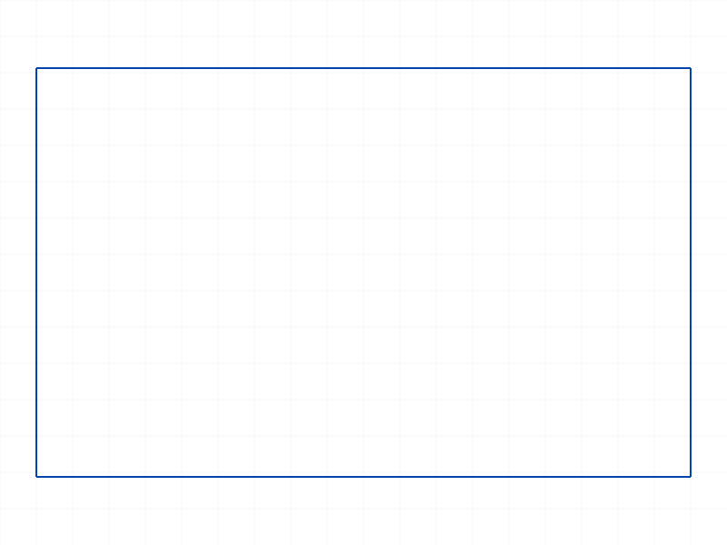
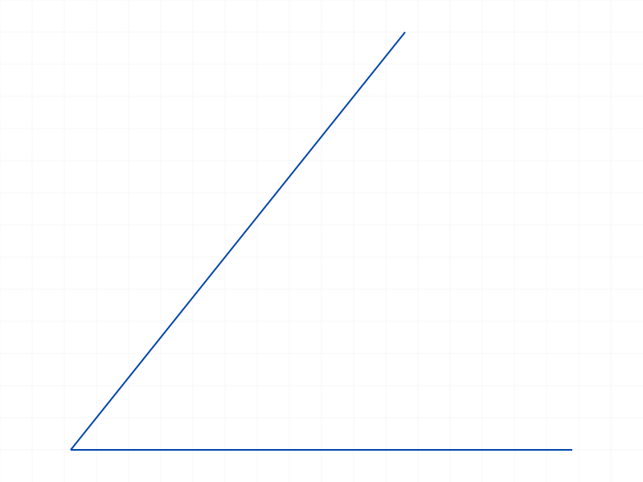

# Training: sketch.updateDimensionPosition

**Date:** 2026-04-09

## Goal

Testing `v1.sketch.updateDimensionPosition` — moves the dimension text/annotation position.

**Methods to cover:**

- `updateDimensionPosition` — basic call with valid dimension ID and pos
- params: `id` (dimension ID), `pos` ([x, y, z])
- Return value: VOID with maxLevel=31 (per existing LLM doc claim)
- Verify the position actually changes in structure tree (dimPt member)
- Test with different dimension types (OFFSET, RADIUS, ANGLE, etc.)
- Error cases: wrong ID type, invalid pos, missing params, deleted dimension

**Questions:**

- Does `pos` actually update the `dimPt` member in the structure tree?
- Does it work for all dimension types (linear, radial, angle)?
- What happens with out-of-range positions (far away, negative, [0,0,0])?
- Can you call it on a dimension in a closed feature?
- What ID types does it reject?
- Does it work on dimensions that haven't been solved?

---

## 01 — basic OFFSET dimension

Script: `scripts/01-basic-offset.mjs` — ✅ Works as documented.

|  |
|---|

**Data:** `result: null` (VOID), `maxLevel: 31`. dimPt changed from `{x:40, y:8, z:0}` to `{x:50, y:60, z:0}` (see `files/01-basic-offset-initial-structure.json` and `files/01-basic-offset-after-structure.json`). Expression changed from `"GetSE([0,0,8,[0,0.5]])"` to `"{50,60,0}"`.

**Learned:** The API works. Updates `dimPt` in the structure tree. Replaces the computed `GetSE(...)` expression with a literal `{x,y,z}` string.
**📌 LLM doc:** Basic behavior, return value, dimPt expression replacement.

## 02 — RADIUS dimension

Script: `scripts/02-radius-dim.mjs` — ✅ Works on CC_RadialFeatureDimension.

|  |
|---|

**Data:** dimPt changed from `{x:68, y:30, z:0}` to `{x:70, y:50, z:0}`. Expression changed to `"{70,50,0}"`. Class: `CC_RadialFeatureDimension`.

**Note:** First attempt failed because `sketch.circle` uses `centerPos` not `center`.

## 03 — ANGLE dimension

Script: `scripts/03-angle-dim.mjs` — ✅ Works on CC_AngularFeatureDimension.

|  |
|---|

**Data:** dimPt from `{x:9.01, y:4.33, z:0}` to `{x:25, y:25, z:0}`. Class: `CC_AngularFeatureDimension`.

## 04 — wrong ID types

Script: `scripts/04-wrong-id-type.mjs` — ✅ Clear error for all wrong types.

All wrong ID types (sketch, part, line, constraint) return the same error:
- `maxLevel: 51`, code 1001: `"The parameter \"id\" has a wrong id type! Provide only following id types: [\"dimension\"]"`

**📌 LLM doc:** Error code 1001 for wrong ID type.

## 05 — missing params

Script: `scripts/05-missing-params.mjs` — ✅ Clear errors for missing params.

- Missing `pos`: code 1004: `"The parameter \"pos\" must be provided in the api call!"`
- Missing `id`: code 1004: `"The parameter \"id\" must be provided in the api call!"`
- Empty `{}`: same as missing id (code 1004)

**📌 LLM doc:** Error codes for missing params.

## 06 — extreme positions

Script: `scripts/06-extreme-positions.mjs` — ✅ All XY positions accepted, Z≠0 fails.

- `[0,0,0]` → accepted, dimPt = `{0,0,0}`, maxLevel=31
- `[99999,99999,0]` → accepted, dimPt = `{99999,99999,0}`, maxLevel=31
- `[-100,-200,0]` → accepted, dimPt = `{-100,-200,0}`, maxLevel=31
- `[40,25,50]` (Z≠0) → **FAILS**, maxLevel=51, dimPt unchanged

**📌 LLM doc:** No validation on XY range. Z must be 0.

## 07 — closed feature

Script: `scripts/07-closed-feature.mjs` — ✅ Works on closed feature.

**Data:** `result: null, maxLevel: 31`, dimPt updated to `{50,60,0}` even after `closeFeature`.

**Learned:** Feature open/close state does not matter, same as `updateDimension`.

## 08 — multiple consecutive updates

Script: `scripts/08-multiple-updates.mjs` — ✅ Each update overwrites the previous.

All 5 sequential position updates succeeded. Each `dimPt` value exactly matches the input `pos`. No accumulation or drift.

## 09 — deleted dimension (first attempt — bad API call)

Script: `scripts/09-deleted-dim.mjs` — ⚠️ The `deleteObject` call used `id` instead of `ids` (plural), so the delete failed silently. The subsequent `updateDimensionPosition` succeeded because the dim was never actually deleted.

## 10 — non-zero Z investigation

Script: `scripts/10-nonzero-z-detail.mjs` — ✅ Clear error message.

Any Z≠0 (even 0.001) returns: code 1014, `"The parameter \"pos\" which is a 2D point, must have a z-value of 0!"`. dimPt unchanged. Z=0 succeeds normally.

**📌 LLM doc:** Z must be exactly 0, code 1014 error.

## 11 — HORIZONTAL_DISTANCE and VERTICAL_DISTANCE

Script: `scripts/11-hdist-vdist-dims.mjs` — ✅ Both work.

- HORIZONTAL_DISTANCE: dimPt updated to `{40,-15,0}`, maxLevel=31
- VERTICAL_DISTANCE: dimPt updated to `{95,25,0}`, maxLevel=31

## 12 — ANGLEOX dimension

Script: `scripts/12-angleox-dim.mjs` — ✅ Works. CC_AngularFeatureDimension.

dimPt updated from `{45,0,0}` to `{30,-10,0}`. Same class as ANGLE.

## 13 — DIAMETER dimension

Script: `scripts/13-diameter-dim.mjs` — ✅ Works. CC_DiameterFeatureDimension.

dimPt updated from `{68,30,0}` to `{65,55,0}`. Note: DIAMETER has its own class (`CC_DiameterFeatureDimension`) distinct from RADIUS (`CC_RadialFeatureDimension`).

## 14 — deleted dimension (corrected)

Script: `scripts/14-deleted-dim-verify.mjs` — ✅ Proper error on deleted dim.

After `deleteObject({ ids: [dimId] })` succeeds (maxLevel=31), the dim node is removed from the structure tree. `updateDimensionPosition` on the deleted ID returns: `maxLevel: 51`, code 0 WARNING "ToId()/TOID() didn't get an existing or valid id" + code 1006 ERROR "An element of parameter \"id\" has an invalid id!"

**📌 LLM doc:** Error on deleted dim — codes 0+1006.

## 15 — expression pattern after updateDimensionPosition

Script: `scripts/15-expression-still-set.mjs` — ✅ Confirms expression replacement pattern.

After `updateDimensionPosition({ id, pos: [123, 456, 0] })`:
- OFFSET dimPt expression: `"{123,456,0}"` (was `"{40,25,0}"` from prior update)
- RADIUS dimPt expression: `"{77,88,0}"`

Expression is always the literal `{x,y,z}` string matching the pos values.

## 16 — initial dimPt expressions (before any update)

Script: `scripts/16-initial-expression.mjs` — ✅ Shows auto-computed expressions.

Initial dimPt expressions (set by the server at creation time):
- OFFSET: `"GetSE([0,0,8,[0,0.5]])"` → value `{40,8,0}`
- HORIZONTAL_DISTANCE: `"GetSE([0,0,8,[0,0.5]])"` → value `{40,58,0}`
- RADIUS: `"GetSE([1,0],[0,3])"` → value `{58,30,0}`

**📌 LLM doc:** After `updateDimensionPosition`, the `GetSE(...)` formula is replaced with a literal position. This is a permanent change — the auto-positioning behavior is lost.

---

## Summary of Findings

1. **Works on all 7 dimension types**: OFFSET, HORIZONTAL_DISTANCE, VERTICAL_DISTANCE, RADIUS, DIAMETER, ANGLE, ANGLEOX
2. **Return value**: `result: null` (VOID), `maxLevel: 31` on success
3. **Structure tree**: updates `dimPt` member to exact input position
4. **Expression replacement**: replaces auto-computed `GetSE(...)` expression with literal `{x,y,z}` — this is irreversible (no way to restore auto-positioning)
5. **Z must be 0**: any non-zero Z fails with code 1014
6. **No XY validation**: any XY values accepted (negative, zero, huge)
7. **Feature-state independent**: works with open or closed features
8. **Wrong ID type**: code 1001, only accepts `"dimension"` type IDs
9. **Missing params**: code 1004 for missing `id` or `pos`
10. **Deleted dimension**: code 1006 "invalid id"
