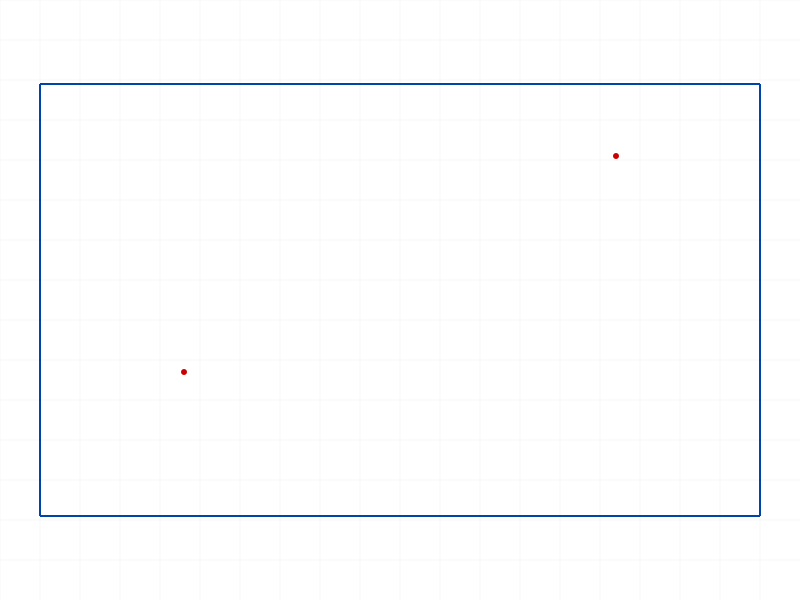
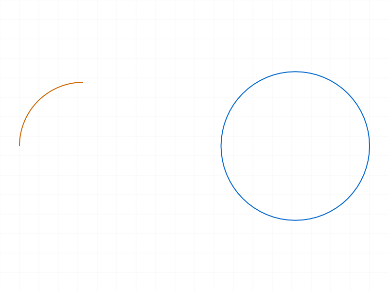
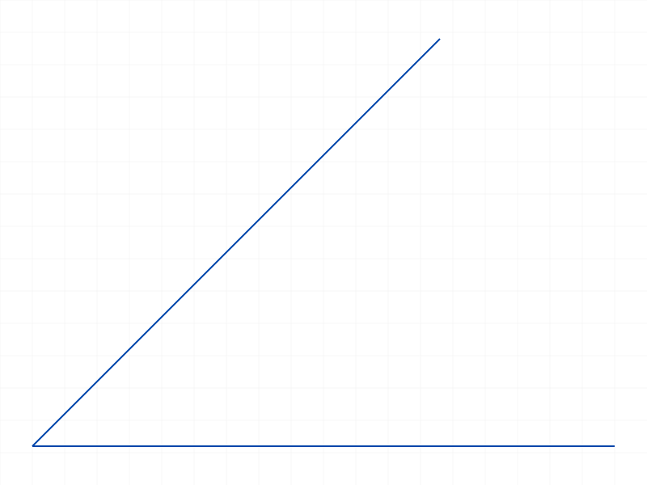
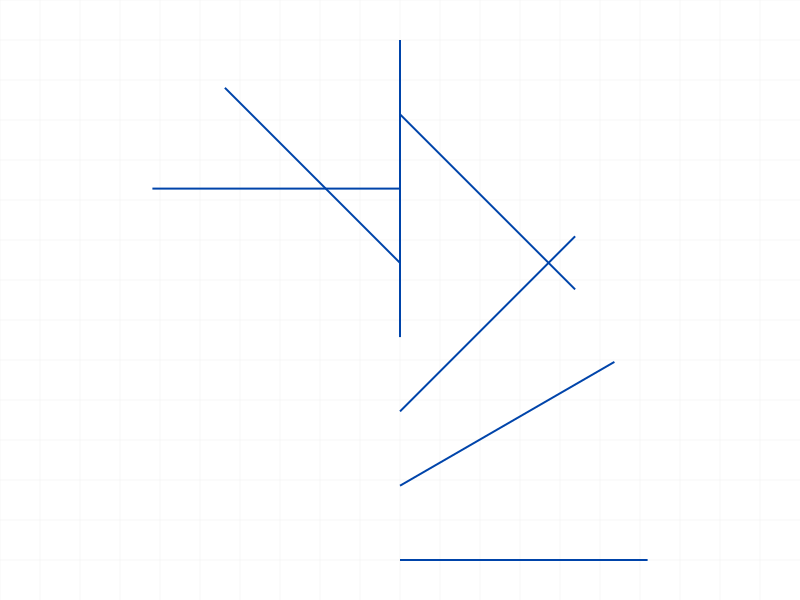
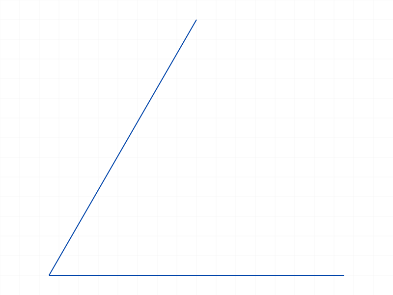

# Training: Dimension Types

**Date:** 2026-04-09

## Goal

Deep study of each dimension type's behavior: RADIUS, DIAMETER, OFFSET, HORIZONTAL_DISTANCE, VERTICAL_DISTANCE, ANGLE, ANGLEOX.

**Questions to answer:**

- What does auto-calculated value compute for each type? Can we read back the value?
- OFFSET: how does it behave with non-parallel lines? With mixed geometry (line+point)?
- HORIZONTAL_DISTANCE / VERTICAL_DISTANCE: what do they measure for a diagonal line? How do they handle negative directions?
- RADIUS vs DIAMETER: are the auto-calculated values related by factor 2?
- ANGLE: how does dimPos select the sector? What values result from acute vs obtuse angles?
- ANGLE reflex: what value is stored?
- ANGLEOX: which direction is 0°? What's the range?
- Can dimensions read back their values via structure tree?
- What happens if you put OFFSET on perpendicular lines?

---

## 01 — OFFSET basic variants

Script: `scripts/01-auto-values-offset.mjs` — ✅ all 5 OFFSET variants succeed (maxLevel=31).

Tested: 1 line, 2 parallel lines, 2 points, line+point, 2 perpendicular lines. All work.

|  |
|---|

---

## 02 — OFFSET structure analysis

Script: `scripts/02-offset-read-values.mjs` — ✅ all 6 OFFSET dims created. `getExpression` fails on all dim IDs (maxLevel=51) — dims are NOT expressions.

**Data (from structure members):** All OFFSET dims are `CC_LinearFeatureDimension` with:
- `orientationType: 2` (OFFSET-specific)
- `startPt`/`endPt` — the measurement endpoints (line endpoints or point positions)
- `angle` — measurement direction in radians (matches the line's geometric angle)
- `paramName: "@value"` — reference to internal value
- `dimPt` — auto-positioned label location (computed by `GetSE(...)` expression)

**📌 LLM doc:** `getExpression` does not work on dimension IDs. Dimension values live in the structure tree, not the expression system.

---

## 03 — Reading dimension values

Script: `scripts/03-read-dim-value.mjs` — `getExpression` with various ID/name combos all fail or return null. After `updateDimension`, still can't read value via `getExpression`.

**Learned:** No API exists to read back the current numeric value of a dimension. The value is stored internally but not exposed. For RADIUS/DIAMETER, the `value` and `radius` structure members reflect geometry, not the constraint.

---

## 04 — HORIZONTAL_DISTANCE and VERTICAL_DISTANCE on various geometry

Script: `scripts/04-horiz-vert-diagonal.mjs` — ✅ all 8 dims created. HD and VD work on diagonal, horizontal, vertical lines and point pairs.

**Data (`files/04-horiz-vert-diagonal-hd-vd-summary.json`):**

| Dim | orientationType | angle | Measures |
|-----|----------------|-------|----------|
| HD on diagonal (10,20)→(80,60) | 1 | 0 | dx=70 |
| VD on diagonal (10,20)→(80,60) | 0 | π/2 | dy=40 |
| HD on horizontal (0,0)→(100,0) | 1 | 0 | dx=100 |
| VD on vertical (0,0)→(0,80) | 0 | π/2 | dy=80 |
| HD on vertical line | 1 | 0 | dx=0 (!) |
| VD on horizontal line | 0 | π/2 | dy=0 (!) |
| HD between 2 points (30,10)→(70,50) | 1 | 0 | dx=40 |
| VD between 2 points | 0 | π/2 | dy=40 |

**📌 LLM doc:** HD always measures X projection (angle=0, orientationType=1). VD always measures Y projection (angle=π/2, orientationType=0). Both work on lines regardless of orientation — even HD on a vertical line produces a dimension (measuring 0). No error for degenerate cases.

---

## 05 — RADIUS and DIAMETER values

Script: `scripts/05-radius-diameter-values.mjs` — ✅ all 4 dims created on circle (r=35) and arc (r=30).

**Data (`files/05-radius-diameter-values-radius-diameter-summary.json`):**

| Dim | Class | value | radius | center |
|-----|-------|-------|--------|--------|
| RADIUS on circle | `CC_RadialFeatureDimension` | 35 | 35 | (50,50,0) |
| DIAMETER on circle | `CC_DiameterFeatureDimension` | 70 | 35 | (50,50,0) |
| RADIUS on arc | `CC_RadialFeatureDimension` | 30 | 30 | (-50,50,0) |
| DIAMETER on arc | `CC_DiameterFeatureDimension` | 60 | 30 | (-50,50,0) |

**📌 LLM doc:** RADIUS → `CC_RadialFeatureDimension` (value = radius). DIAMETER → `CC_DiameterFeatureDimension` (value = 2 × radius). Both store `radius` (actual geometry) and `value` (dimension reading). Both store `center`. The `value` member reflects geometry, not constraint — does NOT change after `updateDimension`.

|  |
|---|

---

## 06 — ANGLE sector selection with dimPos

Script: `scripts/06-angle-sectors.mjs` — ✅ auto, acute dimPos, and obtuse dimPos work. `reflex: 'TRUE'` (string) fails.

**Data (`files/06-angle-sectors-angle-sectors.json`):** ANGLE uses `CC_AngularFeatureDimension` with members: `startPt`, `endPt`, `cornerPt`, `ccw`, `sector`, `paramName: "@userValue"`.

Note: ANGLE uses `paramName: "@userValue"` (not `"@value"` like linear dims).

- Auto (no dimPos): sector=0, ccw=1 — acute angle, CCW direction
- dimPos in acute zone: sector=0, ccw=1
- dimPos in obtuse zone (below x-axis): sector=3, ccw=0

**📌 LLM doc:** `dimPos` selects the sector (which angle to measure). Without `dimPos`, auto-selects sector 0 (acute). Sector numbering: 0-3, mapped to the 4 quadrants around the intersection. `ccw` indicates measurement direction.

|  |
|---|

---

## 07 — ANGLEOX on lines at various angles

Script: `scripts/07-angleox.mjs` — ✅ 7 of 8 succeed. **ANGLEOX at exactly 0° fails** (maxLevel=51).

**Error for 0°:** "Division by zero!" in SetSE evaluation. The dimension IS created (has an ID) but with an error.

**Data (`files/07-angleox-angleox-summary.json`):** ANGLEOX uses `CC_AngularFeatureDimension` (same class as ANGLE). Members: `startPt`, `endPt`, `cornerPt`, `ccw`, `extendToCorner`, `paramName: "@value"`.

- `startPt` = cornerPt + [1, 0, 0] — X-axis reference direction marker
- `endPt` = point on the line
- `cornerPt` = line's start position
- `ccw = 1`, `extendToCorner = 1` for all ANGLEOX dims
- No `sector` member (unlike ANGLE)

**📌 LLM doc:** ANGLEOX measures angle from positive X-axis to line direction (start→end), CCW. **0° is degenerate** — horizontal lines cause division by zero. Use ANGLE between the line and an explicit horizontal reference instead.

|  |
|---|

---

## 08 — ANGLE reflex parameter

Script: `scripts/08-angle-reflex-fix.mjs` — `reflex: true` (boolean) works, `reflex: 'TRUE'` (string) fails with type error.

**Data (`files/08-angle-reflex-fix-reflex-summary.json`):**
- Normal: sector=0, ccw=1
- `reflex: true`: sector=2, ccw=0
- dimPos below-left: sector=2, ccw=1

**📌 LLM doc:** `reflex` must be boolean `true`/`false`, NOT string `'TRUE'`/`'FALSE'`. Reflex gives sector=2 with ccw=0 (clockwise measurement of the >180° angle).

|  |
|---|

---

## 09 — ANGLEOX 0° error and reversed lines

Script: `scripts/09-angleox-zero-error.mjs` — 0° fails with "Division by zero!". ~1° works. Reversed horizontal (180°) works. Downward (-90°) works.

**Data (`files/09-angleox-zero-error-aox-0-error.json`):** The error is in the internal `SetSE` expression evaluation, not parameter validation.

**📌 LLM doc:** ANGLEOX at exactly 0° (horizontal line parallel to X-axis) is a known degenerate case. Near-zero angles work fine. Reversed directions (180°) work. Dimension is created but flagged with error.

---

## 10 — ANGLEOX line direction matters

Script: `scripts/10-angleox-reversed-struct.mjs` — ✅ all 4 dims created.

**Data (`files/10-angleox-reversed-struct-angleox-reversed.json`):**
- Line (0,0)→(50,50): cornerPt=(0,0), measures CCW from X-axis to line direction = 45°
- Reversed line (50,80)→(0,30): cornerPt=(50,80), measures CCW from X-axis to line direction = 225°
- Line (0,120)→(50,70): cornerPt=(0,120), direction is down-right = -45° (or 315°)
- Reversed (50,120)→(0,170): cornerPt=(50,120), direction is up-left = 135°

After `updateDimension({id, value: '30deg'})`, the `paramName` member changes from `"@value"` to `"30deg"` — paramName stores the expression/value string.

**📌 LLM doc:** ANGLEOX measures the angle of the line's direction vector (start→end) relative to X-axis. Line direction matters — reversing start/end changes the measured angle. `paramName` in structure reflects the last value set via `updateDimension`.

---

## 11 — orientationType mapping

Script: `scripts/11-orientation-types.mjs` — all 3 linear dim types on the same diagonal line.

**Data (`files/11-orientation-types-orientation-summary.json`):**

| Type | orientationType | angle (rad) | Measurement direction |
|------|----------------|-------------|----------------------|
| OFFSET | 2 | 0.5191 (line angle) | Along the line |
| HORIZONTAL_DISTANCE | 1 | 0 | X-axis |
| VERTICAL_DISTANCE | 0 | π/2 | Y-axis |

**📌 LLM doc:** `orientationType` in structure: 0=VD (vertical), 1=HD (horizontal), 2=OFFSET (along line). The `angle` member is the measurement direction in radians from X-axis.

---

## 12 — ANGLE sector numbering map

Script: `scripts/12-angle-sector-values.mjs` — ✅ all 5 dims created (4 sectors + reflex).

**Data (`files/12-angle-sector-values-sector-map.json`):** For 60° angle (horizontal + 60° line):

| dimPos location | sector | ccw | Description |
|----------------|--------|-----|-------------|
| Between lines, above x-axis | 0 | 1 | Acute angle (~60°) |
| Above line2, left of origin | 1 | 0 | Supplementary angle (~120°) |
| Below x-axis, left | 2 | 1 | Opposite supplementary (~120°) |
| Below x-axis, right | 3 | 0 | Reflex sector (~300°) |
| reflex=true | 2 | 0 | Same sector as 2, but CW |

**📌 LLM doc:** The 4 sectors are the 4 angle regions formed by extending both lines through their intersection. Sector 0 is the "natural" acute angle. `dimPos` position determines which sector is selected. `reflex: true` forces sector 2 with ccw=0.

|  |
|---|

---

## 13 — paramName after updateDimension

Script: `scripts/13-offset-computed-values.mjs` — after `updateDimension({value: N})` on linear dims, `paramName` becomes `""` (empty string). Was `"@value"` initially.

**Learned:** `paramName` stores the value expression reference. `"@value"` = auto-calculated. `""` = literal numeric value set via `updateDimension`. For expressions, it stores the expression string (e.g., `"30deg"`).

---

## 14 — RADIUS/DIAMETER updateDimension behavior

Script: `scripts/14-radius-update.mjs` — `updateDimension` on RADIUS/DIAMETER returns 0 (unsolved), maxLevel=31.

**Data:** After updating RADIUS to 50 and DIAMETER to 120, the structure tree's `value` and `radius` members **still show 35** (original geometry). `paramName` changes from `"@value"` to `""`.

**📌 LLM doc:** `updateDimension` stores the new constraint value but does NOT update the geometry. The `value` and `radius` members in the structure tree reflect the actual geometry, not the constraint target. To know the constraint's stored value, check `paramName` — but there's no direct API to read the numeric value back.

---

## 15 — ANGLE degenerate cases

Script: `scripts/15-angle-parallel.mjs` — tested edge cases.

| Case | Result | Error |
|------|--------|-------|
| Parallel lines | ❌ null, maxLevel=51 | NullMem + {10,0,0} not defined |
| Near-parallel (~1°) | ✅ id=86 | — |
| Perpendicular (90°) | ✅ id=104 | — |
| Same line twice | ❌ null, maxLevel=51 | Same NullMem error as parallel |
| Single geomId | ❌ null, maxLevel=51 | Index 1 out of array range |

**📌 LLM doc:** ANGLE requires exactly 2 different, non-parallel line geomIds. Parallel lines and same-line-twice both fail with NullMem evaluation error. This is the same class of degenerate case as ANGLEOX at 0°.

---

## 16 — HD/VD with mixed geometry

Script: `scripts/16-hd-vd-mixed-geom.mjs` — HD/VD with 2 geomIds requires both to be points. line+point and point+line both fail with "both must be points."

OFFSET allows line+point in either order.

**📌 LLM doc:** Already documented in dimension.md. Confirmed: HD/VD 2-geomId constraint requires BOTH points. OFFSET is more flexible.

---

## Coverage Checklist

- [x] OFFSET: all geometry combos tested (1 line, 2 parallel, 2 perpendicular, 2 points, line+point)
- [x] HORIZONTAL_DISTANCE: diagonal, horizontal, vertical lines, 2 points, mixed geometry
- [x] VERTICAL_DISTANCE: diagonal, horizontal, vertical lines, 2 points, mixed geometry
- [x] RADIUS: circle, arc, auto-values, updateDimension, structure members
- [x] DIAMETER: circle, arc, auto-values, updateDimension, value=2×radius confirmed
- [x] ANGLE: sector selection, dimPos, reflex, parallel lines, perpendicular, same line, 1 geomId
- [x] ANGLEOX: various angles, 0° degenerate, reversed lines, direction dependence
- [x] Structure tree classes and members mapped for all types
- [x] paramName behavior documented (auto-calc vs. set vs. expression)
- [x] Degenerate cases identified (ANGLE parallel, ANGLEOX 0°)
- [x] orientationType values mapped (0=VD, 1=HD, 2=OFFSET)
