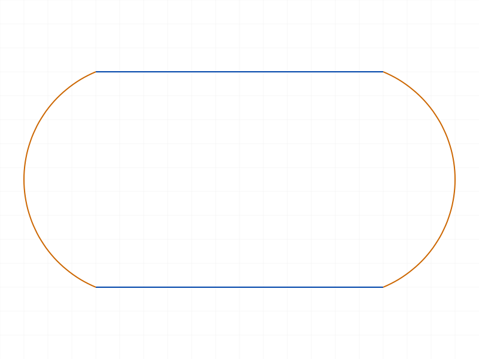
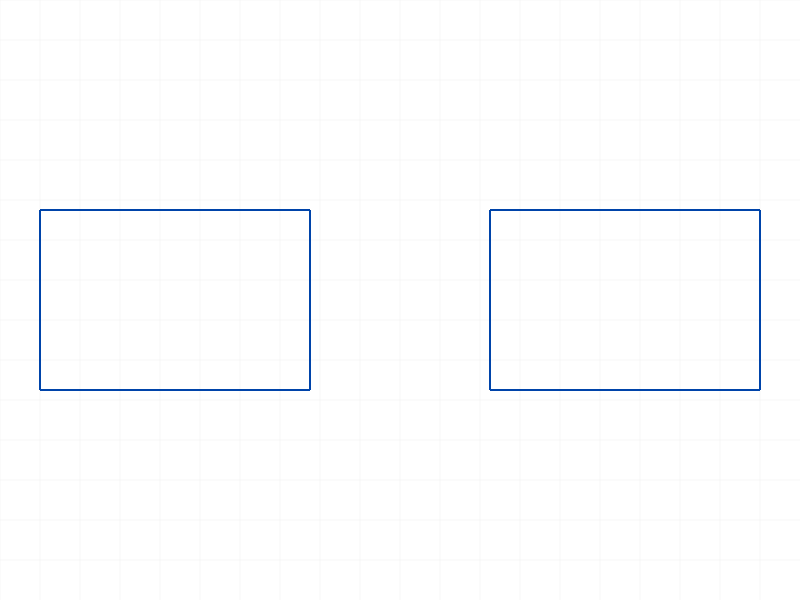
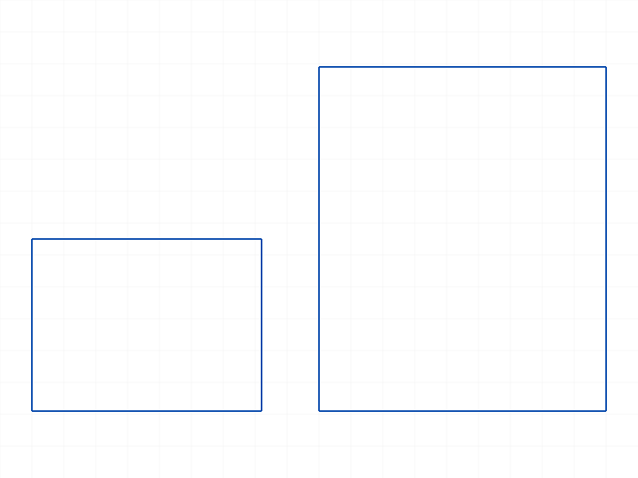

# Training: sketch.sketchRegion

**Date:** 2026-04-09

## Goal

Testing `v1.sketch.sketchRegion`, `v1.sketch.updateSketchRegion`, `v1.sketch.getSketchRegion`, and `v1.part.getSketchRegion`.

**Methods to cover:**

- `sketchRegion` — create region from closed geometry (geomIds), optional name
- `updateSketchRegion` — update region's geomIds (batch update via `regions` array)
- `getSketchRegion` (sketch) — find region by name within a sketch
- `getSketchRegion` (part) — find region by name within a part

**Questions to answer:**

- What geometry types can form a region?
- Can you create multiple regions in one sketch?
- What happens with non-closed geometry?
- What happens with empty geomIds?
- What's the default naming convention?
- Does the region ID work with extrusion?
- What does the structure tree look like for a region?

---

## 01 — basic region from rectangle

Script: `scripts/01-basic-region-from-rect.mjs` — ✅ works. Region ID 92 returned, maxLevel=31, no messages.

|  |
|---|

**Data:** `result: 92`, `maxLevel: 31`, `messages: []` (see `files/01-basic-region-from-rect-region-response.json`).

---

## 02 — region with explicit name

Script: `scripts/02-region-with-name.mjs` — ✅ as expected. Named region created, `getSketchRegion` finds it by name. IDs match.

**Data:** `regionId: 92`, `foundId: 92`, `match: true` (see `files/02-region-with-name-named-region.json`).

---

## 03 — region from circle

Script: `scripts/03-region-from-circle.mjs` — ✅ works. A single circle ID is sufficient for a region (circle is inherently closed).

|  |
|---|

**Data:** `result: 61`, `maxLevel: 31` (see `files/03-region-from-circle-circle-region.json`).

---

## 04 — region from mixed arcs and lines

Script: `scripts/04-region-from-arcs-lines.mjs` — ✅ works. 2 lines + 2 arcs forming a rounded rectangle → region ID 88.

|  |
|---|

**Data:** `result: 88`, `maxLevel: 31` (see `files/04-region-from-arcs-lines-mixed-region.json`).

---

## 05 — multiple regions in same sketch

Script: `scripts/05-multiple-regions.mjs` — ✅ works. Two separate rectangles → two separate regions (IDs 124, 126) in the same sketch.

|  |
|---|

**Data:** `region1: { id: 124, maxLevel: 31 }`, `region2: { id: 126, maxLevel: 31 }` (see `files/05-multiple-regions-multi-regions.json`).

---

## 06 — default naming convention

Script: `scripts/06-default-naming.mjs` — ✅ naming pattern discovered.

**Learned:** Default names are `SketchRegion` (first), then `SketchRegion0`, `SketchRegion1`, etc. The first region has NO numeric suffix. `getSketchRegion` works with these auto-generated names.

**Data:** `region1: { id: 124, name: "SketchRegion" }`, `region2: { id: 126, name: "SketchRegion0" }` (see `files/06-default-naming-default-names.json`).

**📌 LLM doc:** Document the default naming pattern — first region is `SketchRegion`, subsequent are `SketchRegion0`, `SketchRegion1`, etc.

---

## 07 — getSketchRegion with nonexistent name

Script: `scripts/07-get-nonexistent.mjs` — ✅ error behavior documented.

**Learned:** Nonexistent name → `result: null`, `maxLevel: 51`, error code 1015: `Couldn't find sketch region with name: "DoesNotExist" which belongs to the provided sketch.`

**Data:** See `files/07-get-nonexistent-get-nonexistent.json` for full error messages.

**📌 LLM doc:** Document error behavior — null result, maxLevel=51, code 1015.

---

## 08 — updateSketchRegion

Script: `scripts/08-update-region.mjs` — ✅ works. Returns `null` (VOID), maxLevel=31.

|  |  |
|---|---|

**Data:** `updateResult: null`, `maxLevel: 31`, `messages: []` (see `files/08-update-region-update-response.json`). Note: before/after snapshots look the same because the renderer shows all sketch geometry regardless of region membership. The update is structural, not visual in sketch mode.

---

## 09 — non-closed geometry (unexpected)

Script: `scripts/09-non-closed-geometry.mjs` — ⚠️ **ALL succeed silently.** No validation that geometry forms a closed loop.

- Single line → region created (ID 64, maxLevel=31)
- Two disconnected lines → region created (ID 76, maxLevel=31)
- Open U-shape (3 connected lines, not closed) → region created (ID 100, maxLevel=31)

**Data:** All three cases return valid IDs with maxLevel=31 and no messages (see `files/09-non-closed-geometry-non-closed.json`).

**Learned:** `sketchRegion` does NOT validate closure. It creates a region regardless of whether the geometry forms a closed contour. These regions may fail downstream (e.g., in extrusion) but the creation itself succeeds.

**📌 LLM doc:** Critical gotcha — sketchRegion does not validate closure. Non-closed geometry creates a region silently.

---

## 10 — empty geomIds

Script: `scripts/10-empty-geomids.mjs` — ⚠️ **Succeeds.** Empty array creates a region (ID 58, maxLevel=31).

**Data:** `result: 58`, `maxLevel: 31`, `messages: []` (see `files/10-empty-geomids-empty-geomids.json`).

**Learned:** Empty geomIds is allowed. Creates an empty region with no geometry.

**📌 LLM doc:** Empty geomIds creates an empty region (no error).

---

## 11 — part.getSketchRegion

Script: `scripts/11-part-get-region.mjs` — ✅ works. `part.getSketchRegion` and `sketch.getSketchRegion` both return the same region ID.

**Data:** `regionId: 92`, `partLookupId: 92`, `sketchLookupId: 92`, `allMatch: true` (see `files/11-part-get-region-part-lookup.json`).

**Learned:** `part.getSketchRegion` takes a part ID (not sketch ID) but finds the same region. Useful when you know the region name but not which sketch it's in.

---

## 12 — structure tree inspection

Script: `scripts/12-region-structure.mjs` — partially ran (getObjectTypeName doesn't exist), but structure was saved.

**Data:** Full structure tree dumped to `files/12-region-structure-region-structure.json`. Region node at ID 92 is class `CC_SketchRegion`.

---

## 13 — region with extrusion (confirmed failure)

Script: `scripts/13-region-with-extrusion.mjs` — ✅ **Confirmed**: passing a region ID to `part.extrusion` as `references` fails.

**Data:** `result: 96` (extrusion ID created), `maxLevel: 51`, error: `[Evaluation error in Sketch.GetNormal:CCObject can not be opened.]` (see `files/13-region-with-extrusion-extrusion-with-region.json`).

**Learned:** Extrusion creates an ID but errors. The extrusion feature exists in the tree but is broken. Always pass the sketch curve IDs directly, not the region ID.

**📌 LLM doc:** Region IDs must NOT be passed to `part.extrusion` as references. Pass the curve IDs directly.

---

## 14 — batch updateSketchRegion

Script: `scripts/14-update-batch.mjs` — ✅ works. Multiple regions updated in a single call.

**Data:** `batchResult: null` (VOID), `maxLevel: 31`, `messages: []` (see `files/14-update-batch-batch-update.json`).

---

## 15 — invalid IDs

Script: `scripts/15-invalid-ids.mjs` — ✅ proper error handling.

- Part ID as geom → error code 1001: `geomIds has a wrong id type! Provide only following id types: ["sketch-curve","sketch-point"]`
- Sketch ID as geom → same error
- Fake ID (99999) → warning code 0 + error code 1006: `An element of parameter "geomIds" has an invalid id!`

**Data:** See `files/15-invalid-ids-invalid-ids.json` for full error messages.

**📌 LLM doc:** geomIds accepts only `sketch-curve` and `sketch-point` type IDs. Wrong type → code 1001. Invalid ID → code 1006.

---

## 16 — structure tree detail

Script: `scripts/16-region-structure-detail.mjs` — ✅ confirmed structure.

**Learned:**
- Class: `CC_SketchRegion`
- Parent: `CC_GeometrySet` (ID 10)
- Members: `sketch` (parent sketch ID), `curves` (array of curve IDs), `selected` (array of curve IDs, same as curves)
- `curves` and `selected` arrays contain the same IDs as the `geomIds` passed to `sketchRegion`

**Data:** See `files/16-region-structure-detail-region-node.json` for full node structure.

---

## 17 — getGeometry on region ID

Script: `scripts/17-region-geom-getgeometry.mjs` — ✅ works.

**Learned:** `sketch.getGeometry({ id: regionId })` returns the geometry grouped by type: `{ arcs: [], circles: [], lines: [58, 64, 70, 76], points: [] }`. This is a way to inspect what geometry a region contains, categorized by type.

**Data:** See `files/17-region-geom-getgeometry-get-geometry-on-region.json`.

**📌 LLM doc:** `getGeometry` works on region IDs — returns geometry grouped by type.

---

## Coverage Check

- [x] `sketchRegion` called successfully (01, 02, 03, 04, 05)
- [x] Required params tested: `id` (sketch ID), `geomIds` (curve IDs)
- [x] Optional param `name` tested (02, 06)
- [x] Multiple geometry types: rectangle lines (01), circle (03), arcs+lines (04)
- [x] Multiple regions in one sketch (05)
- [x] Default naming convention (06)
- [x] `updateSketchRegion` tested — single (08) and batch (14)
- [x] `getSketchRegion` (sketch) tested — success (02, 06) and failure (07)
- [x] `part.getSketchRegion` tested (11)
- [x] Error cases: non-closed (09), empty (10), invalid IDs (15)
- [x] Structure tree inspected (12, 16)
- [x] Cross-API: region + extrusion interaction (13)
- [x] Cross-API: getGeometry on region (17)
