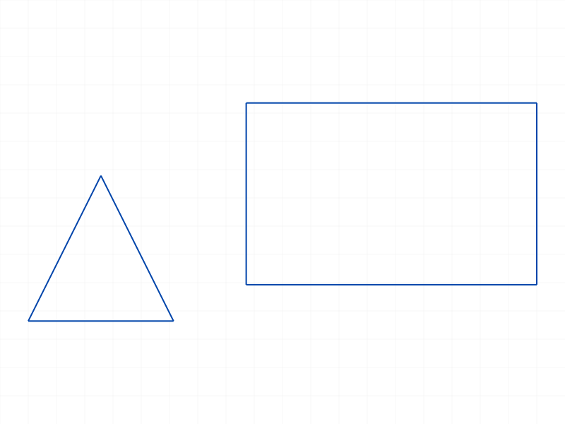
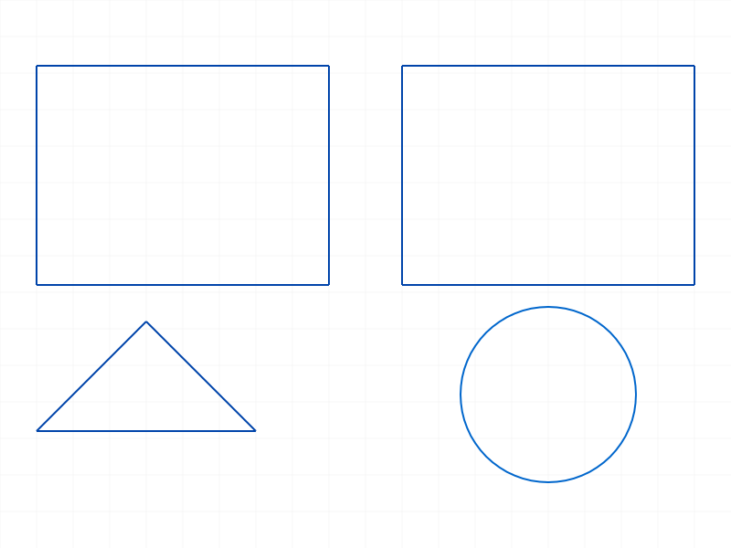
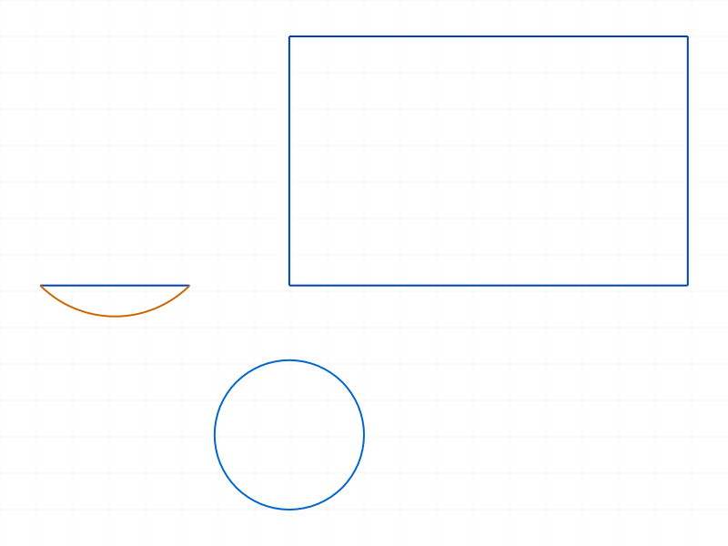

# Training: sketch.updateSketchRegion

**Date:** 2026-04-09

## Goal

Testing `v1.sketch.updateSketchRegion` — updates existing sketch regions with new geometry.

**Methods to cover:**

- `updateSketchRegion` — basic update of a region's geomIds
- `updateSketchRegion` — batch update (multiple regions in one call)
- `updateSketchRegion` — return value (VOID)

**Parameters to test:**

- `regions` — array of `{ id, geomIds }` objects
- `regions[].id` — region ID
- `regions[].geomIds` — new geometry IDs

**Questions:**

- Does updating a region replace or merge geometry?
- Can you update to an empty geomIds array?
- What happens with invalid region ID?
- What happens with invalid geomIds?
- Can you update multiple regions in one call?
- Does the update reflect in `getGeometry` on the region?
- Does updating a region affect an extrusion that references the same curves?
- What happens if you update with geometry from a different sketch?
- Does updating preserve the region name?
- Does batch fail atomically or partially?

---

## 01 — basic update (replace rect with triangle)

Script: `scripts/01-basic-update.mjs` — ✅ Update works. Returns `null` (VOID), maxLevel=31.

|  |  |
|---|---|

**Data:** Before: `getGeometry` → lines: [58,64,70,76] (rectangle). After update with triangle lines [94,100,106]: `getGeometry` → lines: [94,100,106]. Geometry is **fully replaced**, not merged.

**📌 LLM doc:** Update replaces geometry entirely. Returns VOID (null), maxLevel=31, empty messages on success.

---

## 02 — update to empty geomIds

Script: `scripts/02-update-to-empty.mjs` — ❌ Empty `geomIds: []` causes ERROR.

**Data:** maxLevel=51, code=0, message: `[Evaluation error in SketcherHelper.UpdateSketchRegions:[Index 0 ausserhalb des Arraybereichs] not defined !]` (German: "Index 0 outside array range"). After error, region retains original geometry (lines [58,64,70,76] unchanged).

**📌 LLM doc:** Cannot clear a region by passing empty geomIds — throws an internal array bounds error. Region is not modified on error.

---

## 03 — invalid region ID

Script: `scripts/03-invalid-region-id.mjs` — ❌ All three variants produce errors.

**Data:**
- Sketch ID as region → code 1001: `"id" has a wrong id type! Provide only following id types: ["sketchregion"]`
- Part ID as region → same code 1001, same message
- Fake numeric ID (99999) → code 1006: `"id" has an invalid id!` (with warning code 0: `ToId()/TOID() didn't get an existing or valid id`)

**📌 LLM doc:** `regions[].id` must be type `"sketchregion"`. Wrong type → 1001, nonexistent → 1006.

---

## 04 — invalid geomIds

Script: `scripts/04-invalid-geomids.mjs` — ❌ Both variants produce errors. Region unchanged after errors.

**Data:**
- Part ID as geomId → code 1001: `"geomIds" has a wrong id type! Provide only following id types: ["sketch-curve"]`
- Fake ID → code 1006: `"geomIds" has an invalid id!`
- After both errors, `getGeometry` still returns original lines [58,64,70,76].

**📌 LLM doc:** `geomIds` must be `"sketch-curve"` type only (NOT `"sketch-point"`). Errors don't corrupt the region.

---

## 05 — batch update (two regions)

Script: `scripts/05-batch-update.mjs` — ✅ Batch works. Both regions updated in one call.

**Data:** Region1 updated from rect to triangle (lines: [128,134,140]). Region2 updated from rect to circle (circles: [148]). Single call, result=null, maxLevel=31.

|  |
|---|

---

## 06 — structure tree verification

Script: `scripts/06-structure-tree.mjs` — Partial result. Structure tree walk couldn't find the region node by numeric ID (ID comparison may not match). The full structure was saved to files but the findRegion helper failed. Behavior already verified by `getGeometry` in script 01.

---

## 07 — replace, not merge (subset test)

Script: `scripts/07-replace-not-merge.mjs` — ✅ Confirms replace semantics.

**Data:** Started with 4 lines (rectangle). Updated with only 2 of the 4 lines. After: `getGeometry` → lines: [58, 64] — exactly the 2 passed. The other 2 lines were removed from the region. This proves **update replaces**, does not merge.

---

## 08 — mixed geometry types

Script: `scripts/08-mixed-geom-types.mjs` — ✅ Lines, arcs, and circles all accepted.

|  |
|---|

**Data:** After update: `{arcs:[100], circles:[109], lines:[94], points:[]}`. All three geometry types preserved correctly.

---

## 09 — cross-sketch geometry

Script: `scripts/09-cross-sketch-geom.mjs` — ✅ Accepted silently! No error.

**Data:** Region in sketch1 updated with geometry IDs from sketch2. result=null, maxLevel=31, no messages. `getGeometry` on the region returns the sketch2 geometry [100,108,114].

**📌 LLM doc:** `updateSketchRegion` does NOT validate that geometry belongs to the same sketch as the region. Cross-sketch geometry is accepted silently. This may cause issues downstream.

---

## 10 — update with same geometry (no-op)

Script: `scripts/10-update-same-geom.mjs` — ✅ Works fine. No error, geometry unchanged.

**Data:** result=null, maxLevel=31, empty messages. `getGeometry` returns same IDs.

---

## 11 — duplicate geomIds

Script: `scripts/11-duplicate-geomids.mjs` — ✅ Duplicates accepted and preserved.

**Data:** Passed `[58, 58, 64]`. After: `getGeometry` → lines: `[58, 58, 64]`. Duplicates are NOT deduplicated — they are stored as-is.

**📌 LLM doc:** Duplicate IDs in geomIds are not deduplicated — the region stores them as given.

---

## 12 — points in geomIds

Script: `scripts/12-with-points.mjs` — ❌ Points rejected.

**Data:** maxLevel=51, code 1001: `"geomIds" has a wrong id type! Provide only following id types: ["sketch-curve"]`. Region unchanged after error.

**📌 LLM doc:** Unlike `sketchRegion` (create) which accepts both `sketch-curve` and `sketch-point`, `updateSketchRegion` only accepts `sketch-curve`. Points are rejected with code 1001.

---

## 13 — partial batch error (one valid, one invalid)

Script: `scripts/13-partial-batch-error.mjs` — ❌ Entire batch fails atomically.

**Data:** maxLevel=51 (error on the invalid entry). Both regions retain original geometry — region1 was NOT updated even though its geomIds were valid. The error in region2's entry caused the entire batch to fail.

**📌 LLM doc:** Batch updates are atomic — if any entry in `regions` has an error, NO regions are updated.

---

## 14 — name preserved after update

Script: `scripts/14-region-name-preserved.mjs` — ✅ Name preserved.

**Data:** Created region named `MyProfile`. After update, `getSketchRegion({ name: 'MyProfile' })` still returns the same region ID (92). Name is not affected by geometry update.

---

## 15 — empty regions array

Script: `scripts/15-empty-regions-array.mjs` — ✅ No-op, no error.

**Data:** result=null, maxLevel=31, empty messages. Passing `regions: []` is a silent no-op.

---

## Coverage Checklist

- [x] API called successfully (01, 05, 07, 08, 09, 10)
- [x] Required param `regions` tested (01-15)
- [x] Required param `regions[].id` tested — valid (01), wrong type (03), nonexistent (03)
- [x] Required param `regions[].geomIds` tested — valid (01), empty (02), wrong type (04, 12), nonexistent (04), duplicates (11)
- [x] Batch update tested (05, 13)
- [x] Atomic failure behavior confirmed (13)
- [x] Replace vs merge confirmed (07)
- [x] Mixed geometry types (08)
- [x] Cross-sketch geometry (09)
- [x] Name preservation (14)
- [x] Empty regions array (15)
- [x] Behavioral claims verified with data (getGeometry, filewrite dumps)
