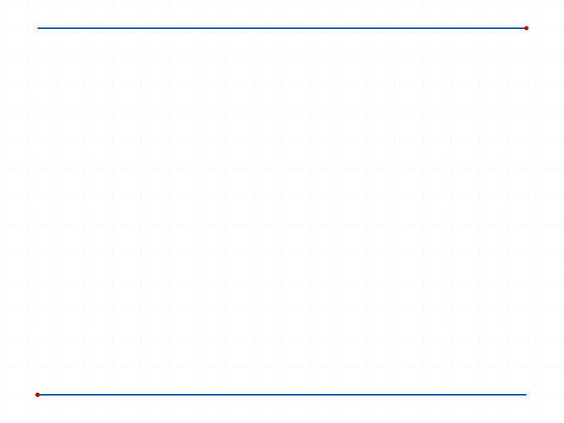
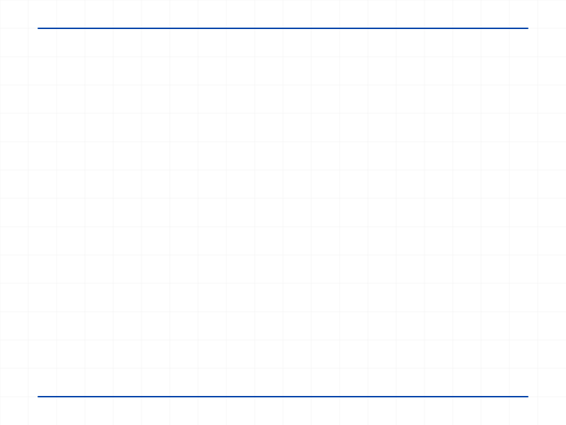
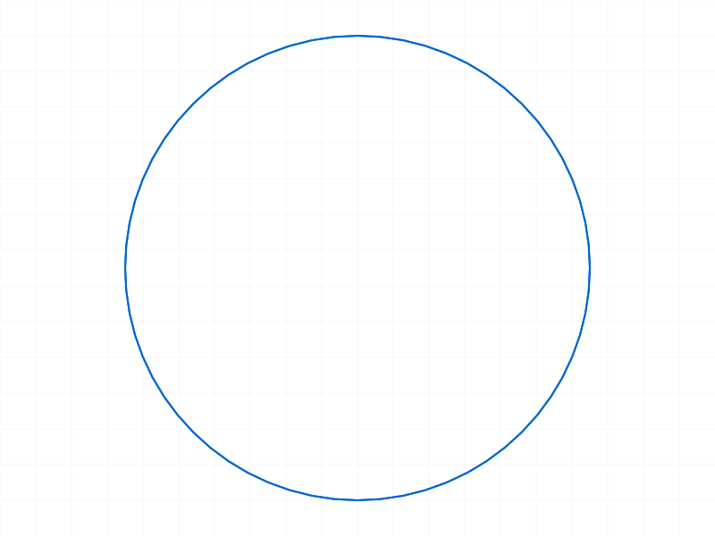

# Training: sketch.referenceGeometry

**Date:** 2026-04-10

## Goal

Testing `v1.sketch.referenceGeometry`, `v1.sketch.changeReferenceGeometry`, `v1.sketch.unlinkReferenceGeometry`, and `v1.sketch.setReferences`.

**Methods to cover:**

- `referenceGeometry` — create "Use" geometry by projecting 3D brep elements into sketch plane
- `changeReferenceGeometry` — relink existing "Use" geometry to a different brep element
- `unlinkReferenceGeometry` — disconnect "Use" geometry from its reference
- `setReferences` — set plane, axis, origin references for a sketch

---

## 01 — basic referenceGeometry (default XY plane)

Script: `scripts/01-basic-referenceGeometry.mjs` — ❌ Failed. Error: "CCObject can not be opened" (level 51).

Sketch created without `planeId` (default XY plane). Attempted to project a box edge into the sketch.

**Learned:** `referenceGeometry` fails on sketches without a `planeId` reference.
**📌 LLM doc:** referenceGeometry requires a sketch with a plane reference.

## 02 — with openFeature

Script: `scripts/02-with-openFeature.mjs` — ❌ Same error even with `openFeature` on the sketch. The issue is not about feature editing state but about the sketch having no plane reference.

## 03 — sketch on box face

Script: `scripts/03-sketch-on-face.mjs` — ✅ Works! Both with and without `openFeature`.

|  |  |
|---|---|

**Data:** `referenceGeometry` returned `[105]` (an array of IDs, **not VOID** as documented). `getGeometry` confirms a line was added. Both calls (with and without openFeature) succeeded independently.

**📌 LLM doc:** Return value is `Array<id>`, not VOID. Docs are wrong.
**📌 LLM doc:** `openFeature` is NOT required for `referenceGeometry`.

## 04 — work plane vs default plane

Script: `scripts/04-workplane-vs-default.mjs` — Mixed results:

- Sketch on work plane → ✅ `referenceGeometry` works
- Sketch on default XY plane (no planeId) → ❌ "CCObject can not be opened"
- Sketch created without planeId, then `setReferences` applied → ✅ works

**Data:** `setReferences` can retroactively fix a sketch missing a plane reference. After calling `setReferences({ id: sk3, planeId: wpId })`, `referenceGeometry` succeeds.

**📌 LLM doc:** Sketch must have plane reference (via `planeId` in create, or via `setReferences`) — otherwise referenceGeometry fails.

## 05 — multiple brep elements and element types

Script: `scripts/05-multiple-brep-elements.mjs` — ✅/❌

- 3 edges in one call → ✅ returns `[105, 117, 127]` (one ID per element)
- Vertex → ✅ returns `[133]`, creates a point in sketch
- Face (plane) → ❌ Error code 1001: "Provide only following id types: [edge-line, vertex, edge-arc, edge-circle]"
- Mixed (edge + vertex) → ✅ returns `[139, 149]`

|  |  |
|---|---|

**Data:** Final sketch geometry: `lines: [105, 117, 139]`, `points: [127, 133, 149]`. Edge 71 (vertical, perpendicular to sketch plane) projected as a point, not a line.

**📌 LLM doc:** Accepted types: edge-line, vertex, edge-arc, edge-circle. NOT faces/planes.
**📌 LLM doc:** Perpendicular edges project as points.
**📌 LLM doc:** Returns one sketch geometry ID per brep element.

## 06 — keepReference: FALSE

Script: `scripts/06-keepReference-false.mjs` — ✅ Both keepReference TRUE and FALSE create sketch geometry.

**Data:** 
- `keepReference: 0` → line 105 at `startPos [0,0,40], endPos [80,0,40]`
- `keepReference: 1` → line 111 at `startPos [0,60,40], endPos [80,60,40]`

Both created geometry. The difference is associativity (tested in script 13).

|  |
|---|

## 07 — changeReferenceGeometry and unlinkReferenceGeometry

Script: `scripts/07-change-unlink.mjs` — ✅

- `changeReferenceGeometry`: re-projected line from front edge (y=0) to back edge (y=60). **Geometry moved.**
- `unlinkReferenceGeometry`: geometry remained at y=60 (frozen at new position).
- Both return VOID (null), maxLevel=31.

|  |
|---|

**Data:** Before change: `endPos [80,0,40]`. After change: `endPos [80,60,40]`. After unlink: `endPos [80,60,40]` (frozen).

**📌 LLM doc:** `changeReferenceGeometry` moves geometry to match new reference. `unlinkReferenceGeometry` freezes geometry at current position.

## 08 — setReferences with plane types

Script: `scripts/08-setReferences-plane.mjs` — ✅ All setReferences calls succeed.

**Data:**
- Before: line at z=0 (default XY plane)
- After setReferences(WP at z=50): line still at z=0
- After setReferences(face at z=40): line moved to z=40
- After setReferences(WP, invertPlane=1): success, no error

**📌 LLM doc:** `setReferences` with a face moves geometry to the face plane. With a work plane, geometry positions don't change in world coordinates (coordinate system reference changes internally).

## 09 — setReferences axis and origin params

Script: `scripts/09-setReferences-axis-origin.mjs` — ✅ All combinations succeed.

**Data:** Work axis at [1,1,0] (45-degree) rotated coordinates:
- plane only: positions unchanged
- plane+axis: line rotated (10,10→0,14.14 and 60,40→14.14,70.71)
- isXAxis=FALSE: different rotation
- plane+origin (WPt at [20,10,40]): shifted origin
- all params combined: rotation + shift

**📌 LLM doc:** `setReferences` axisId rotates sketch coordinate system. `isXAxis` controls whether axis is X or Y direction. `originId` shifts the sketch origin.

## 10 — arc and circle brep edges

Script: `scripts/10-arc-circle-edges.mjs` — ✅ Circle edges from a cylinder project as circles in the sketch.

|  |
|---|

**Data:** Bottom circle edge → circle ID 87 in sketch. Top circle edge (on-plane) → circle ID 96. Both in `circles` array of `getGeometry`.

**📌 LLM doc:** Circle brep edges project as sketch circles. Both on-plane and off-plane projections work.

## 11 — error cases

Script: `scripts/11-error-cases.mjs` — Mixed results as expected.

**Data:**
- Empty `brepIds: []` → returns `[]`, maxLevel=31 (no error)
- Invalid ID 99999 → error code 1006 "invalid id"
- Wrong type (sketch ID) → error code 1001 listing valid types
- Same edge projected twice (separate calls) → creates duplicates: IDs 105, 117
- Same edge in one call `[edgeId, edgeId]` → creates duplicates: IDs 127, 137
- Final geometry: 4 lines (all from the same edge!)

**📌 LLM doc:** No deduplication — projecting the same edge multiple times creates duplicate geometry each time.

## 12 — changeReferenceGeometry and unlinkReferenceGeometry edge cases

Script: `scripts/12-change-errors.mjs` — ✅ Mostly permissive.

**Data:**
- `changeReferenceGeometry` on referenced line → ✅
- `changeReferenceGeometry` on unreferenced line (keepReference=FALSE) → ✅ (can add reference to unlinked geometry)
- `changeReferenceGeometry` after `unlinkReferenceGeometry` → ✅ (can re-link)
- `unlinkReferenceGeometry` on already-unlinked geometry → ✅ (silent no-op)
- `unlinkReferenceGeometry` on hand-drawn line (null ID from failed `sketch.line`) → ❌ "geomId = VOID not allowed"

**📌 LLM doc:** `changeReferenceGeometry` can re-establish references on unlinked geometry. `unlinkReferenceGeometry` on already-unlinked geometry is a no-op.

## 13 — associative update behavior

Script: `scripts/13-associative-update.mjs` — ✅ Critical finding.

**Data:**
- Referenced line (keepReference=TRUE): box length 80→120, line endPos.x changed 80→120. **Geometry updated associatively.**
- Unreferenced line (keepReference=FALSE): box width 60→100, line stayed at y=60. **No update — frozen.**

**📌 LLM doc:** `keepReference: TRUE` = associative (updates when solid changes). `keepReference: FALSE` = static copy (frozen).

## 14 — setReferences with brep edges and vertices

Script: `scripts/14-setReferences-brep-axis.mjs` — ✅ All calls succeed.

**Data:** Brep edges and vertices accepted as axis/origin references. Positions didn't change because the front edge aligns with X-axis already and `getPositions` returns world coordinates.

## 15 — realistic workflow

Script: `scripts/15-realistic-workflow.mjs` — ✅ Partial.

Projected two edges into a top-face sketch. Rectangle creation failed (separate issue with sketch.rectangle on face-plane sketches).

**Data:** Front edge projected: `[0,0,30]→[100,0,30]`. Right edge: `[100,0,30]→[100,80,30]`. Both correct.

---

## Coverage checklist

- [x] `referenceGeometry` called successfully
- [x] All required parameters tested (id, brepIds)
- [x] Optional parameter `keepReference` tested (TRUE, FALSE)
- [x] Accepted brep element types tested (edge-line, vertex, edge-circle)
- [x] Rejected type tested (face/plane)
- [x] `changeReferenceGeometry` tested (re-link to different edge)
- [x] `unlinkReferenceGeometry` tested (disconnect link, geometry persists)
- [x] `setReferences` tested with planeId (work plane, face), invertPlane, axisId, isXAxis, invertAxis, originId
- [x] Associative update behavior verified with data
- [x] Error cases: empty array, invalid ID, wrong type, duplicates
- [x] Edge cases: unlink→change, change on unreferenced, double unlink
